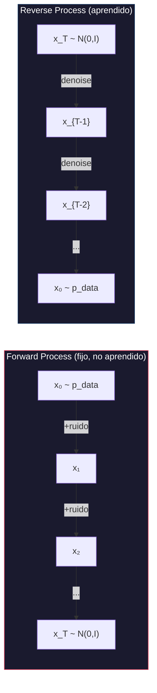
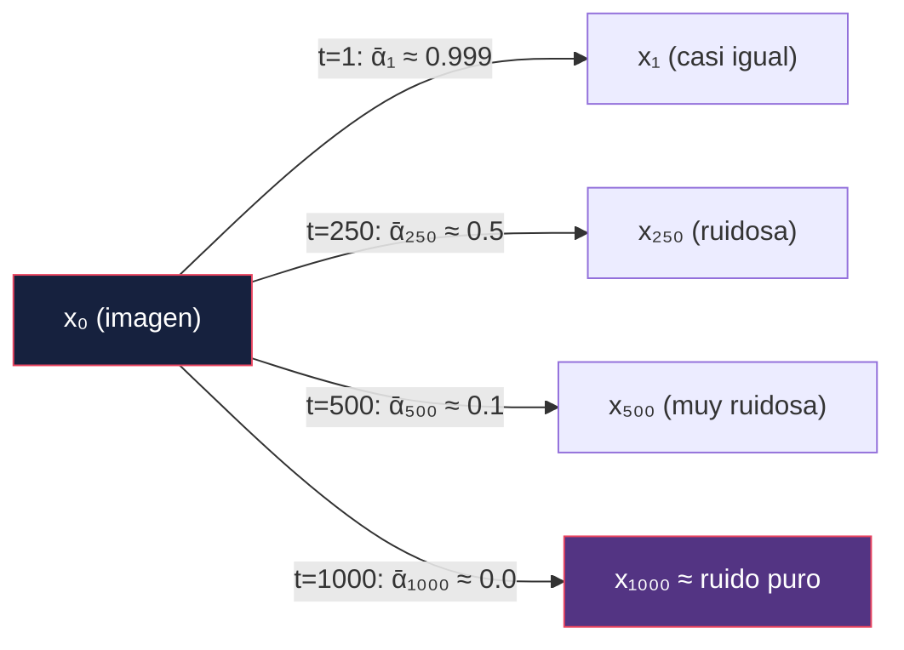
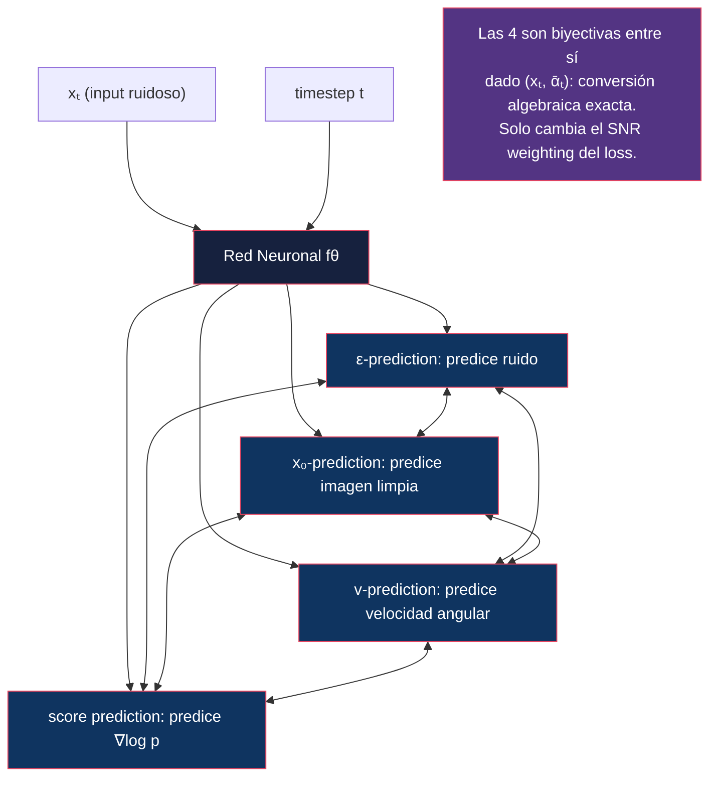
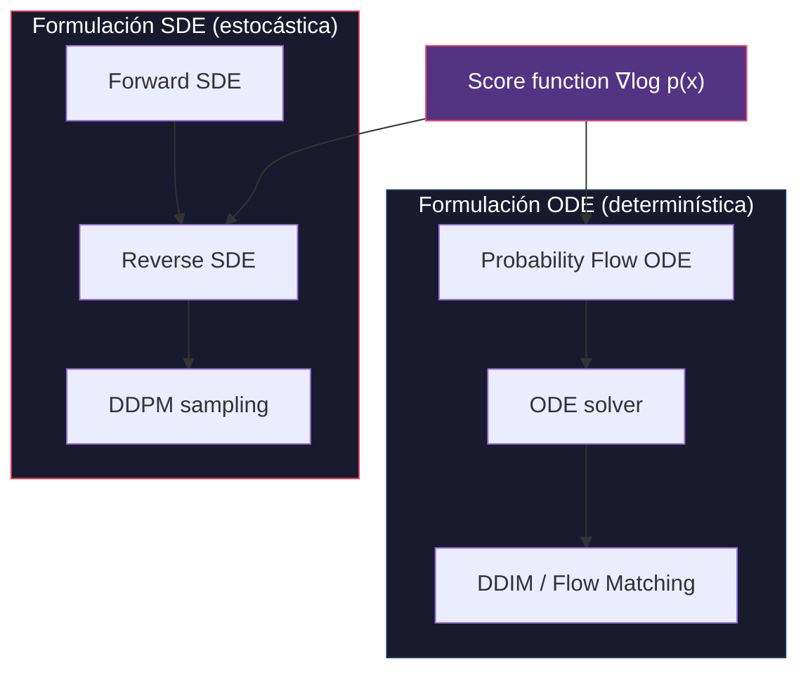
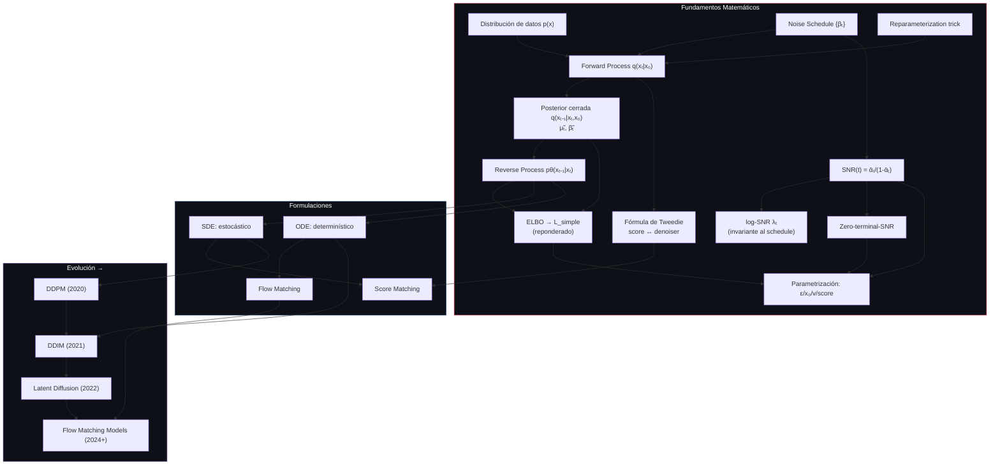

# 01 — Fundamentos Matemáticos

> Los modelos de difusión son, en esencia, un truco elegante: destruir datos añadiendo ruido paso a paso, y luego aprender a revertir ese proceso.

---

## Índice

1. [El problema generativo](#1-el-problema-generativo)
2. [Procesos de difusión](#2-procesos-de-difusión)
3. [Forward process (destruir)](#3-forward-process)
4. [Reverse process (reconstruir)](#4-reverse-process)
5. [Noise schedules](#5-noise-schedules)
6. [SNR — Signal-to-Noise Ratio](#6-snr)
7. [Parametrizaciones: ε, x₀, v, score](#7-parametrizaciones)
8. [ELBO — Evidence Lower Bound](#8-elbo)
9. [Reparameterization trick](#9-reparameterization-trick)
10. [SDE vs ODE](#10-sde-vs-ode)
11. [Diagrama conceptual completo](#11-diagrama-conceptual-completo)

---

## 1. El problema generativo

El objetivo de un modelo generativo es aprender a muestrear de una distribución de datos `p_data(x)` desconocida, teniendo solo acceso a un conjunto finito de muestras (e.g., imágenes).

**Enfoque de difusión**: En lugar de modelar `p_data(x)` directamente (como hacen los GANs o los autoregressive models), los modelos de difusión:

1. Definen un proceso que **destruye** la estructura de los datos gradualmente (forward)
2. Aprenden una red neuronal que **revierte** ese proceso (reverse)



---

## 2. Procesos de difusión

Un **proceso de difusión** es un proceso estocástico que transforma gradualmente una distribución compleja en una distribución simple (típicamente Gaussiana).

### Intuición física

El nombre "difusión" viene de la física: una gota de tinta en agua se difunde hasta que la concentración es uniforme. Los datos son la "tinta" y el ruido es el "agua".

### Definición formal

Definimos una cadena de Markov con T pasos:

```
q(x₁, x₂, ..., x_T | x₀) = ∏ₜ q(xₜ | xₜ₋₁)
```

donde cada transición `q(xₜ | xₜ₋₁)` añade una cantidad controlada de ruido Gaussiano.

---

## 3. Forward process

### Transición individual

En cada paso `t`, añadimos ruido según un schedule `βₜ`:

```
q(xₜ | xₜ₋₁) = N(xₜ; √(1 - βₜ) · xₜ₋₁, βₜ · I)
```

Esto significa:
- **Escalar** la señal por `√(1 - βₜ)` (atenuar)
- **Añadir** ruido Gaussiano con varianza `βₜ`

### Propiedad clave: salto directo a cualquier t

Definiendo `αₜ = 1 - βₜ` y `ᾱₜ = ∏ₛ₌₁ᵗ αₛ`, podemos saltar directamente de `x₀` a `xₜ`:

```
q(xₜ | x₀) = N(xₜ; √ᾱₜ · x₀, (1 - ᾱₜ) · I)
```

O equivalentemente, usando el reparameterization trick:

```
xₜ = √ᾱₜ · x₀ + √(1 - ᾱₜ) · ε,    ε ~ N(0, I)
```

> **Implicación práctica**: No necesitamos simular los T pasos secuencialmente durante el entrenamiento. Podemos muestrear cualquier `t` uniformemente y calcular `xₜ` directamente.



---

## 4. Reverse process

### ¿Qué necesitamos aprender?

Si conociéramos `q(xₜ₋₁ | xₜ)` (la distribución reversa), podríamos generar datos partiendo de ruido. Pero esta distribución **depende de la distribución completa de datos** y es intractable:

```
q(xₜ₋₁ | xₜ) ∝ q(xₜ | xₜ₋₁) · q(xₜ₋₁)
```

El factor `q(xₜ₋₁)` es la marginal del proceso en `t-1`, que requiere integrar sobre todo `p_data`. Ahí está la intratabilidad.

### La posterior condicionada SÍ tiene forma cerrada

Este es el paso que hace computable todo lo demás. Si **además de `xₜ` condicionamos a `x₀`**, la marginal problemática desaparece y la posterior es Gaussiana exacta:

```
q(xₜ₋₁ | xₜ, x₀) = N(xₜ₋₁; μ̃ₜ(xₜ, x₀), β̃ₜ · I)
```

con

```
μ̃ₜ(xₜ, x₀) = [ √ᾱₜ₋₁ · βₜ / (1 - ᾱₜ) ] · x₀  +  [ √αₜ · (1 - ᾱₜ₋₁) / (1 - ᾱₜ) ] · xₜ

β̃ₜ = [ (1 - ᾱₜ₋₁) / (1 - ᾱₜ) ] · βₜ
```

> **Por qué importa**: durante el entrenamiento sí conocemos `x₀` (es el dato). Esta posterior es el *target* contra el que se compara `pθ(xₜ₋₁|xₜ)` en los términos KL del [ELBO](#8-elbo). Sin ella, la §8 no sería calculable en forma cerrada.

Sustituyendo `x₀ = (xₜ - √(1-ᾱₜ)·ε)/√ᾱₜ` en `μ̃ₜ` se obtiene la forma que usa el sampler de DDPM:

```
μ̃ₜ = (1/√αₜ) · [ xₜ - (βₜ / √(1 - ᾱₜ)) · ε ]
```

Es decir: **predecir `ε` equivale a predecir la media de la posterior**. De ahí sale la parametrización ε de la §7.

### Solución: aproximar con una red neuronal

Definimos:

```
pθ(xₜ₋₁ | xₜ) = N(xₜ₋₁; μθ(xₜ, t), Σθ(xₜ, t))
```

La red neuronal predice los parámetros de esta distribución Gaussiana. En DDPM, `Σθ` se fija a `βₜ·I` o `β̃ₜ·I` (no se aprende); Improved DDPM sí la aprende interpolando entre ambos extremos.

### Resultado clave de Feller (1949)

Si el forward process es suficientemente lento (βₜ pequeños) y T es grande, entonces la distribución reversa `q(xₜ₋₁ | xₜ)` es también Gaussiana. Esto justifica la parametrización Gaussiana del reverse process.

### Conexión con score matching: la fórmula de Tweedie

El **score function** `∇ₓ log q(xₜ)` es lo que permite revertir el proceso en formulación continua (ver [§10](#10-sde-vs-ode)). La conexión con `ε` no es una analogía: es una identidad.

Partimos de la marginal conocida `q(xₜ | x₀) = N(√ᾱₜ·x₀, (1-ᾱₜ)·I)`. Para una Gaussiana, el gradiente del log-densidad respecto a su argumento es:

```
∇_{xₜ} log q(xₜ | x₀) = -(xₜ - √ᾱₜ · x₀) / (1 - ᾱₜ)
```

Y como `xₜ - √ᾱₜ·x₀ = √(1-ᾱₜ)·ε`, queda:

```
∇_{xₜ} log q(xₜ | x₀) = -ε / √(1 - ᾱₜ)
```

La **fórmula de Tweedie** establece que el score de la marginal es la esperanza del score condicional bajo la posterior:

```
∇_{xₜ} log q(xₜ) = E[ ∇_{xₜ} log q(xₜ|x₀) | xₜ ] = -E[ε | xₜ] / √(1 - ᾱₜ)
```

Y `E[ε | xₜ]` es exactamente lo que una red entrenada con MSE aprende a predecir. Por tanto:

```
sθ(xₜ, t) = -εθ(xₜ, t) / √(1 - ᾱₜ)
```

> **Insight**: entrenar un denoiser con MSE **es** hacer score matching. DDPM y los score-based models de Song & Ermon son el mismo algoritmo escrito en dos notaciones distintas.

---

## 5. Noise schedules

El schedule `{βₜ}ₜ₌₁ᵀ` controla la velocidad a la que se destruye la información.

### Linear schedule (DDPM original, Ho et al. 2020)

```
βₜ = β₁ + (β_T - β₁) · (t-1)/(T-1)
```

Con β₁ = 10⁻⁴, β_T = 0.02, T = 1000.

**Problema**: La destrucción de información no es uniforme. Los primeros pasos destruyen muy poca información, los últimos destruyen demasiada. Se "desperdician" muchos timesteps.

### Cosine schedule (Nichol & Dhariwal, 2021)

```
ᾱₜ = f(t) / f(0),    f(t) = cos²( ((t/T + s) / (1 + s)) · π/2 )
```

con **offset `s = 0.008`**. El offset no es cosmético: sin él, `βₜ` cerca de `t=0` tiende a cero y los primeros pasos se vuelven numéricamente degenerados. Los autores lo eligen para que `√β₀` quede algo por debajo de la resolución de un píxel (1/127.5). En la práctica también se clipa `βₜ ≤ 0.999` cerca de `t=T`.

**Ventaja**: Distribución más uniforme de la destrucción de información a lo largo de t. El SNR decrece de manera más gradual.

### Comparación numérica

Valores de `ᾱₜ` para T = 1000 (linear: β ∈ [10⁻⁴, 0.02]; cosine: s = 0.008):

| t / T | ᾱₜ (linear) | ᾱₜ (cosine) | Comentario |
|------:|------------:|------------:|:-----------|
| 0.00 | 1.000 | 1.000 | dato limpio |
| 0.25 | 0.52 | 0.85 | linear ya ha destruido la mitad de la señal |
| 0.50 | 0.079 | 0.49 | cosine llega aquí al punto de ambigüedad |
| 0.75 | 0.0034 | 0.14 | linear es casi ruido puro |
| 1.00 | 4·10⁻⁵ | ~0 | ver *zero-terminal-SNR* en [§6](#6-snr) |

La lectura clave: con schedule lineal, a partir de `t ≈ 0.6·T` ya no queda casi señal, así que **el último 40 % de los timesteps aporta muy poco al entrenamiento**. El cosine reparte la destrucción de forma mucho más pareja.

### Tabla de schedules

| Schedule | Fórmula | Modelo(s) | Ventaja | Desventaja |
|:---------|:--------|:----------|:--------|:-----------|
| Linear | β lineal en [β₁, β_T] | DDPM | Simple | SNR no uniforme; malgasta timesteps finales |
| Cosine | ᾱ basado en coseno, s=0.008 | Improved DDPM | SNR más uniforme | Ligeramente más lento en converger |
| Sigmoid | log-SNR lineal vía sigmoide | Chen (2023), algunos DiTs | Transición suave, un solo hiperparámetro | Requiere tuning por resolución |
| Scaled Linear | **√βₜ** lineal en [√β₁, √β_T] | Stable Diffusion (LDM) | Curva más suave al inicio que linear | Heredado de LDM, sin justificación teórica |
| Flow Matching | Interpolación lineal t ∈ [0,1] | FLUX, SD3 | Sin schedule *de ruido*; trayectorias rectas | Paradigma diferente; SD3 sí aplica un *shift* por resolución |

> **Nota sobre `scaled_linear`**: es lineal en la **raíz** de β, no en β. `betas = linspace(β₁^0.5, β_T^0.5, T)²`. No tiene relación con el espacio latente — es simplemente el schedule que LDM adoptó y que Stable Diffusion 1.x/2.x heredaron.

---

## 6. SNR

### Definición

El **Signal-to-Noise Ratio** en el timestep t es:

```
SNR(t) = ᾱₜ / (1 - ᾱₜ)
```

Esto mide cuánta señal original queda relativa al ruido.

### Interpretación

| SNR(t) | Interpretación | Lo que el modelo "ve" |
|:-------|:---------------|:---------------------|
| → ∞ | Sin ruido | La imagen original |
| ~ 1 | Señal ≈ ruido | Mezcla ambigua |
| → 0 | Ruido puro | Gaussiana isótropa |

### ¿Por qué importa?

1. **Ponderación del loss**: Diferentes timesteps contribuyen de manera diferente al aprendizaje. Los timesteps con SNR intermedio son los más informativos.
2. **Min-SNR weighting** (Hang et al., 2023): Ponderar el loss por `min(SNR(t), γ)` (con γ = 5) para balancear la contribución de cada timestep y evitar que los de SNR alto dominen el gradiente.
3. **Conexión con parametrizaciones**: La elección entre predecir ε, x₀ o v implícitamente cambia la ponderación del SNR en el loss ([§7](#7-parametrizaciones)).

### log-SNR: la parametrización invariante al schedule

Definiendo `λₜ = log SNR(t) = log(ᾱₜ / (1 - ᾱₜ))`, se obtiene una descripción del proceso **independiente de cómo se haya construido el schedule**. Kingma et al. (2021, *Variational Diffusion Models*) demuestran un resultado fuerte:

> El ELBO de un modelo de difusión en tiempo continuo depende **únicamente** de los valores extremos `λ_min` y `λ_max`, no de la forma de la curva `λₜ` entre ellos.

Esto reordena por completo la §5: linear, cosine, sigmoid y scaled-linear no son objetivos distintos, sino **reparametrizaciones del mismo objetivo** que difieren en *cuánto tiempo de cómputo* dedican a cada región de log-SNR. El schedule no cambia qué se optimiza; cambia la distribución de muestreo de `t` durante el entrenamiento — que es exactamente lo que SD3 manipula con su muestreo logit-normal.

Rangos típicos: `λ ∈ [-10, +10]` cubre desde ruido esencialmente puro hasta datos casi limpios. Como `ᾱₜ = σ(λₜ)`, el log-SNR es simplemente el logit de `ᾱ`.

### Zero-terminal-SNR

Un detalle que parece menor y no lo es. Con el schedule lineal de DDPM:

```
ᾱ_T ≈ 4 · 10⁻⁵   →   SNR(T) ≈ 4 · 10⁻⁵ ≠ 0
```

`x_T` **no es ruido puro**: conserva una traza residual de la señal original — en concreto, del brillo medio de la imagen. Pero en inferencia se muestrea `x_T ~ N(0, I)`, que sí es ruido puro. Hay por tanto un **desajuste train/test** en el punto de partida del sampling.

**Consecuencia observable** (Lin et al., 2024): los modelos afectados no pueden generar imágenes muy oscuras ni muy claras. Siempre regresan hacia luminancia media, porque durante el entrenamiento nunca vieron un `x_T` cuyo brillo medio no delatara el de `x₀`. Es la explicación de por qué a Stable Diffusion 1.5 le cuesta un fotograma verdaderamente negro.

**Solución**: reescalar el schedule para forzar `ᾱ_T = 0` exactamente. Esto obliga a dos cambios acoplados:

| Problema al forzar ᾱ_T = 0 | Por qué | Solución |
|:---------------------------|:--------|:---------|
| ε-prediction se vuelve indefinida en `t=T` | `x₀ = (xₜ - √(1-ᾱ)ε)/√ᾱ` divide por `√ᾱ_T = 0` | Cambiar a **v-prediction**, que sigue bien condicionada |
| El sampler debe empezar en `t=T` | Si no, nunca se corrige el desajuste | Forzar el timestep inicial del sampler |

Esta es la razón de fondo por la que v-prediction dejó de ser una curiosidad teórica: **es la única de las parametrizaciones clásicas que sobrevive a SNR = 0**. Ver la nota de la [§7](#7-parametrizaciones).

---

## 7. Parametrizaciones

La red neuronal puede predecir diferentes "targets". Todas son matemáticamente equivalentes, pero difieren en propiedades de optimización.

### Tabla comparativa

| Parametrización | La red predice | Target | Loss |
|:----------------|:---------------|:-------|:-----|
| **ε-prediction** | El ruido ε añadido | `εθ(xₜ, t) ≈ ε` | `‖ε - εθ(xₜ, t)‖²` |
| **x₀-prediction** | La imagen limpia | `x₀θ(xₜ, t) ≈ x₀` | `‖x₀ - x₀θ(xₜ, t)‖²` |
| **v-prediction** | v = √ᾱₜ · ε - √(1-ᾱₜ) · x₀ | `vθ(xₜ, t) ≈ v` | `‖v - vθ(xₜ, t)‖²` |
| **score prediction** | ∇ₓ log q(xₜ) | `sθ(xₜ, t) ≈ -ε/√(1-ᾱₜ)` | `‖s - sθ(xₜ, t)‖²` |

### El SNR weighting implícito

Las cuatro parametrizaciones optimizan **el mismo objetivo salvo un factor de peso dependiente de t**. Reescribiendo cada loss en términos del error en ε (tomando ε-prediction como baseline uniforme):

| Parametrización | Peso equivalente en espacio-ε | Enfatiza | Comportamiento |
|:----------------|:------------------------------|:---------|:---------------|
| **ε** | `1` | — | Uniforme por construcción |
| **x₀** | `(1-ᾱₜ)/ᾱₜ = 1/SNR` | **SNR bajo** (t grande, mucho ruido) | Diverge cuando `ᾱ → 0` |
| **v** | `1/ᾱₜ = 1 + 1/SNR` | Balanceado | ≈ 1 en SNR alto; ≈ x₀ en SNR bajo |
| **score** | `1/(1-ᾱₜ)` | **SNR alto** (t pequeño, poco ruido) | Diverge cuando `ᾱ → 1` |

**Derivación** (para `v`, que es la menos obvia). Dado que `x̂₀` y `ε̂` son consistentes con el mismo `xₜ`:

```
v̂ = √ᾱₜ·ε̂ - √(1-ᾱₜ)·x̂₀ = ε̂/√ᾱₜ - √(1-ᾱₜ)·xₜ/√ᾱₜ

⟹  v - v̂ = (ε - ε̂)/√ᾱₜ   ⟹   ‖v - v̂‖² = (1/ᾱₜ)·‖ε - ε̂‖²
```

Análogamente `‖x₀ - x̂₀‖² = ((1-ᾱₜ)/ᾱₜ)·‖ε - ε̂‖²` y `‖s - ŝ‖² = (1/(1-ᾱₜ))·‖ε - ε̂‖²`.

> Esto es consistente con **Min-SNR** (Hang et al., 2023), que expresa los pesos en espacio-x₀: `w = SNR` para ε-pred, `w = 1` para x₀-pred, `w = SNR + 1` para v-pred. Multiplicar por `1/SNR` traduce a espacio-ε y reproduce la tabla de arriba.

**Lectura práctica**: `x₀` y `score` son los dos extremos opuestos — uno se rompe en el régimen de ruido alto, el otro en el de ruido bajo. `v` es el compromiso: acotado por debajo por 1 y sin la divergencia de `score`, lo que explica su preferencia en alta resolución y en schedules con [zero-terminal-SNR](#6-snr).

### Relaciones entre parametrizaciones

Dado que `xₜ = √ᾱₜ · x₀ + √(1 - ᾱₜ) · ε`, podemos convertir entre todas:

```
x₀ = (xₜ - √(1 - ᾱₜ) · ε) / √ᾱₜ
ε  = (xₜ - √ᾱₜ · x₀) / √(1 - ᾱₜ)
v  = √ᾱₜ · ε - √(1 - ᾱₜ) · x₀
score = -ε / √(1 - ᾱₜ)
```

### ¿Cuándo usar cada una?

| Parametrización | Cuándo conviene | Modelos que la usan |
|:----------------|:----------------|:--------------------|
| **ε-prediction** | Estándar, training estable | DDPM, Stable Diffusion 1.x, **SD 2.x base (512)**, **SDXL 1.0** |
| **x₀-prediction** | Cuando se necesita reconstrucción directa | Algunos pipelines de fine-tuning y consistency models |
| **v-prediction** | Alta resolución y schedules con zero-terminal-SNR | **SD 2.x variante 768-v**, Imagen Video, modelos destilados |
| **score prediction** | Formulación continua (SDE/ODE) | NCSN, Score-SDE (Song et al.) |
| **velocity (flow)** | Flow matching, trayectorias rectas | FLUX, SD3 |

> ⚠️ **Corrección frecuente**: se atribuye a menudo v-prediction a SDXL. **SDXL 1.0 base usa ε-prediction** (`prediction_type: "epsilon"` en su configuración). El modelo de la familia Stable Diffusion que sí usa v-prediction es **SD 2.0/2.1 en la variante 768-v**.

> **Nota sobre `velocity (flow)`**: no es la `v` de v-prediction. La `v` de Salimans & Ho es una rotación en el plano `(x₀, ε)` sobre un schedule de difusión; la velocity de flow matching es `dx/dt` de una interpolación lineal `xₜ = (1-t)·x₀ + t·ε`. Coinciden en espíritu (ambas predicen una dirección de movimiento) pero no son la misma cantidad. Ver [07-flow-matching](../07-flow-matching/README.md).

### Diagrama de relaciones



---

## 8. ELBO

### Derivación

El objetivo de entrenamiento se deriva del **Evidence Lower Bound** (ELBO).

Queremos maximizar la log-verosimilitud de los datos:

```
log pθ(x₀) ≥ ELBO = E_q [ log pθ(x₀:T) - log q(x₁:T | x₀) ]
```

Que puede descomponerse en:

```
ELBO = -KL(q(x_T|x₀) ‖ p(x_T))           ← Prior loss (≈ constante)
     - Σₜ₌₂ᵀ KL(q(xₜ₋₁|xₜ,x₀) ‖ pθ(xₜ₋₁|xₜ))  ← Denoising losses
     + log pθ(x₀|x₁)                       ← Reconstruction loss
```

Cada término de la suma es una **KL entre dos Gaussianas**: la posterior `q(xₜ₋₁|xₜ,x₀)` derivada en [§4](#4-reverse-process) y la predicción `pθ(xₜ₋₁|xₜ)`. Ese es el motivo por el que la forma cerrada de `μ̃ₜ` y `β̃ₜ` era necesaria: sin ella este ELBO no sería computable.

### Simplificación de Ho et al. (2020)

Con varianza fija (`Σθ = β̃ₜ·I`), la KL entre dos Gaussianas de igual covarianza se reduce a la distancia entre medias:

```
KL(q ‖ pθ) = (1 / 2β̃ₜ) · ‖μ̃ₜ(xₜ, x₀) - μθ(xₜ, t)‖² + const
```

Sustituyendo la expresión de `μ̃ₜ` en función de `ε` (también de §4) y **descartando el prefactor dependiente de t** — esa es la decisión clave de Ho et al., que equivale a reponderar el ELBO — el loss se reduce a:

```
L_simple = Eₜ,ε [ ‖ε - εθ(√ᾱₜ · x₀ + √(1-ᾱₜ) · ε, t)‖² ]
```

> **Insight clave**: El loss simplificado es simplemente un **MSE entre el ruido real y el ruido predicho**. Toda la complejidad del ELBO colapsa en un objetivo de denoising.

> **Matiz importante**: `L_simple` **ya no es el ELBO**. Al descartar el prefactor `1/2β̃ₜ` se cambia la ponderación relativa de los timesteps, así que `L_simple` optimiza una verosimilitud reponderada, no la log-verosimilitud. Empíricamente da mejor calidad de muestra y peor NLL. Toda la literatura de weighting posterior — Min-SNR, P2, las parametrizaciones de la [§7](#7-parametrizaciones) — consiste en revisar precisamente esta elección.

---

## 9. Reparameterization trick

### Problema

Para entrenar, necesitamos muestrear `xₜ ~ q(xₜ | x₀)`. Pero una operación de muestreo es un nodo estocástico: no tiene derivada respecto a los parámetros de la distribución de la que se muestrea.

### Solución

En lugar de muestrear `xₜ ~ N(√ᾱₜ · x₀, (1-ᾱₜ) · I)`, reparametrizamos:

```
ε ~ N(0, I)                          ← Muestreo de una distribución FIJA, sin parámetros
xₜ = √ᾱₜ · x₀ + √(1 - ᾱₜ) · ε     ← Transformación determinista y diferenciable
```

Toda la aleatoriedad queda aislada en `ε`, que no depende de nada aprendible. Lo que queda es una función diferenciable.

### Qué papel juega realmente en DDPM

Conviene precisar, porque es un punto donde la exposición habitual induce a error:

- **En un VAE**, el trick es imprescindible: hay que propagar gradiente hacia los parámetros del encoder `μφ(x), σφ(x)` a través del muestreo.
- **En DDPM básico, `x₀` es un dato fijo**, no una cantidad aprendida. No hay ningún gradiente que necesite «fluir a través de `x₀`». El gradiente respecto a θ entra por `εθ(xₜ, t)`, no por la construcción de `xₜ`.

Su valor real en DDPM es otro y es doble:

1. **Convierte el forward process en una operación O(1)**. Se puede muestrear `t ~ U{1,T}` y saltar directamente a `xₜ` sin simular los `t` pasos intermedios. Sin esto, el entrenamiento sería inviable.
2. **Define el target del loss**. El `ε` muestreado *es* la etiqueta contra la que se compara `εθ`. La parametrización ε de la [§7](#7-parametrizaciones) sólo existe porque esta forma explicita `ε` como variable.

Donde el trick sí cumple su función clásica de propagación de gradiente dentro de un modelo de difusión es en **latent diffusion**, cuando el encoder del VAE se entrena conjuntamente: ahí `x₀` es `z ~ qφ(z|x)` y el gradiente sí debe atravesar el muestreo.

---

## 10. SDE vs ODE

Los procesos de difusión pueden formularse como ecuaciones diferenciales continuas.

### SDE (Stochastic Differential Equation)

```
dx = f(x, t) dt + g(t) dw
```

donde `dw` es un proceso de Wiener (ruido Browniano).

- **Forward SDE**: añade ruido progresivamente
- **Reverse SDE**: revierte el proceso (requiere score function)

### ODE (Ordinary Differential Equation)

Song et al. (2021) mostraron que existe una **ODE determinística** (Probability Flow ODE) que genera la misma distribución marginal:

```
dx = [f(x,t) - ½g(t)² ∇ₓ log pₜ(x)] dt
```

### Comparación

| Aspecto | SDE (estocástico) | ODE (determinístico) |
|:--------|:-------------------|:---------------------|
| Naturaleza | Estocástico (DDPM) | Determinístico (DDIM) |
| Calidad muestras | Mayor diversidad | Más consistente |
| Número de pasos | Necesita muchos (50-1000) | Puede usar menos (10-50) |
| Inversión | No invertible (la traza no es recuperable) | Invertible **de forma aproximada** — ver nota |
| Interpolación | No posible directamente | Interpolación en latent space |
| Base teórica | SDEs | Flow Matching / ODEs |

> **Nota sobre la invertibilidad ODE**: la inversión es exacta **sólo en el límite de paso infinitesimal**. La *DDIM inversion* que se usa en la práctica discretiza la ODE y asume localmente que `εθ(xₜ,t) ≈ εθ(xₜ₊₁,t+1)`, lo que introduce error de linealización que se acumula paso a paso. Con CFG alto el error crece rápido y la reconstrucción se degrada de forma visible. Precisamente por eso existe toda una familia de métodos correctivos — Null-text Inversion, EDICT, ReNoise, exact inversion vía punto fijo. Describirla como «invertible exacto» sin matizar es la fuente habitual de expectativas equivocadas en editing.

### Diagrama



---

## 11. Diagrama conceptual completo



---

## Referencias

### Fundacionales

- Sohl-Dickstein, J., Weiss, E., Maheswaranathan, N., & Ganguli, S. (2015). *Deep Unsupervised Learning using Nonequilibrium Thermodynamics*. ICML. — **El paper original de difusión**; introduce el forward/reverse process y la justificación vía Feller.
- Feller, W. (1949). *On the Theory of Stochastic Processes, with Particular Reference to Applications*. Berkeley Symposium. — Resultado que justifica la gaussianidad del reverse ([§4](#4-reverse-process)).
- Ho, J., Jain, A., & Abbeel, P. (2020). *Denoising Diffusion Probabilistic Models*. NeurIPS. — `L_simple`, schedule lineal, ε-prediction.

### Score matching y formulación continua

- Song, Y., & Ermon, S. (2019). *Generative Modeling by Estimating Gradients of the Data Distribution*. NeurIPS. — NCSN.
- Song, Y., et al. (2021). *Score-Based Generative Modeling through Stochastic Differential Equations*. ICLR. — Unificación SDE/ODE, Probability Flow ODE ([§10](#10-sde-vs-ode)).
- Efron, B. (2011). *Tweedie's Formula and Selection Bias*. JASA. — Base de la identidad score ↔ denoiser ([§4](#4-reverse-process)).

### Schedules, weighting y parametrizaciones

- Nichol, A. & Dhariwal, P. (2021). *Improved Denoising Diffusion Probabilistic Models*. ICML. — Cosine schedule, varianza aprendida.
- Kingma, D., Salimans, T., Poole, B., & Ho, J. (2021). *Variational Diffusion Models*. NeurIPS. — log-SNR; el ELBO continuo depende sólo de `λ_min`, `λ_max` ([§6](#6-snr)).
- Salimans, T. & Ho, J. (2022). *Progressive Distillation for Fast Sampling of Diffusion Models*. ICLR. — Origen de **v-prediction**.
- Chen, T. (2023). *On the Importance of Noise Scheduling for Diffusion Models*. — Sigmoid schedule y dependencia de la resolución.
- Hang, T. et al. (2023). *Efficient Diffusion Training via Min-SNR Weighting Strategy*. ICCV.
- Lin, S., Liu, B., Li, J., & Yang, X. (2024). *Common Diffusion Noise Schedules and Sample Steps are Flawed*. WACV. — **Zero-terminal-SNR** ([§6](#6-snr)).

### Flow matching

- Lipman, Y., Chen, R.T.Q., Ben-Hamu, H., Nickel, M., & Le, M. (2023). *Flow Matching for Generative Modeling*. ICLR.
- Liu, X., Gong, C., & Liu, Q. (2023). *Flow Straight and Fast: Learning to Generate and Transfer Data with Rectified Flow*. ICLR.
- Esser, P. et al. (2024). *Scaling Rectified Flow Transformers for High-Resolution Image Synthesis*. ICML. — SD3; muestreo logit-normal de `t` y *shift* por resolución.

### Inversión (referenciado en [§10](#10-sde-vs-ode))

- Mokady, R. et al. (2023). *Null-text Inversion for Editing Real Images using Guided Diffusion Models*. CVPR.
- Wallace, B., Gokul, A., & Naik, N. (2023). *EDICT: Exact Diffusion Inversion via Coupled Transformations*. CVPR.

---

## Navegación

*Siguiente en el recorrido:* **02 — DDPM** *(pendiente de escribir)*

Módulos disponibles actualmente: [06 — Arquitecturas](../06-architectures/README.md) · [07 — Flow Matching](../07-flow-matching/README.md)
