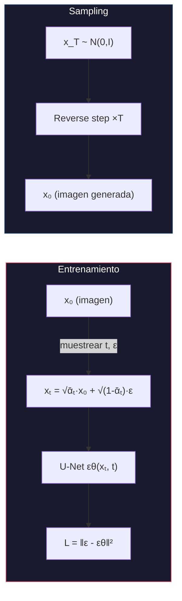
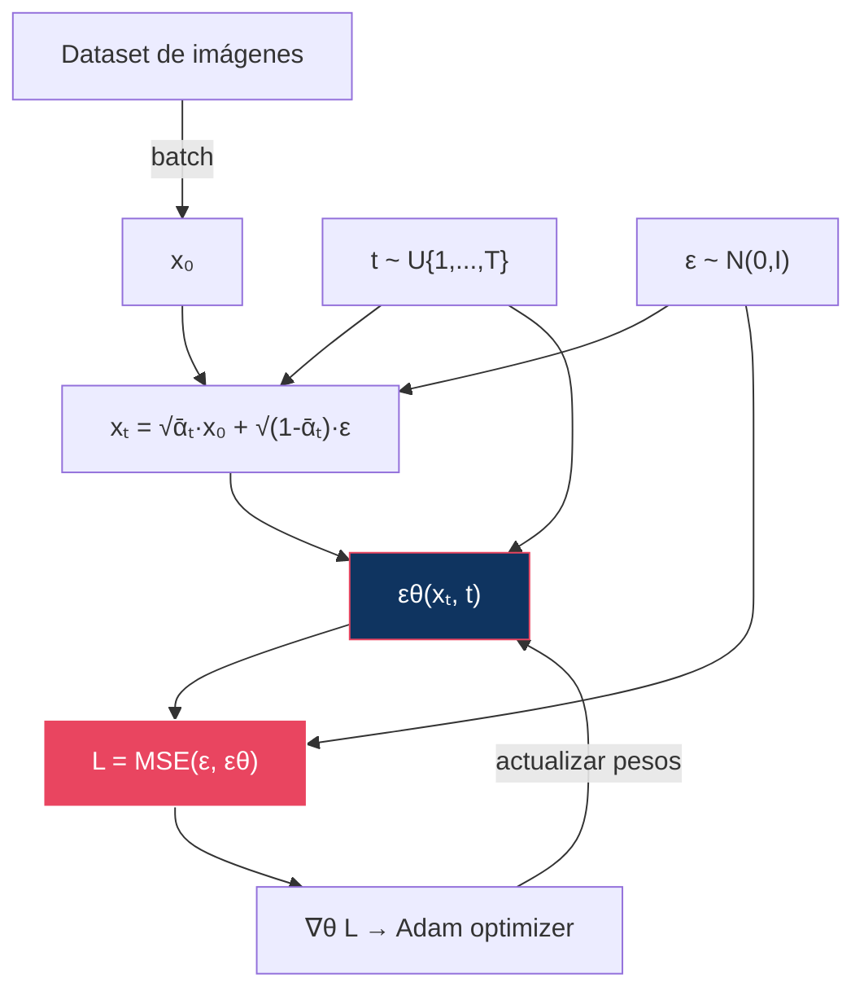
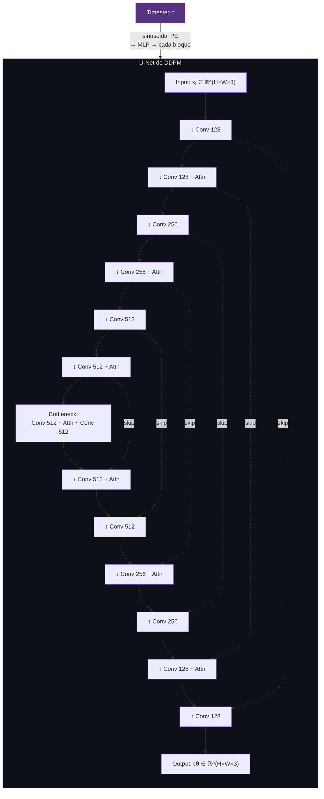
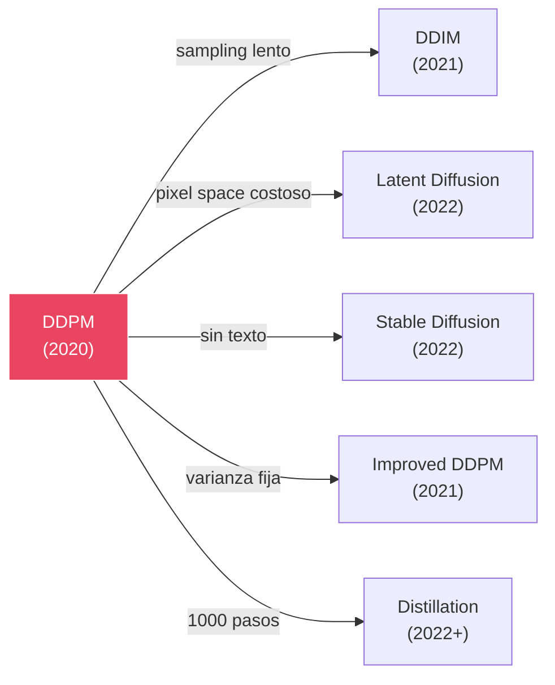

# 02 — DDPM: Denoising Diffusion Probabilistic Models

> El modelo que inició todo: aprender a revertir la destrucción gradual de una imagen por ruido Gaussiano.

---

## Índice

1. [La idea en una frase](#1-la-idea)
2. [Derivación matemática completa](#2-derivación)
3. [Algoritmo de entrenamiento](#3-entrenamiento)
4. [Algoritmo de sampling](#4-sampling)
5. [Arquitectura de la red (U-Net original)](#5-arquitectura)
6. [Hiperparámetros y decisiones de diseño](#6-hiperparámetros)
7. [Limitaciones y lo que vino después](#7-limitaciones)

---

## 1. La idea

**Ho, Jain, Abbeel (2020)**: Definir un proceso de Markov que destruye datos añadiendo ruido Gaussiano paso a paso, y entrenar una red neuronal para revertir cada paso.



---

## 2. Derivación matemática completa

### Forward process

```
q(xₜ | xₜ₋₁) = N(xₜ; √(1-βₜ) · xₜ₋₁, βₜI)
```

Con el reparameterization trick y la propiedad de composición de Gaussianas:

```
q(xₜ | x₀) = N(xₜ; √ᾱₜ · x₀, (1-ᾱₜ)I)

donde: αₜ = 1 - βₜ,  ᾱₜ = ∏ₛ₌₁ᵗ αₛ
```

### Reverse process

Queremos `q(xₜ₋₁ | xₜ)`, pero es intractable. Usando Bayes:

```
q(xₜ₋₁ | xₜ, x₀) = N(xₜ₋₁; μ̃ₜ(xₜ, x₀), β̃ₜI)
```

donde:

```
μ̃ₜ = (√ᾱₜ₋₁ · βₜ)/(1-ᾱₜ) · x₀ + (√αₜ · (1-ᾱₜ₋₁))/(1-ᾱₜ) · xₜ

β̃ₜ = (1-ᾱₜ₋₁)/(1-ᾱₜ) · βₜ
```

### Sustituyendo la predicción de ε

Si la red predice ε, podemos recuperar x₀:

```
x₀ = (xₜ - √(1-ᾱₜ) · εθ(xₜ,t)) / √ᾱₜ
```

Sustituyendo en μ̃ₜ:

```
μθ(xₜ, t) = 1/√αₜ · (xₜ - βₜ/√(1-ᾱₜ) · εθ(xₜ, t))
```

### Loss final

Del ELBO, después de simplificaciones (ver módulo 01):

```
L_simple = E_{t~U{1..T}, ε~N(0,I)} [ ‖ε - εθ(√ᾱₜ · x₀ + √(1-ᾱₜ) · ε, t)‖² ]
```

---

## 3. Algoritmo de entrenamiento

```
╔══════════════════════════════════════════════════╗
║  Algoritmo 1: DDPM Training                     ║
╠══════════════════════════════════════════════════╣
║  repeat                                          ║
║    x₀ ~ q(x₀)              // muestra del dataset║
║    t ~ Uniform({1, ..., T}) // timestep aleatorio║
║    ε ~ N(0, I)              // ruido aleatorio   ║
║    xₜ = √ᾱₜ · x₀ + √(1-ᾱₜ) · ε                ║
║    Gradient step on:                             ║
║      ∇θ ‖ε - εθ(xₜ, t)‖²                       ║
║  until converged                                 ║
╚══════════════════════════════════════════════════╝
```

### Diagrama del training loop



---

## 4. Algoritmo de sampling

```
╔══════════════════════════════════════════════════╗
║  Algoritmo 2: DDPM Sampling                     ║
╠══════════════════════════════════════════════════╣
║  x_T ~ N(0, I)                                  ║
║  for t = T, T-1, ..., 1 do                      ║
║    z ~ N(0, I) if t > 1, else z = 0             ║
║    xₜ₋₁ = 1/√αₜ · (xₜ - βₜ/√(1-ᾱₜ) · εθ(xₜ,t))║
║           + √β̃ₜ · z                             ║
║  return x₀                                      ║
╚══════════════════════════════════════════════════╝
```

> **Nota**: El sampling de DDPM requiere **T pasos** (típicamente 1000), cada uno con un forward pass de la red. Esto es extremadamente lento comparado con GANs (1 paso) y es la principal motivación para DDIM, distillation y flow matching.

---

## 5. Arquitectura de la red (U-Net original)



### Inyección del timestep

```
t → sinusoidal positional encoding → Linear → SiLU → Linear → embedding ∈ ℝᵈ
```

Este embedding se suma o se inyecta en cada ResNet block como un bias.

---

## 6. Hiperparámetros y decisiones de diseño

| Hiperparámetro | Valor (Ho et al.) | Justificación |
|:---------------|:-----------------|:-------------|
| T | 1000 | Suficiente para que q(x_T) ≈ N(0,I) |
| β₁ | 10⁻⁴ | Primer paso de ruido muy pequeño |
| β_T | 0.02 | Último paso destruye lo que queda |
| Schedule | Linear | Simple, funciona bien |
| Loss | L_simple (sin ponderación) | Empíricamente mejor que L_vlb ponderado |
| Varianza Σθ | Fija (β̃ₜ o βₜ) | No aprendida, simplifica el modelo |
| Optimizer | Adam, lr=2×10⁻⁴ | Estándar |
| EMA | Sí (decay 0.9999) | Crucial para calidad de muestras |

### ¿Por qué L_simple funciona mejor que L_vlb?

Ho et al. descubrieron empíricamente que **eliminar la ponderación del ELBO** produce mejores muestras, aunque produce un peor bound en log-likelihood. Esto se debe a que la ponderación del ELBO enfatiza demasiado los timesteps bajos (poco ruido), mientras que L_simple pondera uniformemente.

> **Trade-off**: L_simple → mejores muestras pero peor likelihood; L_vlb → mejor likelihood pero peores muestras.

---

## 7. Limitaciones y lo que vino después

| Limitación | Consecuencia | Solución posterior |
|:-----------|:-------------|:-------------------|
| 1000 pasos de sampling | Minutos por imagen | DDIM (50 pasos), distillation (4 pasos) |
| Pixel space | Costoso en alta resolución | Latent Diffusion (módulo 05) |
| Sin text conditioning | Solo class-conditional | Cross-attention + CLIP (SD) |
| Varianza fija | Subóptimo en pocos pasos | Improved DDPM (varianza aprendida) |
| Schedule lineal | SNR no uniforme | Cosine schedule, Min-SNR weighting |



---

## Referencias

- Ho, J., Jain, A., & Abbeel, P. (2020). *Denoising Diffusion Probabilistic Models*. NeurIPS 2020.
- Nichol, A. & Dhariwal, P. (2021). *Improved Denoising Diffusion Probabilistic Models*. ICML 2021.
- Sohl-Dickstein, J. et al. (2015). *Deep Unsupervised Learning using Nonequilibrium Thermodynamics*. ICML 2015.

---

*← [01 — Fundamentos](../01-foundations/README.md) | [03 — DDIM →](../03-ddim/README.md)*
