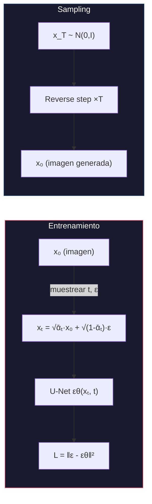
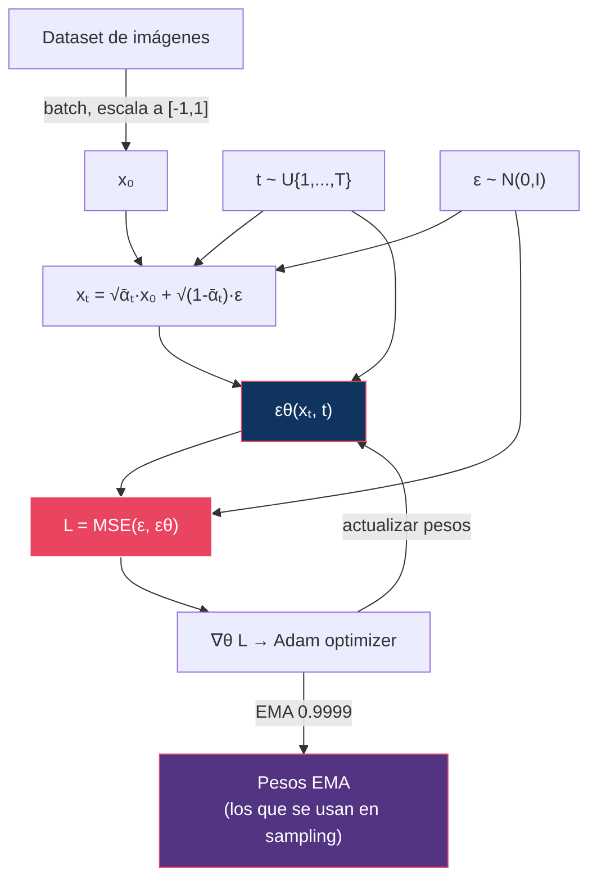
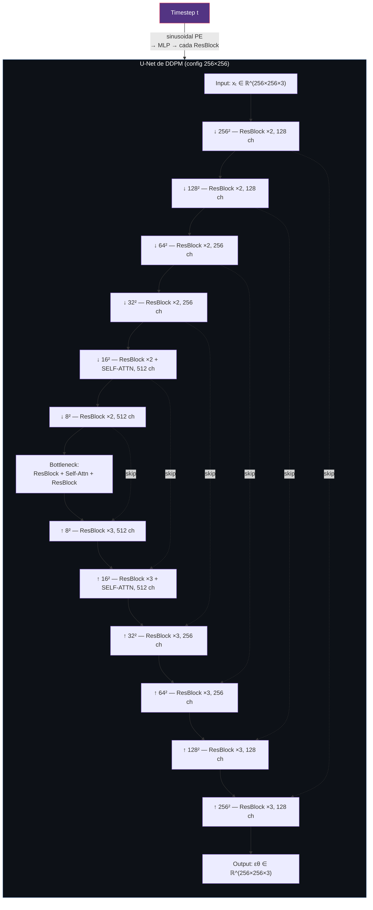
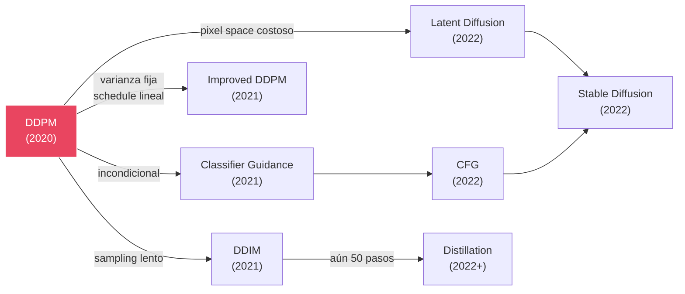

# 02 — DDPM: Denoising Diffusion Probabilistic Models

> El modelo que inició todo: aprender a revertir la destrucción gradual de una imagen por ruido Gaussiano.

---

## Índice

1. [La idea en una frase](#1-la-idea)
2. [Formulación matemática](#2-formulación-matemática)
3. [Algoritmo de entrenamiento](#3-algoritmo-de-entrenamiento)
4. [Algoritmo de sampling](#4-algoritmo-de-sampling)
5. [Arquitectura de la red (U-Net original)](#5-arquitectura-de-la-red-u-net-original)
6. [Hiperparámetros y decisiones de diseño](#6-hiperparámetros-y-decisiones-de-diseño)
7. [Resultados](#7-resultados)
8. [Relación con score matching](#8-relación-con-score-matching)
9. [Limitaciones y lo que vino después](#9-limitaciones-y-lo-que-vino-después)

---

## 1. La idea

**Ho, Jain, Abbeel (2020)**: Definir un proceso de Markov que destruye datos añadiendo ruido Gaussiano paso a paso, y entrenar una red neuronal para revertir cada paso.



> **Contexto**: DDPM no inventa la difusión — la formulación es de [Sohl-Dickstein et al. (2015)](#referencias). Lo que aporta Ho et al. es la parametrización ε, el loss simplificado y la arquitectura que hicieron que el enfoque **funcionara a escala competitiva** por primera vez.

---

## 2. Formulación matemática

### Convención de datos

Las imágenes se escalan al rango **[-1, 1]** antes de entrar al proceso. No es cosmético: el forward process asume que `x₀` tiene una escala comparable a la del ruido `N(0,I)`, y la varianza terminal `ᾱ_T ≈ 0` solo produce `N(0,I)` si los datos están centrados.

### Forward process

```
q(xₜ | xₜ₋₁) = N(xₜ; √(1-βₜ) · xₜ₋₁, βₜI)
```

Componiendo Gaussianas (dos ruidos Gaussianos independientes suman varianzas), se obtiene la marginal en forma cerrada:

```
q(xₜ | x₀) = N(xₜ; √ᾱₜ · x₀, (1-ᾱₜ)I)

donde: αₜ = 1 - βₜ,  ᾱₜ = ∏ₛ₌₁ᵗ αₛ
```

### Reverse process: por qué hace falta condicionar a x₀

Lo que necesitamos para generar es `q(xₜ₋₁ | xₜ)`. Por Bayes:

```
q(xₜ₋₁ | xₜ) = q(xₜ | xₜ₋₁) · q(xₜ₋₁) / q(xₜ)
```

El problema no es Bayes — es que `q(xₜ₋₁)` y `q(xₜ)` son **marginales sobre todo el dataset**, e incalculables.

La salida es condicionar además a `x₀`. Entonces las marginales problemáticas se sustituyen por condicionales que sí conocemos en forma cerrada:

```
q(xₜ₋₁ | xₜ, x₀) = q(xₜ | xₜ₋₁) · q(xₜ₋₁ | x₀) / q(xₜ | x₀)
```

Los tres factores son Gaussianos y conocidos. Desarrollando el exponente y completando el cuadrado en `xₜ₋₁`:

```
exp{ -½ [ (xₜ - √αₜ·xₜ₋₁)²/βₜ + (xₜ₋₁ - √ᾱₜ₋₁·x₀)²/(1-ᾱₜ₋₁) - (xₜ - √ᾱₜ·x₀)²/(1-ᾱₜ) ] }
```

El coeficiente de `xₜ₋₁²` da la precisión (inversa de la varianza) y el de `xₜ₋₁` da la media. Resultado:

```
q(xₜ₋₁ | xₜ, x₀) = N(xₜ₋₁; μ̃ₜ(xₜ, x₀), β̃ₜI)

μ̃ₜ = (√ᾱₜ₋₁ · βₜ)/(1-ᾱₜ) · x₀ + (√αₜ · (1-ᾱₜ₋₁))/(1-ᾱₜ) · xₜ

β̃ₜ = (1-ᾱₜ₋₁)/(1-ᾱₜ) · βₜ
```

> Durante el entrenamiento `x₀` es el dato, así que esta posterior es computable y sirve de *target*. Durante el sampling no lo es — por eso la red tiene que estimarla. Ver [01 §4](../01-foundations/README.md#4-reverse-process).

### Sustituyendo la predicción de ε

Si la red predice ε, podemos recuperar x₀:

```
x̂₀ = (xₜ - √(1-ᾱₜ) · εθ(xₜ,t)) / √ᾱₜ
```

Sustituyendo en μ̃ₜ y simplificando:

```
μθ(xₜ, t) = 1/√αₜ · (xₜ - βₜ/√(1-ᾱₜ) · εθ(xₜ, t))
```

**Predecir el ruido equivale a predecir la media de la posterior.** Ahí está la justificación de la parametrización ε.

### Loss final

Del ELBO, tras descartar la ponderación dependiente de t (ver [01 §8](../01-foundations/README.md#8-elbo)):

```
L_simple = E_{t~U{1..T}, ε~N(0,I)} [ ‖ε - εθ(√ᾱₜ · x₀ + √(1-ᾱₜ) · ε, t)‖² ]
```

### El decoder discreto del último paso

Detalle que casi todas las exposiciones omiten. El término `log pθ(x₀|x₁)` del ELBO **no es una densidad Gaussiana**: los píxeles son discretos (256 valores), así que DDPM usa una **Gaussiana discretizada** que integra la densidad sobre el ancho de bin correspondiente a cada valor de píxel:

```
pθ(x₀|x₁) = ∏ᵢ ∫_{δ₋(x₀ⁱ)}^{δ₊(x₀ⁱ)} N(y; μθⁱ(x₁,1), σ₁²) dy
```

con bins de ancho `1/127.5` en el rango escalado [-1,1]. Sin esto el NLL en bits/dim no sería comparable con el de modelos autoregresivos.

---

## 3. Algoritmo de entrenamiento

```
Algoritmo 1 — DDPM Training

repeat
    x₀ ~ q(x₀)                     // muestra del dataset, escalada a [-1,1]
    t  ~ Uniform({1, ..., T})      // timestep aleatorio
    ε  ~ N(0, I)                   // ruido aleatorio
    xₜ = √ᾱₜ · x₀ + √(1-ᾱₜ) · ε   // forward en un solo paso (O(1))

    gradient step on  ∇θ ‖ε - εθ(xₜ, t)‖²
until converged
```

> El paso clave para la viabilidad es la cuarta línea: gracias a la forma cerrada de `q(xₜ|x₀)` **no hay que simular los t pasos intermedios**. Cada iteración cuesta un forward pass, no t.

### Diagrama del training loop



---

## 4. Algoritmo de sampling

```
Algoritmo 2 — DDPM Sampling

x_T ~ N(0, I)
for t = T, T-1, ..., 1 do
    z ~ N(0, I)  si t > 1,  else  z = 0

    xₜ₋₁ = 1/√αₜ · (xₜ - βₜ/√(1-ᾱₜ) · εθ(xₜ,t))  +  σₜ · z
return x₀
```

### La elección de σₜ

Ho et al. no fijan una sola varianza; prueban dos extremos y reportan resultados comparables:

| Opción | σₜ² | Interpretación | Uso |
|:-------|:----|:---------------|:----|
| *fixedlarge* | `βₜ` | Óptimo si `x₀ ~ N(0,I)` | **La del resultado principal del paper** (FID 3.17) |
| *fixedsmall* | `β̃ₜ` | Óptimo si `x₀` es un punto fijo | Alternativa, ligeramente peor FID |

Los dos son cotas de la varianza real de la posterior. Que ambas funcionen parecido es lo que motiva a **Improved DDPM** a aprender la interpolación entre ellas, con lo que sí gana calidad en pocos pasos.

> **Coste**: el sampling requiere **T pasos** (típicamente 1000), cada uno con un forward pass completo de la red. A 256×256 son del orden de un minuto por imagen en el hardware del paper; a 32×32, ~1.5 s. Esta es la principal motivación de DDIM, la distillation y el flow matching.

---

## 5. Arquitectura de la red (U-Net original)

Backbone tipo PixelCNN++/Wide-ResNet con tres cambios propios: **GroupNorm** en lugar de weight normalization, embedding sinusoidal de timestep, y self-attention en **una única resolución**.



> ⚠️ **Corrección frecuente**: se suele dibujar el U-Net de DDPM con atención en varios niveles. El paper es explícito (Apéndice B): *self-attention blocks at the 16×16 resolution*, **una sola resolución** (más el bottleneck). Esto es justamente lo que lo mantenía barato — ampliar la atención a más escalas es uno de los cambios que introducen los modelos posteriores.

### Configuraciones por resolución

| Config | Resoluciones | Channel multipliers | Canales | Self-attention |
|:-------|:-------------|:--------------------|:--------|:---------------|
| CIFAR-10 (32×32) | 4 (32 → 4) | (1, 2, 2, 2) | 128, 256, 256, 256 | solo 16×16 |
| LSUN / CelebA-HQ (256×256) | 6 (256 → 8) | (1, 1, 2, 2, 4, 4) | 128, 128, 256, 256, 512, 512 | solo 16×16 |

Dos bloques residuales por nivel en el encoder (tres en el decoder, por la concatenación del skip).

### Inyección del timestep

```
t → sinusoidal positional encoding (estilo Transformer) → Linear → SiLU → Linear → emb ∈ ℝᵈ
```

El embedding se proyecta y se **suma como bias dentro de cada ResNet block**, tras la primera convolución. Es el único mecanismo por el que la red sabe en qué nivel de ruido está operando: la misma red comparte pesos para los T timesteps.

---

## 6. Hiperparámetros y decisiones de diseño

| Hiperparámetro | Valor (Ho et al.) | Justificación |
|:---------------|:-----------------|:-------------|
| T | 1000 | Compromiso calidad/coste; ver nota sobre `q(x_T)` abajo |
| β₁ | 10⁻⁴ | Primer paso de ruido muy pequeño |
| β_T | 0.02 | Último paso destruye lo que queda |
| Schedule | Linear | Simple, funciona bien |
| Loss | L_simple (sin ponderación) | Mejores muestras que L_vlb ponderado |
| Varianza Σθ | Fija (βₜ o β̃ₜ) | No aprendida, simplifica el modelo |
| Optimizer | Adam | Estándar |
| Learning rate | 2×10⁻⁴ (32×32) · 2×10⁻⁵ (256×256) | Se reduce con la resolución |
| Batch size | 128 (CIFAR-10) | Menor en alta resolución |
| Dropout | 0.1 | Regularización en los ResBlocks |
| Pasos de entrenamiento | ~800 K (CIFAR-10) | — |
| Gradient clipping | 1.0 | Estabilidad |
| EMA | Sí (decay 0.9999) | **Crucial** para calidad de muestras |

> **EMA no es un detalle**: el sampling se hace siempre con los pesos promediados, no con los del último paso de gradiente. La diferencia en FID es grande, y es un error habitual al reimplementar DDPM.

### Nota sobre `q(x_T) ≈ N(0,I)`

Se suele justificar `T = 1000` diciendo que basta para que `q(x_T)` sea ruido puro. **No lo es**: con el schedule lineal,

```
ᾱ_T ≈ 4 · 10⁻⁵   ⟹   SNR(T) ≈ 4 · 10⁻⁵ ≠ 0
```

`x_T` conserva una traza residual de `x₀` — en concreto de su brillo medio — mientras que el sampler arranca de `N(0,I)` puro. Ese desajuste train/test es la causa de que estos modelos no generen bien imágenes muy oscuras o muy claras. Desarrollado en [01 §6 — Zero-terminal-SNR](../01-foundations/README.md#6-snr).

### ¿Por qué L_simple funciona mejor que L_vlb?

Ho et al. descubrieron empíricamente que **eliminar la ponderación del ELBO** produce mejores muestras, aunque empeora el bound en log-likelihood.

La razón es cuantificable. El peso de cada término del ELBO, escrito en espacio-ε, es:

```
w(t) = βₜ² / (2σₜ²·αₜ·(1-ᾱₜ))
```

Con `σₜ² = βₜ` esto se reduce a `βₜ / (2αₜ(1-ᾱₜ))`. En t pequeño, `1-ᾱₜ ≈ t·β₁`, así que `w(t) → 1/(2t)`: **enorme**. En t grande, `w(t) ≈ 0.01`. El ELBO dedica casi toda su capacidad a los timesteps de ruido bajo, que son los denoising más fáciles y menos informativos.

`L_simple` pone `w(t) = 1`, lo que en la práctica **redistribuye capacidad hacia los t grandes**, donde está el trabajo difícil que determina la estructura global de la imagen.

> **Trade-off** (medido en CIFAR-10, ver [§7](#7-resultados)): L_simple → FID 3.17 pero NLL 3.75; L_vlb → NLL 3.70 pero FID 13.51.

Toda la literatura posterior de weighting — Min-SNR, P2, las parametrizaciones de [01 §7](../01-foundations/README.md#7-parametrizaciones) — consiste en buscar el punto intermedio. Improved DDPM lo consigue con un objetivo híbrido.

---

## 7. Resultados

### CIFAR-10 (32×32), incondicional

| Objetivo / variante | IS ↑ | FID ↓ | NLL (bits/dim) ↓ |
|:--------------------|-----:|------:|-----------------:|
| **DDPM (L_simple)** | **9.46** | **3.17** | ≤ 3.75 |
| DDPM (L_vlb, varianza isótropa fija) | 7.67 | 13.51 | **3.70** |

Estas dos filas son el argumento central del paper en forma de tabla: **el objetivo que da mejor verosimilitud da peores muestras**, y viceversa. El FID de 3.17 superaba en su momento al de los mejores GANs no condicionados en CIFAR-10, y es el resultado que abrió el campo.

### Alta resolución

El paper también reporta LSUN (Church-outdoor, Bedroom) y CelebA-HQ a 256×256, con calidad comparable a ProgressiveGAN.

> ⚠️ Los números concretos de LSUN/CelebA-HQ **están pendientes de verificar contra el paper** antes de incluirse aquí, siguiendo el principio de trazabilidad del repositorio.

---

## 8. Relación con score matching

DDPM y los *score-based models* de Song & Ermon (2019) se desarrollaron en paralelo y resultaron ser **el mismo algoritmo en dos notaciones**. Ho et al. lo señalan explícitamente.

La identidad, vía la fórmula de Tweedie (desarrollada en [01 §4](../01-foundations/README.md#4-reverse-process)):

```
sθ(xₜ, t) = ∇ₓ log q(xₜ) = -εθ(xₜ, t) / √(1-ᾱₜ)
```

Y la correspondencia de los algoritmos:

| DDPM | Score-based (NCSN) |
|:-----|:-------------------|
| `εθ(xₜ,t)` entrenada con MSE | Denoising score matching |
| Schedule `{βₜ}` | Escala de ruido `{σᵢ}` |
| Reverse process ancestral | Annealed Langevin dynamics |
| Paso de sampling con `σₜ·z` | Paso de Langevin con ruido inyectado |

Song et al. (2021) unificarían ambos bajo la formulación SDE: DDPM es la discretización de una **VP-SDE** (varianza preservada), NCSN de una **VE-SDE** (varianza explotada). Ver [04 — Score Models](../04-score-models/README.md).

---

## 9. Limitaciones y lo que vino después

| Limitación | Consecuencia | Solución posterior |
|:-----------|:-------------|:-------------------|
| 1000 pasos de sampling | ~1 min/imagen a 256×256 | DDIM (50 pasos), distillation (1-4 pasos) |
| Pixel space | Coste cuadrático en resolución | Latent Diffusion ([05](../05-latent-diffusion/README.md)) |
| **Incondicional** | Sin control sobre la salida | Classifier guidance → CFG ([09](../09-guidance/README.md)) |
| Varianza fija | Subóptimo en pocos pasos | Improved DDPM (varianza aprendida) |
| Schedule lineal | SNR no uniforme, `ᾱ_T ≠ 0` | Cosine schedule, zero-terminal-SNR, Min-SNR |
| `L_simple` no es el ELBO | Peor likelihood | Objetivo híbrido (Improved DDPM) |

> ⚠️ **Corrección frecuente**: DDPM (2020) es **incondicional** — se entrena en CIFAR-10, LSUN y CelebA-HQ sin etiquetas de ningún tipo. El condicionamiento por clase llega con Dhariwal & Nichol (2021) junto con classifier guidance; el condicionamiento por texto con LDM/Stable Diffusion.



---

## Referencias

- Ho, J., Jain, A., & Abbeel, P. (2020). *Denoising Diffusion Probabilistic Models*. NeurIPS 2020. — **Paper de este módulo.**
- Sohl-Dickstein, J., Weiss, E., Maheswaranathan, N., & Ganguli, S. (2015). *Deep Unsupervised Learning using Nonequilibrium Thermodynamics*. ICML 2015. — Formulación original de difusión.
- Song, Y., & Ermon, S. (2019). *Generative Modeling by Estimating Gradients of the Data Distribution*. NeurIPS 2019. — NCSN; el desarrollo paralelo de [§8](#8-relación-con-score-matching).
- Nichol, A. & Dhariwal, P. (2021). *Improved Denoising Diffusion Probabilistic Models*. ICML 2021. — Cosine schedule, varianza aprendida, objetivo híbrido.
- Dhariwal, P. & Nichol, A. (2021). *Diffusion Models Beat GANs on Image Synthesis*. NeurIPS 2021. — Primer condicionamiento por clase + classifier guidance.
- Song, Y. et al. (2021). *Score-Based Generative Modeling through Stochastic Differential Equations*. ICLR 2021. — Unificación VP/VE-SDE.
- Lin, S. et al. (2024). *Common Diffusion Noise Schedules and Sample Steps are Flawed*. WACV 2024. — Zero-terminal-SNR.
- Salimans, T. et al. (2016). *Improved Techniques for Training GANs*. NeurIPS 2016. — Definición del Inception Score usado en [§7](#7-resultados).

---

*← [01 — Fundamentos](../01-foundations/README.md) | [03 — DDIM →](../03-ddim/README.md)*
