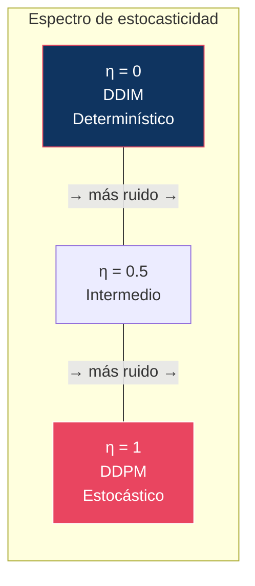
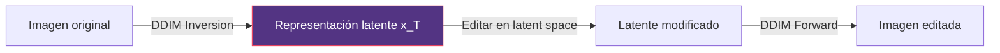
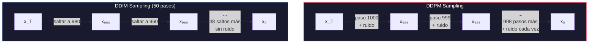

# 03 — DDIM: Denoising Diffusion Implicit Models

> Cómo convertir un proceso estocástico lento en un proceso determinístico rápido — sin reentrenar.

---

## Índice

1. [Motivación](#1-motivación)
2. [Derivación: de DDPM a DDIM](#2-derivación)
3. [El parámetro η](#3-el-parámetro-η)
4. [Aceleración: menos pasos](#4-aceleración)
5. [DDIM Inversion](#5-ddim-inversion)
6. [Interpolación en latent space](#6-interpolación)
7. [DDPM vs DDIM: análisis comparativo](#7-comparación)

---

## 1. Motivación

**DDPM** requiere T = 1000 pasos para generar una imagen. Cada paso necesita un forward pass de la U-Net. Esto es inaceptablemente lento.

**Song et al. (2021)** observaron que el proceso de sampling de DDPM no necesita ser Markoviano — pueden existir procesos **no-Markovianos** que comparten las mismas distribuciones marginales `q(xₜ|x₀)` pero permiten saltar pasos.

---

## 2. Derivación: de DDPM a DDIM

### Insight clave

DDPM define `q(xₜ₋₁|xₜ, x₀)` como una Gaussiana con media y varianza específicas. Pero existen **infinitas** distribuciones `q(xₜ₋₁|xₜ, x₀)` que son consistentes con la misma marginal `q(xₜ|x₀)`.

### La familia DDIM

Song et al. proponen una familia de distribuciones parametrizada por σₜ:

```
q_σ(xₜ₋₁ | xₜ, x₀) = N(xₜ₋₁; μ_σ, σₜ²I)
```

donde:

```
μ_σ = √ᾱₜ₋₁ · x₀ + √(1 - ᾱₜ₋₁ - σₜ²) · (xₜ - √ᾱₜ · x₀) / √(1 - ᾱₜ)
```

### Sampling update rule

Sustituyendo `x₀ = (xₜ - √(1-ᾱₜ)·εθ) / √ᾱₜ`:

```
xₜ₋₁ = √ᾱₜ₋₁ · predicted_x₀
      + √(1 - ᾱₜ₋₁ - σₜ²) · predicted_direction
      + σₜ · εₜ
```

donde:
- `predicted_x₀ = (xₜ - √(1-ᾱₜ)·εθ(xₜ,t)) / √ᾱₜ`
- `predicted_direction = (xₜ - √ᾱₜ · predicted_x₀) / √(1-ᾱₜ)` = dirección hacia el ruido
- `εₜ ~ N(0,I)` = ruido fresco (solo si σₜ > 0)

---

## 3. El parámetro η

El parámetro σₜ se parametriza como:

```
σₜ = η · √((1-ᾱₜ₋₁)/(1-ᾱₜ)) · √(1 - ᾱₜ/ᾱₜ₋₁)
```

donde **η ∈ [0, 1]** controla la estocasticidad:

| η | Comportamiento | Equivalente a |
|:--|:---------------|:-------------|
| η = 1 | Completamente estocástico | DDPM original |
| 0 < η < 1 | Parcialmente estocástico | Intermedio |
| **η = 0** | **Completamente determinístico** | **DDIM puro** |



### Implicaciones de η = 0

Cuando η = 0:
1. **No se añade ruido** en cada paso → proceso determinístico
2. **Dado el mismo x_T**, siempre se genera la **misma imagen**
3. El proceso es **invertible**: podemos ir de x₀ a x_T y viceversa
4. Permite **interpolación** entre imágenes en el espacio latente

---

## 4. Aceleración: menos pasos

### Subsampling de timesteps

DDIM no requiere usar todos los T = 1000 timesteps. Podemos seleccionar un **subconjunto** S ⊂ {1,...,T}:

```
S = {τ₁, τ₂, ..., τₛ}    con s << T
```

Ejemplo con S = 50 pasos:
```
S = {20, 40, 60, 80, ..., 980, 1000}
```

El update rule se aplica solo entre los timesteps en S, saltando los intermedios.

### ¿Por qué funciona?

El truco es que `q(xₜ | x₀)` se puede calcular **directamente** para cualquier t (propiedad del forward process). No necesitamos pasar por los pasos intermedios.

### Calidad vs pasos

| Pasos | Calidad relativa (FID ↓) | Velocidad relativa |
|:------|:------------------------|:------------------|
| 1000 (DDPM) | Baseline | 1× |
| 100 (DDIM) | Casi igual | 10× |
| 50 (DDIM) | Ligeramente peor | 20× |
| 20 (DDIM) | Degradación visible | 50× |
| 10 (DDIM) | Significativa | 100× |

> **Insight**: DDIM con 50 pasos produce calidad comparable a DDPM con 1000 pasos. Esta aceleración de **20×** fue revolucionaria.

---

## 5. DDIM Inversion

### ¿Qué es?

Como DDIM (η=0) es determinístico, el proceso puede **invertirse**: dada una imagen real x₀, podemos encontrar el x_T que la generaría.

### Procedimiento

```
╔══════════════════════════════════════════════════╗
║  DDIM Inversion (Forward)                        ║
╠══════════════════════════════════════════════════╣
║  Input: x₀ (imagen real)                        ║
║  for t = 1, 2, ..., T do                        ║
║    εθ = modelo(xₜ₋₁, t-1)                      ║
║    xₜ = √ᾱₜ · pred_x₀ + √(1-ᾱₜ) · εθ         ║
║  return x_T                                     ║
╚══════════════════════════════════════════════════╝
```

### ¿Para qué sirve?



Aplicaciones:
1. **Image editing**: Invertir → modificar latent/prompt → re-generar
2. **Style transfer**: Invertir imagen A → generar con prompt de estilo B
3. **Interpolación**: Invertir dos imágenes → interpolar sus latents → generar

---

## 6. Interpolación en latent space

Con DDIM, podemos interpolar entre dos imágenes:

```
x_T^(A) = DDIM_Inversion(imagen_A)
x_T^(B) = DDIM_Inversion(imagen_B)

x_T^(interp) = slerp(x_T^(A), x_T^(B), α)    // α ∈ [0, 1]

imagen_interp = DDIM_Forward(x_T^(interp))
```

> **Nota**: Se usa **SLERP** (Spherical Linear Interpolation) en lugar de LERP porque los latents viven en una esfera de alta dimensión (distribución Gaussiana isótropa).

---

## 7. DDPM vs DDIM: análisis comparativo

### Tabla de diferencias

| Aspecto | DDPM | DDIM |
|:--------|:-----|:-----|
| **Naturaleza** | Estocástico (SDE) | Determinístico (ODE) cuando η=0 |
| **Pasos** | 1000 (fijo) | 10-100 (configurable) |
| **Diversidad** | Alta (ruido en cada paso) | Menor (determinístico) |
| **Reproducibilidad** | Diferentes resultados cada vez | Mismo x_T → misma imagen |
| **Inversión** | No posible | Sí (exacta con η=0) |
| **Interpolación** | No posible | Sí |
| **Calidad (muchos pasos)** | Excelente | Excelente |
| **Calidad (pocos pasos)** | Terrible | Aceptable |
| **Reentrenamiento** | N/A | **No necesario** (mismo modelo) |

### El insight más importante

> DDIM no requiere reentrenar el modelo. Usa **exactamente el mismo εθ** entrenado para DDPM. Solo cambia el procedimiento de sampling. Esto fue conceptualmente revolucionario: separó el training del inference.

### Diagrama comparativo



---

## Conexión con módulos posteriores

| Concepto DDIM | Evolución posterior | Módulo |
|:--------------|:-------------------|:-------|
| ODE determinístico | → Flow Matching ODE | [07](../07-flow-matching/) |
| Subsample timesteps | → DPM-Solver, schedulers | [08](../08-sampling/) |
| Inversión | → Image editing pipelines | [11](../11-conditioning/) |
| η como control de estocasticidad | → Ancestral vs deterministic samplers | [08](../08-sampling/) |

---

## Referencias

- Song, J., Meng, C., & Ermon, S. (2021). *Denoising Diffusion Implicit Models*. ICLR 2021.
- Ho, J., Jain, A., & Abbeel, P. (2020). *Denoising Diffusion Probabilistic Models*. NeurIPS 2020.

---

*← [02 — DDPM](../02-ddpm/README.md) | [04 — Score Models →](../04-score-models/README.md)*
