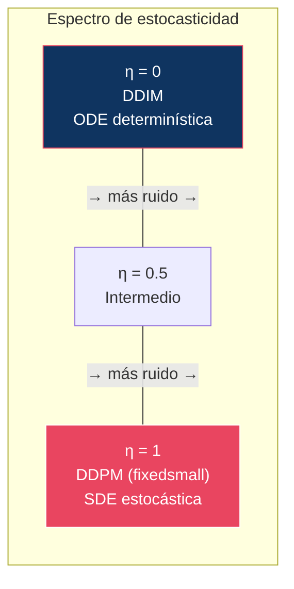
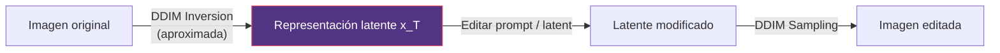
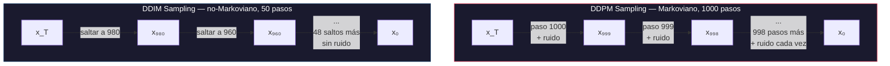

# 03 — DDIM: Denoising Diffusion Implicit Models

> Cómo convertir un proceso estocástico lento en un proceso determinístico rápido — sin reentrenar.

---

## Índice

1. [Motivación](#1-motivación)
2. [Derivación: de DDPM a DDIM](#2-derivación-de-ddpm-a-ddim)
3. [El parámetro η](#3-el-parámetro-η)
4. [Aceleración: menos pasos](#4-aceleración-menos-pasos)
5. [DDIM como ODE](#5-ddim-como-ode)
6. [DDIM Inversion](#6-ddim-inversion)
7. [Interpolación en latent space](#7-interpolación-en-latent-space)
8. [DDPM vs DDIM: análisis comparativo](#8-ddpm-vs-ddim-análisis-comparativo)

---

## 1. Motivación

**DDPM** requiere T = 1000 pasos para generar una imagen. Cada paso necesita un forward pass de la U-Net. Esto es inaceptablemente lento.

**Song, Meng & Ermon (2021)** observaron que el objetivo de entrenamiento `L_simple` **solo depende de las marginales `q(xₜ|x₀)`**, no del proceso conjunto que las conecta. Como el forward Markoviano de DDPM no es el único que produce esas marginales, se puede sustituir por procesos **no-Markovianos** que permiten saltar pasos — y reutilizar el modelo ya entrenado sin tocarlo.

> **Nota de nomenclatura**: en este repositorio conviven dos «Song et al. (2021)». **Jiaming** Song, Meng & Ermon firman DDIM; **Yang** Song et al. firman el paper de Score-SDE ([04](../04-score-models/README.md)). No confundirlos.

### ¿Por qué «implicit»?

El nombre viene de *implicit probabilistic model*, en el sentido de los GANs: con η = 0 las muestras se obtienen aplicando un **mapa determinista** a un ruido inicial, sin una verosimilitud tratable paso a paso. DDIM genera como un modelo implícito aunque se haya entrenado como uno explícito.

---

## 2. Derivación: de DDPM a DDIM

### Insight clave

DDPM define `q(xₜ₋₁|xₜ, x₀)` como una Gaussiana concreta. Pero existen **infinitas** distribuciones `q(xₜ₋₁|xₜ, x₀)` consistentes con la misma marginal `q(xₜ|x₀)`, y el loss no distingue entre ellas.

### La familia DDIM

Song et al. proponen una familia parametrizada por σₜ:

```
q_σ(xₜ₋₁ | xₜ, x₀) = N(xₜ₋₁; μ_σ, σₜ²I)
```

donde:

```
μ_σ = √ᾱₜ₋₁ · x₀ + √(1 - ᾱₜ₋₁ - σₜ²) · (xₜ - √ᾱₜ · x₀) / √(1 - ᾱₜ)
```

La familia está construida precisamente para que se cumpla, por inducción y para cualquier σₜ:

```
q_σ(xₜ | x₀) = N(xₜ; √ᾱₜ · x₀, (1-ᾱₜ)I)     ← la marginal de DDPM, intacta
```

Ese es todo el truco: **misma marginal, distinto proceso conjunto**. Como `L_simple` solo ve las marginales, el `εθ` entrenado para DDPM sirve para toda la familia.

### Sampling update rule

Sustituyendo `x₀ = (xₜ - √(1-ᾱₜ)·εθ) / √ᾱₜ`:

```
xₜ₋₁ = √ᾱₜ₋₁ · x̂₀           ← predicción de la imagen limpia
      + √(1 - ᾱₜ₋₁ - σₜ²) · εθ(xₜ,t)   ← dirección que apunta de vuelta a xₜ
      + σₜ · εₜ                ← ruido fresco (solo si σₜ > 0)
```

donde:
- `x̂₀ = (xₜ - √(1-ᾱₜ)·εθ(xₜ,t)) / √ᾱₜ`
- `εₜ ~ N(0,I)`

Los tres términos tienen lectura geométrica: **saltar al x₀ estimado**, **retroceder parcialmente hacia el ruido** hasta el nivel que corresponde a `t-1`, y opcionalmente **reinyectar aleatoriedad**.

---

## 3. El parámetro η

El parámetro σₜ se parametriza como:

```
σₜ = η · √((1-ᾱₜ₋₁)/(1-ᾱₜ)) · √(1 - ᾱₜ/ᾱₜ₋₁)
```

donde **η ∈ [0, 1]** controla la estocasticidad:

| η | Comportamiento | Equivalente a |
|:--|:---------------|:-------------|
| η = 1 | Completamente estocástico | DDPM (variante *fixedsmall*) |
| 0 < η < 1 | Parcialmente estocástico | Intermedio |
| **η = 0** | **Completamente determinístico** | **DDIM puro** |

### Por qué η = 1 recupera DDPM

No es una analogía, es una identidad. Como `ᾱₜ/ᾱₜ₋₁ = αₜ`, el segundo radical es `√(1-αₜ) = √βₜ`, y por tanto:

```
σₜ² = (1-ᾱₜ₋₁)/(1-ᾱₜ) · βₜ = β̃ₜ
```

Exactamente la varianza de la posterior de DDPM. Con η = 1 el proceso vuelve a ser Markoviano y el sampler es el Algoritmo 2 de DDPM.

> ⚠️ **Matiz**: η = 1 recupera DDPM con `σₜ² = β̃ₜ` (*fixedsmall*). El resultado principal del paper de DDPM (FID 3.17) usa `σₜ² = βₜ` (*fixedlarge*), que **no** pertenece a la familia DDIM. Ver [02 §4](../02-ddpm/README.md#4-algoritmo-de-sampling).



### Implicaciones de η = 0

1. **No se añade ruido** en cada paso → el sampler es una función determinista
2. **Dado el mismo x_T**, siempre se genera la **misma imagen**
3. El proceso es **aproximadamente invertible** (ver [§6](#6-ddim-inversion) — la exactitud tiene matices importantes)
4. Permite **interpolación** significativa en el espacio de ruido

---

## 4. Aceleración: menos pasos

### Subsampling de timesteps

DDIM no requiere usar todos los T = 1000 timesteps. Podemos seleccionar un **subconjunto** creciente S ⊂ {1,...,T}:

```
S = {τ₁, τ₂, ..., τₛ}    con s << T
```

Ejemplo con s = 50 pasos (espaciado uniforme):
```
S = {20, 40, 60, 80, ..., 980, 1000}
```

El update rule se aplica entre timesteps **consecutivos dentro de S** (`τᵢ → τᵢ₋₁`), saltando los intermedios.

### ¿Por qué funciona?

Porque la familia `q_σ` se define sobre cualquier subsecuencia creciente de timesteps y sigue respetando las marginales `q(xτᵢ|x₀)`. No hay nada especial en los 1000 pasos originales: eran una elección de discretización, no una propiedad del modelo.

Es también donde se ve mejor la diferencia con DDPM: el proceso Markoviano de DDPM **obliga** a pasar por todos los estados intermedios, porque cada transición depende únicamente del estado anterior.

### Calidad vs pasos

FID en CIFAR-10 en función del número de pasos:

| Pasos (s) | DDIM (η = 0) | DDPM (η = 1) | Speedup |
|:----------|-------------:|-------------:|--------:|
| 1000 | — | ~3.2 (baseline) | 1× |
| 100 | ~4.2 | ~11 | 10× |
| 50 | ~4.7 | ~15 | 20× |
| 20 | ~6.8 | ~28 | 50× |
| 10 | ~13.4 | ~41 | 100× |

> ⚠️ Valores aproximados reconstruidos de la Tabla 1 del paper; **pendientes de verificar contra la fuente** antes de darlos por definitivos.

La lectura importante no son los valores absolutos sino **la forma de las dos curvas**: DDIM se degrada suavemente al reducir pasos, DDPM se desploma. Con 1000 pasos DDPM gana ligeramente; por debajo de 100, DDIM es el único utilizable.

> **Insight**: DDIM con 50 pasos produce calidad cercana a DDPM con 1000. Esa aceleración de **20×** es lo que hizo la difusión viable en producción.

---

## 5. DDIM como ODE

Esta es la sección que conecta DDIM con todo lo que vino después, y suele omitirse.

Con η = 0 el update rule no tiene ruido, así que es una **discretización de Euler de una ecuación diferencial ordinaria**. Reescribiendo con el cambio de variable

```
σ = √(1-ᾱ)/√ᾱ        (desviación estándar en escala de señal)
x̄ = x/√ᾱ             (estado renormalizado)
```

el sampler de DDIM se convierte en:

```
dx̄ = εθ(x̄, σ) dσ
```

Una ODE limpia, sin schedule. Tres consecuencias:

| Consecuencia | Por qué | Dónde se explota |
|:-------------|:--------|:-----------------|
| El error viene de la **discretización**, no del modelo | Con pasos infinitesimales se recupera la trayectoria exacta | Justifica que más pasos → mejor |
| Se pueden usar **solvers mejores que Euler** | Es una ODE ordinaria: sirven Heun, Runge-Kutta, métodos multipaso | DPM-Solver, UniPC ([08](../08-sampling/)) |
| La trayectoria es **reversible** en el límite continuo | Las ODEs son reversibles en el tiempo | Inversión ([§6](#6-ddim-inversion)) |

Esta ODE es la misma **Probability Flow ODE** que aparece en [01 §10](../01-foundations/README.md#10-sde-vs-ode) y que Yang Song et al. (2021) derivan desde la formulación SDE. DDIM la había encontrado antes por vía puramente algebraica, sin pasar por cálculo estocástico.

Y es el puente conceptual con **Flow Matching** ([07](../07-flow-matching/)): si generar es resolver una ODE, la pregunta natural es por qué no entrenar directamente para que esa ODE tenga trayectorias lo más rectas posible — que es exactamente lo que hace Rectified Flow.

---

## 6. DDIM Inversion

### ¿Qué es?

Como el sampler con η = 0 es determinista, se puede recorrer al revés: dada una imagen real `x₀`, encontrar el `x_T` que la generaría.

### Procedimiento

```
DDIM Inversion (x₀ → x_T)

Input: x₀ (imagen real)
for t = 1, 2, ..., T do
    ε̂     = εθ(xₜ₋₁, t-1)                          // (*) aproximación
    x̂₀    = (xₜ₋₁ - √(1-ᾱₜ₋₁) · ε̂) / √ᾱₜ₋₁
    xₜ    = √ᾱₜ · x̂₀ + √(1-ᾱₜ) · ε̂
return x_T
```

### La aproximación (*) y por qué importa

El paso de sampling hacia delante necesitaría `εθ(xₜ, t)`, pero en la inversión **todavía no tenemos `xₜ`** — es lo que estamos calculando. Se usa `εθ(xₜ₋₁, t-1)` en su lugar, asumiendo que

```
εθ(xₜ, t) ≈ εθ(xₜ₋₁, t-1)
```

Es una **linealización local**. Válida cuando los pasos son pequeños; el error se acumula a lo largo de la trayectoria.

> ⚠️ **La inversión DDIM no es exacta.** Solo lo es en el límite de paso infinitesimal. Con pocos pasos, y sobre todo **con CFG alto**, el error crece rápido y la reconstrucción se degrada de forma visible: al re-generar desde el `x_T` invertido no se recupera la imagen original.

Por eso existe una familia entera de métodos correctivos:

| Método | Estrategia |
|:-------|:-----------|
| **Null-text Inversion** | Optimiza el embedding nulo por timestep para cerrar el gap con CFG |
| **EDICT** | Dos latents acoplados con transformaciones afines exactamente invertibles |
| **ReNoise** | Refinamiento iterativo de punto fijo en cada paso de inversión |

Consistente con lo señalado en [01 §10](../01-foundations/README.md#10-sde-vs-ode).

### ¿Para qué sirve?



Aplicaciones:
1. **Image editing**: invertir → modificar latent/prompt → re-generar
2. **Style transfer**: invertir imagen A → generar con prompt de estilo B
3. **Interpolación**: invertir dos imágenes → interpolar sus latents → generar

---

## 7. Interpolación en latent space

Con DDIM se puede interpolar entre dos imágenes:

```
x_T^(A) = DDIM_Inversion(imagen_A)
x_T^(B) = DDIM_Inversion(imagen_B)

x_T^(interp) = slerp(x_T^(A), x_T^(B), λ)    // λ ∈ [0, 1]

imagen_interp = DDIM_Sampling(x_T^(interp))
```

### Por qué SLERP y no LERP

En dimensión alta, la masa de una Gaussiana isótropa `N(0, I_d)` se concentra en una **cáscara esférica** de radio ≈ `√d`; la probabilidad de encontrar puntos cerca del origen es despreciable.

La interpolación lineal entre dos puntos de esa cáscara pasa por el interior: en λ = 0.5 la norma cae a un factor ≈ `cos(θ/2)` del original. El resultado es un latente **fuera de la distribución** con la que se entrenó el modelo — típicamente produce imágenes lavadas o de bajo contraste.

**SLERP** (interpolación esférica) mantiene la norma constante y recorre el arco sobre la cáscara, así que todos los puntos intermedios son latentes plausibles.

> Con DDPM esto no es posible: no hay un `x_T` único asociado a una imagen, porque la trayectoria depende de los ~1000 ruidos inyectados por el camino.

---

## 8. DDPM vs DDIM: análisis comparativo

### Tabla de diferencias

| Aspecto | DDPM | DDIM |
|:--------|:-----|:-----|
| **Naturaleza** | Estocástico (SDE) | Determinístico (ODE) cuando η = 0 |
| **Proceso** | Markoviano | No-Markoviano |
| **Pasos** | 1000 (fijo) | 10-100 (configurable) |
| **Determinismo** | Depende de los T ruidos inyectados | Función determinista de x_T solo |
| **Inversión** | No practicable | Sí, **aproximada** (§6) |
| **Interpolación** | No posible | Sí, vía SLERP en x_T |
| **Calidad (muchos pasos)** | Ligeramente mejor | Excelente |
| **Calidad (pocos pasos)** | Se desploma | Degradación suave |
| **Reentrenamiento** | N/A | **No necesario** (mismo modelo) |

> **Sobre la diversidad**: se repite a menudo que «DDIM es menos diverso por ser determinístico». Conviene separar dos cosas. El determinismo elimina la aleatoriedad **dentro de una trayectoria**, no la variedad **entre semillas distintas**: muestrear muchos `x_T` sigue dando muestras variadas. Lo que sí se observa empíricamente es que η > 0 puede mejorar ligeramente el FID con muchos pasos, porque el ruido inyectado corrige errores acumulados del modelo. No es una pérdida de cobertura de modos.

### El insight más importante

> DDIM no requiere reentrenar el modelo. Usa **exactamente el mismo εθ** entrenado para DDPM. Solo cambia el procedimiento de sampling.
>
> Esto separó **training** de **inference** y convirtió el sampler en un componente intercambiable. Todo el módulo [08 — Sampling](../08-sampling/) existe gracias a esta separación.

### Diagrama comparativo



---

## Conexión con módulos posteriores

| Concepto DDIM | Evolución posterior | Módulo |
|:--------------|:-------------------|:-------|
| ODE determinística ([§5](#5-ddim-como-ode)) | → Probability Flow ODE, Flow Matching | [04](../04-score-models/), [07](../07-flow-matching/) |
| Discretización de Euler | → DPM-Solver, UniPC, solvers de orden alto | [08](../08-sampling/) |
| Subsample de timesteps | → Schedulers configurables | [08](../08-sampling/) |
| η como control de estocasticidad | → Ancestral vs deterministic samplers | [08](../08-sampling/) |
| Inversión | → Pipelines de image editing | [11](../11-conditioning/) |
| Trayectoria determinista | → Consistency models, distillation | [10](../10-distillation/) |

---

## Referencias

- Song, J., Meng, C., & Ermon, S. (2021). *Denoising Diffusion Implicit Models*. ICLR 2021. — **Paper de este módulo.**
- Ho, J., Jain, A., & Abbeel, P. (2020). *Denoising Diffusion Probabilistic Models*. NeurIPS 2020.
- Song, Y., Sohl-Dickstein, J., Kingma, D., Kumar, A., Ermon, S., & Poole, B. (2021). *Score-Based Generative Modeling through Stochastic Differential Equations*. ICLR 2021. — Probability Flow ODE ([§5](#5-ddim-como-ode)).
- Lu, C. et al. (2022). *DPM-Solver: A Fast ODE Solver for Diffusion Probabilistic Model Sampling in Around 10 Steps*. NeurIPS 2022.
- Mokady, R., Hertz, A., Aberman, K., Pritch, Y., & Cohen-Or, D. (2023). *Null-text Inversion for Editing Real Images using Guided Diffusion Models*. CVPR 2023.
- Wallace, B., Gokul, A., & Naik, N. (2023). *EDICT: Exact Diffusion Inversion via Coupled Transformations*. CVPR 2023.
- Garibi, D. et al. (2024). *ReNoise: Real Image Inversion Through Iterative Noising*. ECCV 2024.

---

*← [02 — DDPM](../02-ddpm/README.md) | [04 — Score Models →](../04-score-models/README.md)*
