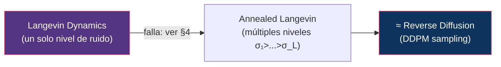
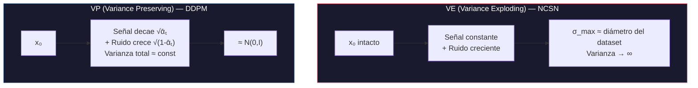
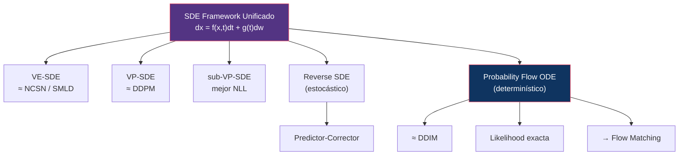
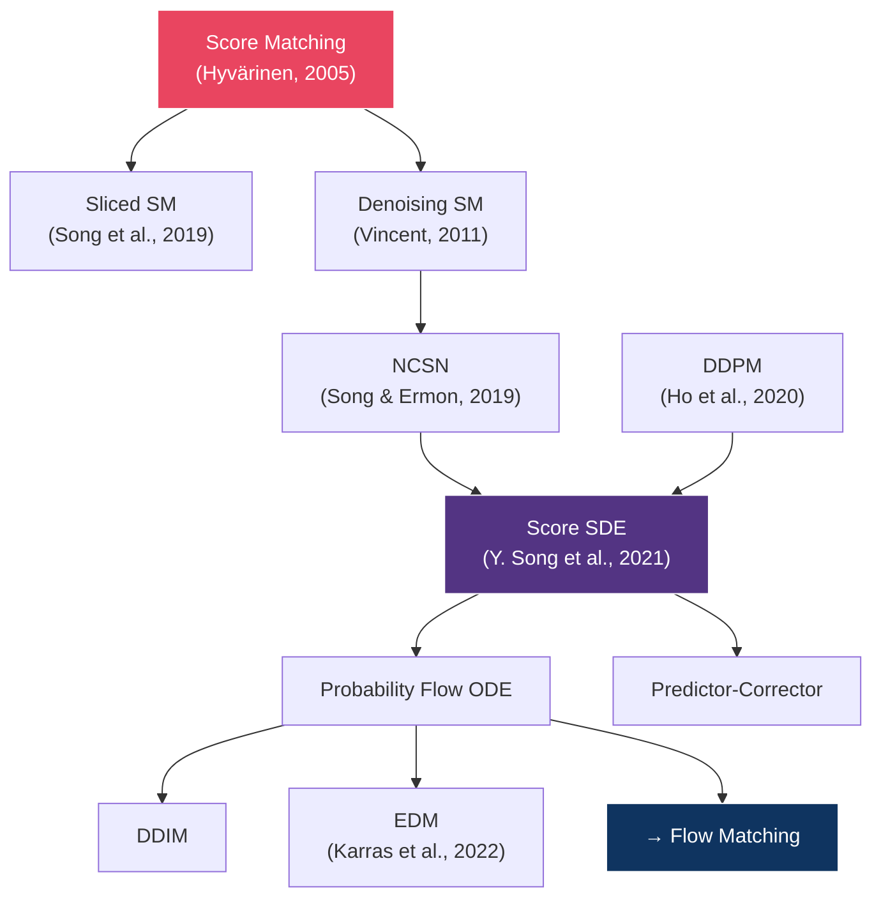

# 04 — Score-Based Generative Models

> La perspectiva alternativa: en lugar de predecir ruido, estimar el gradiente de la log-densidad de datos.

---

## Índice

1. [Score function: ¿qué es?](#1-score-function)
2. [Score matching](#2-score-matching)
3. [Langevin dynamics](#3-langevin-dynamics)
4. [NCSN: Noise Conditional Score Networks](#4-ncsn-noise-conditional-score-networks)
5. [VE vs VP SDEs](#5-ve-vs-vp-sdes)
6. [Unificación: Score SDE](#6-unificación-score-sde)
7. [Predictor-Corrector sampling](#7-predictor-corrector-sampling)
8. [Likelihood exacta vía la ODE](#8-likelihood-exacta-vía-la-ode)
9. [Resultados](#9-resultados)

---

## 1. Score function

### Definición

El **score** de una distribución `p(x)` es el gradiente de su log-densidad **respecto a x** (no respecto a los parámetros — eso es el score de Fisher, otra cosa):

```
s(x) = ∇ₓ log p(x)
```

### Interpretación geométrica

El score es un **campo vectorial** que en cada punto apunta hacia donde la densidad crece más rápido. En los modos el score se anula; lejos de ellos, apunta de vuelta.

```
   Densidad p(x)                    Campo de score ∇ₓ log p(x)

        ╱╲      ╱╲                   →→→  ←←←    →→→  ←←←
       ╱  ╲    ╱  ╲                 →→      ←←  →→      ←←
      ╱    ╲__╱    ╲               →→   ·    ←←→→   ·    ←←
   __╱              ╲__            →              ·        ←
   ─────┴──────┴──────           ─────┴──────────┴──────
      modo A   modo B                modo A      modo B
                                  (score = 0)  (score = 0)

   Las flechas apuntan SIEMPRE hacia los modos.
   Su longitud es proporcional a |∇ₓ log p(x)|.
```

### ¿Por qué es útil?

1. **No requiere la constante de normalización**. Si `p(x) = p̃(x)/Z`, entonces `log p(x) = log p̃(x) - log Z`, y al derivar respecto a x el término `log Z` desaparece. Esto elimina el obstáculo central de los modelos de energía.
2. **Permite sampling** mediante Langevin dynamics ([§3](#3-langevin-dynamics)).
3. **Conecta con difusión**: el score ruidoso es proporcional al ruido predicho.

### Relación con ε-prediction

Para la marginal conocida del forward process:

```
∇ₓ log q(xₜ | x₀) = -ε / √(1 - ᾱₜ)
```

El paso de aquí al score de la **marginal** `q(xₜ)` — que es lo que realmente necesitamos, porque en sampling no tenemos `x₀` — requiere la fórmula de Tweedie:

```
∇ₓ log q(xₜ) = -E[ε | xₜ] / √(1 - ᾱₜ)
```

Y `E[ε|xₜ]` es exactamente el minimizador del MSE que entrena `εθ`. Por tanto:

```
sθ(xₜ, t) = -εθ(xₜ, t) / √(1 - ᾱₜ)
```

> **Predecir el score y predecir el ruido son la misma tarea** salvo un factor de escala dependiente de t. Derivación completa en [01 §4](../01-foundations/README.md#4-reverse-process).
>
> Ojo: el factor de escala **no es inocuo para el entrenamiento**. Cambia la ponderación efectiva del loss entre timesteps — ver la tabla de weighting en [01 §7](../01-foundations/README.md#7-parametrizaciones).

---

## 2. Score matching

### El problema

Queremos aprender `sθ(x) ≈ ∇ₓ log p_data(x)`, pero no conocemos `p_data`, así que no podemos calcular el target.

### Score matching (Hyvärinen, 2005)

Hyvärinen demostró que minimizar la distancia al score verdadero es equivalente, tras integrar por partes, a un objetivo que **no contiene `p_data`**:

```
L_SM = E_{x~p_data} [ ½‖sθ(x)‖² + tr(∇ₓ sθ(x)) ]
```

**Problema**: la traza del Jacobiano cuesta `O(d)` backward passes. En imágenes, `d` es del orden de 10⁵. Inviable.

Hay dos salidas.

### Salida A — Sliced Score Matching (Song et al., 2019)

Proyectar la traza sobre direcciones aleatorias (estimador de Hutchinson):

```
L_SSM = E_{x, v} [ ½‖sθ(x)‖² + vᵀ ∇ₓ sθ(x) v ],    v ~ N(0,I)
```

Un solo producto Jacobiano-vector por muestra. Insesgado, pero con varianza.

### Salida B — Denoising Score Matching (Vincent, 2011)

La que se impuso. En lugar del score de `p_data`, se estima el de una versión **ruidosa** `qσ`, cuyo score condicional sí tiene forma cerrada:

```
q(x̃ | x) = N(x̃; x, σ²I)

∇_x̃ log q(x̃ | x) = -(x̃ - x) / σ²
```

Objetivo:

```
L_DSM = E_{x, x̃} [ ‖sθ(x̃) - ∇_x̃ log q(x̃|x)‖² ]
      = E_{x, ε} [ ‖sθ(x + σε) + ε/σ‖² ]
```

Sin Jacobianos: un forward pass y un MSE.

**El resultado de Vincent** es que el minimizador de `L_DSM` es el score de la distribución *perturbada* `qσ`, no el de `p_data`. Para σ pequeño se parecen; para σ grande, no. Esa discrepancia deliberada es lo que hace falta para arreglar las patologías de [§4](#4-ncsn-noise-conditional-score-networks).

> **Insight**: Denoising Score Matching **es** la parametrización ε de DDPM. Sustituyendo `sθ = -εθ/σ` en `L_DSM` se obtiene `(1/σ²)‖ε - εθ‖²`. El loss de DDPM es score matching con un schedule de ruido y un weighting concreto.

---

## 3. Langevin dynamics

### ¿Qué es?

Un método MCMC que genera muestras de `p(x)` usando **solo** el score:

```
xₖ₊₁ = xₖ + (δ/2) · ∇ₓ log p(xₖ) + √δ · εₖ,    εₖ ~ N(0,I)
```

- **Paso de gradiente**: mueve x hacia regiones de mayor probabilidad
- **Ruido**: impide colapsar al máximo y mantiene la exploración

Cuando `δ → 0` y `K → ∞`, la cadena converge a `p(x)` exactamente. Con δ finito hay un sesgo de discretización (corregible con Metropolis-Hastings, que en la práctica se omite).

> **Lo notable**: para muestrear de `p` basta conocer `∇log p`. Nunca hace falta evaluar `p` ni su normalización. Eso es lo que convierte al score en un objetivo de aprendizaje suficiente.

### Conexión con difusión reversa



---

## 4. NCSN: Noise Conditional Score Networks

### Las tres patologías que resuelve

Song & Ermon (2019) identifican por qué el score matching ingenuo + Langevin **no funciona** en datos reales. Son tres problemas distintos, y conviene no fundirlos en uno:

| # | Patología | Por qué ocurre |
|:--|:----------|:---------------|
| 1 | **Hipótesis de la variedad** | Si los datos viven en una variedad de dimensión baja dentro de ℝᵈ, `∇log p_data` está **indefinido** fuera de ella. El objetivo de score matching es matemáticamente mal planteado. |
| 2 | **Regiones de baja densidad** | Donde casi no hay datos de entrenamiento no hay señal para estimar el score. Y Langevin arranca justamente ahí (desde ruido). |
| 3 | **Mezcla lenta entre modos** | Langevin con un solo nivel de ruido tarda un tiempo exponencial en cruzar zonas de densidad baja, así que **no recupera los pesos relativos** de los modos aunque los encuentre todos. |

**La solución resuelve las tres a la vez**: perturbar los datos con ruido Gaussiano de varias magnitudes.

- El ruido grande **infla la variedad** hasta cubrir todo ℝᵈ → arregla (1)
- El ruido grande **puebla las regiones vacías** → arregla (2)
- El ruido grande **aplana las barreras entre modos** → arregla (3)

Y el ruido pequeño conserva el detalle. De ahí la necesidad de una escala de niveles, no de uno solo.

### La red condicionada al nivel de ruido

```
sθ(x, σ) ≈ ∇ₓ log qσ(x)
```

con `σ₁ > σ₂ > ... > σ_L` en **progresión geométrica** (`σᵢ/σᵢ₊₁` constante). Los extremos se eligen así:

- `σ₁` ≈ la distancia máxima entre pares de puntos del dataset → garantiza que `qσ₁` sea casi una Gaussiana única sin barreras
- `σ_L` ≈ suficientemente pequeño para que `qσ_L ≈ p_data`

NCSN (2019) usa L = 10; NCSNv2 lo sube a L = 232, justamente porque los saltos entre niveles deben ser pequeños para que la cadena se mantenga en equilibrio.

### El weighting del loss

Detalle que suele omitirse y sin el cual no converge:

```
L = (1/L) · Σᵢ λ(σᵢ) · E[ ‖sθ(x + σᵢε, σᵢ) + ε/σᵢ‖² ]     con λ(σᵢ) = σᵢ²
```

La elección `λ(σ) = σ²` no es arbitraria: como `sθ ∝ 1/σ`, el término `σ²‖·‖²` tiene **magnitud independiente de σ**. Sin ella, los niveles de ruido bajo dominarían el gradiente por órdenes de magnitud.

> Es el mismo problema de ponderación entre niveles de ruido que aparece en [01 §7](../01-foundations/README.md#7-parametrizaciones) y que Min-SNR reformula años después.

### Sampling: Annealed Langevin Dynamics

```
x ← ruido inicial
para cada σᵢ, de σ₁ (alto) a σ_L (bajo):
    αᵢ = ε · σᵢ² / σ_L²          // step size proporcional a σᵢ²
    repetir K veces:
        z ~ N(0, I)
        x ← x + (αᵢ/2) · sθ(x, σᵢ) + √αᵢ · z
return x
```

Alto ruido → estructura global. Bajo ruido → detalle fino.

El step size escala con `σᵢ²` para que la relación señal/ruido de cada paso de Langevin se mantenga constante a lo largo del annealing.

> **Conexión con DDPM**: los niveles `{σᵢ}` de NCSN son los timesteps `{t}` de DDPM; el annealed Langevin es el reverse process. Los dos frameworks se desarrollaron en paralelo y describen el mismo algoritmo — ver [02 §8](../02-ddpm/README.md#8-relación-con-score-matching).

---

## 5. VE vs VP SDEs

### Song et al. (2021) unificaron los frameworks

Ambos son procesos de difusión continuos; se diferencian en si la señal se atenúa o no.

| Framework | SDE | q(xₜ\|x₀) |
|:----------|:----|:-----------|
| **VE (Variance Exploding)** | `dx = √(d[σ²(t)]/dt) · dw` | `N(x₀, σ²(t)·I)` — señal intacta, varianza crece sin límite |
| **VP (Variance Preserving)** | `dx = -½β(t)x·dt + √β(t)·dw` | `N(√ᾱₜ·x₀, (1-ᾱₜ)I)` — señal se atenúa, varianza total constante |

El término `-½β(t)x·dt` de VP es el que **encoge la señal**; VE no lo tiene, y por eso tiene que hacer explotar la varianza hasta dominar los datos.



| Aspecto | VE | VP |
|:--------|:---|:---|
| Varianza total | Crece sin límite | Constante |
| Estado terminal | `N(x₀, σ²_max I)`, depende de x₀ | `N(0, I)`, independiente de x₀ |
| Modelo asociado | NCSN / SMLD | DDPM / DDIM |
| Rango dinámico de la entrada | Muy amplio (σ de ~0.01 a ~50) | Acotado |
| Uso moderno | Vía EDM (Karras et al., 2022) | Base de la mayoría de modelos |

> **Precisión sobre «varianza ≈ 1»**: VP preserva la varianza **suponiendo que los datos están normalizados a varianza unidad**. Si `Var(x₀) = v`, la varianza en t es `ᾱₜ·v + (1-ᾱₜ)`, que solo es constante si `v = 1`. De ahí la importancia del escalado a [-1,1] de [02 §2](../02-ddpm/README.md#2-formulación-matemática).

> **sub-VP-SDE**: variante propuesta en el mismo paper, `dx = -½β(t)x dt + √(β(t)(1-e^{-2∫β})) dw`. Su varianza está **acotada por la de VP** en todo t, lo que mejora los bounds de likelihood. Es la que mejores NLL da en el paper.

> **VE no está obsoleto**: la formulación de **EDM** (Karras et al., 2022), que es el estándar de facto para samplers modernos, es esencialmente VE con un preacondicionamiento cuidadoso de entradas, salidas y niveles de ruido.

---

## 6. Unificación: Score SDE

### El framework



### Reverse SDE (Anderson, 1982)

Todo proceso de difusión tiene un proceso reverso que también es una difusión:

```
dx = [f(x,t) - g(t)² · ∇ₓ log pₜ(x)] dt + g(t) dw̄
```

donde `dw̄` es un Wiener process en tiempo invertido. **El único término desconocido es el score** — todo lo demás viene del forward, que nosotros diseñamos. Ese es el motivo por el que aprender el score basta para generar.

### Probability Flow ODE

```
dx = [f(x,t) - ½g(t)² · ∇ₓ log pₜ(x)] dt
```

> **Resultado clave**: la SDE reversa y esta ODE tienen **exactamente las mismas marginales `pₜ(x)`** en todo t. Cambian las trayectorias individuales, no la distribución.
>
> La única diferencia con la SDE es el factor **½** delante de `g²`. La mitad del término de score compensa el ruido que la ODE ya no inyecta.

Consecuencia práctica: se puede elegir sampler estocástico o determinista **sobre el mismo modelo entrenado**, que es exactamente lo que DDIM había descubierto por vía algebraica ([03 §5](../03-ddim/README.md#5-ddim-como-ode)).

---

## 7. Predictor-Corrector sampling

Una contribución del paper que suele pasarse por alto y que ilustra bien qué aporta la vista continua.

Hay dos formas independientes de usar el score entrenado:

- **Predictor**: dar un paso de un solver numérico de la SDE reversa (Euler-Maruyama, ancestral sampling). Avanza en el tiempo.
- **Corrector**: dar pasos de Langevin **a t fijo**. No avanza; corrige la distribución hacia `pₜ` la marginal correcta.

**PC sampling** alterna ambos:

```
para t = T ... 0:
    x ← predictor(x, t)          // avanzar un paso de tiempo
    repetir N veces:
        x ← corrector(x, t)      // Langevin a t fijo, reajustar a p_t
```

La lectura conceptual: el predictor acumula error de discretización que aleja la muestra de la marginal correcta; el corrector la devuelve. Ninguna de las dos familias anteriores lo hacía — NCSN era corrector puro (Langevin), DDPM predictor puro (ancestral). PC combina las dos y supera a ambas.

---

## 8. Likelihood exacta vía la ODE

Como la Probability Flow ODE es determinista y reversible, define un **continuous normalizing flow**. Eso permite calcular la log-verosimilitud **exacta** con la fórmula de cambio de variables instantáneo:

```
log p₀(x₀) = log p_T(x_T) + ∫₀ᵀ ∇·[ f̃(x,t) ] dt
```

donde `f̃` es el campo de la ODE y la divergencia se estima con el truco de Hutchinson.

Esto es un cambio cualitativo: los modelos de difusión pasan de dar solo una **cota** (el ELBO de [01 §8](../01-foundations/README.md#8-elbo)) a dar el **valor exacto**, y se vuelven directamente comparables con modelos autoregresivos y normalizing flows.

---

## 9. Resultados

Score-SDE alcanzó el estado del arte en CIFAR-10 en 2021, tanto en calidad de muestra como en verosimilitud:

| Modelo | FID ↓ | NLL (bits/dim) ↓ |
|:-------|------:|-----------------:|
| NCSN (2019) | ~25.3 | — |
| NCSNv2 (2020) | ~10.9 | — |
| DDPM (2020) | 3.17 | ≤ 3.75 |
| **NCSN++ / Score-SDE (2021)** | **~2.2** | — |
| Score-SDE (sub-VP, likelihood) | — | **~2.99** |

> ⚠️ Valores aproximados; **pendientes de verificar contra las fuentes primarias**. El FID 3.17 de DDPM sí está verificado ([02 §7](../02-ddpm/README.md#7-resultados)).

La lectura: el salto de ~25 a ~2.2 en dos años es la arquitectura (NCSN++) más el framework continuo más PC sampling, no una sola idea.

---

## Mapa conceptual: Score Models → Diffusion → Flow Matching



### El score como base del conditioning

Una consecuencia que se explota en el módulo [09](../09-guidance/): condicionar es sumar scores.

```
∇ₓ log p(x|y) = ∇ₓ log p(x) + ∇ₓ log p(y|x)
```

El primer término es el modelo incondicional; el segundo, un clasificador. De ahí sale **classifier guidance** directamente, sin reentrenar el modelo generativo.

---

## Referencias

- Hyvärinen, A. (2005). *Estimation of Non-Normalized Statistical Models by Score Matching*. JMLR 6.
- Vincent, P. (2011). *A Connection Between Score Matching and Denoising Autoencoders*. Neural Computation 23(7).
- Anderson, B.D.O. (1982). *Reverse-time Diffusion Equation Models*. Stochastic Processes and their Applications. — Base del reverse SDE de [§6](#6-unificación-score-sde).
- Song, Y., Garg, S., Shi, J., & Ermon, S. (2019). *Sliced Score Matching: A Scalable Approach to Density and Score Estimation*. UAI 2019.
- Song, Y. & Ermon, S. (2019). *Generative Modeling by Estimating Gradients of the Data Distribution*. NeurIPS 2019. — **NCSN.**
- Song, Y. & Ermon, S. (2020). *Improved Techniques for Training Score-Based Generative Models*. NeurIPS 2020. — NCSNv2.
- Song, Y., Sohl-Dickstein, J., Kingma, D., Kumar, A., Ermon, S., & Poole, B. (2021). *Score-Based Generative Modeling through Stochastic Differential Equations*. ICLR 2021. — **Paper central de este módulo.**
- Karras, T., Aittala, M., Aila, T., & Laine, S. (2022). *Elucidating the Design Space of Diffusion-Based Generative Models*. NeurIPS 2022. — EDM.

---

*← [03 — DDIM](../03-ddim/README.md) | [05 — Latent Diffusion →](../05-latent-diffusion/README.md)*
