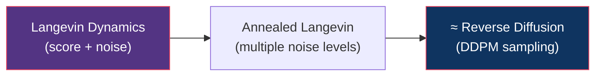
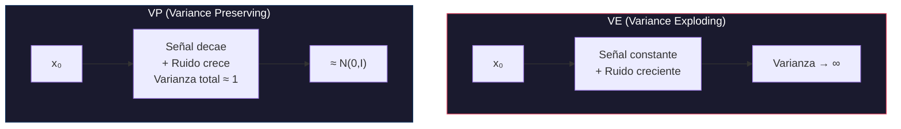
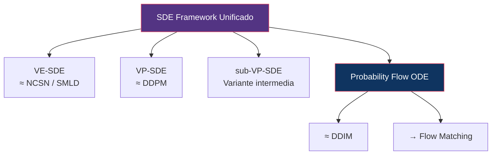
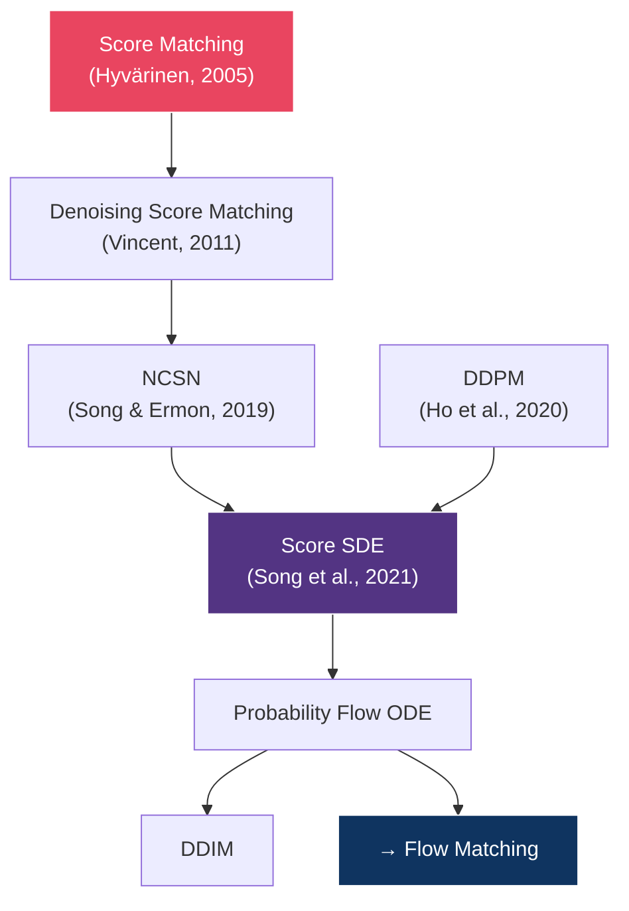

# 04 — Score-Based Generative Models

> La perspectiva alternativa: en lugar de predecir ruido, estimar el gradiente de la log-densidad de datos.

---

## Índice

1. [Score function: ¿qué es?](#1-score-function)
2. [Score matching](#2-score-matching)
3. [Langevin dynamics](#3-langevin-dynamics)
4. [NCSN: Noise Conditional Score Networks](#4-ncsn)
5. [VE vs VP SDEs](#5-ve-vs-vp)
6. [Unificación: Song et al. (2021)](#6-unificación)

---

## 1. Score function

### Definición

El **score** de una distribución `p(x)` es el gradiente de su log-densidad:

```
s(x) = ∇ₓ log p(x)
```

### Interpretación geométrica

El score apunta en la dirección de **mayor incremento de probabilidad**. Si estás en un punto `x` de baja probabilidad, el score te dice hacia dónde moverte para llegar a una región de mayor densidad.

```
                    ↗ ↗ ↗
                  ↗  MODO  ↖
                ↗   (alta p)  ↖
              ↗               ↖
Baja p →  → → → → →       ← ← ← ← ←  ← Baja p
              ↘               ↙
                ↘   (alta p)  ↙
                  ↘  MODO  ↙
                    ↘ ↘ ↘

Las flechas representan s(x) = ∇ₓ log p(x)
```

### ¿Por qué es útil?

1. **No requiere la constante de normalización**: `log p(x) = log p̃(x) - log Z`, y al tomar el gradiente, `log Z` desaparece
2. **Permite sampling**: Usando Langevin dynamics (ver sección 3)
3. **Conecta con difusión**: El score ruidoso `∇ₓ log pₜ(x)` es proporcional al ruido predicho `εθ`

### Relación con ε-prediction

```
∇ₓ log q(xₜ | x₀) = -ε / √(1 - ᾱₜ)
```

Por lo tanto:

```
sθ(xₜ, t) ≈ -εθ(xₜ, t) / √(1 - ᾱₜ)
```

> **Predecir el score y predecir el ruido son matemáticamente equivalentes** (hasta un factor de escala dependiente de t).

---

## 2. Score matching

### El problema

Queremos aprender `sθ(x) ≈ ∇ₓ log p_data(x)`, pero no conocemos `p_data`.

### Score matching objetivo (Hyvärinen, 2005)

```
L_SM = E_{x~p_data} [ ½‖sθ(x)‖² + tr(∇ₓ sθ(x)) ]
```

Pero el segundo término (traza del Jacobiano) es **costoso** de calcular.

### Denoising Score Matching (Vincent, 2011)

**Truco clave**: En lugar de estimar `∇ₓ log p_data(x)`, estimamos `∇ₓ log q(x̃|x)` — el score de una distribución ruidosa, que tiene forma cerrada:

```
q(x̃ | x) = N(x̃; x, σ²I)

∇_x̃ log q(x̃ | x) = -(x̃ - x) / σ²
```

Objetivo:

```
L_DSM = E_{x, x̃} [ ‖sθ(x̃) - ∇_x̃ log q(x̃|x)‖² ]
      = E_{x, ε} [ ‖sθ(x + σε) + ε/σ‖² ]
```

> **Insight**: Denoising Score Matching es equivalente a ε-prediction de DDPM. El loss de DDPM **es** score matching con un schedule de ruido.

---

## 3. Langevin dynamics

### ¿Qué es?

Un método de MCMC (Monte Carlo por Cadenas de Markov) que usa el score para generar muestras:

```
xₖ₊₁ = xₖ + (δ/2) · ∇ₓ log p(xₖ) + √δ · εₖ,    εₖ ~ N(0,I)
```

- **Paso de gradiente**: Mueve x hacia regiones de mayor probabilidad
- **Ruido**: Previene colapso a un solo modo

### Conexión con difusión reversa

El reverse process de DDPM puede interpretarse como una forma de **Langevin dynamics annealed** (con schedule de ruido decreciente):



---

## 4. NCSN: Noise Conditional Score Networks

### Song & Ermon (2019)

Problema con score matching a un solo nivel de ruido: el score es **impreciso** en regiones de baja densidad (donde no hay datos de entrenamiento).

**Solución**: Entrenar un modelo que estime scores a **múltiples niveles de ruido**:

```
sθ(x, σ) ≈ ∇ₓ log qσ(x)
```

con `σ₁ > σ₂ > ... > σ_L`.

### Sampling: Annealed Langevin Dynamics

```
For each σᵢ from σ₁ (alto) to σ_L (bajo):
    Run K steps of Langevin dynamics using sθ(x, σᵢ)
```

Alto ruido → captura estructura global
Bajo ruido → refina detalles

> **Conexión con DDPM**: Los "múltiples niveles de ruido" de NCSN son análogos a los timesteps de DDPM. Los dos frameworks convergen.

---

## 5. VE vs VP SDEs

### Song et al. (2021) unificaron los frameworks

| Framework | SDE | q(xₜ\|x₀) |
|:----------|:----|:-----------|
| **VE (Variance Exploding)** | `dx = √(dσ²/dt) · dw` | `N(x₀, σ²(t)·I)` — la varianza crece |
| **VP (Variance Preserving)** | `dx = -½β(t)x·dt + √β(t)·dw` | `N(√ᾱₜ·x₀, (1-ᾱₜ)I)` — la varianza total es ~1 |

### Comparación



| Aspecto | VE | VP |
|:--------|:---|:---|
| Varianza total | Crece sin límite | Constante (~1) |
| Modelo asociado | NCSN / SMLD | DDPM / DDIM |
| Ventaja | Conceptualmente simple | Numéricamente estable |
| Uso moderno | Menos común | Base de la mayoría de modelos |

---

## 6. Unificación: Score SDE

### El framework unificado de Song et al. (2021)



### Reverse SDE

```
dx = [f(x,t) - g(t)² · ∇ₓ log pₜ(x)] dt + g(t) dw̄
```

### Probability Flow ODE

```
dx = [f(x,t) - ½g(t)² · ∇ₓ log pₜ(x)] dt
```

> **Resultado clave**: El SDE estocástico y la ODE determinística generan **las mismas distribuciones marginales** pₜ(x). Esto significa que podemos elegir entre sampling estocástico (más diverso) o determinístico (más rápido, invertible).

---

## Mapa conceptual: Score Models → Diffusion → Flow Matching



---

## Referencias

- Hyvärinen, A. (2005). *Estimation of Non-Normalized Statistical Models by Score Matching*. JMLR.
- Vincent, P. (2011). *A Connection Between Score Matching and Denoising Autoencoders*. Neural Computation.
- Song, Y. & Ermon, S. (2019). *Generative Modeling by Estimating Gradients of the Data Distribution*. NeurIPS.
- Song, Y. et al. (2021). *Score-Based Generative Modeling through Stochastic Differential Equations*. ICLR.

---

*← [03 — DDIM](../03-ddim/README.md) | [05 — Latent Diffusion →](../05-latent-diffusion/README.md)*
