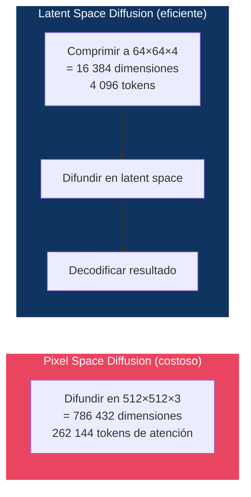
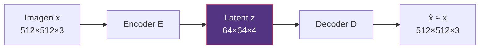
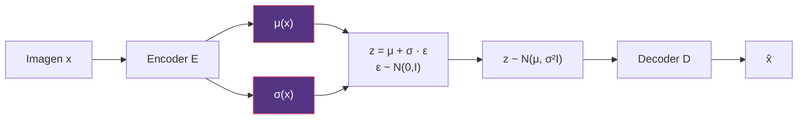
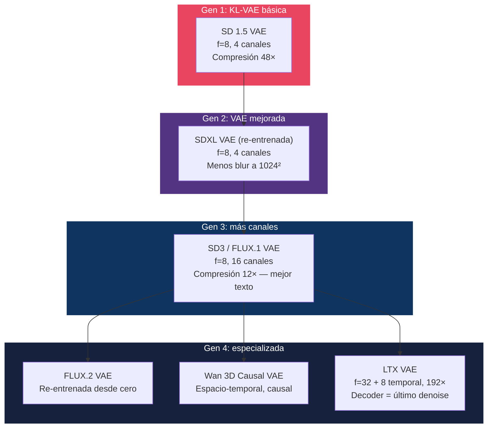
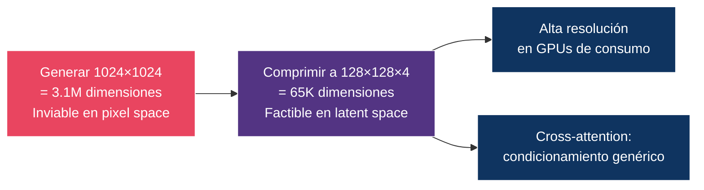

# 05 — Latent Diffusion

> Por qué mover la difusión del espacio de píxeles al espacio latente cambió radicalmente el coste de generación — y habilitó la generación de imágenes de alta resolución.

---

## Índice

1. [El problema de la resolución](#1-el-problema-de-la-resolución)
2. [Autoencoders y VAE](#2-autoencoders-y-vae)
3. [El espacio latente](#3-el-espacio-latente)
4. [Latent Diffusion Models (LDM)](#4-latent-diffusion-models-ldm)
5. [Elegir el factor de compresión](#5-elegir-el-factor-de-compresión)
6. [KL regularization y latent scaling](#6-kl-regularization-y-latent-scaling)
7. [Decoder artifacts](#7-decoder-artifacts)
8. [Evolución del VAE en modelos modernos](#8-evolución-del-vae-en-modelos-modernos)

---

## 1. El problema de la resolución

### Coste computacional de difusión en pixel space

La complejidad de un modelo de difusión depende de la **dimensionalidad de los datos**:

| Resolución | Dimensiones (RGB) | Relativo |
|:-----------|:-----------------|:---------|
| 64×64 | 12 288 | 1× |
| 256×256 | 196 608 | 16× |
| 512×512 | 786 432 | 64× |
| 1024×1024 | 3 145 728 | 256× |

Y el coste no se reparte de forma uniforme dentro del U-Net:

| Tipo de capa | Escala con | A 4× la resolución |
|:-------------|:-----------|:-------------------|
| Convolución | O(n) — nº de posiciones espaciales | 16× |
| Self-attention | O(n²) | 256× |

donde `n = H×W`. Las capas de atención son las que hacen inviable el pixel space a alta resolución, y por eso DDPM solo las usaba en la resolución 16×16 ([02 §5](../02-ddpm/README.md#5-arquitectura-de-la-red-u-net-original)).

### La solución: comprimir primero, difundir después



### Cuánto se ahorra realmente

Conviene ser preciso, porque aquí circulan cifras infladas.

| Magnitud | Pixel (512²×3) | Latente (64²×4) | Ratio |
|:---------|---------------:|----------------:|------:|
| Valores totales | 786 432 | 16 384 | **48×** |
| Posiciones espaciales (tokens) `n` | 262 144 | 4 096 | **64×** |
| Coste de una capa conv, O(n) | — | — | **~64×** |
| Coste de una capa de atención, O(n²) | — | — | **~4 096×** |

> ⚠️ **Error frecuente**: elevar al cuadrado el 48× y anunciar «~2 300× de ahorro». Es un error de categoría — los **canales no entran en el término `n²`** de la atención. El factor correcto para atención es `64² = 4 096`.
>
> Y aun así ese número **no es el speedup real**. El U-Net de LDM está dominado por convoluciones, no por atención; hay costes fijos (VAE encode/decode, text encoder); y la arquitectura se rediseñó al mismo tiempo. La ganancia end-to-end medida es de **un orden de magnitud**, no de tres. La cifra que importa es que LDM hizo entrenable un modelo texto-imagen con un presupuesto de GPU accesible, no un multiplicador concreto.

---

## 2. Autoencoders y VAE

### Autoencoder (AE)



- **Encoder E**: comprime la imagen a una representación compacta
- **Decoder D**: reconstruye desde esa representación
- **Loss**: `L = ‖x - D(E(x))‖²`

**Problema**: el espacio latente no tiene estructura. Puntos arbitrarios de `z` no corresponden a imágenes válidas, y la escala de los latentes es libre.

### Variational Autoencoder (VAE)



- El encoder produce una **distribución** (μ, σ), no un punto
- Se muestrea `z` con el reparameterization trick — este es el caso donde el trick sí cumple su función clásica de propagar gradiente a través del muestreo ([01 §9](../01-foundations/README.md#9-reparameterization-trick))
- **Loss**: `L = L_rec + β · KL(q(z|x) ‖ N(0,I))`

### El VAE de LDM apenas está regularizado

Un matiz decisivo que suele pasarse por alto. En un VAE clásico, `β` es lo bastante grande para que el espacio latente se parezca a `N(0,I)` y se pueda muestrear de él directamente.

**En LDM, `β` es del orden de 10⁻⁶.** El término KL solo evita que los latentes tengan magnitudes arbitrarias; no impone una prior. El resultado es esencialmente un autoencoder con un empujón mínimo hacia la regularidad.

Esto tiene dos consecuencias que atraviesan todo el módulo:

1. **No se puede muestrear de `N(0,I)` en el espacio latente de SD y decodificar**: no saldría una imagen. Quien pone estructura generativa en ese espacio es el modelo de difusión, no el VAE.
2. **La varianza de los latentes no es 1**, y por eso hace falta un factor de escala ([§6](#6-kl-regularization-y-latent-scaling)).

> El diseño es deliberado: LDM quiere que el VAE **conserve la máxima información perceptual** posible, y una prior fuerte lo impediría. Se sacrifica la capacidad generativa del VAE porque la aporta la difusión.

### KL-reg vs VQ-reg

El paper de LDM ofrece **dos** regularizaciones, no una:

| Variante | Mecanismo | Ventaja | Usado en |
|:---------|:----------|:--------|:---------|
| **KL-reg** | Penalización KL débil, latente **continuo** | Compatible directo con difusión Gaussiana | Stable Diffusion, la mayoría |
| **VQ-reg** | Cuantización vectorial contra un codebook, latente **discreto** | Hereda VQGAN; sirve para modelos autoregresivos | Algunas variantes de LDM |

Ambas usan el mismo entrenamiento con pérdida perceptual + adversarial heredado de **VQGAN** (Esser et al., 2021), que es de donde LDM toma el autoencoder.

---

## 3. El espacio latente

### ¿Qué aprende el VAE?

El encoder comprime **la información perceptualmente relevante**, descartando redundancia:

| Lo que conserva z | Lo que descarta z |
|:------------------|:-----------------|
| Estructura global | Ruido de alta frecuencia |
| Colores y tonos | Detalle sub-píxel |
| Formas y contornos | Texturas muy finas |
| Relaciones espaciales | Artefactos de compresión |
| Semántica de alto nivel | Ruido a nivel de píxel |

Esta división del trabajo es la tesis del paper: la difusión en pixel space gasta la mayor parte de su capacidad modelando detalle imperceptible. El VAE se encarga de la **compresión perceptual** y la difusión de la **compresión semántica**.

### Factor de compresión

La forma correcta de compararlo es contar cuántos valores de entrada se resumen en cada posición latente:

| Modelo | f (spatial) | Canales | Valores in → out por posición | Compresión |
|:-------|:------------|:--------|:------------------------------|-----------:|
| SD 1.5 / SDXL | 8 | 4 | 8·8·3 = 192 → 4 | **48×** |
| SD3 | 8 | 16 | 192 → 16 | **12×** |
| FLUX.1 | 8 | 16 | 192 → 16 | **12×** |
| LTX-Video | 32 (+8 temporal) | 128 | 32·32·8·3 = 24 576 → 128 | **192×** |

> ⚠️ **Corrección frecuente**: se dice que SD3 y FLUX comprimen «48×, igual que SD 1.5, pero con 16 canales». **No es igual**: pasar de 4 a 16 canales **divide la compresión entre cuatro**, de 48× a 12×.
>
> Y ese es precisamente el punto del cambio. SD3 y FLUX **renuncian deliberadamente a compresión** para ganar fidelidad del latente — menos blur, mejor texto renderizado, menos artefactos. El coste es un espacio latente 4× más grande sobre el que difundir.

> **Trade-off fundamental**: más compresión = menos VRAM y cómputo, pero más pérdida de detalle y más artefactos de decoder. Nadie ha escapado a esta tensión; solo se ha ido moviendo el punto de equilibrio.

---

## 4. Latent Diffusion Models (LDM)

### Arquitectura (Rombach et al., 2022)

```mermaid
graph TB
    subgraph Stage1 ["Etapa 1: Entrenar el autoencoder (por separado)"]
        S1_IMG["Imágenes"] --> S1_ENC["Encoder"]
        S1_ENC --> S1_Z["z"]
        S1_Z --> S1_DEC["Decoder"]
        S1_DEC --> S1_REC["Reconstrucción"]
        S1_LOSS["L = L_rec + 1e-6·L_KL<br/>+ L_perceptual (LPIPS)<br/>+ L_adversarial (PatchGAN)"]
    end

    subgraph Stage2 ["Etapa 2: Entrenar difusión en latent space"]
        S2_IMG["Imágenes"] --> S2_ENC["Encoder E (congelado)"]
        S2_ENC --> S2_Z["z₀"]
        S2_NOISE["ε ~ N(0,I)"] --> S2_ZT["zₜ = √ᾱₜ·z₀ + √(1-ᾱₜ)·ε"]
        S2_Z --> S2_ZT
        S2_ZT --> S2_UNET["U-Net εθ(zₜ, t, c)"]
        S2_TEXT["Prompt → Text Encoder<br/>→ CROSS-ATTENTION"] --> S2_UNET
        S2_UNET --> S2_LOSS["L = ‖ε - εθ‖²"]
    end

    subgraph Inference ["Inferencia"]
        I_Z["z_T ~ N(0,I)"] --> I_DENOISE["Denoise (N pasos)"]
        I_TEXT["Prompt → Text Encoder"] --> I_DENOISE
        I_DENOISE --> I_Z0["z₀ predicho"]
        I_Z0 --> I_DEC["Decoder D (congelado)"]
        I_DEC --> I_IMG["Imagen generada"]
    end

    style Stage1 fill:#1a1a2e,stroke:#533483,color:#fff
    style Stage2 fill:#1a1a2e,stroke:#0f3460,color:#fff
    style Inference fill:#1a1a2e,stroke:#e94560,color:#fff
```



### Las dos etapas son completamente separadas

| Etapa | Qué se entrena | Qué está congelado |
|:------|:---------------|:-------------------|
| 1. Autoencoder | Encoder + Decoder + discriminador | Nada |
| 2. Difusión | U-Net / DiT | Encoder, Decoder, Text Encoder |

> **Consecuencia**: se puede mejorar el VAE sin reentrenar el modelo de difusión, y viceversa. Esa modularidad es lo que permite que la comunidad intercambie VAEs en modelos ya entrenados.
>
> Con un límite: cambiar el VAE por otro con **distinto número de canales o distinto `f`** sí obliga a reentrenar la difusión, porque cambia la forma del tensor sobre el que opera. Por eso los VAEs de 16 canales de SD3/FLUX vinieron con modelos nuevos.

### La segunda contribución: cross-attention

Se recuerda a LDM por el espacio latente, pero el paper aporta **dos** cosas. La otra es el mecanismo genérico de condicionamiento:

```
Attention(Q, K, V)   con   Q = W_Q · φ(zₜ)     ← features de la imagen
                            K = W_K · τ(c)      ← embedding del condicionante
                            V = W_V · τ(c)
```

Al inyectar el condicionante por **K y V** en lugar de concatenarlo, `τ(c)` puede ser cualquier cosa — texto, layout, otra imagen, un mapa semántico — sin cambiar la arquitectura. Es lo que convirtió la difusión en un framework de propósito general y lo que hizo posible el texto-imagen a escala. Desarrollado en [11 — Conditioning](../11-conditioning/README.md).

---

## 5. Elegir el factor de compresión

Rombach et al. hacen la ablación sobre `f ∈ {1, 2, 4, 8, 16, 32}`, y el resultado es una curva en U que explica el diseño de todos los modelos posteriores.

```
Calidad
  ↑
  │        ╭───────╮
  │      ╱           ╲
  │    ╱               ╲
  │  ╱                   ╲
  │╱                       ╲
  └────┬────┬────┬────┬────┬───→  f
      1    2    4    8   16   32

  f=1,2:  la difusión tiene que hacer también la compresión
          perceptual. Entrenamiento lentísimo, sin ganancia.

  f=4,8:  punto óptimo. El autoencoder quita el detalle
          imperceptible; la difusión modela la semántica.

  f≥16:   el autoencoder destruye información que la difusión
          ya no puede recuperar. Techo de calidad.
```

> **La conclusión que se llevó la industria**: `f = 8`. Es el valor de SD 1.5, SDXL, SD3 y FLUX. Lo que ha cambiado en cinco años no es `f`, sino el **número de canales** — el otro eje del trade-off, que el paper original no exploró a fondo.

---

## 6. KL regularization y latent scaling

### ¿Para qué sirve el término KL en LDM?

Con `β ≈ 10⁻⁶` ([§2](#2-autoencoders-y-vae)), el KL **no** impone una prior Gaussiana. Lo que hace es más modesto y aun así necesario:

1. Evita que la varianza de los latentes crezca sin límite durante el entrenamiento
2. Mantiene el espacio suave: puntos cercanos → imágenes parecidas
3. Deja el espacio en un rango numérico razonable para que la difusión opere

Lo que **no** hace: garantizar que `N(0,I)` sea un buen punto de partida. Eso lo aporta el modelo de difusión.

### Latent scaling factor

Como consecuencia directa de lo anterior, los latentes crudos del VAE no tienen varianza unidad — en SD 1.5 su desviación típica es de ~5.5. El proceso de difusión sí asume varianza ≈ 1 (ver el requisito de normalización en [04 §5](../04-score-models/README.md#5-ve-vs-vp-sdes)). Se corrige con un escalar:

```
Al codificar:    z_diffusion = z_vae · scale_factor
Al decodificar:  z_vae       = z_diffusion / scale_factor
```

> ⚠️ **Corrección frecuente**: se escribe a menudo `z / scale_factor` para entrar al espacio de difusión. Es al revés. Como `scale_factor < 1` y la desviación cruda es ~5.5, hay que **multiplicar** para bajarla a ≈ 1: `5.5 × 0.18215 ≈ 1.0`. Dividir la subiría a ~30.

| Modelo | scale_factor | Nota |
|:-------|:-------------|:-----|
| SD 1.5 | 0.18215 | ≈ 1/5.49, la desviación empírica del VAE |
| SDXL | 0.13025 | VAE re-entrenado, distinta escala |
| SD3 / FLUX | Propio de cada VAE | Con 16 canales la estadística cambia |

> Sin este factor el modelo de difusión tendría que aprender a compensar la escala por sí mismo, desperdiciando capacidad — y, peor, el schedule de ruido estaría mal calibrado respecto a la magnitud real de la señal.

---

## 7. Decoder artifacts

Todo lo que el encoder descarta es irrecuperable. Estos son los modos de fallo característicos:

| Artefacto | Causa | Manifestación |
|:----------|:------|:-------------|
| **Blur** | Compresión excesiva | Pérdida de detalle fino |
| **Grid artifacts** | Efectos de borde entre parches | Patrones de cuadrícula visibles |
| **Color banding** | Cuantización implícita | Degradados con bandas |
| **Texture loss** | Alta frecuencia descartada | Texturas planas |
| **Ringing** | Fenómeno de Gibbs en la decodificación | Halos alrededor de bordes |
| **Texto degradado** | Glifos pequeños = alta frecuencia | Letras ilegibles o deformadas |

> El **texto** es el caso límite más visible: un glifo pequeño es exactamente el tipo de señal de alta frecuencia y baja redundancia que un VAE de 4 canales no puede conservar. Que SD3 y FLUX rendericen texto mucho mejor se debe en buena parte al salto a 16 canales, no solo a un mejor modelo de difusión.

### Mitigaciones en modelos modernos

| Estrategia | Usado por | Mecanismo |
|:-----------|:----------|:----------|
| Perceptual loss (LPIPS) | LDM, SD, SDXL | Loss en feature space en vez de en píxeles |
| Adversarial loss (PatchGAN) | LDM, SD, SDXL | Discriminador que penaliza artefactos locales |
| Más canales latentes | SD3, FLUX (16 ch) | Menos compresión, mejor fidelidad |
| Re-entrenar el VAE a más resolución | SDXL | Menos artefactos a 1024² |
| VAE reentrenada desde cero | FLUX.2 | Rebalanceo learnability / calidad / compresión |
| Decoder de doble función | LTX-Video | El decoder asume también el último denoise |

---

## 8. Evolución del VAE en modelos modernos



> ⚠️ Las especificaciones de los modelos de Gen 4 deben contrastarse con sus model cards en [16 — Image Models](../16-image-models/README.md) y [17 — Video Models](../17-video-models/README.md); aquí se resumen para mostrar la trayectoria, no como fuente primaria.

### La trayectoria en una frase

De 2022 a 2026 el `f = 8` no se ha movido. Lo que se ha movido es **el número de canales** (4 → 16) y el **dominio** (2D → 3D causal para vídeo). El campo descubrió que el eje interesante del trade-off no era la compresión espacial sino la capacidad del latente.

### Preguntas de diseño para un VAE

| Pregunta | Trade-off |
|:---------|:---------|
| ¿Más compresión espacial (f mayor)? | Menos cómputo ↔ más artefactos |
| ¿Más canales latentes? | Mejor fidelidad ↔ latente mayor, difusión más cara |
| ¿KL o VQ? | Continuo (difusión) ↔ discreto (autoregresivo) |
| ¿2D o 3D? | Imágenes ↔ vídeo con consistencia temporal |
| ¿Causal? | Permite vídeo de longitud variable y streaming |

---

## Diagrama conceptual: por qué LDM importa



---

## Referencias

- Rombach, R., Blattmann, A., Lorenz, D., Esser, P., & Ommer, B. (2022). *High-Resolution Image Synthesis with Latent Diffusion Models*. CVPR 2022. — **Paper de este módulo.**
- Kingma, D.P. & Welling, M. (2014). *Auto-Encoding Variational Bayes*. ICLR 2014. — VAE.
- Esser, P., Rombach, R., & Ommer, B. (2021). *Taming Transformers for High-Resolution Image Synthesis*. CVPR 2021. — VQGAN; origen del autoencoder perceptual+adversarial de LDM.
- Zhang, R., Isola, P., Efros, A., Shechtman, E., & Wang, O. (2018). *The Unreasonable Effectiveness of Deep Features as a Perceptual Metric*. CVPR 2018. — LPIPS.
- Isola, P., Zhu, J.-Y., Zhou, T., & Efros, A. (2017). *Image-to-Image Translation with Conditional Adversarial Networks*. CVPR 2017. — PatchGAN.
- Esser, P. et al. (2024). *Scaling Rectified Flow Transformers for High-Resolution Image Synthesis*. ICML 2024. — SD3; VAE de 16 canales.

---

*← [04 — Score Models](../04-score-models/README.md) | [06 — Arquitecturas →](../06-architectures/README.md)*
