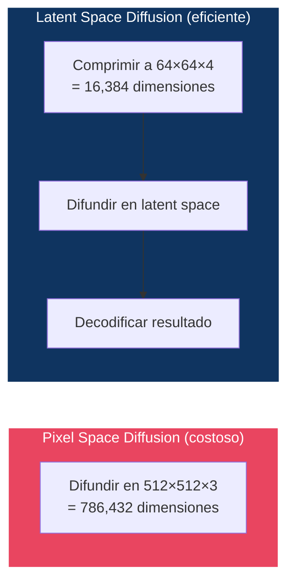
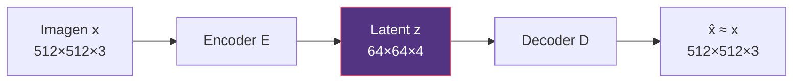
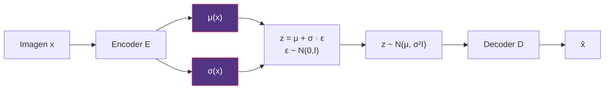
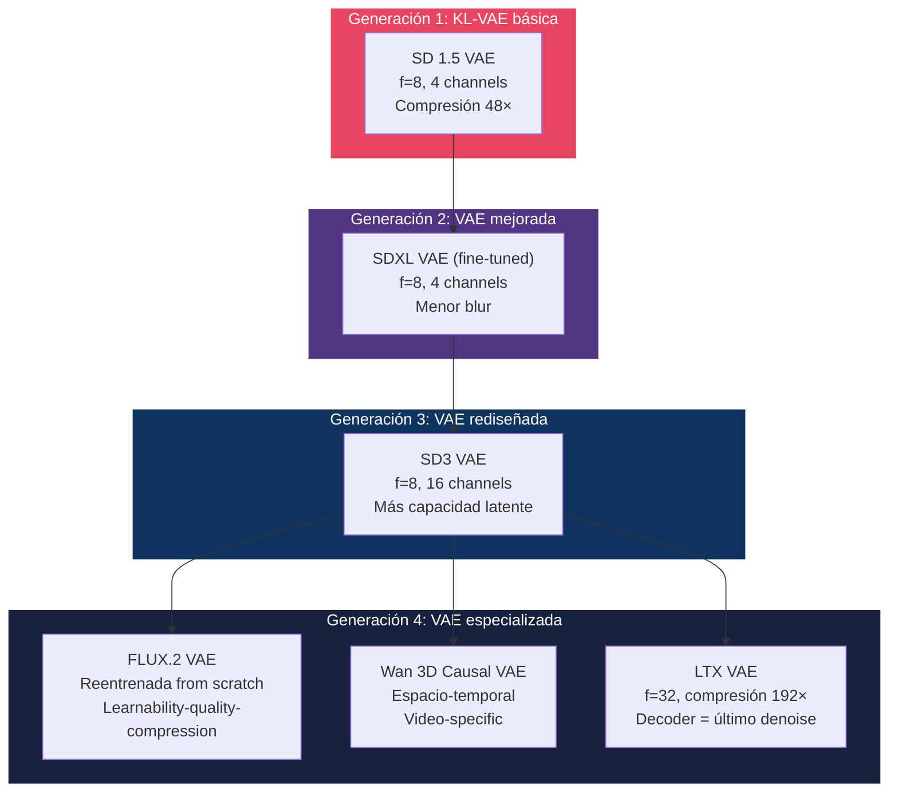
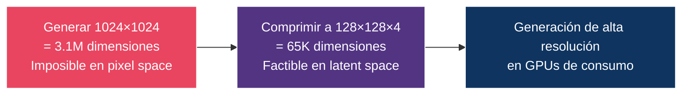

# 05 — Latent Diffusion

> Por qué mover la difusión del espacio de píxeles al espacio latente cambió radicalmente el coste de generación — y habilitó la generación de imágenes de alta resolución.

---

## Índice

1. [El problema de la resolución](#1-el-problema)
2. [Autoencoders y VAE](#2-autoencoders)
3. [El espacio latente](#3-espacio-latente)
4. [Latent Diffusion Models (LDM)](#4-ldm)
5. [KL regularization y latent scaling](#5-kl-y-scaling)
6. [Decoder artifacts](#6-decoder-artifacts)
7. [Evolución del VAE en modelos modernos](#7-evolución-vae)

---

## 1. El problema de la resolución

### Coste computacional de difusión en pixel space

La complejidad de un modelo de difusión depende de la **dimensionalidad de los datos**:

| Resolución | Dimensiones (RGB) | Relativo | VRAM (estimado) |
|:-----------|:-----------------|:---------|:----------------|
| 64×64 | 12,288 | 1× | ~1 GB |
| 256×256 | 196,608 | 16× | ~4 GB |
| 512×512 | 786,432 | 64× | ~16 GB |
| 1024×1024 | 3,145,728 | 256× | ~64 GB |

Para attention layers, la complejidad es **O(n²)** donde n = H×W. Esto hace que difusión en pixel space a 1024×1024 sea prohibitivamente costosa.

### La solución: comprimir primero, difundir después



**Factor de reducción**: 786,432 / 16,384 = **48×** menos dimensiones. La attention es O(n²), así que el ahorro real en cómputo es **~2,300×**.

---

## 2. Autoencoders y VAE

### Autoencoder (AE)



- **Encoder E**: Comprime imagen a representación compacta
- **Decoder D**: Reconstruye imagen desde representación
- **Loss**: `L = ‖x - D(E(x))‖²` (reconstrucción)

**Problema**: El espacio latente no tiene estructura. Puntos aleatorios en z no corresponden a imágenes válidas.

### Variational Autoencoder (VAE)



- El encoder produce **distribución** (μ, σ), no un punto fijo
- Se muestrea z usando reparameterization trick
- **Loss**: `L = L_rec + β · KL(q(z|x) ‖ N(0,I))`

El término KL fuerza al espacio latente a ser **regular** (cercano a una Gaussiana), lo que permite muestrear puntos significativos.

---

## 3. El espacio latente

### ¿Qué aprende el VAE?

El encoder aprende a comprimir **la información perceptualmente relevante**, descartando redundancia.

| Lo que conserva z | Lo que descarta z |
|:------------------|:-----------------|
| Estructura global | Ruido de alta frecuencia |
| Colores y tonos | Detalle sub-pixel |
| Formas y contornos | Texturas muy finas |
| Relaciones espaciales | Artefactos de compresión |
| Semántica de alto nivel | Pixel-level noise |

### Factor de compresión

| Modelo | Factor (f) | Channels | Input → Latent | Ratio |
|:-------|:-----------|:---------|:--------------|:------|
| SD 1.5 / SDXL | f=8 | 4 | 512² → 64² | 48× |
| SD3 | f=8 | 16 | 1024² → 128² | 48× (pero 16ch) |
| FLUX.1 | f=8 | 16 | 1024² → 128² | 48× |
| LTX-Video | **f=32** (spatial) | Variable | Video → tiny latent | **192×** |

> **Trade-off fundamental**: Mayor compresión = menos VRAM y cómputo, pero mayor pérdida de detalle y más artefactos de decoder.

---

## 4. Latent Diffusion Models (LDM)

### Arquitectura (Rombach et al., 2022)

```mermaid
graph TB
    subgraph Stage1 ["Etapa 1: Entrenar VAE (separadamente)"]
        S1_IMG["Imágenes"] --> S1_ENC["Encoder"]
        S1_ENC --> S1_Z["z"]
        S1_Z --> S1_DEC["Decoder"]
        S1_DEC --> S1_REC["Reconstrucción"]
        S1_LOSS["L = L_rec + L_KL + L_perceptual + L_adversarial"]
    end

    subgraph Stage2 ["Etapa 2: Entrenar Diffusion en latent space"]
        S2_IMG["Imágenes"] --> S2_ENC["Encoder E (congelado)"]
        S2_ENC --> S2_Z["z₀"]
        S2_NOISE["ε ~ N(0,I)"] --> S2_ZT["zₜ = √ᾱₜ·z₀ + √(1-ᾱₜ)·ε"]
        S2_Z --> S2_ZT
        S2_ZT --> S2_UNET["U-Net εθ(zₜ, t, c)"]
        S2_TEXT["Prompt → Text Encoder"] --> S2_UNET
        S2_UNET --> S2_LOSS["L = ‖ε - εθ‖²"]
    end

    subgraph Inference ["Inferencia"]
        I_Z["z_T ~ N(0,I)"] --> I_DENOISE["Denoise (N pasos)"]
        I_TEXT["Prompt → Text Encoder"] --> I_DENOISE
        I_DENOISE --> I_Z0["z₀ predicho"]
        I_Z0 --> I_DEC["Decoder D (congelado)"]
        I_DEC --> I_IMG["Imagen generada"]
    end

    style Stage1 fill:#1a1a2e,stroke:#533483,color:#fff
    style Stage2 fill:#1a1a2e,stroke:#0f3460,color:#fff
    style Inference fill:#1a1a2e,stroke:#e94560,color:#fff
```



### Las 2 etapas son completamente separadas

| Etapa | Qué se entrena | Qué está congelado |
|:------|:---------------|:-------------------|
| 1. VAE | Encoder + Decoder | Nada |
| 2. Diffusion | U-Net/DiT | Encoder, Decoder, Text Encoder |

> **Consecuencia**: Se puede mejorar la VAE sin reentrenar el modelo de difusión, y viceversa. Esta modularidad es una ventaja clave de LDM.

---

## 5. KL regularization y latent scaling

### ¿Por qué KL regularization?

Sin regularización, el espacio latente puede tener:
- Regiones vacías (no mapeadas a datos)
- Escalas arbitrarias (latents con magnitudes enormes)
- Estructura no uniforme

El término KL fuerza `q(z|x) ≈ N(0,I)`, lo que:
1. Regulariza la escala de z
2. Hace el espacio "suave" (puntos cercanos → imágenes similares)
3. Permite que el modelo de difusión trabaje en un espacio bien condicionado

### Latent scaling factor

En la práctica, los latents del VAE no tienen exactamente varianza 1. Se aplica un **factor de escala** para normalizarlos:

```
z_scaled = z / scale_factor
```

| Modelo | scale_factor | Justificación |
|:-------|:-------------|:-------------|
| SD 1.5 | 0.18215 | Normaliza varianza empírica de latents |
| SDXL | 0.13025 | Ajustado al VAE fine-tuned |
| SD3 | Variable | Depende del nuevo VAE |
| FLUX | Custom | VAE reentrenada |

> Si no se aplica este factor, el modelo de difusión debe aprender a compensar la escala, lo cual es ineficiente.

---

## 6. Decoder artifacts

### Tipos de artefactos del VAE decoder

| Artefacto | Causa | Manifestación |
|:----------|:------|:-------------|
| **Blur** | Compresión excesiva | Pérdida de detalle fino |
| **Grid artifacts** | Boundary effects entre patches | Patrones de cuadrícula visibles |
| **Color banding** | Cuantización implícita | Degradados con bandas |
| **Texture loss** | High-frequency info descartada | Texturas planas |
| **Ringing** | Efectos Gibbs en decodificación | Halos alrededor de bordes |

### Mitigaciones en modelos modernos

| Estrategia | Usado por | Mecanismo |
|:-----------|:----------|:----------|
| Perceptual loss (LPIPS) | SD, SDXL | Loss en feature space en lugar de pixel space |
| Adversarial loss (PatchGAN) | SD, SDXL | Discriminador que detecta artefactos |
| Más canales latentes | SD3 (16ch) | Mayor capacidad de representación |
| Mayor resolución de training | SDXL | VAE entrenada en resolución más alta |
| VAE reentrenada | FLUX.2 | Optimización end-to-end |
| Dual-role decoder | LTX-Video | Decoder también hace último denoise |

---

## 7. Evolución del VAE en modelos modernos



### Preguntas de diseño para VAE

| Pregunta | Trade-off |
|:---------|:---------|
| ¿Más compresión (f mayor)? | Menos cómputo ↔ más artefactos |
| ¿Más canales latentes? | Más capacidad ↔ más VRAM |
| ¿KL vs VQ? | Espacio continuo (difusión) vs discreto (autoregresivo) |
| ¿2D vs 3D? | Imágenes vs video (consistencia temporal) |
| ¿Causal? | Permite video de longitud variable |

---

## Diagrama conceptual: por qué LDM importa



---

## Referencias

- Rombach, R. et al. (2022). *High-Resolution Image Synthesis with Latent Diffusion Models*. CVPR 2022.
- Kingma, D.P. & Welling, M. (2014). *Auto-Encoding Variational Bayes*. ICLR 2014.
- Esser, P. et al. (2021). *Taming Transformers for High-Resolution Image Synthesis*. CVPR 2021.

---

*← [04 — Score Models](../04-score-models/README.md) | [06 — Arquitecturas →](../06-architectures/README.md)*
