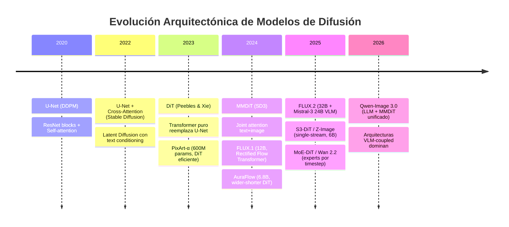
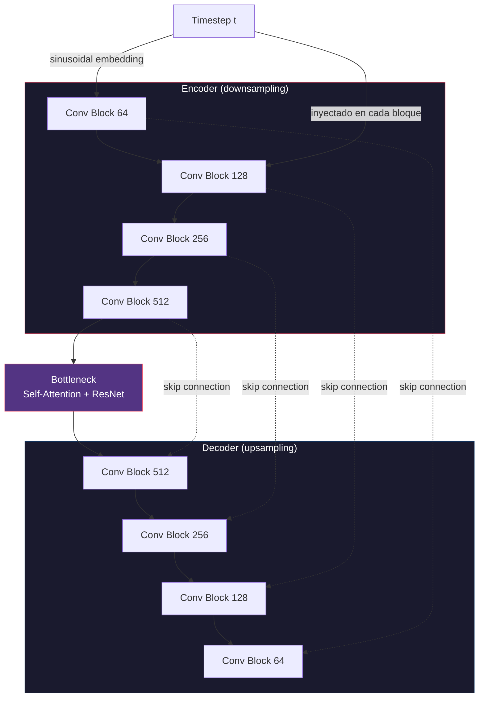
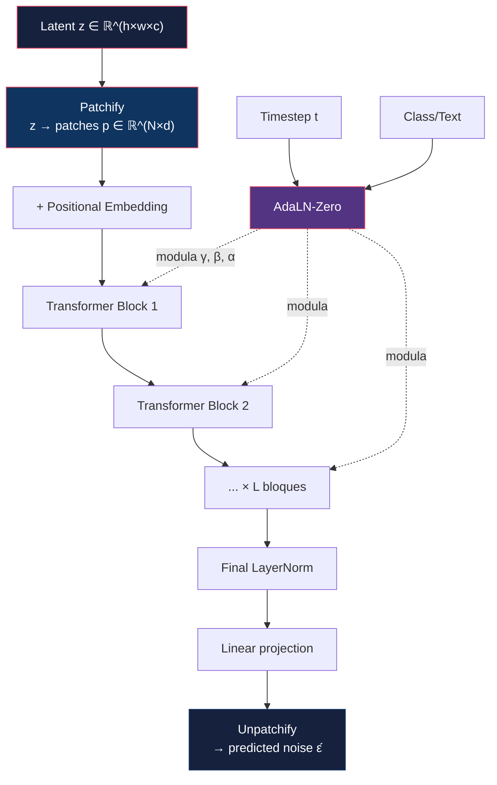
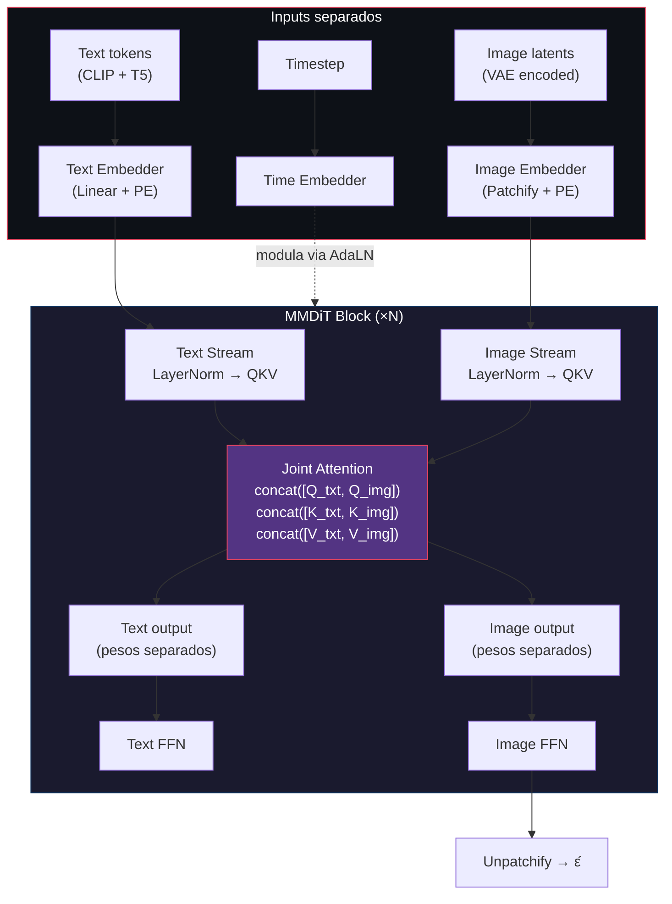
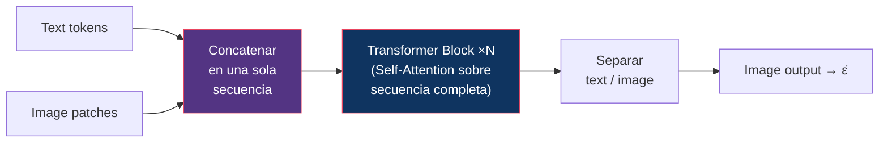
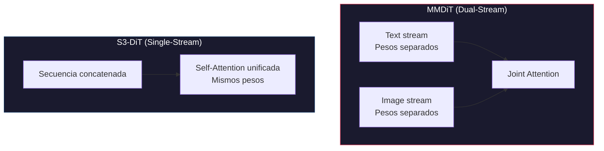
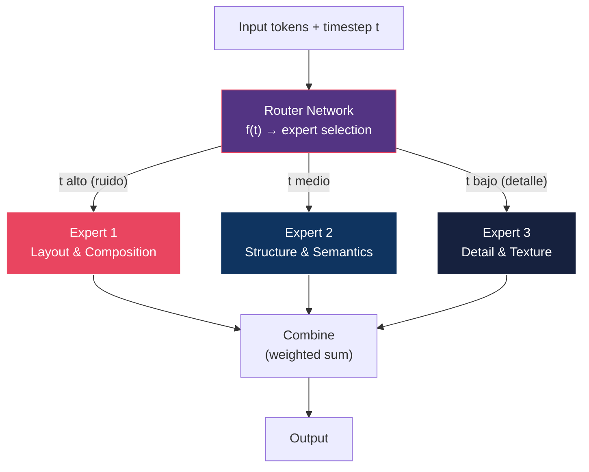
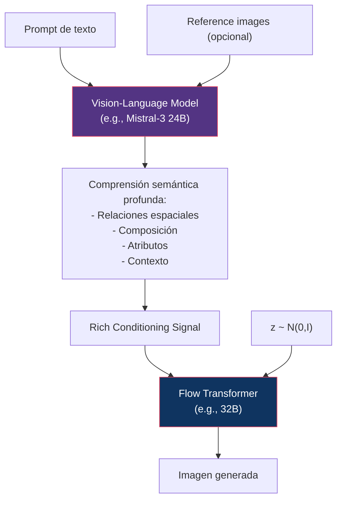
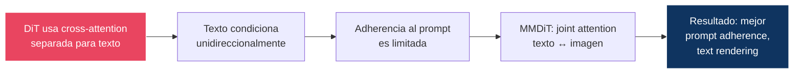
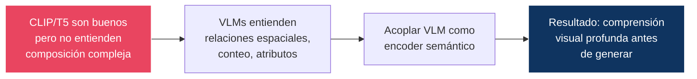

# 06 — Evolución Arquitectónica

> De U-Net a Diffusion Transformers: cómo y por qué cambió la columna vertebral de los modelos generativos.

---

## Índice

1. [Visión general de la evolución](#1-visión-general)
2. [U-Net: la arquitectura fundacional](#2-u-net)
3. [DiT: Diffusion Transformers](#3-dit)
4. [MMDiT: Multi-Modal DiT](#4-mmdit)
5. [S3-DiT: Single-Stream Scalable DiT](#5-s3-dit)
6. [MoE-DiT: Mixture of Experts](#6-moe-dit)
7. [VLM-coupled architectures](#7-vlm-coupled)
8. [Tabla comparativa completa](#8-tabla-comparativa)
9. [¿Por qué ocurrió la transición?](#9-por-qué)

---

## 1. Visión general



---

## 2. U-Net

### Arquitectura

La U-Net para difusión es una red **encoder-decoder** con skip connections.



### Componentes clave

#### ResNet Block
```
Input → GroupNorm → SiLU → Conv3x3 → GroupNorm → SiLU → Conv3x3 → + Input (residual)
                                  ↑
                          time_embedding (projection lineal)
```

#### Self-Attention (dentro de U-Net)
- Se aplica solo en resoluciones intermedias (e.g., 16×16, 32×32) por coste computacional
- Complejidad: O(n²) donde n = H×W (número de spatial tokens)

#### Cross-Attention (Stable Diffusion)
```
Q = projection(image_features)
K = projection(text_embeddings)    ← CLIP text encoder
V = projection(text_embeddings)

Attention(Q, K, V) = softmax(QKᵀ / √d) · V
```

> **Insight**: La cross-attention es el mecanismo principal por el cual el texto controla la generación. Cada token de texto puede influenciar cada posición espacial de la imagen.

### Limitaciones de U-Net

| Limitación | Consecuencia |
|:-----------|:-------------|
| Inductive bias espacial fuerte | Difícil de escalar a resoluciones variables |
| Attention solo en resoluciones bajas | Limita la coherencia global |
| Complejidad arquitectónica | Encoder/decoder/skip connections/attention interactúan de formas complejas |
| Escalado no trivial | Añadir capacidad requiere decisiones de diseño no obvias |
| Acoplamiento resolución-parámetros | Cambiar resolución puede requerir re-entrenar |

---

## 3. DiT

### La idea central

**Peebles & Xie (2023)**: Reemplazar completamente la U-Net por un **Vision Transformer estándar** (ViT).



### Mecanismo AdaLN-Zero

En lugar de inyectar el timestep como un bias (como en U-Net), DiT usa **Adaptive Layer Normalization**:

```
AdaLN(h, c) = γ(c) · LayerNorm(h) + β(c)
```

donde `γ(c)` y `β(c)` son funciones del conditioning (timestep + class/text).

**"-Zero"**: Los parámetros de escala se inicializan a cero, haciendo que cada bloque transformer actúe como identidad al inicio del training → training más estable.

### Escalado de DiT

| Variante | Layers | Hidden dim | Heads | Params |
|:---------|:-------|:-----------|:------|:-------|
| DiT-S | 12 | 384 | 6 | 33M |
| DiT-B | 12 | 768 | 12 | 130M |
| DiT-L | 24 | 1024 | 16 | 458M |
| DiT-XL | 28 | 1152 | 16 | 675M |

> **Resultado clave**: DiT escala de manera predecible — mayor modelo = menor FID. Esto conecta con la literatura de scaling laws de LLMs y justifica construir modelos cada vez más grandes.

### ¿Por qué funciona mejor que U-Net?

1. **Sin inductive bias espacial forzado**: El transformer ve toda la imagen como una secuencia de tokens
2. **Escalado directo**: Más layers, más dimensión → mejor rendimiento predecible
3. **Atención global**: Cada patch atiende a todos los demás desde el primer layer
4. **Flexibilidad de resolución**: Los patches se adaptan más naturalmente a diferentes resoluciones
5. **Infraestructura de LLMs**: Optimizaciones existentes (FlashAttention, tensor parallelism) se aplican directamente

---

## 4. MMDiT

### Motivación

En un DiT estándar, el text conditioning entra como un "side input" a través de AdaLN o cross-attention separada. MMDiT (SD3) propone tratar **texto e imagen como ciudadanos de primera clase** dentro del mismo mecanismo de atención.

### Arquitectura



### Joint Attention vs Cross-Attention

| Mecanismo | Cómo funciona | Flujo de información |
|:----------|:-------------|:--------------------|
| **Cross-Attention** (SD 1.x) | Q=image, KV=text | Unidireccional: text→image |
| **Joint Attention** (MMDiT) | QKV = concat(text, image) | Bidireccional: text↔image |

> **Por qué importa**: La joint attention permite que los tokens de texto se "actualicen" basándose en lo que la imagen está generando. Esto mejora dramáticamente la adherencia al prompt y la capacidad de renderizar texto en imágenes.

### Variante MMDiT-X (SD 3.5 Medium)

- Añade **dual attention layers** en los primeros bloques
- Incluye **self-attention por modalidad** antes de la joint attention
- Usa **QK-normalization** para estabilidad de training

---

## 5. S3-DiT

### Arquitectura (Z-Image, 2025)

**Single-Stream**: En lugar de tener streams separados para texto e imagen que se fusionan en la attention (como MMDiT), S3-DiT procesa texto e imagen en una **secuencia unificada desde el principio**.



### Comparación de streams



| Aspecto | MMDiT (Dual-Stream) | S3-DiT (Single-Stream) |
|:--------|:--------------------|:-----------------------|
| Pesos | Separados por modalidad | Compartidos |
| Params (mismo rendimiento) | Mayor | ~50% menor |
| VRAM | Mayor | Menor |
| Latencia | Mayor | Menor |
| Expresividad por modalidad | Mayor | Menor (compartida) |

---

## 6. MoE-DiT

### Motivación (Wan 2.2, 2025)

¿Y si diferentes timesteps requieren diferentes "expertos"?

- **Timesteps altos (mucho ruido)**: El modelo necesita resolver la composición global (layout, objetos principales)
- **Timesteps bajos (poco ruido)**: El modelo necesita refinar detalles finos (texturas, iluminación)

### Arquitectura



### Ventaja

- **Más capacidad sin más cómputo**: Solo un subconjunto de expertos se activa por paso
- **Especialización**: Cada experto se optimiza para un régimen de ruido específico
- **Escalado eficiente**: Se pueden añadir expertos sin aumentar la latencia de inferencia proporcionalmente

---

## 7. VLM-Coupled Architectures

### La tendencia de 2025–2026

La frontera actual acopla un **Vision-Language Model** completo con el generador de difusión/flow.



### Ejemplo: FLUX.2 (2025)

| Componente | Detalle |
|:-----------|:--------|
| VLM | Mistral-3 24B (vision-language) |
| Generador | Rectified Flow Transformer 32B |
| VAE | Reentrenada from scratch (optimizada para learnability-quality-compression) |
| Capacidad | Multi-reference editing (hasta 10 imágenes fuente) |
| Resolución | Hasta 4 megapíxeles |

> **¿Por qué acoplar un VLM?** Los text encoders anteriores (CLIP, T5) tienen limitaciones fundamentales en comprensión espacial, composicional y de conteo. Un VLM completo entiende semántica visual profunda, permitiendo generaciones mucho más fieles al prompt.

---

## 8. Tabla comparativa completa

| Arquitectura | Año | Attention | Conditioning | Params típicos | Modelos representativos |
|:-------------|:----|:----------|:-------------|:---------------|:-----------------------|
| **U-Net** | 2020 | Self (solo low-res) | Timestep via bias | 50M–900M | DDPM, SD 1.x |
| **U-Net + Cross-Attn** | 2022 | Self + Cross | CLIP text via cross-attn | 860M–2.6B | SD 1.5, SD 2.x, SDXL |
| **DiT** | 2023 | Full self-attention | AdaLN-Zero | 33M–675M | DiT, PixArt-α (600M) |
| **MMDiT** | 2024 | Joint (text+image) | CLIP + T5, joint attn | 2B–8B | SD3, SD 3.5 |
| **Rectified Flow Transformer** | 2024 | Full self + double/single stream | T5 + CLIP | 12B | FLUX.1 |
| **S3-DiT** | 2025 | Unified self-attention | Single-stream concat | 6B | Z-Image |
| **MoE-DiT** | 2025 | Full self + MoE routing | Timestep-routed experts | 5B–14B active | Wan 2.2 |
| **VLM + Flow Transformer** | 2025 | VLM attn + Flow attn | VLM (Mistral-3 24B) | 32B + 24B | FLUX.2 |
| **LLM + MMDiT** | 2026 | LLM attn + MMDiT | MLLM integrado | Variable | Qwen-Image 3.0 |

---

## 9. ¿Por qué ocurrió la transición?

### De U-Net a DiT


### De DiT a MMDiT



### De MMDiT a VLM-coupled



### Resumen: cada transición resolvió un bottleneck

| Transición | Bottleneck resuelto |
|:-----------|:-------------------|
| U-Net → DiT | Escalabilidad predecible |
| DiT → MMDiT | Adherencia al prompt |
| MMDiT → S3-DiT | Eficiencia (misma calidad, menos params) |
| DiT → MoE-DiT | Especialización por régimen de ruido |
| MMDiT → VLM-coupled | Comprensión semántica profunda |

---

## Referencias

- Ronneberger, O. et al. (2015). *U-Net: Convolutional Networks for Biomedical Image Segmentation*
- Peebles, W. & Xie, S. (2023). *Scalable Diffusion Models with Transformers (DiT)*. ICCV.
- Esser, P. et al. (2024). *Scaling Rectified Flow Transformers for High-Resolution Image Synthesis (SD3)*. ICML.
- Black Forest Labs (2024). *FLUX.1 Technical Report*.
- Black Forest Labs (2025). *FLUX.2 Technical Report*.
- Alibaba/Tongyi (2025). *Wan 2.1/2.2 Technical Report*.
- Chen, J. et al. (2024). *PixArt-α: Fast Training of Diffusion Transformer*. ICLR.

---

*← [05 — Latent Diffusion](../05-latent-diffusion/README.md) | [07 — Flow Matching →](../07-flow-matching/README.md)*
