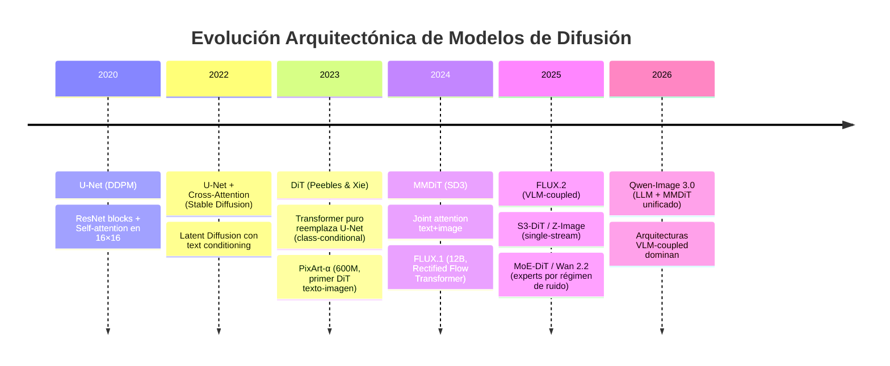
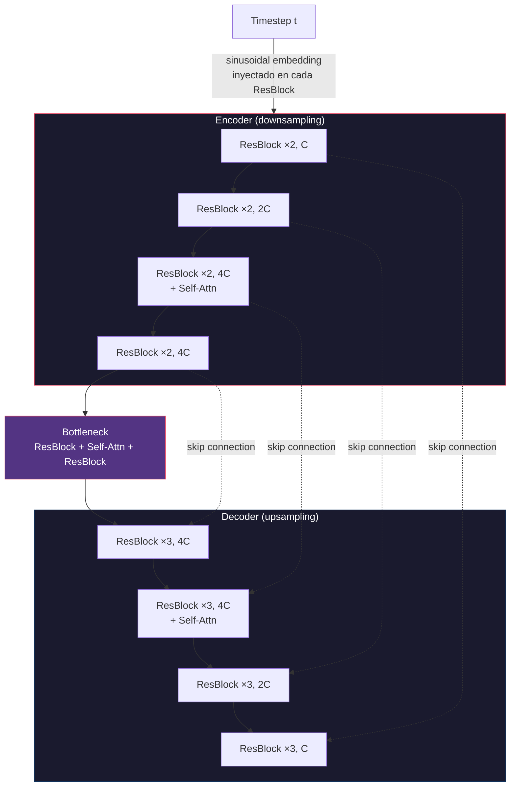
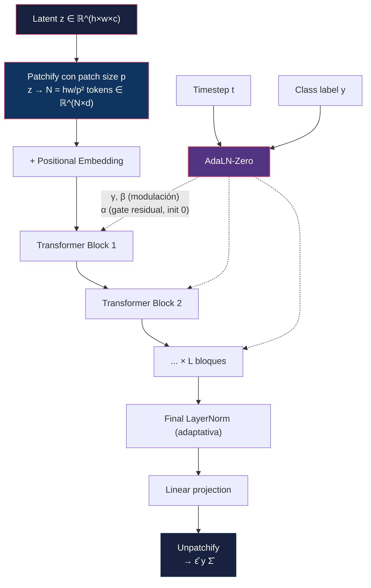
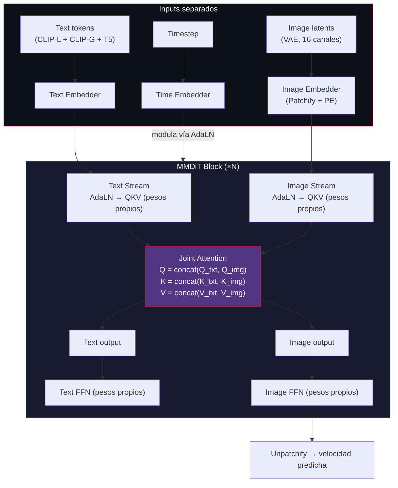
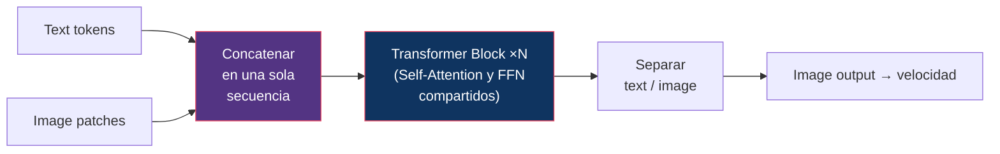
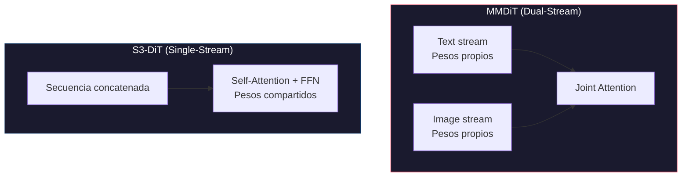
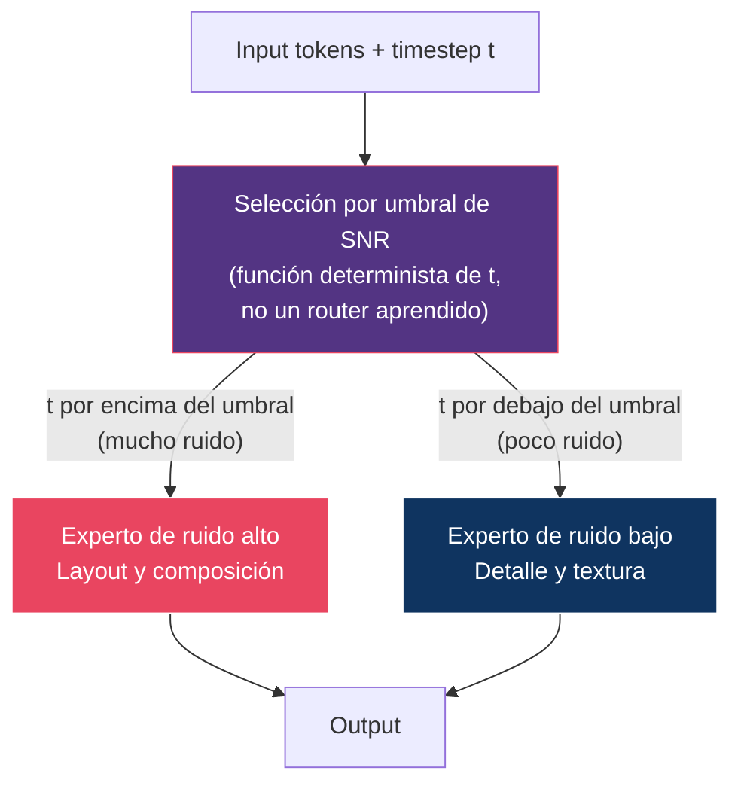
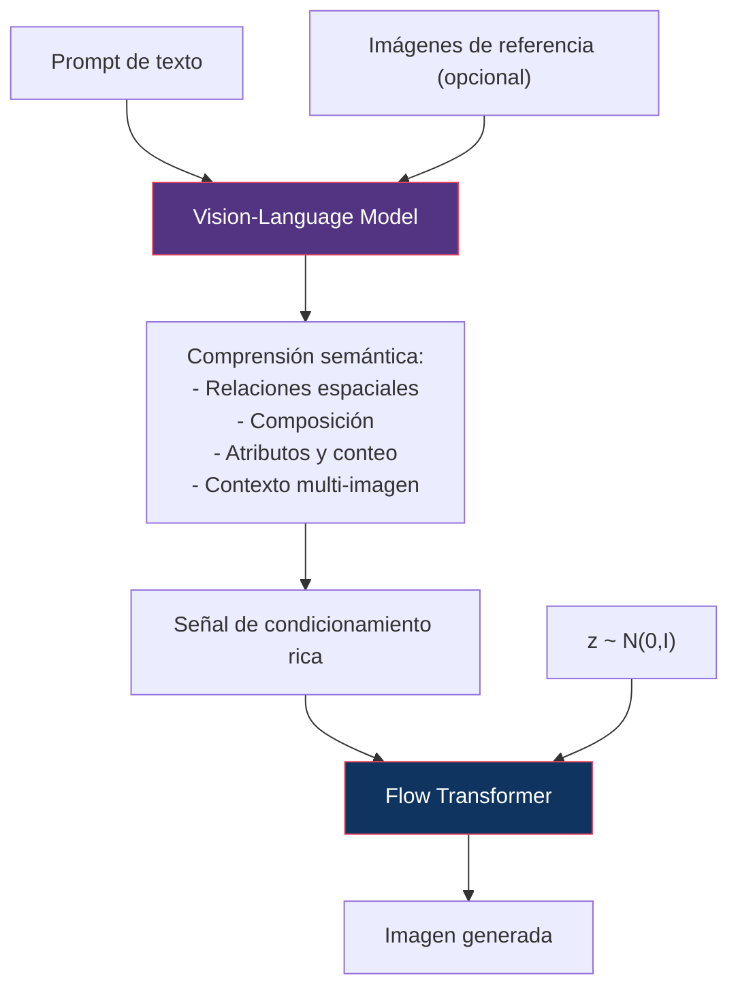
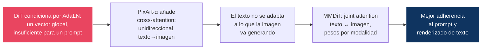
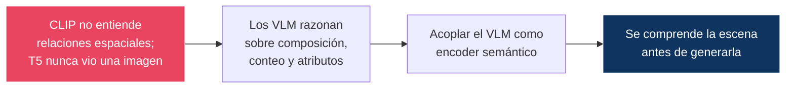

# 06 — Evolución Arquitectónica

> De U-Net a Diffusion Transformers: cómo y por qué cambió la columna vertebral de los modelos generativos.

---

## Índice

1. [Visión general de la evolución](#1-visión-general)
2. [U-Net: la arquitectura fundacional](#2-u-net)
3. [DiT: Diffusion Transformers](#3-dit)
4. [MMDiT: Multi-Modal DiT](#4-mmdit)
5. [S3-DiT: Single-Stream Scalable DiT](#5-s3-dit)
6. [MoE-DiT: Mixture of Experts](#6-moe-dit)
7. [VLM-coupled architectures](#7-vlm-coupled-architectures)
8. [Tabla comparativa completa](#8-tabla-comparativa-completa)
9. [¿Por qué ocurrió la transición?](#9-por-qué-ocurrió-la-transición)

---

## 1. Visión general



> ⚠️ Las entradas de 2025-2026 resumen la trayectoria. Las especificaciones concretas de cada modelo son competencia de [16 — Image Models](../16-image-models/README.md) y [17 — Video Models](../17-video-models/README.md), que son la fuente dentro de este repositorio.

---

## 2. U-Net

### Arquitectura

La U-Net para difusión es una red **encoder-decoder** con skip connections.



> Diagrama esquemático (`C` = canales base). Las configuraciones reales están en [02 §5](../02-ddpm/README.md#5-arquitectura-de-la-red-u-net-original): DDPM usa `C = 128`; el U-Net de SD 1.5 usa `C = 320`.

### Componentes clave

#### ResNet Block
```
Input → GroupNorm → SiLU → Conv3x3 → GroupNorm → SiLU → Conv3x3 → + Input (residual)
                                  ↑
                          time_embedding (proyección lineal, sumada como bias)
```

#### Self-Attention (dentro de U-Net)
- Complejidad **O(n²)** con `n = H×W`, así que solo es asumible en resoluciones bajas
- **DDPM**: una sola resolución (16×16)
- **Stable Diffusion**: varias (64², 32², 16² en el espacio latente), gracias a que el latente ya está comprimido 8×

#### Cross-Attention (Stable Diffusion)
```
Q = projection(image_features)
K = projection(text_embeddings)    ← CLIP text encoder
V = projection(text_embeddings)

Attention(Q, K, V) = softmax(QKᵀ / √d) · V
```

> **Insight**: la cross-attention es el mecanismo por el que el texto controla la generación. Cada token de texto puede influir sobre cada posición espacial. Introducida por LDM ([05 §4](../05-latent-diffusion/README.md#4-latent-diffusion-models-ldm)).

### Limitaciones de U-Net

| Limitación | Consecuencia |
|:-----------|:-------------|
| Inductive bias espacial fuerte | Diseñado alrededor de una jerarquía de resoluciones fija |
| Attention limitada a resoluciones bajas | La interacción global de grano fino es cara |
| Complejidad arquitectónica | Encoder/decoder/skips/attention interactúan de forma no modular |
| Escalado no trivial | Añadir capacidad exige decidir *dónde*: ¿más canales? ¿más niveles? ¿más bloques? Sin ley clara. |
| Acoplamiento resolución-arquitectura | El número de niveles depende de la resolución de entrada |

> **Matiz honesto**: ninguna de estas limitaciones impidió que U-Net produjera modelos excelentes. SDXL (2023) es U-Net y fue estado del arte. La transición a DiT no ocurrió porque U-Net fallara, sino porque **no ofrecía una ley de escalado predecible** — ver [§9](#9-por-qué-ocurrió-la-transición).

---

## 3. DiT

### La idea central

**Peebles & Xie (2023)**: reemplazar completamente la U-Net por un **Vision Transformer estándar**.



> ⚠️ **Precisión importante**: el DiT original es **class-conditional sobre ImageNet**, no texto-imagen. No tiene cross-attention ni text encoder: el condicionamiento es una etiqueta de clase que entra por AdaLN junto con el timestep. El primer DiT de texto-imagen relevante es **PixArt-α** (2024), que sí añade cross-attention con T5.

### Mecanismo AdaLN-Zero

En lugar de inyectar el condicionamiento como un bias, DiT lo usa para **modular las normalizaciones**:

```
AdaLN(h, c) = γ(c) · LayerNorm(h) + β(c)
```

donde `γ(c)`, `β(c)` se regresan del vector de condicionamiento `c = emb(t) + emb(y)`.

**Y el «-Zero»** es un tercer parámetro, distinto de γ y β:

```
h ← h + α(c) · Block(AdaLN(h, c))
                ↑
        α inicializado a CERO
```

`α` es una **puerta sobre la rama residual**. Al inicializarla a cero, cada bloque empieza siendo la identidad exacta y la red arranca como una función identidad que va «abriendo» bloques según los necesita. Peebles & Xie muestran que esta variante supera claramente a la modulación AdaLN normal y al condicionamiento por cross-attention o por tokens.

> Confundir el zero-init con γ es un error común: si γ fuera cero, la LayerNorm anularía la señal, no la dejaría pasar.

### El resultado real: FID escala con Gflops, no con parámetros

Esta es la aportación científica del paper, y suele resumirse mal.

```
                  FID
                   ↑
                   │  ●  DiT-S/8
                   │    ●  DiT-B/8
                   │       ● DiT-S/2
                   │         ●  DiT-L/8
                   │            ● DiT-B/2
                   │               ●  DiT-L/4
                   │                   ● DiT-XL/2
                   └─────────────────────────────→ Gflops

     Los puntos caen sobre UNA sola curva, independientemente
     de si los Gflops vienen de más capas, más ancho o menos
     patch size. Lo que predice el FID es el cómputo, no los
     parámetros.
```

**Consecuencia contraintuitiva**: un modelo pequeño con patch size chico puede superar a uno grande con patch size grande, aunque tenga muchos menos parámetros. El **patch size no cambia casi el número de parámetros pero sí el cómputo**, porque determina cuántos tokens hay.

### El patch size: el parámetro que está en el nombre

`DiT-XL/2` significa XL con **patch size 2**. Es el eje que más influye:

| Patch size p | Tokens (latente 32×32) | Gflops relativos | Calidad |
|:-------------|:-----------------------|:-----------------|:--------|
| 8 | 16 | 1× | Peor |
| 4 | 64 | ~4× | Media |
| **2** | **256** | **~16×** | **Mejor** |

Como la atención es O(N²), dividir `p` entre dos multiplica por ~4 el número de tokens y dispara el cómputo. Todos los modelos serios usan p = 2.

### Escalado de DiT

| Variante | Layers | Hidden dim | Heads | Params |
|:---------|:-------|:-----------|:------|:-------|
| DiT-S | 12 | 384 | 6 | 33M |
| DiT-B | 12 | 768 | 12 | 130M |
| DiT-L | 24 | 1024 | 16 | 458M |
| DiT-XL | 28 | 1152 | 16 | 675M |

**Resultado**: DiT-XL/2 alcanza **FID 2.27** en ImageNet 256×256 class-conditional, superando a LDM y a los mejores GANs de la época.

> ⚠️ Cifra pendiente de verificar contra el paper, igual que el resto de números de este repositorio que no estén marcados como verificados.

### ¿Por qué funciona mejor que U-Net?

1. **Ley de escalado predecible**: más Gflops → menor FID, de forma monótona y extrapolable
2. **Sin jerarquía de resoluciones fija**: la secuencia de tokens no impone una estructura espacial
3. **Atención global desde la primera capa**: cada patch ve a todos los demás
4. **Flexibilidad de resolución**: cambiar la resolución cambia `N`, no la arquitectura — especialmente con embeddings posicionales relativos (RoPE)
5. **Infraestructura de LLMs directamente aplicable**: FlashAttention, tensor/sequence parallelism, técnicas de cuantización

---

## 4. MMDiT

### Motivación

El DiT original condiciona por AdaLN, que comprime todo el condicionamiento en un vector global — suficiente para una etiqueta de clase, insuficiente para un prompt. PixArt-α lo resuelve con cross-attention (unidireccional). MMDiT (SD3) va más allá: tratar **texto e imagen como ciudadanos de primera clase** dentro del mismo mecanismo de atención.

### Arquitectura



**La clave**: cada modalidad tiene sus **propios pesos** para QKV y FFN (porque texto e imagen tienen estadísticas muy distintas), pero la **atención es conjunta** sobre la secuencia concatenada. Dos conjuntos de parámetros, una sola operación de atención.

### Joint Attention vs Cross-Attention

| Mecanismo | Cómo funciona | Flujo de información |
|:----------|:-------------|:--------------------|
| **Cross-Attention** (SD 1.x, PixArt) | Q = image, K/V = text | Unidireccional: texto → imagen |
| **Joint Attention** (MMDiT) | QKV = concat(text, image) | Bidireccional: texto ↔ imagen |

> **Por qué importa**: con joint attention los tokens de texto se actualizan en función de lo que la imagen está generando. La representación del prompt deja de ser estática. Es una de las razones de la mejora en adherencia al prompt y en renderizado de texto — la otra es el VAE de 16 canales ([05 §3](../05-latent-diffusion/README.md#3-el-espacio-latente)).

### QK-normalization

Detalle de estabilidad que se volvió estándar: normalizar Q y K (RMSNorm) antes del producto escalar. Sin ello, en modelos grandes las logits de atención crecen sin control durante el entrenamiento y aparecen divergencias en precisión mixta. SD3 lo documenta explícitamente.

### Variante MMDiT-X (SD 3.5 Medium)

- **Dual attention layers** en los primeros bloques
- **Self-attention por modalidad** antes de la joint attention
- **QK-normalization** en todos los bloques

---

## 5. S3-DiT

### Arquitectura (Z-Image, 2025)

**Single-Stream**: en lugar de mantener pesos separados por modalidad que se encuentran en la atención (MMDiT), S3-DiT procesa texto e imagen en una **secuencia unificada con los mismos pesos**.



### Comparación de streams



| Aspecto | MMDiT (Dual-Stream) | S3-DiT (Single-Stream) |
|:--------|:--------------------|:-----------------------|
| Pesos QKV/FFN | Separados por modalidad | Compartidos |
| Params para calidad comparable | Mayor | Menor |
| VRAM y latencia | Mayor | Menor |
| Especialización por modalidad | Explícita | Emergente (si la hay) |

> ⚠️ Las cifras concretas de ahorro de parámetros dependen del modelo y **están pendientes de contrastar** con el reporte técnico de Z-Image. Lo estructuralmente cierto es la dirección del trade-off, no un porcentaje.

> **Nota**: FLUX.1 usa un diseño **híbrido** — bloques dual-stream al principio y single-stream después. Sugiere que la separación importa más en las capas tempranas, donde las estadísticas de las dos modalidades aún son muy distintas.

---

## 6. MoE-DiT

### Motivación (Wan 2.2, 2025)

La observación de partida es sólida y conecta con [01 §6](../01-foundations/README.md#6-snr): **los distintos regímenes de SNR son tareas diferentes**.

- **Ruido alto (SNR bajo)**: resolver composición global — layout, objetos principales
- **Ruido bajo (SNR alto)**: refinar detalle — texturas, iluminación, bordes

Un solo conjunto de pesos tiene que servir para ambas. La propuesta es especializar.

### Arquitectura



> ⚠️ El número exacto de expertos y el criterio de conmutación **deben verificarse contra el reporte técnico de Wan 2.2** ([17 — Video Models](../17-video-models/README.md)). Lo que sí es estructuralmente necesario es lo siguiente.

### Por qué la selección debe ser exclusiva

Un MoE por timestep **solo ahorra cómputo si se activa un experto a la vez**. Si se combinaran todos los expertos con una suma ponderada, habría que evaluarlos todos y no habría ningún ahorro — solo más parámetros y la misma latencia multiplicada.

La ventaja depende de que la selección sea **dura y exclusiva**:

| Propiedad | Requiere |
|:----------|:---------|
| Más capacidad total sin más cómputo por paso | Un solo experto activo por forward |
| Especialización por régimen de ruido | Partición del rango de t entre expertos |
| Sin coste de routing | La selección depende solo de `t`, que se conoce de antemano |

Este último punto distingue el MoE-por-timestep del MoE clásico de LLMs: aquí **no hace falta un router aprendido ni balanceo de carga**, porque el timestep es conocido antes de ejecutar nada. Es un MoE mucho más simple que el de un Mixtral.

---

## 7. VLM-Coupled Architectures

### La tendencia de 2025–2026

La frontera actual acopla un **Vision-Language Model** completo con el generador de difusión/flow.



### Por qué acoplar un VLM

El argumento técnico es concreto. Los text encoders clásicos tienen límites documentados:

| Encoder | Límite |
|:--------|:-------|
| **CLIP** | Entrenado con contrastive loss sobre pares imagen-texto cortos. Se comporta casi como una bolsa de conceptos: falla en relaciones espaciales («a la izquierda de»), negación y conteo. |
| **T5** | Buena comprensión lingüística, pero **nunca ha visto una imagen**. No tiene noción de qué es visualmente realizable. |
| **VLM** | Entrenado sobre imagen y texto conjuntamente y con razonamiento. Sí modela relaciones espaciales y composición. |

> El salto conceptual: se pasa de **codificar** el prompt a **comprenderlo** antes de generar. El condicionamiento deja de ser una proyección del texto y pasa a ser el estado interno de un modelo que ha razonado sobre la escena.

### Ejemplo: FLUX.2

| Componente | Detalle |
|:-----------|:--------|
| VLM | Mistral-3 24B (vision-language) |
| Generador | Rectified Flow Transformer 32B |
| VAE | Re-entrenada desde cero |
| Capacidad | Edición multi-referencia |
| Resolución | Hasta ~4 MP |

> ⚠️ Especificaciones **pendientes de contrastar** con el reporte técnico oficial. Ver [16 — Image Models](../16-image-models/README.md).

---

## 8. Tabla comparativa completa

| Arquitectura | Año | Attention | Conditioning | Params típicos | Modelos representativos |
|:-------------|:----|:----------|:-------------|:---------------|:-----------------------|
| **U-Net** | 2020 | Self solo en 16×16 | Timestep vía bias; **sin texto** | 35M–560M | DDPM, ADM |
| **U-Net + Cross-Attn** | 2022 | Self (varias res.) + Cross | CLIP vía cross-attention | 860M–2.6B | SD 1.5, SD 2.x, SDXL |
| **DiT** | 2023 | Full self-attention | AdaLN-Zero; **class label** | 33M–675M | DiT |
| **DiT + Cross-Attn** | 2024 | Full self + cross | T5 vía cross-attention | 600M | PixArt-α |
| **MMDiT** | 2024 | Joint (text+image) | CLIP + T5, joint attn | 2B–8B | SD3, SD 3.5 |
| **Rectified Flow Transformer** | 2024 | Dual-stream + single-stream | T5 + CLIP | 12B | FLUX.1 |
| **S3-DiT** | 2025 | Self-attention unificada | Single-stream concat | ~6B | Z-Image |
| **MoE-DiT** | 2025 | Full self + expertos por t | Expertos por régimen de ruido | Variable | Wan 2.2 |
| **VLM + Flow Transformer** | 2025 | VLM attn + Flow attn | VLM completo | 32B + 24B | FLUX.2 |
| **LLM + MMDiT** | 2026 | LLM attn + MMDiT | MLLM integrado | Variable | Qwen-Image 3.0 |

> ⚠️ Los recuentos de parámetros de 2025-2026 son orientativos y deben contrastarse con los model cards de [16](../16-image-models/README.md) y [17](../17-video-models/README.md).

---

## 9. ¿Por qué ocurrió la transición?

### De U-Net a DiT


> **El punto que suele perderse**: el argumento no fue «DiT genera mejor que U-Net a igualdad de cómputo» — a escalas pequeñas la diferencia es modesta, y SDXL demostró que U-Net llegaba muy lejos. El argumento fue **predictibilidad**: con DiT puedes estimar la calidad de un modelo de 10B antes de entrenarlo. Para quien financia un entrenamiento de millones de dólares, eso vale más que unos puntos de FID.

### De DiT a MMDiT



### De MMDiT a VLM-coupled



### Resumen: cada transición resolvió un bottleneck

| Transición | Bottleneck resuelto | Coste asumido |
|:-----------|:-------------------|:--------------|
| U-Net → DiT | Escalabilidad predecible | Menos eficiencia a escala pequeña |
| DiT → PixArt (cross-attn) | Condicionamiento por texto | Flujo unidireccional |
| Cross-attn → MMDiT | Adherencia al prompt | ~2× parámetros por bloque |
| MMDiT → S3-DiT | Eficiencia de parámetros | Menos especialización por modalidad |
| DiT → MoE-DiT | Especialización por régimen de ruido | Más VRAM total |
| MMDiT → VLM-coupled | Comprensión semántica | Un modelo grande extra en el pipeline |

---

## Referencias

- Ronneberger, O., Fischer, P., & Brox, T. (2015). *U-Net: Convolutional Networks for Biomedical Image Segmentation*. MICCAI 2015.
- Ho, J., Jain, A., & Abbeel, P. (2020). *Denoising Diffusion Probabilistic Models*. NeurIPS 2020. — U-Net para difusión.
- Dhariwal, P. & Nichol, A. (2021). *Diffusion Models Beat GANs on Image Synthesis*. NeurIPS 2021. — ADM; el U-Net más refinado.
- Rombach, R. et al. (2022). *High-Resolution Image Synthesis with Latent Diffusion Models*. CVPR 2022. — Cross-attention conditioning.
- Peebles, W. & Xie, S. (2023). *Scalable Diffusion Models with Transformers*. ICCV 2023. — **DiT, AdaLN-Zero, escalado por Gflops.**
- Chen, J. et al. (2024). *PixArt-α: Fast Training of Diffusion Transformer for Photorealistic Text-to-Image Synthesis*. ICLR 2024.
- Esser, P. et al. (2024). *Scaling Rectified Flow Transformers for High-Resolution Image Synthesis*. ICML 2024. — **MMDiT, QK-norm.**
- Black Forest Labs (2024). *FLUX.1*. — Híbrido dual/single-stream.
- Black Forest Labs (2025). *FLUX.2 Technical Report*.
- Alibaba/Tongyi (2025). *Wan 2.1 / 2.2 Technical Report*.

---

*← [05 — Latent Diffusion](../05-latent-diffusion/README.md) | [07 — Flow Matching →](../07-flow-matching/README.md)*
