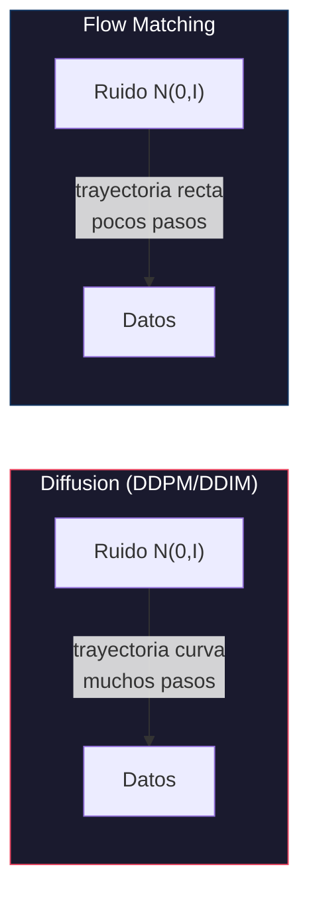
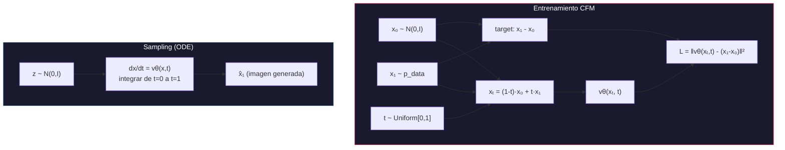
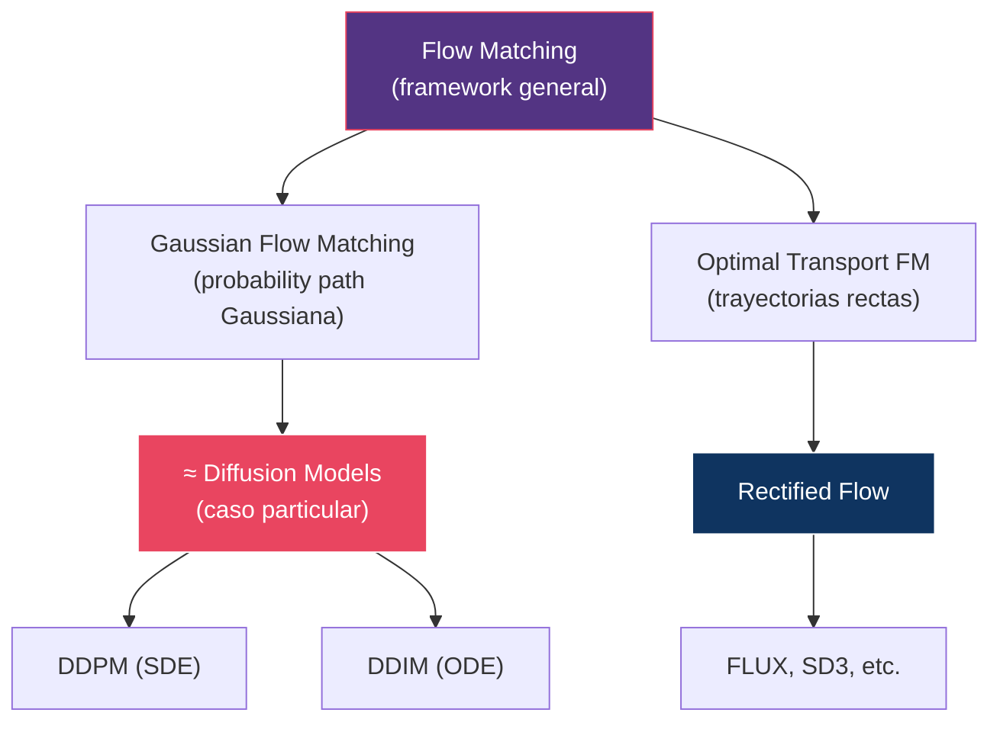
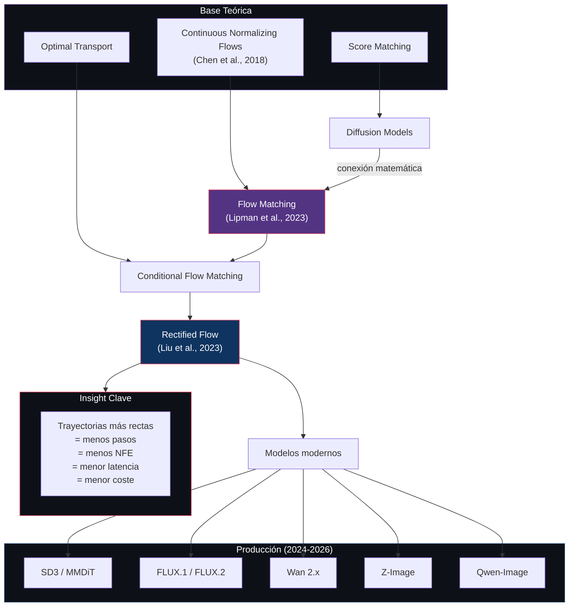

# 07 — Flow Matching y Rectified Flow

> El paradigma que reemplazó a la difusión clásica: en lugar de revertir un proceso estocástico de destrucción, aprender un campo de velocidad que transporta ruido a datos por la ruta más directa posible.

---

## Índice

1. [¿Por qué Flow Matching?](#1-por-qué-flow-matching)
2. [Formulación matemática](#2-formulación-matemática)
3. [Conditional Flow Matching (CFM)](#3-conditional-flow-matching)
4. [Rectified Flow](#4-rectified-flow)
5. [Diffusion vs Flow Matching: comparación profunda](#5-comparación)
6. [Trayectorias: curvas vs rectas](#6-trayectorias)
7. [ODE Solvers y NFE](#7-ode-solvers)
8. [Velocity prediction vs ε-prediction](#8-velocity-vs-epsilon)
9. [Modelos que usan Flow Matching](#9-modelos)
10. [Diagrama conceptual completo](#10-diagrama)

---

## 1. ¿Por qué Flow Matching?

### El problema con diffusion clásico



| Aspecto | Diffusion clásico | Flow Matching |
|:--------|:-------------------|:--------------|
| Formulación | SDE (estocástica) | ODE (determinística) |
| Trayectoria | Curva, ruidosa | Recta, directa |
| Training target | Predecir ruido ε | Predecir velocidad v |
| Pasos típicos | 20–50 (DDIM) a 1000 (DDPM) | 4–30 |
| NFE (evaluaciones del modelo) | Alto | Bajo |
| Inversión | Aproximada | Exacta |

### La intuición clave

Imagina que tienes una nube de puntos de ruido y una nube de puntos de datos. Quieres mover cada punto de ruido hacia un punto de datos.

- **Diffusion**: Cada punto hace un camino errático, como una partícula browniana
- **Flow Matching**: Cada punto va en línea recta desde ruido hasta dato

La línea recta es más fácil de seguir con menos pasos de discretización.

---

## 2. Formulación matemática

### Continuous Normalizing Flows (CNF)

Definimos un flujo continuo como un mapa `φ: [0,1] × ℝᵈ → ℝᵈ` que transporta una distribución `p₀` (ruido) a `p₁` (datos):

```
φₜ(x) = x + ∫₀ᵗ vθ(φₛ(x), s) ds
```

donde `vθ` es un campo de velocidad parametrizado por una red neuronal.

### El campo de velocidad

La red neuronal aprende `vθ(x, t)` — la "velocidad" con la que un punto `x` debería moverse en el tiempo `t`.

### Ecuación de flujo

```
dx/dt = vθ(x, t)
```

Esta es una **ODE ordinaria**, no una SDE estocástica. Es determinística y exactamente invertible.

### Distribuciones marginales

El campo de velocidad induce una secuencia de distribuciones `pₜ` que evoluciona según la **ecuación de continuidad**:

```
∂pₜ/∂t + ∇ · (pₜ · vₜ) = 0
```

---

## 3. Conditional Flow Matching

### El problema de entrenar un CNF

Entrenar directamente un CNF requiere conocer `pₜ(x)` para todo `t`, lo cual es intractable (requiere marginalizar sobre todos los datos).

### La solución: Conditional Flow Matching (CFM)

**Lipman et al. (2023)**: En lugar de aprender el campo de velocidad marginal, aprendemos un campo de velocidad **condicionado en un par (x₀, x₁)** específico.

### Probability path condicional

Definimos una interpolación lineal entre un punto de ruido `x₀ ~ N(0,I)` y un dato `x₁ ~ p_data`:

```
xₜ = (1 - t) · x₀ + t · x₁
```

### Campo de velocidad condicional

La velocidad que mueve `xₜ` a lo largo de esta línea recta es simplemente:

```
uₜ(x | x₁) = x₁ - x₀
```

Es constante en el tiempo — la dirección siempre apunta de `x₀` a `x₁`.

### Objetivo de entrenamiento

```
L_CFM(θ) = E_{t~U[0,1], x₀~N(0,I), x₁~p_data} ‖ vθ(xₜ, t) - (x₁ - x₀) ‖²
```

> **Insight**: El loss es un simple MSE entre la velocidad predicha y la dirección `x₁ - x₀`. La red aprende a predecir "hacia dónde ir" en cada punto del espacio y del tiempo.

### Resultado teórico clave

El gradiente de `L_CFM` es un **estimador insesgado** del gradiente del objetivo marginal (intractable). Esto significa que al entrenar con pares individuales, estamos optimizando el objetivo correcto.



---

## 4. Rectified Flow

### Motivación

Aunque CFM define trayectorias rectas entre pares (x₀, x₁), las trayectorias **marginales** (promediando sobre todos los pares posibles) pueden seguir siendo curvas.

**Liu et al. (2023)**: Rectified Flow propone un procedimiento iterativo para "enderezar" las trayectorias marginales.

### Procedimiento

1. **Entrenar** un modelo de flow matching inicial
2. **Generar pares** (x₀, x₁) usando el modelo entrenado (x₀ = ruido, x₁ = dato generado)
3. **Re-entrenar** con estos pares — las trayectorias se "enderezan"
4. **Repetir** si es necesario (cada iteración las trayectorias se hacen más rectas)


### ¿Por qué trayectorias más rectas son mejores?

| Trayectoria | Pasos de Euler necesarios | Error de discretización |
|:------------|:--------------------------|:-----------------------|
| Muy curva | Muchos (50-100) | Alto si pocos pasos |
| Moderadamente curva | Moderados (10-30) | Moderado |
| Recta | Muy pocos (1-8) | Bajo incluso con pocos pasos |

Una línea recta puede seguirse con un solo paso de Euler. Una curva compleja requiere muchos pasos para no "salirse" de la trayectoria.

---

## 5. Comparación profunda: Diffusion vs Flow Matching

### Tabla matemática

| Concepto | Diffusion | Flow Matching |
|:---------|:----------|:--------------|
| **Proceso forward** | `xₜ = √ᾱₜ·x₀ + √(1-ᾱₜ)·ε` | `xₜ = (1-t)·x₀ + t·x₁` |
| **Distribución** | `q(xₜ\|x₀) = N(√ᾱₜ·x₀, (1-ᾱₜ)I)` | `pₜ(x\|x₁) = N((1-t)·x₀+t·x₁, σ²I)` |
| **Training target** | `ε` (ruido añadido) | `x₁ - x₀` (velocidad) |
| **Red predice** | `εθ(xₜ, t)` | `vθ(xₜ, t)` |
| **Loss** | `‖ε - εθ‖²` | `‖(x₁-x₀) - vθ‖²` |
| **Sampling** | Reverse SDE/ODE con schedule | ODE: `dx/dt = vθ(x,t)` |
| **Tiempo** | `t ∈ {1,...,T}` discreto | `t ∈ [0,1]` continuo |
| **Schedule** | `{βₜ}` (noise schedule) | No necesario (interpolación lineal) |

### Conexión matemática

Diffusion y Flow Matching **no son tan diferentes como parecen**. Se puede demostrar que:

1. **Gaussian diffusion** es un caso especial de flow matching donde la probability path es la que define el forward process de DDPM
2. **DDIM** puede interpretarse como un ODE solver sobre un flow implícito
3. La **v-prediction** de diffusion es equivalente a la velocity prediction de flow matching (bajo cierta parametrización)



---

## 6. Trayectorias: curvas vs rectas

### Visualización conceptual

```
                DDPM (estocástico)
    x₀ ·  ·                          ·
           · ·                      ·  · x₁
              · ·                 ·
                 ·  ·  ·  ·  · ·

                DDIM (determinístico, curvo)
    x₀ ·                               ·
         ·  ·                        ·   · x₁
              ·  ·               · ·
                   ·  ·  ·  · ·

                Flow Matching (recto)
    x₀ · · · · · · · · · · · · · · · · · x₁
```

### Implicaciones prácticas

| Tipo de trayectoria | Euler con 1 paso | Euler con 4 pasos | Euler con 20 pasos |
|:--------------------|:-----------------|:------------------|:-------------------|
| DDPM (estocástica) | Inutilizable | Muy malo | Aceptable |
| DDIM (curva) | Malo | Aceptable | Bueno |
| Flow Matching (recta) | Aceptable | Bueno | Excelente |
| Rectified Flow (muy recta) | Bueno | Muy bueno | Excelente |

---

## 7. ODE Solvers y NFE

### ¿Qué es NFE?

**Number of Function Evaluations** = cuántas veces necesitamos evaluar la red neuronal para generar una muestra.

Cada evaluación del modelo es costosa (forward pass de un transformer de billones de parámetros), así que **NFE ∝ latencia ∝ coste**.

### Solvers y su NFE

| Solver | Orden | NFE por paso | Notas |
|:-------|:------|:-------------|:------|
| **Euler** | 1 | 1 | Más simple, menos preciso |
| **Heun** | 2 | 2 | Predictor-corrector |
| **Midpoint** | 2 | 2 | Evaluación en punto medio |
| **RK4** | 4 | 4 | Clásico, alta precisión |
| **DPM-Solver** | 2-3 | 1 | Especializado para difusión |
| **DPM-Solver++** | 2-3 | 1 | Mejorado para pocos pasos |

### Trade-off: pasos × orden

Para un presupuesto fijo de NFE (e.g., 20):

| Configuración | Pasos | NFE por paso | NFE total | Precisión |
|:--------------|:------|:-------------|:----------|:----------|
| Euler × 20 | 20 | 1 | 20 | Baja-Media |
| Heun × 10 | 10 | 2 | 20 | Media-Alta |
| RK4 × 5 | 5 | 4 | 20 | Alta |
| DPM-Solver++ × 20 | 20 | 1 | 20 | Alta (especializado) |

> **Insight**: Con trayectorias rectas (Flow Matching), Euler funciona sorprendentemente bien. Con trayectorias curvas (diffusion), solvers de orden superior o especializados son necesarios.

---

## 8. Velocity prediction vs ε-prediction

### Correspondencia

| Diffusion | Flow Matching | Relación |
|:----------|:-------------|:---------|
| Predecir ε (ruido) | Predecir v (velocidad) | `v = x₁ - x₀`, `ε ≈ x₀` (en flow matching, x₀ es el ruido) |
| `xₜ = √ᾱ·x₁ + √(1-ᾱ)·ε` | `xₜ = (1-t)·x₀ + t·x₁` | Parametrizaciones del mismo concepto |
| Schedule `{βₜ}` define la curva | `t ∈ [0,1]` define la línea | Schedule implícito vs explícito |

### ¿Por qué velocity prediction ganó?

1. **Estabilidad numérica**: En los extremos (t≈0, t≈1), ε-prediction tiene varianza alta. Velocity prediction es más estable.
2. **Compatibilidad con flow matching**: La velocity es el target natural de CFM.
3. **Uniformidad del loss**: El loss de velocity prediction es más uniforme a lo largo de t.

---

## 9. Modelos que usan Flow Matching

| Modelo | Año | Formulación | Detalles |
|:-------|:----|:-----------|:---------|
| **SD3 / SD 3.5** | 2024 | Rectified Flow | MMDiT, joint attention |
| **FLUX.1** | 2024 | Rectified Flow | 12B params, double/single stream blocks |
| **AuraFlow** | 2024 | Rectified Flow | 6.8B, wider-shorter design |
| **FLUX.2** | 2025 | Rectified Flow | 32B + Mistral-3 24B VLM |
| **FLUX.2 Klein** | 2026 | Rectified Flow (distilled) | Sub-second, consumer GPU |
| **Z-Image** | 2025 | Flow Matching | S3-DiT 6B, single-stream |
| **Qwen-Image** | 2025-26 | Flow Matching | LLM + MMDiT |
| **Wan 2.1/2.2** | 2025 | Flow Matching | Video, DiT + MoE |
| **LTX-Video** | 2024-26 | Flow Matching | Video, high-compression VAE |

> **Observación**: Prácticamente **todos** los modelos de producción lanzados después de 2024 usan alguna variante de flow matching. La difusión clásica (ε-prediction + noise schedule) ha quedado relegada a modelos legacy.

---

## 10. Diagrama conceptual completo



---

## Referencias

- Lipman, Y. et al. (2023). *Flow Matching for Generative Modeling*. ICLR.
- Liu, X. et al. (2023). *Flow Straight and Fast: Learning to Generate and Transfer Data with Rectified Flow*. ICLR.
- Chen, R.T.Q. et al. (2018). *Neural Ordinary Differential Equations*. NeurIPS.
- Albergo, M. & Vanden-Eijnden, E. (2023). *Building Normalizing Flows with Stochastic Interpolants*. ICLR.
- Esser, P. et al. (2024). *Scaling Rectified Flow Transformers for High-Resolution Image Synthesis*. ICML.
- Holderrieth, P. et al. (2025). *An Introduction to Flow Matching and Diffusion Models*.

---

*← [06 — Arquitecturas](../06-architectures/README.md) | [08 — Sampling →](../08-sampling/README.md)*
