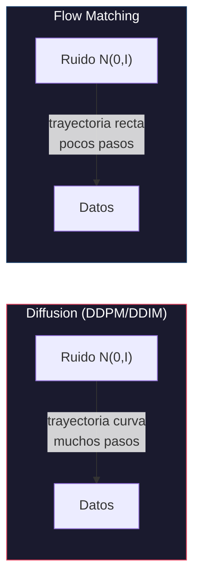
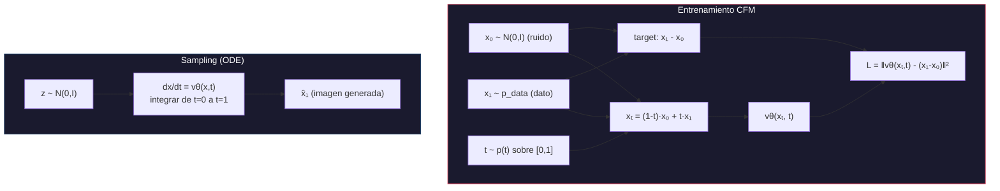
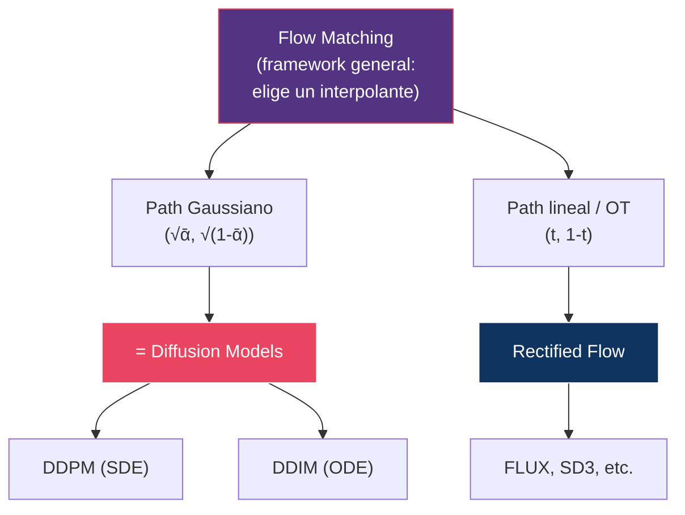
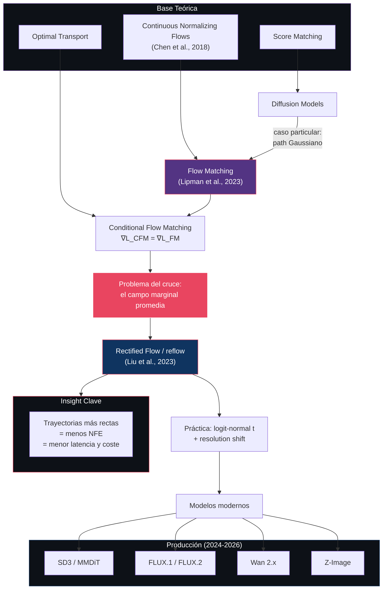

# 07 — Flow Matching y Rectified Flow

> El paradigma que reemplazó a la difusión clásica: en lugar de revertir un proceso estocástico de destrucción, aprender un campo de velocidad que transporta ruido a datos por la ruta más directa posible.

---

## Índice

1. [¿Por qué Flow Matching?](#1-por-qué-flow-matching)
2. [Convención de tiempo](#2-convención-de-tiempo)
3. [Formulación matemática](#3-formulación-matemática)
4. [Conditional Flow Matching (CFM)](#4-conditional-flow-matching-cfm)
5. [Rectified Flow y el problema del cruce](#5-rectified-flow-y-el-problema-del-cruce)
6. [Timestep sampling y shift](#6-timestep-sampling-y-shift)
7. [Diffusion vs Flow Matching](#7-diffusion-vs-flow-matching)
8. [Trayectorias: curvas vs rectas](#8-trayectorias-curvas-vs-rectas)
9. [ODE Solvers y NFE](#9-ode-solvers-y-nfe)
10. [Velocity prediction vs ε-prediction](#10-velocity-prediction-vs-ε-prediction)
11. [Modelos que usan Flow Matching](#11-modelos-que-usan-flow-matching)
12. [Diagrama conceptual completo](#12-diagrama-conceptual-completo)

---

## 1. ¿Por qué Flow Matching?

### El problema con diffusion clásico



| Aspecto | Diffusion clásico | Flow Matching |
|:--------|:-------------------|:--------------|
| Formulación | SDE (estocástica) | ODE (determinística) |
| Trayectoria | Curva | Recta por par; casi recta tras reflow |
| Training target | Predecir ruido ε | Predecir velocidad v |
| Pasos típicos | 20–50 (DDIM) a 1000 (DDPM) | 4–30 |
| NFE | Alto | Bajo |
| Inversión | Aproximada (error de discretización) | Aproximada, pero **con menos error** |

> ⚠️ **Corrección frecuente**: se dice que la inversión en Flow Matching es «exacta». No lo es. Es una integración numérica de una ODE, igual que la inversión DDIM ([03 §6](../03-ddim/README.md#6-ddim-inversion)), y acumula el mismo tipo de error de discretización. Lo que cambia es la **magnitud**: una trayectoria recta se integra con mucho menos error que una curva. Exacta solo en el límite de paso infinitesimal.

### La intuición clave

Tienes una nube de puntos de ruido y una nube de puntos de datos. Quieres mover cada punto de ruido hasta un punto de datos.

- **Diffusion**: cada punto recorre un camino curvo determinado por el noise schedule
- **Flow Matching**: cada punto va en línea recta

Una recta se sigue con un solo paso de Euler sin error. Una curva necesita muchos pasos para no salirse.

---

## 2. Convención de tiempo

Antes de nada, porque es la fuente número uno de confusión al leer código y papers de este área:

| Convención | t = 0 | t = 1 | Usada por |
|:-----------|:------|:------|:----------|
| **Flow Matching (esta guía)** | Ruido | Datos | Lipman et al., Liu et al. |
| **Diffusion** | Datos (`x₀`) | Ruido (`x_T`) | DDPM, DDIM, [01](../01-foundations/)–[05](../05-latent-diffusion/) |
| **SD3 / diffusers** | Datos | Ruido | Implementaciones de producción |

> **En este módulo**: `x₀` es **ruido** y `x₁` son **datos**. Es exactamente al revés que en los módulos 01–05, donde `x₀` es la imagen limpia. Cada vez que se cruzan las dos notaciones aquí se indica explícitamente.

---

## 3. Formulación matemática

### Continuous Normalizing Flows (CNF)

Un flujo continuo es un mapa `φ: [0,1] × ℝᵈ → ℝᵈ` que transporta `p₀` (ruido) a `p₁` (datos):

```
φₜ(x) = x + ∫₀ᵗ vθ(φₛ(x), s) ds
```

donde `vθ` es un campo de velocidad parametrizado por una red neuronal.

### Ecuación de flujo

```
dx/dt = vθ(x, t)
```

Una **ODE**, no una SDE. Determinística y reversible en el límite continuo.

### Distribuciones marginales

El campo de velocidad induce una familia `pₜ` que evoluciona según la **ecuación de continuidad**:

```
∂pₜ/∂t + ∇ · (pₜ · vₜ) = 0
```

Esta ecuación es la que conecta «mover puntos» con «transformar distribuciones»: si el campo `vₜ` transporta las partículas, la densidad se conserva y fluye con ellas.

---

## 4. Conditional Flow Matching (CFM)

### El problema de entrenar un CNF

El objetivo ideal sería regresar el campo de velocidad **marginal** `uₜ(x)`:

```
L_FM(θ) = E_{t, x~pₜ} ‖ vθ(x, t) - uₜ(x) ‖²
```

Pero `uₜ(x)` es intratable: requiere marginalizar sobre todos los datos, igual que la posterior de DDPM ([02 §2](../02-ddpm/README.md#2-formulación-matemática)).

### La solución

**Lipman et al. (2023)**: condicionar. En lugar del campo marginal, regresar el campo **condicionado a un par concreto**.

Interpolación lineal entre un punto de ruido `x₀ ~ N(0,I)` y un dato `x₁ ~ p_data`:

```
xₜ = (1 - t) · x₀ + t · x₁
```

La velocidad a lo largo de esa recta es la derivada temporal, **constante en t**:

```
uₜ(xₜ | x₀, x₁) = dxₜ/dt = x₁ - x₀
```

> **Nota de notación**: el campo condicional se escribe a veces `uₜ(x|x₁)`, condicionando solo al dato. En esa forma, para el camino de transporte óptimo, `uₜ(x|x₁) = (x₁ - x)/(1 - t)`. Las dos expresiones coinciden al sustituir `x = xₜ`. Escribir `uₜ(x|x₁) = x₁ - x₀` es un abuso de notación: el miembro derecho depende de `x₀`, así que el condicionamiento es sobre **el par**.

### Objetivo de entrenamiento

```
L_CFM(θ) = E_{t~U[0,1], x₀~N(0,I), x₁~p_data} ‖ vθ(xₜ, t) - (x₁ - x₀) ‖²
```

Un MSE contra una dirección constante. Nada más.

### Resultado teórico clave

`∇θ L_CFM = ∇θ L_FM`

Los dos objetivos tienen **el mismo gradiente**, aunque sus valores difieran en una constante. Entrenar contra pares individuales optimiza exactamente el campo marginal intratable.

La intuición: el minimizador de un MSE es la esperanza condicional, así que

```
vθ*(x, t) = E[ x₁ - x₀ | xₜ = x ]
```

La red aprende **el promedio de todas las velocidades que pasan por ese punto**. Este hecho — que el campo aprendido es una media — es exactamente lo que explica la sección siguiente.



---

## 5. Rectified Flow y el problema del cruce

### Por qué las trayectorias marginales salen curvas

Cada par `(x₀, x₁)` define una recta. Pero **las rectas se cruzan**: dos pares distintos pueden pasar por el mismo punto `x` en el mismo instante `t`, con velocidades diferentes.

```
   Dos pares independientes, sus rectas se cruzan en P:

   x₀^A ●────────────╲                  ╱────────────● x₁^A
                       ╲              ╱
                         ╲          ╱
                           ╲      ╱
                             ╲  ╱
                              P ●   ← aquí conviven dos velocidades
                             ╱  ╲
                           ╱      ╲
                         ╱          ╲
   x₀^B ●──────────────╱              ╲──────────────● x₁^B


   El campo aprendido en P es el PROMEDIO de ambas.
   Una media de direcciones distintas no apunta a ninguna
   de las dos → la trayectoria real se curva.
```

Como `vθ*(x,t) = E[x₁ - x₀ | xₜ = x]`, en un cruce la red **no puede** hacer otra cosa que promediar. La curvatura marginal no es un defecto del entrenamiento: es una consecuencia matemática de que el emparejamiento inicial ruido↔dato es **aleatorio e independiente**.

### La solución: reflow

**Liu et al. (2023)** proponen re-emparejar. Si en lugar de parejas aleatorias usamos las parejas que **el propio modelo ya conecta**, los cruces desaparecen.

1. **Entrenar** un flow matching inicial con emparejamiento aleatorio → *1-rectified flow*
2. **Generar pares**: integrar la ODE desde muchos `x₀` y guardar los `(x₀, x̂₁)` resultantes
3. **Re-entrenar** desde cero con esos pares → *2-rectified flow*
4. **Repetir** si compensa


**Dos propiedades que hacen que esto funcione**:

| Propiedad | Qué garantiza |
|:----------|:--------------|
| **Preserva las marginales** | El reflow no cambia `p₀` ni `p₁`. La distribución generada es la misma; solo cambia qué ruido va a qué dato. |
| **No aumenta el coste de transporte** | Cada iteración reduce (o mantiene) el coste de transporte para cualquier función convexa. Las trayectorias solo pueden mejorar. |

> ⚠️ **Distinción importante**: **reflow ≠ distillation**. El reflow endereza y mantiene la calidad multi-paso. Los resultados de **un solo paso** de Rectified Flow provienen de **destilar** el modelo enderezado, que es un paso adicional y con pérdida. Ver [10 — Distillation](../10-distillation/README.md).

### ¿Por qué trayectorias más rectas son mejores?

| Trayectoria | Pasos de Euler necesarios | Error de discretización |
|:------------|:--------------------------|:-----------------------|
| Muy curva | Muchos (50-100) | Alto con pocos pasos |
| Moderadamente curva | Moderados (10-30) | Moderado |
| Recta | Muy pocos (1-8) | Bajo incluso con pocos pasos |

Una recta se integra **exactamente** con un paso de Euler, porque la velocidad es constante. Todo el error de un sampler de pocos pasos viene de la curvatura.

---

## 6. Timestep sampling y shift

La parte práctica que decide si un modelo de flow matching funciona o no, y que suele quedar fuera de las explicaciones teóricas.

### El muestreo uniforme de t es subóptimo

`L_CFM` muestrea `t ~ U[0,1]`. Pero los timesteps no son igual de difíciles ni de informativos: en los extremos (`t≈0`, `t≈1`) la tarea es casi trivial, mientras que en la zona intermedia es donde se decide la estructura de la imagen.

**SD3** muestrea `t` de una **logit-normal** en lugar de uniforme:

```
u ~ N(m, s²)          →          t = σ(u) = 1/(1+e^{-u})
```

Esto concentra las muestras en el centro de [0,1] y deja los extremos poco representados. Es el análogo directo del weighting de SNR de [01 §7](../01-foundations/README.md#7-parametrizaciones): flow matching no elimina el problema de ponderación, lo traslada de la forma del schedule a la **distribución de muestreo de t**.

### Resolution shift

Un mismo nivel de ruido destruye **menos** información en una imagen grande que en una pequeña, porque hay más redundancia espacial que sobrevive. Un modelo entrenado a 256² aplicado a 1024² resulta, en la práctica, poco ruidoso para los t altos.

La corrección es desplazar el schedule de tiempo según la resolución:

```
t_shifted = (s · t) / (1 + (s - 1) · t)
```

con `s > 1` creciente con el número de tokens. Desplaza masa hacia los niveles de ruido altos.

> **Consecuencia para [01 §5](../01-foundations/README.md#5-noise-schedules)**: la afirmación «Flow Matching no necesita schedule» es cierta solo en cuanto a *schedule de ruido*. La elección de `p(t)` y del shift cumple exactamente el mismo papel, y hay que ajustarla igual.

---

## 7. Diffusion vs Flow Matching

### Tabla matemática

> Recordatorio de [§2](#2-convención-de-tiempo): en la columna de Diffusion, `x₀` = **datos**. En la de Flow Matching, `x₀` = **ruido**. Para evitar el choque, aquí se escribe `x_data` y `x_noise`.

| Concepto | Diffusion | Flow Matching |
|:---------|:----------|:--------------|
| **Interpolante** | `xₜ = √ᾱₜ·x_data + √(1-ᾱₜ)·x_noise` | `xₜ = (1-t)·x_noise + t·x_data` |
| **Coeficientes** | `(√ᾱₜ, √(1-ᾱₜ))`, suma de cuadrados = 1 | `(t, 1-t)`, suma = 1 |
| **Geometría** | Arco de circunferencia | Segmento recto |
| **Training target** | `x_noise` | `x_data - x_noise` |
| **Red predice** | `εθ(xₜ, t)` | `vθ(xₜ, t)` |
| **Loss** | `‖x_noise - εθ‖²` | `‖(x_data - x_noise) - vθ‖²` |
| **Sampling** | Reverse SDE u ODE con schedule | ODE: `dx/dt = vθ(x,t)` |
| **Tiempo** | `t ∈ {1,...,T}` discreto | `t ∈ [0,1]` continuo |
| **Lo que hay que ajustar** | Noise schedule `{βₜ}` + weighting | Distribución `p(t)` + shift ([§6](#6-timestep-sampling-y-shift)) |

La fila de geometría es la diferencia esencial: **difusión interpola sobre un círculo, flow matching sobre una recta**. Todo lo demás se deriva de ahí.

### Conexión matemática

Flow Matching y diffusion **no son marcos rivales**; son la misma construcción con distinto interpolante.

1. **Gaussian diffusion es un caso particular de flow matching**: basta elegir el probability path `(√ᾱₜ, √(1-ᾱₜ))` en vez del lineal.
2. **DDIM es un ODE solver** sobre el flujo implícito de ese path ([03 §5](../03-ddim/README.md#5-ddim-como-ode)).
3. **Las cuatro parametrizaciones son inter-convertibles**: dados `xₜ` y los coeficientes del interpolante, `{x_data, x_noise, v, velocidad}` se determinan mutuamente por álgebra lineal ([01 §7](../01-foundations/README.md#7-parametrizaciones)).

> ⚠️ **Matiz sobre v-prediction**: la `v` de Salimans & Ho (`v = √ᾱ·ε − √(1-ᾱ)·x_data`) y la velocidad de flow matching (`x_data − x_noise`) **no son la misma cantidad**. Son combinaciones lineales distintas de la misma base `{x_data, x_noise}`, sobre paths distintos. Son inter-convertibles, no idénticas. Decir que son «equivalentes» sin más es impreciso.



---

## 8. Trayectorias: curvas vs rectas

### Visualización conceptual

```
                DDPM (estocástico)
    x₀ ·  ·                          ·
           · ·                      ·  · x₁
              · ·                 ·
                 ·  ·  ·  ·  · ·

                DDIM (determinístico, curvo)
    x₀ ·                               ·
         ·  ·                        ·   · x₁
              ·  ·               · ·
                   ·  ·  ·  · ·

                Flow Matching (recto por par)
    x₀ · · · · · · · · · · · · · · · · · x₁
```

### Implicaciones prácticas

| Tipo de trayectoria | Euler 1 paso | Euler 4 pasos | Euler 20 pasos |
|:--------------------|:-------------|:--------------|:---------------|
| DDPM (estocástica) | Inutilizable | Muy malo | Aceptable |
| DDIM (curva) | Malo | Aceptable | Bueno |
| Flow Matching (recta por par, marginal curva) | Aceptable | Bueno | Excelente |
| Rectified Flow tras reflow | Bueno | Muy bueno | Excelente |

> Nota: la fila de Flow Matching se refiere al modelo **sin reflow**. Sus trayectorias son rectas por par pero el campo marginal aprendido sigue siendo curvo por el problema del cruce ([§5](#5-rectified-flow-y-el-problema-del-cruce)). El salto real de calidad en pocos pasos lo da el reflow, no el interpolante lineal por sí solo.

---

## 9. ODE Solvers y NFE

### ¿Qué es NFE?

**Number of Function Evaluations** = cuántas veces hay que evaluar la red para generar una muestra.

Cada evaluación es un forward pass de un transformer de miles de millones de parámetros, así que **NFE ∝ latencia ∝ coste**. Es la métrica que de verdad importa, no el «número de pasos».

### Solvers y su NFE

| Solver | Orden | NFE por paso | Notas |
|:-------|:------|:-------------|:------|
| **Euler** | 1 | 1 | El más simple; óptimo si la trayectoria es recta |
| **Heun** | 2 | 2 | Predictor-corrector; el sampler por defecto de EDM |
| **Midpoint** | 2 | 2 | Evaluación en el punto medio |
| **RK4** | 4 | 4 | Clásico, alta precisión, caro |
| **DPM-Solver (2S/3S)** | 2-3 | 2-3 | *Singlestep*: varias evaluaciones por paso |
| **DPM-Solver++ (2M)** | 2 | **1** | *Multistep*: reutiliza la evaluación del paso anterior |
| **UniPC** | 2-3 | ~1 | Corrector unificado, multistep |

> ⚠️ **Corrección frecuente**: se atribuye a DPM-Solver «orden 2-3 con 1 NFE por paso». Solo es cierto para las variantes **multistep** (`2M`, `3M`), que consiguen orden alto reutilizando evaluaciones anteriores, como un método de Adams. Las variantes **singlestep** (`2S`, `3S`) gastan 2 o 3 NFE por paso.

### Trade-off: pasos × orden

Para un presupuesto fijo de NFE = 20:

| Configuración | Pasos | NFE/paso | NFE total | Cuándo conviene |
|:--------------|:------|:---------|:----------|:----------------|
| Euler × 20 | 20 | 1 | 20 | Trayectorias rectas (post-reflow) |
| Heun × 10 | 10 | 2 | 20 | Trayectorias curvas, presupuesto medio |
| RK4 × 5 | 5 | 4 | 20 | Rara vez óptimo: pocos pasos, mucho coste |
| DPM-Solver++(2M) × 20 | 20 | 1 | 20 | Difusión con pocos pasos |

> **Insight**: el orden del solver y la rectitud de la trayectoria son **sustitutivos**. Enderezar la trayectoria en el entrenamiento (reflow) o compensar la curvatura en la inferencia (solver de orden alto) atacan el mismo error. Flow matching apuesta por lo primero, que es gratis en inferencia. Detalle en [08 — Sampling](../08-sampling/README.md).

---

## 10. Velocity prediction vs ε-prediction

### Correspondencia

| Diffusion | Flow Matching |
|:----------|:-------------|
| `xₜ = √ᾱₜ·x_data + √(1-ᾱₜ)·x_noise` | `xₜ = t·x_data + (1-t)·x_noise` |
| Predecir `x_noise` (el ruido) | Predecir `x_data − x_noise` (la velocidad) |
| Schedule `{βₜ}` define la curva | El interpolante lineal define la recta |

### ¿Por qué velocity prediction se impuso?

1. **No degenera en los extremos.** Con ε-prediction, recuperar `x_data = (xₜ − √(1-ᾱₜ)·ε)/√ᾱₜ` divide por `√ᾱₜ`, que tiende a cero al final del proceso. Con zero-terminal-SNR la operación es directamente indefinida ([01 §6](../01-foundations/README.md#6-snr)). La velocidad está bien condicionada en todo `t ∈ [0,1]`.
2. **Ponderación más equilibrada del loss.** En espacio-ε, el peso implícito de v-prediction es `1 + 1/SNR` — acotado por debajo por 1, sin la divergencia de x₀-prediction ni la de score ([01 §7](../01-foundations/README.md#7-parametrizaciones)).
3. **Es el target nativo de CFM**, así que no hay conversión que introduzca factores dependientes de t.

> Lo que **no** es una razón válida: «ε-prediction tiene varianza alta en los extremos». El problema no es la varianza del target sino el **mal condicionamiento de la conversión** a `x_data`.

---

## 11. Modelos que usan Flow Matching

| Modelo | Año | Formulación | Detalles |
|:-------|:----|:-----------|:---------|
| **SD3 / SD 3.5** | 2024 | Rectified Flow | MMDiT, logit-normal timestep sampling |
| **FLUX.1** | 2024 | Rectified Flow | 12B, bloques dual + single stream |
| **AuraFlow** | 2024 | Rectified Flow | 6.8B |
| **FLUX.2** | 2025 | Rectified Flow | VLM-coupled |
| **Z-Image** | 2025 | Flow Matching | S3-DiT single-stream |
| **Qwen-Image** | 2025-26 | Flow Matching | LLM + MMDiT |
| **Wan 2.1 / 2.2** | 2025 | Flow Matching | Vídeo, DiT + MoE |
| **LTX-Video** | 2024-26 | Flow Matching | Vídeo, VAE de alta compresión |

> ⚠️ Especificaciones pendientes de contrastar con [16 — Image Models](../16-image-models/README.md) y [17 — Video Models](../17-video-models/README.md).

> **Sobre la adopción**: flow matching es el estándar en los modelos **nuevos** de frontera desde 2024. Conviene no exagerar la conclusión: SD 1.5 y SDXL — ε-prediction clásica — siguen siendo enormemente usados en producción en 2026, por el ecosistema de LoRAs, ControlNets y herramientas construido a su alrededor. Lo que cambió es dónde se entrena lo nuevo, no lo que se ejecuta en todas partes.

---

## 12. Diagrama conceptual completo



---

## Referencias

- Lipman, Y., Chen, R.T.Q., Ben-Hamu, H., Nickel, M., & Le, M. (2023). *Flow Matching for Generative Modeling*. ICLR 2023. — **CFM.**
- Liu, X., Gong, C., & Liu, Q. (2023). *Flow Straight and Fast: Learning to Generate and Transfer Data with Rectified Flow*. ICLR 2023. — **Rectified Flow, reflow.**
- Chen, R.T.Q., Rubanova, Y., Bettencourt, J., & Duvenaud, D. (2018). *Neural Ordinary Differential Equations*. NeurIPS 2018. — CNF.
- Albergo, M. & Vanden-Eijnden, E. (2023). *Building Normalizing Flows with Stochastic Interpolants*. ICLR 2023. — Formulación paralela.
- Esser, P. et al. (2024). *Scaling Rectified Flow Transformers for High-Resolution Image Synthesis*. ICML 2024. — **SD3: logit-normal sampling y resolution shift ([§6](#6-timestep-sampling-y-shift)).**
- Karras, T., Aittala, M., Aila, T., & Laine, S. (2022). *Elucidating the Design Space of Diffusion-Based Generative Models*. NeurIPS 2022. — EDM; sampler de Heun.
- Lu, C. et al. (2022). *DPM-Solver++: Fast Solver for Guided Sampling of Diffusion Probabilistic Models*. — Variantes singlestep vs multistep ([§9](#9-ode-solvers-y-nfe)).
- Holderrieth, P. et al. (2025). *An Introduction to Flow Matching and Diffusion Models*.

---

*← [06 — Arquitecturas](../06-architectures/README.md) | [08 — Sampling →](../08-sampling/README.md)*
