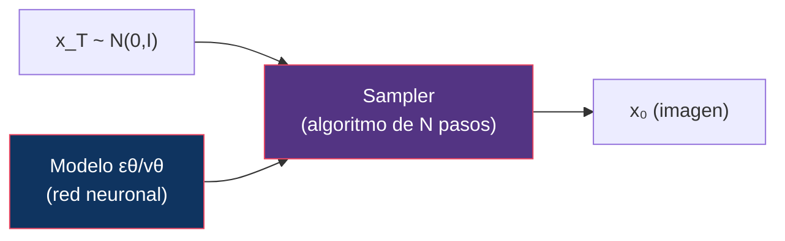
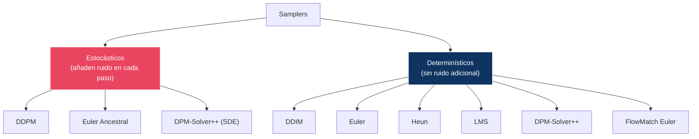
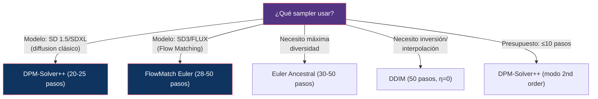

# 08 — Sampling: Solvers y Schedulers

> La pregunta experimental central: ¿cuánta calidad podemos conservar mientras reducimos el número de evaluaciones del modelo?

---

## Índice

1. [¿Qué es un sampler?](#1-qué-es-un-sampler)
2. [Taxonomía de samplers](#2-taxonomía)
3. [Samplers principales](#3-samplers)
4. [Comparación bajo condiciones idénticas](#4-comparación)
5. [NFE vs calidad](#5-nfe-vs-calidad)
6. [Noise schedules para sampling](#6-noise-schedules)
7. [Diseño experimental: sampler comparison](#7-diseño-experimental)

---

## 1. ¿Qué es un sampler?

Un sampler (o scheduler/solver) es el algoritmo que controla cómo se avanza desde ruido puro `x_T` hasta una imagen limpia `x₀`. Es el algoritmo que "resuelve" la ecuación diferencial (ODE o SDE) definida por el modelo.



> El modelo (U-Net, DiT) se entrena **una vez**. El sampler se elige en **inferencia** y puede cambiarse libremente.

---

## 2. Taxonomía de samplers



| Tipo | Diversidad | Consistencia | Pasos mínimos | Modelo típico |
|:-----|:-----------|:-------------|:-------------|:-------------|
| Estocástico | Alta | Baja | 20-50+ | DDPM, SD 1.5 |
| Determinístico | Menor | Alta | 4-30 | DDIM, FLUX, SD3 |

---

## 3. Samplers principales

### DDPM (Ancestral)

```
xₜ₋₁ = 1/√αₜ · (xₜ - βₜ/√(1-ᾱₜ) · εθ(xₜ,t)) + √β̃ₜ · z,   z ~ N(0,I)
```

| Propiedad | Valor |
|:----------|:------|
| Tipo | Estocástico |
| Orden | 1 |
| NFE/paso | 1 |
| Pasos recomendados | 50-1000 |
| Fortaleza | Máxima diversidad |
| Debilidad | Muy lento |

### DDIM

```
xₜ₋₁ = √ᾱₜ₋₁ · pred_x₀ + √(1-ᾱₜ₋₁-σ²) · pred_dir + σ · z
```

Con η=0 (determinístico): σ = 0, z se elimina.

| Propiedad | Valor |
|:----------|:------|
| Tipo | Determinístico (η=0) o estocástico (η>0) |
| Orden | 1 |
| NFE/paso | 1 |
| Pasos recomendados | 20-50 |
| Fortaleza | Aceleración, inversión, interpolación |
| Debilidad | Calidad inferior a solvers de orden superior |

### Euler

Solver ODE de primer orden:

```
xₜ₋ₐₜ = xₜ + Δt · vθ(xₜ, t)
```

| Propiedad | Valor |
|:----------|:------|
| Tipo | Determinístico |
| Orden | 1 |
| NFE/paso | 1 |
| Pasos recomendados | 20-50 |
| Fortaleza | Simple, robusto, estándar para Flow Matching |
| Debilidad | Baja precisión con pocos pasos |

### Euler Ancestral

Euler + ruido estocástico en cada paso.

| Propiedad | Valor |
|:----------|:------|
| Tipo | Estocástico |
| Orden | 1 |
| NFE/paso | 1 |
| Pasos recomendados | 20-50 |
| Fortaleza | Más diversidad que Euler determinístico |
| Debilidad | Menos consistente |

### Heun (Improved Euler)

Predictor-corrector de segundo orden:

```
x̃ₜ₋ₐₜ = xₜ + Δt · vθ(xₜ, t)                    // predicción
xₜ₋ₐₜ = xₜ + Δt/2 · (vθ(xₜ, t) + vθ(x̃, t-Δt))  // corrección
```

| Propiedad | Valor |
|:----------|:------|
| Tipo | Determinístico |
| Orden | 2 |
| NFE/paso | **2** |
| Pasos recomendados | 10-25 |
| Fortaleza | Mejor calidad por paso que Euler |
| Debilidad | 2× coste por paso (2 evaluaciones del modelo) |

### DPM-Solver / DPM-Solver++

Solver especializado para ecuaciones de difusión (Lu et al., 2022):

| Propiedad | Valor |
|:----------|:------|
| Tipo | Determinístico (ODE) o estocástico (SDE) |
| Orden | 2-3 (configurable) |
| NFE/paso | 1 (usa evaluaciones previas) |
| Pasos recomendados | 15-25 |
| Fortaleza | Excelente calidad con pocos pasos, reutiliza evaluaciones |
| Debilidad | Más complejo de implementar |

> **DPM-Solver++ es el solver por defecto** de muchas implementaciones (Diffusers, ComfyUI) para modelos basados en difusión clásica (SD 1.5, SDXL).

### LMS (Linear Multi-Step)

Usa múltiples evaluaciones pasadas para extrapolar:

| Propiedad | Valor |
|:----------|:------|
| Tipo | Determinístico |
| Orden | Variable (típicamente 4) |
| NFE/paso | 1 (usa historia) |
| Pasos recomendados | 20-50 |
| Fortaleza | Buen balance calidad/velocidad |
| Debilidad | Inestable con muy pocos pasos |

### FlowMatch Euler

Euler adaptado para Flow Matching (trayectorias rectas):

```
xₜ₋ₐₜ = xₜ + Δt · vθ(xₜ, t)
```

La misma fórmula que Euler, pero aplicada en el framework de Flow Matching donde t ∈ [0,1] y las trayectorias son más rectas.

| Propiedad | Valor |
|:----------|:------|
| Tipo | Determinístico |
| Orden | 1 |
| NFE/paso | 1 |
| Pasos recomendados | 20-50 (base), 1-4 (distilled) |
| Fortaleza | **Estándar para modelos modernos** (SD3, FLUX) |
| Debilidad | Menos preciso que solvers de orden superior |

> **Pero**: Con trayectorias suficientemente rectas (rectified flow), Euler es altamente efectivo incluso con pocos pasos.

---

## 4. Comparación bajo condiciones idénticas

### Tabla comparativa

| Sampler | 10 pasos | 20 pasos | 50 pasos | Calidad/NFE |
|:--------|:---------|:---------|:---------|:------------|
| DDPM | ✗ (inutilizable) | Pobre | Aceptable | Baja |
| DDIM | Aceptable | Buena | Muy buena | Media |
| Euler | Aceptable | Buena | Muy buena | Media |
| Euler Ancestral | Aceptable | Buena | Buena | Media |
| Heun | Buena (20 NFE) | Muy buena (40 NFE) | Excelente (100 NFE) | Alta |
| DPM-Solver++ | **Buena** | **Muy buena** | Excelente | **Alta** |
| LMS | Media | Buena | Muy buena | Media |
| FlowMatch Euler | Buena* | Muy buena* | Excelente* | Alta* |

*Con modelos entrenados con Flow Matching (trayectorias rectas).

### Diagrama de decisión



---

## 5. NFE vs calidad

### La pregunta central

```
¿Cuántas evaluaciones del modelo (NFE) necesitamos para una calidad aceptable?
```

| NFE | Factibilidad | Técnica necesaria |
|:----|:-------------|:-----------------|
| 1000 | DDPM original | Ninguna (brute force) |
| 50 | DDIM, DPM-Solver | Solver eficiente |
| 20-30 | SD3, FLUX.1 dev | Flow Matching + solver eficiente |
| 4-8 | FLUX.1 schnell | Flow Matching + **distillation** |
| 1-2 | Consistency models | **Distillation agresiva** |

### Relación NFE-calidad según paradigma

```
Calidad
  │
  │  ████████████████████  ← Flow Matching (plateau rápido)
  │  ███████████████
  │  ██████████           ← Diffusion + DPM-Solver++
  │  ████████
  │  ████
  │  ███                  ← Diffusion + Euler
  │  ██
  │  █
  └──────────────────────── NFE
  1   4   10  20  50  100
```

---

## 6. Noise schedules para sampling

El schedule de timesteps durante sampling también afecta la calidad:

| Schedule de timesteps | Descripción | Uso |
|:---------------------|:-----------|:----|
| Uniform | Espaciado uniforme en [1, T] | Simple, baseline |
| Trailing | Más pasos en timesteps bajos (detalle) | Mejora detalles finos |
| Leading | Más pasos en timesteps altos (composición) | Mejora estructura global |
| Karras | Spacing con σ siguiendo la propuesta de Karras et al. | Popular en DPM-Solver++ |
| AYS (Align Your Steps) | Optimizado para distribución de timesteps | Mejor calidad/NFE |

---

## 7. Diseño experimental: sampler comparison

```
╔════════════════════════════════════════════════════════════╗
║  Experimento I: Scheduler Comparison                       ║
╠════════════════════════════════════════════════════════════╣
║                                                            ║
║  Hipótesis: Para un modelo dado y un presupuesto fijo      ║
║  de NFE, el solver óptimo depende de si el modelo fue      ║
║  entrenado con diffusion o flow matching.                   ║
║                                                            ║
║  Modelo A: SDXL (diffusion, ε/v-prediction)                ║
║  Modelo B: FLUX.1 (flow matching, velocity)                ║
║                                                            ║
║  Samplers: DDIM, Euler, Euler-a, Heun, DPM-Solver++,      ║
║            LMS, FlowMatch Euler                             ║
║                                                            ║
║  NFE fijos: {10, 20, 30, 50}                               ║
║                                                            ║
║  Variables controladas:                                    ║
║    - Mismo prompt set (10 prompts diversos)                ║
║    - Misma seed (42)                                       ║
║    - Misma resolución (1024×1024)                          ║
║    - CFG scale fijo (7.5 para SDXL, 3.5 para FLUX)        ║
║                                                            ║
║  Métricas:                                                 ║
║    - CLIPScore (prompt adherence)                          ║
║    - Aesthetic score (calidad percibida)                    ║
║    - LPIPS entre 10 seeds (diversidad)                     ║
║    - Presencia de artefactos (manual, binario)              ║
║                                                            ║
║  Resultado esperado:                                       ║
║    SDXL: DPM-Solver++ > DDIM > Euler > DDPM               ║
║    FLUX: FlowMatch Euler ≈ Euler >> DPM-Solver++ (N/A)     ║
║    Con <10 NFE: Heun es competitivo pero costoso           ║
╚════════════════════════════════════════════════════════════╝
```

---

## Referencias

- Lu, C. et al. (2022). *DPM-Solver: A Fast ODE Solver for Diffusion Probabilistic Model Sampling in Around 10 Steps*. NeurIPS.
- Lu, C. et al. (2023). *DPM-Solver++: Fast Solver for Guided Sampling of Diffusion Probabilistic Models*.
- Karras, T. et al. (2022). *Elucidating the Design Space of Diffusion-Based Generative Models*. NeurIPS.
- Song, J. et al. (2021). *Denoising Diffusion Implicit Models*. ICLR.

---

*← [07 — Flow Matching](../07-flow-matching/README.md) | [09 — Guidance →](../09-guidance/README.md)*
