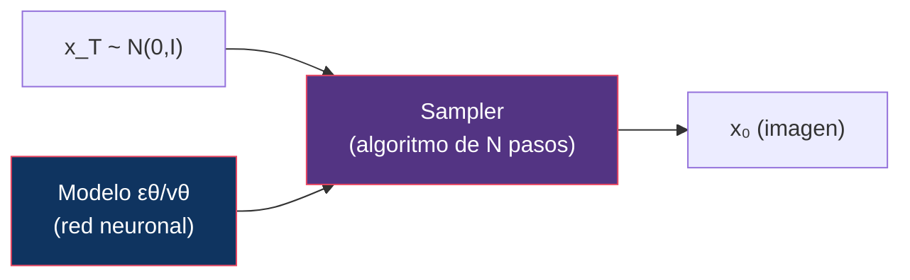
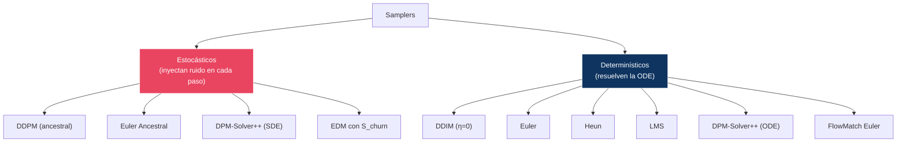
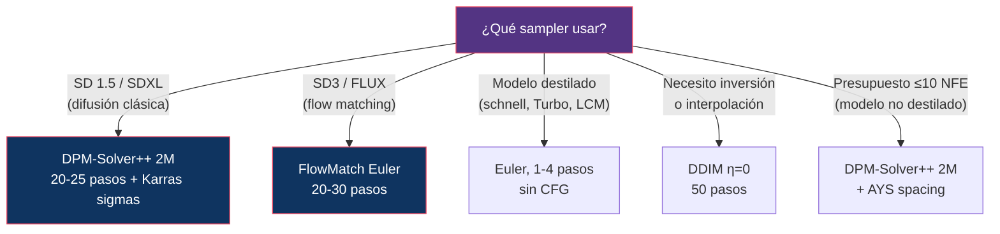

# 08 — Sampling: Solvers y Schedulers

> La pregunta experimental central: ¿cuánta calidad podemos conservar mientras reducimos el número de evaluaciones del modelo?

---

## Índice

1. [¿Qué es un sampler?](#1-qué-es-un-sampler)
2. [Las tres cosas que se suelen confundir](#2-las-tres-cosas-que-se-suelen-confundir)
3. [Taxonomía de samplers](#3-taxonomía-de-samplers)
4. [Samplers principales](#4-samplers-principales)
5. [Comparación bajo condiciones idénticas](#5-comparación-bajo-condiciones-idénticas)
6. [NFE vs calidad](#6-nfe-vs-calidad)
7. [Timestep spacing y sigma schedules](#7-timestep-spacing-y-sigma-schedules)
8. [Diseño experimental: sampler comparison](#8-diseño-experimental-sampler-comparison)

---

## 1. ¿Qué es un sampler?

Un sampler (o scheduler/solver) es el algoritmo que controla cómo se avanza desde ruido puro hasta una imagen limpia. Resuelve numéricamente la ecuación diferencial —ODE o SDE— definida por el modelo entrenado.



> El modelo se entrena **una vez**; el sampler se elige en **inferencia** y es intercambiable. Esta separación la estableció DDIM ([03 §8](../03-ddim/README.md#8-ddpm-vs-ddim-análisis-comparativo)) y es la razón de que este módulo exista.

---

## 2. Las tres cosas que se suelen confundir

Bajo la palabra «schedule» conviven tres conceptos independientes. Mezclarlos es el origen de la mayoría de la confusión en este tema.

| Concepto | Cuándo se fija | Qué controla | Ejemplos |
|:---------|:---------------|:-------------|:---------|
| **Noise schedule** | **Entrenamiento** | Cómo `ᾱₜ` decae con t. Define el modelo. | linear, cosine, scaled_linear ([01 §5](../01-foundations/README.md#5-noise-schedules)) |
| **Timestep spacing** | **Inferencia** | Qué subconjunto de timesteps se visita | leading, trailing, linspace |
| **Sigma schedule** | **Inferencia** | Cómo se distribuyen los niveles de ruido visitados | Karras, exponential, beta |
| **Solver** | **Inferencia** | Cómo se da cada paso entre dos niveles | Euler, Heun, DPM-Solver++ |

Cambiar el noise schedule exige reentrenar. Los otros tres se cambian libremente sobre el mismo modelo.

---

## 3. Taxonomía de samplers



### Qué significa «ancestral»

Un sampler **ancestral** muestrea en cada paso de la posterior `q(xₜ₋₁|xₜ, x̂₀)` en lugar de tomar su media: añade ruido fresco cada vez. El nombre viene del *ancestral sampling* de los modelos gráficos — recorrer la cadena generativa muestreando de cada condicional.

### La diferencia real entre estocástico y determinístico

| | Determinístico | Estocástico |
|:--|:---------------|:------------|
| **Al aumentar los pasos** | **Converge** a la solución de la ODE | **No converge**: el resultado sigue cambiando |
| **Misma semilla, distinto nº de pasos** | Resultado casi idéntico | Resultado distinto |
| **Error acumulado** | Se acumula | El ruido inyectado lo **corrige parcialmente** |
| **Inversión / interpolación** | Posible | No |

> **Sobre la «diversidad»**: se repite que los samplers estocásticos son «más diversos». Conviene precisar, igual que en [03 §8](../03-ddim/README.md#8-ddpm-vs-ddim-análisis-comparativo): partiendo de semillas distintas, ambos producen muestras variadas. Lo que aporta la estocasticidad es un efecto de **corrección de error** — Karras et al. muestran que el ruido inyectado compensa los sesgos del modelo aprendido — a cambio de no converger nunca a una respuesta estable.

---

## 4. Samplers principales

### DDPM (Ancestral)

```
xₜ₋₁ = 1/√αₜ · (xₜ - βₜ/√(1-ᾱₜ) · εθ(xₜ,t)) + σₜ · z,   z ~ N(0,I)
```

| Propiedad | Valor |
|:----------|:------|
| Tipo | Estocástico |
| Orden | 1 |
| NFE/paso | 1 |
| Pasos recomendados | 50-1000 |
| Fortaleza | El sampler «de referencia» del modelo |
| Debilidad | Muy lento; se desploma con pocos pasos |

### DDIM

```
xₜ₋₁ = √ᾱₜ₋₁ · x̂₀ + √(1-ᾱₜ₋₁-σ²) · εθ(xₜ,t) + σ · z
```

Con η = 0: σ = 0 y desaparece `z`. Detalle en [03 §2](../03-ddim/README.md#2-derivación-de-ddpm-a-ddim).

| Propiedad | Valor |
|:----------|:------|
| Tipo | Determinístico (η=0) o estocástico (η>0) |
| Orden | 1 |
| NFE/paso | 1 |
| Pasos recomendados | 20-50 |
| Fortaleza | Aceleración, inversión, interpolación |
| Debilidad | Calidad inferior a solvers de orden superior |

### Euler

```
x_{t-Δt} = xₜ + Δt · vθ(xₜ, t)
```

| Propiedad | Valor |
|:----------|:------|
| Tipo | Determinístico |
| Orden | 1 |
| NFE/paso | 1 |
| Pasos recomendados | 20-50 (menos si la trayectoria es recta) |
| Fortaleza | Simple; **óptimo si la trayectoria es recta** |
| Debilidad | El error crece con la curvatura |

### Euler Ancestral

Euler más ruido inyectado en cada paso.

| Propiedad | Valor |
|:----------|:------|
| Tipo | Estocástico |
| Orden | 1 |
| NFE/paso | 1 |
| Pasos recomendados | 20-50 |
| Fortaleza | Corrección de error; texturas más ricas |
| Debilidad | No converge al aumentar pasos |

### Heun (Euler mejorado)

Predictor-corrector de segundo orden. Es el sampler por defecto de **EDM**.

```
x̃ = xₜ + Δt · vθ(xₜ, t)                          // predicción
x_{t-Δt} = xₜ + Δt/2 · (vθ(xₜ,t) + vθ(x̃, t-Δt))  // corrección
```

| Propiedad | Valor |
|:----------|:------|
| Tipo | Determinístico |
| Orden | 2 |
| NFE/paso | **2** |
| Pasos recomendados | 10-25 (= 20-50 NFE) |
| Fortaleza | Mucho mejor por *paso* que Euler |
| Debilidad | A igualdad de **NFE** la ventaja se reduce mucho |

### DPM-Solver / DPM-Solver++

Solver especializado (Lu et al., 2022-2023) que explota la **estructura semilineal** de la ODE de difusión: la parte lineal se resuelve analíticamente y solo se aproxima numéricamente la parte no lineal.

| Variante | Orden | NFE/paso | Nota |
|:---------|:------|:---------|:-----|
| DPM-Solver **2S / 3S** (*singlestep*) | 2 / 3 | **2 / 3** | Evaluaciones intermedias dentro del paso |
| DPM-Solver++ **2M / 3M** (*multistep*) | 2 / 3 | **1** | Reutiliza evaluaciones anteriores, tipo Adams |

> ⚠️ **Corrección frecuente**: atribuir a DPM-Solver «orden 2-3 con 1 NFE por paso» sin más. Solo vale para las variantes **multistep** (`2M`, `3M`). Las *singlestep* gastan 2 o 3 evaluaciones por paso. En diffusers el nombre lo indica: `DPMSolverMultistepScheduler` vs `DPMSolverSinglestepScheduler`.

**Y el «++» no es una mejora genérica**: DPM-Solver original se degradaba con **guidance alta** (CFG ≥ 7), produciendo saturación y artefactos, porque el término guiado sale del rango en que la aproximación era válida. DPM-Solver++ reformula el solver en el espacio de `x̂₀` en vez de `ε` justamente para ser estable con guidance fuerte. De ahí el título del paper: *Fast Solver for **Guided** Sampling*.

### LMS (Linear Multi-Step)

| Propiedad | Valor |
|:----------|:------|
| Tipo | Determinístico |
| Orden | Variable (típicamente 4) |
| NFE/paso | 1 (usa historia) |
| Pasos recomendados | 20-50 |
| Fortaleza | Buen balance calidad/velocidad |
| Debilidad | Inestable con muy pocos pasos (necesita historial) |

### FlowMatch Euler

La misma fórmula de Euler, aplicada sobre `t ∈ [0,1]` en modelos de flow matching.

| Propiedad | Valor |
|:----------|:------|
| Tipo | Determinístico |
| Orden | 1 |
| NFE/paso | 1 |
| Pasos recomendados | 20-50 (base), 1-4 (destilado) |
| Fortaleza | Estándar en SD3 / FLUX; casi óptimo si hubo reflow |
| Debilidad | Sigue siendo orden 1 |

> ⚠️ **Corrección frecuente**: dar por hecho que los solvers de orden alto «no aplican» a flow matching. Sí aplican — `dx/dt = vθ(x,t)` es una ODE ordinaria y admite Heun, RK4 o esquemas multistep sin ningún problema. Lo que ocurre es que, **si el reflow ha enderezado la trayectoria, no hay curvatura que corregir** y el orden alto no compensa su coste. Es una cuestión de rendimiento, no de aplicabilidad. Ver [07 §9](../07-flow-matching/README.md#9-ode-solvers-y-nfe).

---

## 5. Comparación bajo condiciones idénticas

### A igualdad de PASOS

| Sampler | 10 pasos | 20 pasos | 50 pasos |
|:--------|:---------|:---------|:---------|
| DDPM | Inutilizable | Pobre | Aceptable |
| DDIM | Aceptable | Buena | Muy buena |
| Euler | Aceptable | Buena | Muy buena |
| Euler Ancestral | Aceptable | Buena | Buena |
| Heun | Buena | Muy buena | Excelente |
| DPM-Solver++ (2M) | Buena | Muy buena | Excelente |
| LMS | Media | Buena | Muy buena |
| FlowMatch Euler * | Buena | Muy buena | Excelente |

### A igualdad de NFE — la comparación que importa

| Sampler | NFE = 20 | Coste real de la columna anterior |
|:--------|:---------|:----------------------------------|
| Euler | Buena | 20 pasos |
| Heun | Muy buena | **10 pasos** (2 NFE cada uno) |
| DPM-Solver++ (2M) | **Muy buena** | 20 pasos |
| DPM-Solver 2S | Muy buena | 10 pasos |
| FlowMatch Euler * | Muy buena | 20 pasos |

\* Con modelos entrenados con flow matching y reflow.

> **La lectura correcta**: Heun mejora por *paso* pero paga el doble por cada uno. La ventaja de **DPM-Solver++ multistep** es que consigue orden 2 **sin** duplicar el NFE, reutilizando la evaluación previa. Por eso es el defecto en difusión clásica, y por eso una tabla que compare «por pasos» sobrevalora sistemáticamente a Heun.

### Diagrama de decisión



---

## 6. NFE vs calidad

| NFE | Factibilidad | Técnica necesaria |
|:----|:-------------|:-----------------|
| 1000 | DDPM original | Ninguna (fuerza bruta) |
| 50 | DDIM, DPM-Solver | Solver eficiente |
| 20-30 | SD3, FLUX.1 dev | Flow matching + solver eficiente |
| 4-8 | FLUX.1 schnell, SDXL-Turbo | Flow matching + **distillation** |
| 1-2 | Consistency models | **Distillation agresiva** ([10](../10-distillation/README.md)) |

### Relación NFE-calidad según paradigma

```
Calidad
  │
  │  ████████████████████  ← Flow Matching + reflow (plateau temprano)
  │  ███████████████
  │  ██████████           ← Difusión + DPM-Solver++
  │  ████████
  │  ████
  │  ███                  ← Difusión + Euler
  │  ██
  │  █
  └──────────────────────── NFE
  1   4   10  20  50  100
```

> **Ojo con el eje**: por debajo de ~4 NFE ningún solver salva a un modelo no destilado. La barrera de los pocos pasos **no se rompe con mejores solvers** sino cambiando el modelo — reflow o distillation. Los solvers reducen NFE de 1000 a ~20; de 20 a 1 es trabajo del módulo [10](../10-distillation/README.md).

---

## 7. Timestep spacing y sigma schedules

### Timestep spacing

Qué subconjunto de los T timesteps de entrenamiento se visita en inferencia.

| Spacing | Cómo selecciona | Propiedad clave |
|:--------|:----------------|:----------------|
| **leading** | `0, k, 2k, …` con `k = T/N` | **No incluye `t = T`**: arranca por debajo del ruido máximo |
| **trailing** | `T, T-k, T-2k, …` | **Sí incluye `t = T`** |
| **linspace** | `linspace(0, T-1, N)` | Incluye ambos extremos |

> ⚠️ **Corrección frecuente**: describir *leading* y *trailing* como «más pasos al principio» o «más pasos al final». **No reparten la densidad de forma desigual** — el espaciado es uniforme en los tres casos. Lo que cambia es **qué extremo del rango queda incluido**.
>
> Y eso importa mucho: Lin et al. (2024) muestran que *leading* **se salta el timestep terminal**, así que el sampler nunca opera en el nivel de ruido máximo y el desajuste de zero-terminal-SNR ([01 §6](../01-foundations/README.md#6-snr)) no llega a corregirse. Su recomendación es usar **trailing**, y es la razón de que el parámetro `timestep_spacing` exista en diffusers.

### Sigma schedules

Cómo se distribuyen los niveles de ruido visitados. Esto sí redistribuye densidad.

**Karras et al. (2022)** proponen espaciar en `σ^(1/ρ)`:

```
σᵢ = ( σ_max^(1/ρ) + (i/(N-1)) · (σ_min^(1/ρ) - σ_max^(1/ρ)) )^ρ,    ρ = 7
```

Con `ρ = 7` se concentran más pasos en los `σ` **bajos**, donde el error de discretización es mayor porque la trayectoria se curva más. Es el origen del sufijo «Karras» en los nombres de sampler.

| Sigma schedule | Efecto |
|:---------------|:-------|
| Uniforme en σ | Baseline; desperdicia pasos en σ alto |
| **Karras (ρ=7)** | Más pasos en σ bajo; el estándar de facto |
| Exponential | Espaciado geométrico en σ |
| **AYS (Align Your Steps)** | Spacing optimizado numéricamente por modelo; mejor calidad a NFE bajo |

---

## 8. Diseño experimental: sampler comparison

```
Experimento I — Scheduler Comparison

HIPÓTESIS
  Para un modelo dado y un presupuesto fijo de NFE, el solver óptimo
  depende de si el modelo fue entrenado con difusión o flow matching,
  y de si sus trayectorias fueron enderezadas.

MODELOS
  A: SDXL      (difusión, ε-prediction)
  B: FLUX.1    (flow matching, velocity)

SAMPLERS
  DDIM, Euler, Euler-a, Heun, DPM-Solver++ 2M, DPM-Solver 2S,
  LMS, FlowMatch Euler
  (los de orden alto también sobre el modelo B — ver §4)

PRESUPUESTO
  NFE fijos: {10, 20, 30, 50}
  ← medido en EVALUACIONES, no en pasos: Heun con 10 pasos
    entra en la celda de NFE=20, no en la de 10.

VARIABLES CONTROLADAS
  - Mismo set de 10 prompts diversos
  - Misma semilla (42)
  - Misma resolución (1024×1024)
  - Guidance: 7.5 (SDXL, CFG clásico)
              3.5 (FLUX.1 dev, embedding de guidance destilada —
                   NO es CFG clásico, ver nota)
  - Mismo sigma schedule dentro de cada familia

MÉTRICAS
  - CLIPScore                    (adherencia al prompt)
  - Aesthetic score              (calidad percibida)
  - LPIPS entre 10 semillas      (diversidad)
  - Convergencia: LPIPS(N, 2N)   (¿se estabiliza al doblar pasos?)
  - Artefactos                   (manual, binario)

RESULTADO ESPERADO
  SDXL: DPM-Solver++ 2M > DDIM ≈ Euler > DDPM
  FLUX: FlowMatch Euler ≈ orden alto (la curvatura ya es baja,
        el orden extra no compensa su NFE)
  NFE < 10: ningún solver rescata a un modelo no destilado
```

> **Nota sobre la guidance de FLUX**: FLUX.1 dev no aplica CFG clásico (dos forward passes, condicional e incondicional). Usa un **embedding de guidance destilado**: el valor 3.5 entra en la red como condicionamiento, con un solo forward pass. Compararlo con el CFG 7.5 de SDXL como si fuera la misma magnitud es un error de diseño experimental. FLUX.1 schnell no acepta guidance en absoluto. Ver [09 — Guidance](../09-guidance/README.md).

---

## Referencias

- Song, J., Meng, C., & Ermon, S. (2021). *Denoising Diffusion Implicit Models*. ICLR 2021. — Separación training/sampling.
- Lu, C., Zhou, Y., Bao, F., Chen, J., Li, C., & Zhu, J. (2022). *DPM-Solver: A Fast ODE Solver for Diffusion Probabilistic Model Sampling in Around 10 Steps*. NeurIPS 2022.
- Lu, C. et al. (2023). *DPM-Solver++: Fast Solver for Guided Sampling of Diffusion Probabilistic Models*. — Estabilidad con guidance alta.
- Karras, T., Aittala, M., Aila, T., & Laine, S. (2022). *Elucidating the Design Space of Diffusion-Based Generative Models*. NeurIPS 2022. — Sigma schedule con ρ=7, sampler de Heun, `S_churn`.
- Zhao, W. et al. (2023). *UniPC: A Unified Predictor-Corrector Framework for Fast Sampling of Diffusion Models*. NeurIPS 2023.
- Lin, S., Liu, B., Li, J., & Yang, X. (2024). *Common Diffusion Noise Schedules and Sample Steps are Flawed*. WACV 2024. — **leading vs trailing** ([§7](#7-timestep-spacing-y-sigma-schedules)).
- Sabour, A. et al. (2024). *Align Your Steps: Optimizing Sampling Schedules in Diffusion Models*. ICML 2024. — AYS.

---

*← [07 — Flow Matching](../07-flow-matching/README.md) | [09 — Guidance →](../09-guidance/README.md)*
