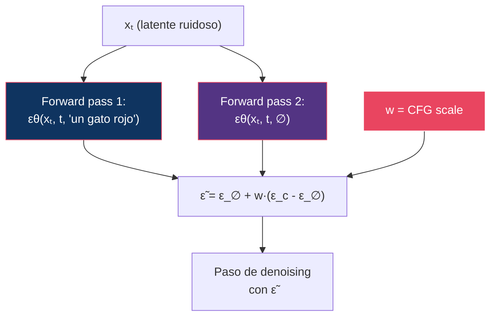

# 09 — Guidance

> Classifier-Free Guidance es probablemente la técnica más impactante y menos entendida de los modelos de difusión modernos. Aquí la desarmamos — incluida la parte que la explicación estándar se equivoca.

---

## Índice

1. [¿Qué problema resuelve guidance?](#1-qué-problema-resuelve-guidance)
2. [Classifier guidance](#2-classifier-guidance)
3. [Classifier-Free Guidance (CFG)](#3-classifier-free-guidance-cfg)
4. [Análisis matemático](#4-análisis-matemático)
5. [CFG scale: efectos y trade-offs](#5-cfg-scale-efectos-y-trade-offs)
6. [Negative prompts](#6-negative-prompts)
7. [Intervalos, rescaling y variantes](#7-intervalos-rescaling-y-variantes)
8. [Guidance en modelos modernos](#8-guidance-en-modelos-modernos)
9. [Diseño experimental: CFG sweep](#9-diseño-experimental-cfg-sweep)

---

## 1. ¿Qué problema resuelve guidance?

Sin guidance, los modelos de difusión generan muestras **diversas pero poco fieles** al prompt. Guidance amplifica la influencia del condicionamiento sobre la generación.


> El origen del problema: el modelo aprende `p(x|c)`, y esa distribución tiene **mucha masa en muestras mediocres pero válidas**. Guidance no mejora el modelo — mueve el muestreo hacia la parte de la distribución donde el condicionamiento es más discriminativo.

---

## 2. Classifier guidance

### Dhariwal & Nichol (2021)

**Idea**: usar un clasificador `p(y|xₜ)` para empujar el sampling hacia la clase deseada. Se apoya directamente en la descomposición del score de [04](../04-score-models/README.md#el-score-como-base-del-conditioning):

```
∇ₓ log p(xₜ | y) = ∇ₓ log p(xₜ) + ∇ₓ log p(y | xₜ)
```

Con un factor de escala `w`:

```
score_guiado = ∇ₓ log p(xₜ) + w · ∇ₓ log p(y | xₜ)
```

### En términos de ε

Como `sθ = -εθ/√(1-ᾱₜ)` ([01 §4](../01-foundations/README.md#4-reverse-process)), al pasar la expresión a la parametrización ε aparece el factor de conversión:

```
ε̃ = εθ(xₜ, t) - w · √(1 - ᾱₜ) · ∇ₓ log p(y | xₜ)
```

Ese `√(1-ᾱₜ)` no es decorativo: es lo que hace que la magnitud de la corrección escale correctamente con el nivel de ruido.

### Problemas

Requiere un clasificador entrenado **sobre entradas ruidosas** `xₜ`, para todos los niveles de ruido. Esto implica:

- Un modelo adicional que entrenar y que ejecutar en inferencia
- No generaliza a condicionamiento arbitrario: un clasificador tiene clases fijas, no acepta texto libre
- Los gradientes de un clasificador sobre entradas ruidosas son ruidosos y frágiles — es esencialmente un ataque adversarial dirigido

---

## 3. Classifier-Free Guidance (CFG)

### Ho & Salimans (2022)

**Idea**: eliminar el clasificador. Reordenando la regla de Bayes,

```
∇ₓ log p(c|x) = ∇ₓ log p(x|c) - ∇ₓ log p(x)
```

el «clasificador implícito» es simplemente **la diferencia entre el modelo condicional y el incondicional**. Si un mismo modelo sabe hacer ambas cosas, no hace falta nada más.

### Entrenamiento

Durante el training, con probabilidad `p_uncond` (típicamente 10 %), se reemplaza el condicionamiento por un embedding vacío:

```
si random() < p_uncond:
    entrenar εθ(xₜ, t, ∅)      // rama incondicional
si no:
    entrenar εθ(xₜ, t, c)      // rama condicional
```

Un solo conjunto de pesos aprende las dos distribuciones.

### Inferencia

```
ε̃ = εθ(xₜ, t, ∅) + w · (εθ(xₜ, t, c) - εθ(xₜ, t, ∅))
   = (1 - w) · ε_∅ + w · ε_c
```

> **Convención**: aquí `w = 1` significa **sin guidance** (muestreo condicional puro). Es la convención de `guidance_scale` en diffusers. Otros textos usan `ε̃ = ε_c + w·(ε_c - ε_∅)`, donde `w = 0` es sin guidance. Los valores no son intercambiables: `w=7.5` en una convención es `w=6.5` en la otra.



> **Coste**: CFG **duplica** el cómputo de inferencia — dos forward passes por paso. Es la principal motivación de la *guidance distillation* ([10](../10-distillation/README.md)).

---

## 4. Análisis matemático

### La interpretación estándar

La fórmula se reescribe como un score modificado:

```
∇ₓ log p̃(x|c) = ∇ₓ log p(x) + w · ∇ₓ log p(c|x)
```

que correspondería a muestrear de una distribución **afilada**:

```
p̃(x|c) ∝ p(x) · p(c|x)^w
```

| w | Distribución objetivo | Efecto |
|:--|:----------------------|:-------|
| w = 0 | `p(x)` | Ignora el prompt |
| w = 1 | `p(x\|c)` | Muestreo condicional normal |
| w > 1 | `p(x) · p(c\|x)^w` | Afilado: más fiel al prompt |
| w ≫ 1 | Muy concentrada | Sobresaturación, artefactos |

### ⚠️ Por qué esta interpretación es incorrecta

Es la explicación que aparece en todas partes, y **no describe lo que CFG hace realmente**.

El argumento falla en un punto concreto. La identidad del score vale **en cada nivel de ruido por separado**: aplicando guidance en `t` obtienes el score de `p̃ₜ ∝ pₜ(x)·pₜ(c|x)^w`. Pero **la familia `{p̃ₜ}` no es el proceso de difusión de `p̃₀`**. Difundir la distribución afilada y afilar la distribución difundida no son la misma operación — no conmutan.

Consecuencia: al integrar el sampler con guidance no se está muestreando de `p̃₀ ∝ p₀(x)·p₀(c|x)^w` para ningún `w > 1`. Se muestrea de una distribución que **no tiene forma cerrada**.

**Bradley & Nakkiran (2024)** lo demuestran y proponen una descripción alternativa: CFG se comporta como un **predictor-corrector** — combina un paso de denoising con un paso de *sharpening* tipo Langevin sobre la distribución condicional. Eso explica mejor los efectos observados que la fórmula del exponente.

> **Por qué importa**: la interpretación del afilado predice que subir `w` debería concentrar la distribución sin distorsionarla. Lo que se observa —sobresaturación, deriva de luminancia, colapso de textura— **no** son síntomas de una distribución afilada, sino de estar muestreando de algo que no es una distribución de imágenes bien definida. El resto de este módulo trata de mitigaciones para ese hecho.

### La trampa: más guidance ≠ mejor

```
Calidad
  │        ┌──── sweet spot
  │       ╱ ╲
  │      ╱   ╲
  │     ╱     ╲
  │    ╱       ╲ ← artefactos, saturación
  │   ╱         ╲
  │  ╱           ╲
  │ ╱             ╲
  │╱               ╲
  └──────────────────── CFG scale
  1    3    5    7   10   15   20
```

---

## 5. CFG scale: efectos y trade-offs

| CFG (w) | Adherencia | Calidad visual | Diversidad | Artefactos |
|:--------|:-----------|:---------------|:-----------|:-----------|
| 1.0 | Nativa del modelo | Baja (borrosa) | Máxima | Ninguno |
| 3.0 | Media | Buena | Alta | Mínimos |
| 5.0 | Buena | Muy buena | Media | Pocos |
| **7.0-7.5** | **Muy buena** | **Muy buena** | **Media** | **Pocos** |
| 10.0 | Alta | Buena | Baja | Visibles |
| 15.0 | Muy alta | Degradada | Muy baja | Significativos |
| 20+ | Extrema | Mala | Mínima | Severos |

### Artefactos de CFG alto

| Artefacto | Causa | Manifestación |
|:----------|:------|:-------------|
| **Sobresaturación** | La norma de `ε̃` crece con `w`, y los valores se salen del rango entrenado | Colores neón, no naturales |
| **Pérdida de detalle** | Distribución colapsada | Texturas planas |
| **Deriva de luminancia** | Se amplifica el sesgo de brillo del zero-terminal-SNR ([01 §6](../01-foundations/README.md#6-snr)) | Imágenes lavadas o quemadas |
| **Patrones repetidos** | Colapso de modo parcial | Texturas que se repiten |

> **El mecanismo de la sobresaturación es cuantificable**: `ε̃ = ε_∅ + w·(ε_c - ε_∅)` es una **extrapolación**, no una interpolación, cuando `w > 1`. La norma de `ε̃` crece aproximadamente de forma lineal con `w`, así que la `x̂₀` implícita se sale del rango [-1,1] de los datos. Sobre esto actúa el rescaling de [§7](#7-intervalos-rescaling-y-variantes).

---

## 6. Negative prompts

La aplicación práctica más usada de CFG, y consecuencia directa de su formulación.

Nada obliga a que la rama incondicional use el embedding vacío `∅`. Sustituyéndolo por un prompt concreto `c⁻`:

```
ε̃ = εθ(xₜ, t, c⁻) + w · (εθ(xₜ, t, c⁺) - εθ(xₜ, t, c⁻))
```

La guidance ahora empuja **desde** `c⁻` **hacia** `c⁺`. Como el término es una extrapolación, el resultado se aleja activamente de lo descrito en el prompt negativo.

| Aspecto | Consecuencia |
|:--------|:-------------|
| Coste | **Ninguno adicional** — la segunda pasada ya se hacía |
| Requiere entrenamiento | No; es puramente de inferencia |
| Con `w = 1` | El prompt negativo **no tiene ningún efecto** (el término se anula) |
| Modelos sin CFG | **No admiten negative prompt**: no hay segunda rama que sustituir |

> Esa última fila explica una queja frecuente: los modelos con guidance destilada (FLUX schnell, LCM, Turbo) ignoran los prompts negativos. No es un fallo de implementación — no existe el mecanismo.

---

## 7. Intervalos, rescaling y variantes

### Aplicar guidance solo en un intervalo

**Kynkäänniemi et al. (2024)** hacen la pregunta obvia que nadie había hecho: ¿hace falta guidance en *todos* los niveles de ruido?

Su resultado: **no, y aplicarla en los extremos es contraproducente**.

| Nivel de ruido | Efecto de la guidance |
|:---------------|:----------------------|
| **Muy alto** (inicio) | **Perjudicial**: colapsa la variedad de composiciones antes de que se decida nada |
| **Intermedio** | **Beneficioso**: es donde se define el contenido |
| **Muy bajo** (final) | **Innecesaria**: solo añade artefactos de alta frecuencia |

Limitar la guidance a un intervalo intermedio mejora el FID de forma sustancial **sin coste añadido**.

> ⚠️ **Corrección frecuente**: se dice que «hace falta más guidance al principio, cuando hay mucho ruido, para fijar la composición». La evidencia apunta al revés: al principio es cuando más daño hace. Cuidado también con las fórmulas de *dynamic CFG* del tipo `w(t) = w_max·(1-t/T) + w_min·(t/T)` — conviene comprobar en qué extremo evalúan cada valor, porque es fácil escribir lo contrario de lo que se pretende.

### CFG Rescaling (Lin et al., 2024)

**Problema**: con `w` alto, `std(ε̃)` es mucho mayor que `std(ε_c)`, y esa desviación es la causa directa de la sobresaturación.

**Solución en dos pasos** — la parte que suele omitirse es la primera:

```
1) Reescalar a la desviación del condicional:

   ε_rescaled = ε̃ · std(ε_c) / std(ε̃)

2) Interpolar entre el reescalado y el CFG original:

   ε_final = φ · ε_rescaled + (1 - φ) · ε̃        con φ ≈ 0.7
```

Sin el paso 1 no hay reescalado; interpolar directamente `ε̃` con `ε_c` es otra cosa (equivale a bajar `w`) y no corrige la estadística.

### Tabla de estrategias

| Estrategia | Mecanismo | Ventaja | Coste |
|:-----------|:----------|:--------|:------|
| CFG fijo | `w` constante | Simple | 2× |
| **Guidance interval** | Solo en niveles de ruido intermedios | Mejor FID, gratis | 2× (menos pasos) |
| **CFG rescaling** | Normalizar `std` tras el CFG | Reduce sobresaturación | 2× |
| Negative prompt | Sustituir `∅` por `c⁻` | Control negativo | 2× |
| **PAG** (Perturbed Attention) | La rama «débil» se obtiene degradando la self-attention, no quitando el prompt | Funciona sin condicionamiento | 2× |
| **Autoguidance** | La rama «débil» es una versión peor del propio modelo (menos entrenada o más pequeña) | Mejora calidad sin sacrificar diversidad | 2× |
| **Guidance distillation** | Entrenar el modelo para reproducir la salida guiada en una pasada | Elimina el 2× | 1× |

> **El patrón que unifica PAG y autoguidance**: CFG no necesita que la segunda rama sea *incondicional*. Solo necesita que sea **peor de forma sistemática**. Extrapolar desde una versión degradada del modelo hacia la buena es el mecanismo general; el `∅` de CFG es solo una forma de degradarlo entre muchas.

---

## 8. Guidance en modelos modernos

| Modelo | Tipo de guidance | Escala típica | Forward passes |
|:-------|:-----------------|:--------------|:---------------|
| SD 1.5 | CFG clásico | 7.5 | **2×** |
| SDXL | CFG clásico | 5-9 | **2×** |
| SD3 / SD 3.5 | CFG clásico | ~5 | **2×** |
| **FLUX.1 [dev]** | **Guidance destilada** | 3.5 | **1×** |
| **FLUX.1 [schnell]** | Destilada, sin control | — | **1×** |
| FLUX.2 / Klein | Destilada | — | 1× |

> ⚠️ **Corrección frecuente**: catalogar FLUX.1 dev como «CFG clásico con 2× forward passes». **No lo es.** FLUX.1 dev está *guidance-distilled*: el valor de guidance entra en la red como un **embedding de condicionamiento**, igual que el timestep, y se ejecuta **una sola pasada**. Por eso su escala típica (3.5) no es comparable con el 7.5 de SDXL: no son la misma magnitud. Y por eso tampoco admite negative prompts ([§6](#6-negative-prompts)).

> **Tendencia 2025-2026**: destilar la guidance elimina el 2× de cómputo, y es un factor tan importante como la reducción de pasos para llegar a la generación sub-segundo. El precio es perder el control fino: sin las dos ramas, se pierden los negative prompts, los intervalos de guidance y el rescaling.

---

## 9. Diseño experimental: CFG sweep

```
Experimento F — CFG Scale Sweep

HIPÓTESIS
  Existe un sweet spot de CFG que maximiza calidad × adherencia, y
  los efectos de degradación por encima de él son medibles como
  desviación estadística de la predicción, no solo perceptualmente.

VARIABLES
  Independiente:  w = {1, 2, 3, 5, 7, 10, 15}
  Controladas:    modelo, semilla, prompt, pasos, solver,
                  sigma schedule
  Dependientes:   ver métricas

  ⚠ Solo aplicable a modelos con CFG real (SDXL, SD3).
    FLUX.1 dev usa guidance destilada: su escala NO es comparable
    y debe analizarse como un experimento aparte.

PROMPTS (fijos)
  1. "A red cat sitting on a blue chair"          (atributo-objeto)
  2. "A mountain landscape at sunset, oil painting" (estilo)
  3. "Typography: HELLO WORLD in gothic font"      (texto)
  4. "Three green apples on a wooden table"        (conteo)

MÉTRICAS
  - CLIPScore                  (adherencia)
  - Aesthetic score            (calidad percibida)
  - Saturación media en HSV    (detectar oversaturation)
  - std(ε̃) / std(ε_c)          (la causa mecánica, §7)
  - Luminancia media           (deriva de brillo)
  - LPIPS entre 10 semillas    (diversidad)

BRAZO ADICIONAL
  Repetir con guidance limitada a un intervalo intermedio de niveles
  de ruido (§7) para verificar la mejora reportada por
  Kynkäänniemi et al. a igualdad de w.

RESULTADO ESPERADO
  CLIPScore:    crece y satura
  Aesthetic:    pico en w = 5-7, luego cae
  Saturación:   crece monotónicamente
  std(ε̃)/std(ε_c): crece ~linealmente con w  ← predicción mecánica
  Diversidad:   decrece monotónicamente
  Intervalo:    mejor aesthetic al mismo w que el CFG completo
```

---

## Referencias

- Dhariwal, P. & Nichol, A. (2021). *Diffusion Models Beat GANs on Image Synthesis*. NeurIPS 2021. — **Classifier guidance.**
- Ho, J. & Salimans, T. (2022). *Classifier-Free Diffusion Guidance*. NeurIPS 2021 Workshop / arXiv. — **CFG.**
- Lin, S., Liu, B., Li, J., & Yang, X. (2024). *Common Diffusion Noise Schedules and Sample Steps are Flawed*. WACV 2024. — **CFG rescaling** ([§7](#7-intervalos-rescaling-y-variantes)).
- Kynkäänniemi, T. et al. (2024). *Applying Guidance in a Limited Interval Improves Sample and Distribution Quality in Diffusion Models*. NeurIPS 2024.
- Bradley, A. & Nakkiran, P. (2024). *Classifier-Free Guidance is a Predictor-Corrector*. — **CFG no muestrea de `p·p^w`** ([§4](#4-análisis-matemático)).
- Karras, T. et al. (2024). *Guiding a Diffusion Model with a Bad Version of Itself*. NeurIPS 2024. — Autoguidance.
- Ahn, D. et al. (2024). *Self-Rectifying Diffusion Sampling with Perturbed-Attention Guidance*. ECCV 2024. — PAG.
- Meng, C. et al. (2023). *On Distillation of Guided Diffusion Models*. CVPR 2023. — Guidance distillation.

---

*← [08 — Sampling](../08-sampling/README.md) | [10 — Distillation →](../10-distillation/README.md)*
