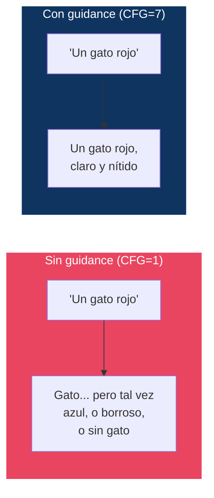
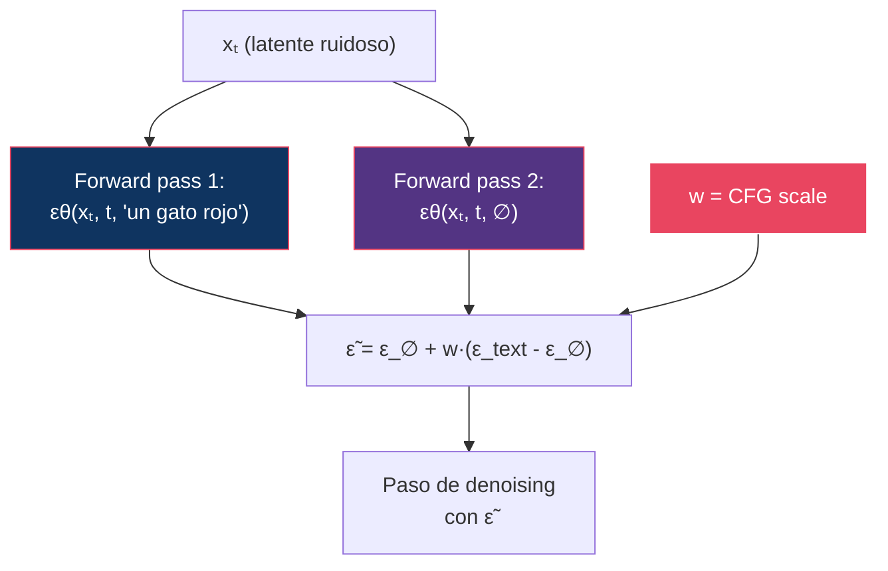

# 09 — Guidance

> Classifier-Free Guidance es probablemente la técnica más impactante y menos entendida de los modelos de difusión modernos. Aquí la desarmamos.

---

## Índice

1. [¿Qué problema resuelve guidance?](#1-el-problema)
2. [Classifier guidance](#2-classifier-guidance)
3. [Classifier-Free Guidance (CFG)](#3-cfg)
4. [CFG: análisis matemático](#4-análisis-matemático)
5. [CFG scale: efectos y trade-offs](#5-cfg-scale)
6. [Dynamic CFG y rescaling](#6-dynamic-cfg)
7. [Guidance en modelos modernos](#7-guidance-moderna)
8. [Diseño experimental: CFG sweep](#8-diseño-experimental)

---

## 1. ¿Qué problema resuelve guidance?

Sin guidance, los modelos de difusión generan muestras **diversas pero poco fieles** al prompt. Guidance amplifica la influencia del conditioning (texto) sobre la generación.



---

## 2. Classifier guidance

### Dhariwal & Nichol (2021)

**Idea**: Usar un clasificador pre-entrenado `p(y|xₜ)` para guiar el sampling hacia la clase deseada.

### Formulación

Modificar el score con el gradiente del clasificador:

```
∇ₓ log p(xₜ | y) = ∇ₓ log p(xₜ) + ∇ₓ log p(y | xₜ)
```

Con un factor de escala `w`:

```
score_guiado = score_base + w · ∇ₓ log p(y | xₜ)
```

### Problema

Requiere entrenar un clasificador **ruidoso** (que funcione con inputs xₜ parcialmente ruidosos). Esto es:
- Costoso de entrenar
- No generaliza a conditioning arbitrario (texto libre)
- Requiere un modelo adicional en inferencia

---

## 3. Classifier-Free Guidance (CFG)

### Ho & Salimans (2022)

**Idea radical**: No usar ningún clasificador externo. En su lugar, entrenar el mismo modelo para funcionar **con y sin conditioning**, y usar la diferencia para guiar.

### Entrenamiento

Durante el training, con probabilidad `p_uncond` (típicamente 10-20%), reemplazar el texto por un embedding vacío (∅):

```
Si random() < p_uncond:
    εθ(xₜ, t, ∅)      // entrenamiento incondicional
Else:
    εθ(xₜ, t, c)      // entrenamiento condicional
```

### Inferencia

Combinar las predicciones condicional e incondicional:

```
ε̃ = εθ(xₜ, t, ∅) + w · (εθ(xₜ, t, c) - εθ(xₜ, t, ∅))
```

Simplificando:

```
ε̃ = (1 - w) · ε_uncond + w · ε_cond
```

donde `w` es el **CFG scale** (guidance scale).

### Diagrama del proceso



> **Coste**: CFG **duplica** el coste de inferencia (2 forward passes por paso). Esto es una de las principales motivaciones para distillation de guidance.

---

## 4. Análisis matemático

### ¿Qué hace realmente CFG?

La fórmula `ε̃ = ε_uncond + w · (ε_cond - ε_uncond)` puede reinterpretarse como:

```
∇ₓ log p̃(x|c) = ∇ₓ log p(x) + w · ∇ₓ log p(c|x)
```

Lo que corresponde a muestrear de una distribución **sharpened**:

```
p̃(x|c) ∝ p(x) · p(c|x)^w
```

| w | Distribución muestreada | Efecto |
|:--|:------------------------|:-------|
| w = 0 | p(x) (incondicional) | Ignora el prompt completamente |
| w = 1 | p(x\|c) (condicional) | Sampling normal, sin guidance |
| w > 1 | p(x) · p(c\|x)^w | **Sharpened**: más fiel al prompt |
| w >> 1 | Distribución muy concentrada | Oversaturation, artefactos |

### La trampa: más guidance ≠ siempre mejor

```
Calidad
  │        ┌──── sweet spot
  │       ╱ ╲
  │      ╱   ╲
  │     ╱     ╲
  │    ╱       ╲ ← artefactos, saturación
  │   ╱         ╲
  │  ╱           ╲
  │ ╱             ╲
  │╱               ╲
  └──────────────────── CFG scale
  1    3    5    7   10   15   20
```

---

## 5. CFG scale: efectos y trade-offs

### Efectos observados al aumentar CFG

| CFG | Prompt adherence | Calidad visual | Diversidad | Artefactos |
|:----|:-----------------|:---------------|:-----------|:-----------|
| 1.0 | Baja | Baja (borrosa) | Máxima | Ninguno |
| 3.0 | Media | Buena | Alta | Mínimos |
| 5.0 | Buena | Muy buena | Media | Pocos |
| **7.0-7.5** | **Muy buena** | **Muy buena** | **Media** | **Pocos** |
| 10.0 | Alta | Buena | Baja | Visibles |
| 15.0 | Muy alta | Degradada | Muy baja | Significativos |
| 20.0+ | Extrema | Mala | Mínima | Severos (saturación, artefactos) |

### Artefactos de CFG alto

| Artefacto | Causa | Manifestación |
|:----------|:------|:-------------|
| **Oversaturation** | Colores empujados a extremos | Colores neón, no naturales |
| **Loss of detail** | Distribución colapsada | Texturas planas, simplificadas |
| **Brightness artifacts** | Distribución de luminosidad distorsionada | Imágenes muy claras u oscuras |
| **Repeated patterns** | Mode collapse parcial | Texturas repetitivas |

---

## 6. Dynamic CFG y rescaling

### Dynamic CFG

En lugar de usar un CFG fijo, variarlo a lo largo del proceso de denoising:

```
w(t) = w_max · (1 - t/T) + w_min · (t/T)
```

**Lógica**: En los primeros pasos (t alto, mucho ruido), se necesita más guidance para establecer la composición. En los últimos pasos (t bajo), menos guidance para preservar detalles.

### CFG Rescaling (Lin et al., 2024)

**Problema**: CFG alto cambia la distribución de normas de los latents, causando oversaturation.

**Solución**: Rescalar la predicción guiada para mantener la misma norma que la predicción condicional:

```
ε̃_rescaled = φ · ε̃ + (1 - φ) · ε_cond

donde φ controla la fuerza del rescaling
```

### Tabla de estrategias de guidance

| Estrategia | Mecanismo | Ventaja |
|:-----------|:----------|:--------|
| CFG fijo | w constante | Simple |
| Dynamic CFG | w varía con t | Mejor balance calidad/adherencia |
| CFG rescaling | Normalizar norma post-CFG | Reduce oversaturation |
| PAG (Perturbed Attention) | Perturbar attention en lugar de usar ∅ | No requiere 2× forward passes |
| Guidance distillation | Entrenar modelo para simular CFG en 1 pass | Elimina 2× coste |
| Autoguidance | Usar modelo más pequeño como "unconditional" | Menor coste |

---

## 7. Guidance en modelos modernos

| Modelo | Tipo de guidance | CFG default | Notas |
|:-------|:----------------|:------------|:------|
| SD 1.5 | CFG clásico | 7.5 | 2× forward passes |
| SDXL | CFG clásico | 5-9 | 2× forward passes |
| SD3 | CFG | ~5 | Joint attention + CFG |
| FLUX.1 [dev] | CFG | Variable | 2× forward passes |
| FLUX.1 [schnell] | **Sin CFG** | N/A | Distilled para funcionar sin guidance |
| FLUX.2 Klein | Sin CFG | N/A | Guidance distilled |

> **Tendencia 2025-2026**: Los modelos distilados eliminan la necesidad de CFG, ahorrando 50% del cómputo de inferencia. Esto es un factor clave en la generación sub-segundo.

---

## 8. Diseño experimental: CFG sweep

### Diseño del experimento

```
╔══════════════════════════════════════════════════════╗
║  Experimento F: CFG Scale Sweep                      ║
╠══════════════════════════════════════════════════════╣
║  Hipótesis: Existe un sweet spot de CFG que          ║
║  maximiza calidad × adherencia, y valores más        ║
║  altos degradan la imagen.                           ║
║                                                      ║
║  Variables:                                          ║
║    Independiente: CFG scale = {1, 2, 3, 5, 7, 10, 15}║
║    Controladas: modelo, seed, prompt, pasos, solver  ║
║    Dependientes: CLIPScore, aesthetic score,          ║
║                  saturación media, diversidad         ║
║                                                      ║
║  Prompts (fijos):                                    ║
║    1. "A red cat sitting on a blue chair"            ║
║    2. "A mountain landscape at sunset, oil painting" ║
║    3. "Typography: HELLO WORLD in gothic font"       ║
║    4. "Three green apples on a wooden table"         ║
║                                                      ║
║  Métricas:                                           ║
║    - CLIPScore (prompt adherence)                    ║
║    - Aesthetic score (calidad percibida)              ║
║    - Mean pixel saturation (detectar oversaturation)  ║
║    - LPIPS entre seeds (diversidad)                  ║
║                                                      ║
║  Resultado esperado:                                 ║
║    CLIPScore: crece monotónicamente con CFG           ║
║    Aesthetic: pico en CFG 5-7, luego decrece          ║
║    Saturación: crece monotónicamente con CFG          ║
║    Diversidad: decrece monotónicamente con CFG        ║
╚══════════════════════════════════════════════════════╝
```

---

## Referencias

- Ho, J. & Salimans, T. (2022). *Classifier-Free Diffusion Guidance*. NeurIPS Workshop.
- Dhariwal, P. & Nichol, A. (2021). *Diffusion Models Beat GANs on Image Synthesis*. NeurIPS.
- Lin, S. et al. (2024). *Common Diffusion Noise Schedules and Sample Steps are Flawed*. WACV.

---

*← [08 — Sampling](../08-sampling/README.md) | [10 — Distillation →](../10-distillation/README.md)*
