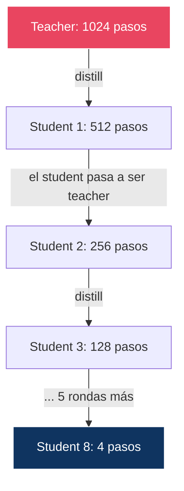
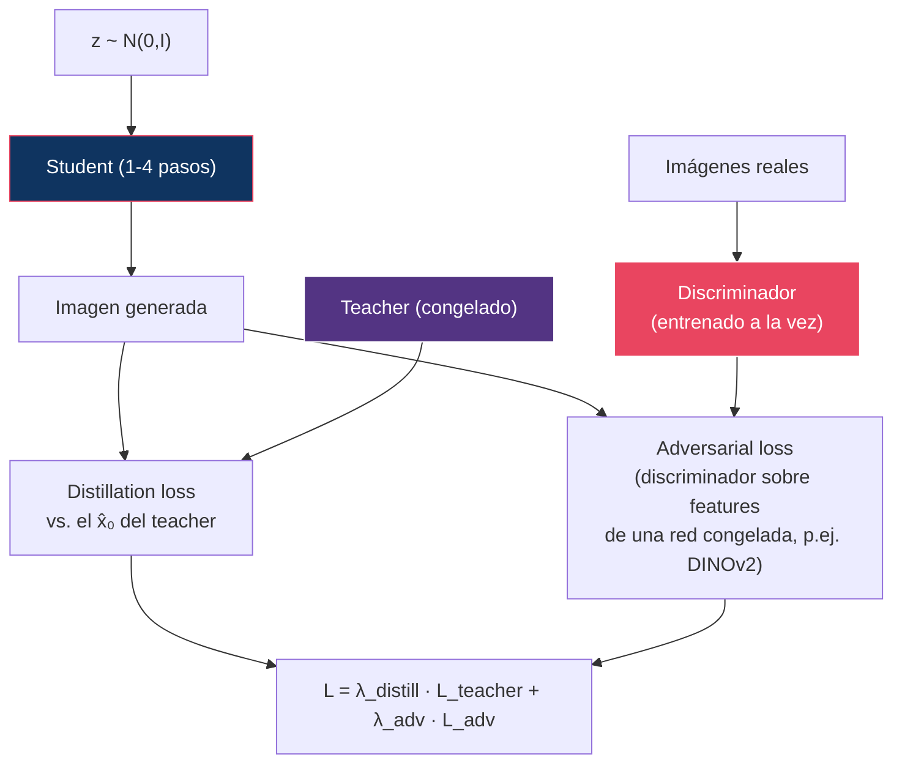
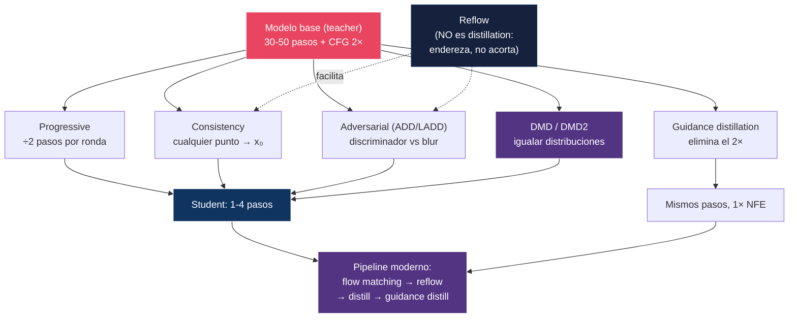

# 10 — Distillation y Few-Step Generation

> ¿Cómo pasar de 50 pasos a 4 — o incluso 1 — sin destruir la calidad?

---

## Índice

1. [El problema de la latencia](#1-el-problema-de-la-latencia)
2. [Por qué un paso es difícil](#2-por-qué-un-paso-es-difícil)
3. [Progressive distillation](#3-progressive-distillation)
4. [Consistency models](#4-consistency-models)
5. [Adversarial distillation](#5-adversarial-distillation)
6. [Distribution Matching Distillation](#6-distribution-matching-distillation)
7. [Guidance distillation](#7-guidance-distillation)
8. [Reflow: por qué NO es distillation](#8-reflow-por-qué-no-es-distillation)
9. [Comparación de métodos](#9-comparación-de-métodos)
10. [¿Qué se pierde en la distillation?](#10-qué-se-pierde-en-la-distillation)
11. [Estado del arte (2026)](#11-estado-del-arte-2026)

---

## 1. El problema de la latencia

Lo que determina la latencia es el **NFE**, no el número de pasos. Con CFG clásico cada paso cuesta **dos** evaluaciones ([09 §3](../09-guidance/README.md#3-classifier-free-guidance-cfg)).

| Modelo | Pasos | Guidance | NFE | Latencia (orden) | ¿Producción? |
|:-------|:------|:---------|----:|:-----------------|:-------------|
| DDPM | 1000 | — | 1000 | ~minutos | ✗ |
| SD 1.5 (DDIM) | 50 | CFG 2× | **100** | ~5 s | Parcialmente |
| SD 1.5 (DPM++) | 20 | CFG 2× | **40** | ~2 s | Sí |
| SDXL | 30 | CFG 2× | **60** | ~5 s | Sí |
| FLUX.1 dev | 30 | **destilada 1×** | **30** | ~8 s | Parcialmente |
| FLUX.1 schnell | 4 | destilada 1× | **4** | ~1 s | **Sí** |
| Consistency model | 1-2 | ninguna | **1-2** | ~0.2 s | **Sí** |

> ⚠️ **Corrección frecuente**: contar FLUX.1 dev como «30 pasos × 2 por CFG = 60 NFE». **No aplica**: FLUX.1 dev tiene la guidance destilada y hace **una sola pasada por paso** ([09 §8](../09-guidance/README.md#8-guidance-en-modelos-modernos)). Su ventaja frente a SDXL no está en los pasos sino en no pagar el 2×.

> **Consecuencia**: hay **dos ejes independientes** que reducir. Bajar de 50 a 4 pasos es 12×; eliminar el 2× de CFG es otro 2×. Se atacan con técnicas distintas y se combinan multiplicativamente.

---

## 2. Por qué un paso es difícil

Antes de los métodos, el obstáculo. Es uno solo y explica el diseño de todos ellos.

Un sampler de muchos pasos convierte ruido en imagen mediante una **secuencia** de decisiones pequeñas. Un modelo de un paso tiene que aprender el mapa completo `x_T ↦ x₀` de golpe.

El problema: si se entrena ese mapa con **MSE contra la salida del teacher**, el minimizador es la **media condicional**:

```
f*(x_T) = E[ x₀ | x_T ]
```

Y la media de muchas imágenes plausibles **no es una imagen plausible**: es un borrón. Este es el mismo fenómeno que hace borrosos a los autoencoders entrenados con L2.

```
   Con 50 pasos:               Con 1 paso y loss L2:

   x_T ──→ ──→ ──→ x₀          x_T ──────────→ E[x₀|x_T]
        (cada paso                              ↑
         resuelve poca                    promedio de todas
         ambigüedad)                      las salidas posibles
                                          = imagen borrosa
```

**Todos los métodos de esta sección son formas distintas de evitar ese promedio**:

| Método | Cómo evita el promedio |
|:-------|:-----------------------|
| Progressive | Nunca salta más de 2 pasos a la vez; la ambigüedad por salto es pequeña |
| Consistency | Impone consistencia a lo largo de una **trayectoria ODE concreta**, que es determinista |
| Adversarial | Añade un discriminador: una imagen borrosa se detecta y se penaliza |
| Distribution matching | Iguala **distribuciones**, no muestras individuales |

---

## 3. Progressive distillation

### Salimans & Ho (2022)

**Idea**: enseñar iterativamente al modelo a hacer en N/2 pasos lo que antes hacía en N.



### Procedimiento

En cada ronda:

1. El **teacher** da dos pasos DDIM: `t → t-1 → t-2`
2. El **student** debe alcanzar el mismo punto con **un solo paso**: `t → t-2`
3. Loss: `‖student(xₜ) − teacher_2pasos(xₜ)‖²`
4. El student se convierte en el teacher de la ronda siguiente

`1024 / 2⁸ = 4`: ocho rondas bastan.

> **Por qué funciona pese al MSE**: cada salto solo cubre **dos pasos**, y en esa escala el mapa es casi determinista — hay poca ambigüedad que promediar. El problema del [§2](#2-por-qué-un-paso-es-difícil) se difiere, no se resuelve, y por eso reaparece en las últimas rondas (4 → 2 → 1), donde la calidad cae bruscamente.

> **Nota**: este es el paper que introduce **v-prediction** ([01 §7](../01-foundations/README.md#7-parametrizaciones)), y no por casualidad: con ε-prediction la distillation a pocos pasos es numéricamente inestable cerca de `ᾱ → 0`.

### Limitaciones

- Requiere **múltiples rondas** completas de entrenamiento
- El error se acumula ronda a ronda
- Por debajo de 4 pasos la degradación se acelera

---

## 4. Consistency models

### Song et al. (2023)

**Idea**: entrenar un modelo que mapee **cualquier punto de una trayectoria ODE directamente a su origen `x₀`**.


### Propiedad de consistencia

```
fθ(xₜ, t) = fθ(xₜ', t')     para todo t, t' sobre la MISMA trayectoria ODE
```

Nótese el matiz que hace que esto no sea un promedio: la trayectoria de la Probability Flow ODE es **determinista** ([04 §6](../04-score-models/README.md#6-unificación-score-sde)), así que cada `xₜ` tiene **un único** `x₀` asociado. No hay ambigüedad que promediar — a diferencia del mapa `x_T ↦ x₀` genérico del [§2](#2-por-qué-un-paso-es-difícil).

### La condición de frontera (sin ella no funciona)

La consistencia por sí sola admite una solución trivial: `fθ ≡ const` la satisface. Hace falta anclarla:

```
fθ(x_ε, ε) = x_ε        con ε ≈ 0
```

Y no se impone con una penalización, sino **por construcción**, con una parametrización de tipo skip:

```
fθ(x, t) = c_skip(t) · x  +  c_out(t) · Fθ(x, t)

con    c_skip(ε) = 1    y    c_out(ε) = 0
```

En `t = ε` la red devuelve la identidad exacta, pase lo que pase con `Fθ`. Es el detalle de diseño que hace viable todo el método.

### Dos modos de entrenamiento

| Modo | ¿Teacher? | Cómo estima la trayectoria | Calidad |
|:-----|:----------|:---------------------------|:--------|
| **Consistency Distillation (CD)** | Sí | Un paso del solver ODE del teacher | Mejor |
| **Consistency Training (CT)** | No | Estimador insesgado del score con datos | Menor |

### Multistep consistency

También admiten refinamiento iterativo — alternando *denoise completo* y *re-ruidificación parcial*:

```
x̂₀ = fθ(x_T, T)                       // 1 NFE: estructura básica
x̂₀ = fθ(añadir_ruido(x̂₀, t₁), t₁)     // 2 NFE: mejor
x̂₀ = fθ(añadir_ruido(x̂₀, t₂), t₂)     // 3 NFE: mejor aún
```

> Es exactamente la estructura predictor-corrector de [04 §7](../04-score-models/README.md#7-predictor-corrector-sampling): re-ruidificar y volver a limpiar corrige el error del salto anterior.

### LCM: Latent Consistency Models

Luo et al. (2023) llevan consistency al espacio latente de Stable Diffusion e integran la guidance en el modelo. Su variante **LCM-LoRA** destila la capacidad de pocos pasos en un adaptador LoRA aplicable a cualquier checkpoint compatible — es lo que popularizó la generación en tiempo real en el ecosistema SD.

---

## 5. Adversarial distillation

### ADD: Adversarial Diffusion Distillation (Sauer et al., 2023)

La base de **SD-Turbo** y **SDXL-Turbo**. Combina dos pérdidas:



### Por qué adversarial

Ataca directamente el problema del [§2](#2-por-qué-un-paso-es-difícil). El loss de distillation por sí solo produce el promedio borroso; el discriminador **penaliza explícitamente lo borroso**, porque una imagen difuminada es trivialmente distinguible de una real.

| Componente | Función |
|:-----------|:--------|
| Distillation loss | Fidelidad semántica al teacher y al prompt |
| Adversarial loss | Nitidez y realismo de textura |

El discriminador no opera sobre píxeles crudos sino sobre **features de una red preentrenada y congelada** (DINOv2 en ADD), lo que estabiliza mucho un entrenamiento que de otro modo sería el de un GAN clásico.

### LADD: Latent Adversarial Diffusion Distillation

Sucesor de ADD (base de SD3-Turbo): mueve el discriminador al **espacio latente**, eliminando la decodificación del VAE en cada paso de entrenamiento. Más barato y escalable a alta resolución.

---

## 6. Distribution Matching Distillation

### DMD / DMD2 (Yin et al., 2024)

El enfoque que mejor resuelve el problema de fondo, y el que domina el estado del arte en un paso.

**Idea**: no obligar al student a reproducir **la salida** del teacher para cada entrada, sino a que **la distribución** de sus salidas coincida con la del teacher.

```
Objetivo:  minimizar  KL( p_student ‖ p_teacher )
```

El gradiente de esa KL se expresa como una **diferencia de dos scores**:

```
∇θ KL  ∝  E[ ( s_fake(x) − s_real(x) ) · ∂x/∂θ ]
```

donde `s_real` es el score del teacher (congelado) y `s_fake` el de un segundo modelo que se entrena **en paralelo** sobre las salidas del student.

| Por qué funciona | Explicación |
|:-----------------|:------------|
| No promedia | El objetivo es distribucional; nada empuja hacia la media condicional |
| No necesita pares | No hay correspondencia entrada-salida que respetar |
| Preserva diversidad | Igualar distribuciones penaliza el colapso de modo explícitamente |

**DMD2** añade un término adversarial y elimina la necesidad del dataset de pares de regresión del DMD original, alcanzando calidad comparable al teacher **en un solo paso**.

> Conceptualmente es pariente de **Variational Score Distillation** (usada en 3D/text-to-3D): en ambos casos se optimiza un generador contra la diferencia entre dos campos de score.

---

## 7. Guidance distillation

Eje **ortogonal** a la reducción de pasos: en lugar de menos pasos, pasos más baratos.

**Meng et al. (2023)**: entrenar el modelo para que reproduzca **la salida ya guiada** en una sola pasada, tomando la escala de guidance como entrada:

```
Teacher (2 pasadas):   ε̃ = ε_∅ + w·(ε_c − ε_∅)
                                  ↓ destilar
Student (1 pasada):    ε̃ = εθ(xₜ, t, c, w)     ← w entra como embedding
```

| Ventaja | Coste |
|:--------|:------|
| Elimina el 2× de CFG | Se pierden los negative prompts ([09 §6](../09-guidance/README.md#6-negative-prompts)) |
| `w` sigue siendo ajustable (si se entrenó así) | Se pierden guidance por intervalos y rescaling |
| Combinable con reducción de pasos | La escala deja de ser comparable con el CFG clásico |

Es lo que usan **FLUX.1 dev** (con `w` ajustable) y **FLUX.1 schnell** (con `w` fijo).

---

## 8. Reflow: por qué NO es distillation

Aparece a menudo clasificado como *trajectory distillation*. Conviene separarlo, porque el mecanismo es distinto.

| | Distillation | Reflow ([07 §5](../07-flow-matching/README.md#5-rectified-flow-y-el-problema-del-cruce)) |
|:--|:-------------|:---------------------------------------|
| **Qué se optimiza** | Que el student imite la salida del teacher | El **mismo** objetivo CFM de siempre |
| **Qué cambia** | El número de pasos del modelo | El **emparejamiento** ruido↔dato |
| **Marginales** | Pueden desplazarse | **Se preservan exactamente** |
| **Resultado** | Un modelo de pocos pasos | Un modelo de igual coste, con trayectorias más rectas |
| **Pérdida de calidad** | Sí, inherente | No: es un re-entrenamiento legítimo |

El reflow **no reduce los pasos por sí mismo**: produce un modelo cuya ODE es más fácil de integrar, así que *tolera* menos pasos. Los resultados de **un paso** de Rectified Flow provienen de **destilar** el modelo ya enderezado — un paso adicional y con pérdida.

> **La secuencia completa en un modelo moderno**: entrenar con flow matching → reflow para enderezar → destilar a pocos pasos → destilar la guidance. Cuatro etapas, y solo dos son distillation.

---

## 9. Comparación de métodos

| Método | Pasos | ¿Teacher? | Coste de entrenamiento | Estabilidad | Mecanismo anti-borrón |
|:-------|:------|:----------|:-----------------------|:------------|:----------------------|
| Progressive distillation | 4-8 | Sí | Alto (múltiples rondas) | Alta | Saltos pequeños |
| Consistency distillation | 1-4 | Sí | Medio | Media | Trayectoria determinista |
| Consistency training | 1-4 | No | Alto | Media | Trayectoria determinista |
| Adversarial (ADD/LADD) | 1-4 | Sí | Alto | Baja (GAN) | Discriminador |
| **DMD / DMD2** | **1** | Sí | Alto | Media | Objetivo distribucional |
| Guidance distillation | N | Sí | Medio | Alta | N/A (no reduce pasos) |
| Reflow (no es distillation) | 4-8 | No | Medio | Alta | N/A (endereza) |

> ⚠️ Deliberadamente **sin una columna de «% de calidad respecto al teacher»**. Ese porcentaje aparece con frecuencia en resúmenes de este tema, pero la calidad no es un escalar comparable entre métodos: cada paper mide con un FID distinto, sobre datasets y resoluciones distintos. Los números concretos deben tomarse de cada paper con su protocolo, no de una tabla agregada.

---

## 10. ¿Qué se pierde en la distillation?

### Degradaciones observadas

| Aspecto | Modelo base (30-50 pasos) | Destilado (1-4 pasos) |
|:--------|:--------------------------|:----------------------|
| **Detalles finos** | Excelentes | Buenos, con tendencia al blur |
| **Diversidad** | Alta | **Reducida** (la pérdida más consistente) |
| **Adherencia al prompt** | Alta | Similar |
| **Composición compleja** | Buena | Falla con más frecuencia |
| **Text rendering** | Según el modelo | Algo peor |
| **Coherencia anatómica** | Según el modelo | Algo peor |
| **Control en inferencia** | Completo | **Muy reducido** |

### Por qué ocurre

1. **Promedio de modos** — el mecanismo del [§2](#2-por-qué-un-paso-es-difícil); es la causa raíz de casi todo lo demás
2. **Menos capacidad de corrección** — con 50 pasos el modelo corrige errores por el camino; con 1 no hay segunda oportunidad
3. **Desplazamiento distribucional** — el student opera sobre entradas que el teacher nunca vio exactamente
4. **Colapso de modo parcial** — especialmente con pérdidas adversariales, que no penalizan perder variedad

> **La pérdida de diversidad es la más sistemática**, y también la más fácil de pasar por alto: no se ve en una imagen aislada, solo al comparar muchas generaciones del mismo prompt. Es una métrica obligatoria al evaluar un modelo destilado (LPIPS o recall entre semillas).

### Pérdida de control, no solo de calidad

Se enumera menos y a menudo pesa más en producción:

| Se pierde | Motivo |
|:----------|:-------|
| Negative prompts | No hay segunda rama ([09 §6](../09-guidance/README.md#6-negative-prompts)) |
| Ajustar la escala de guidance | Fijada en la destilación (salvo que se entrene como entrada) |
| Guidance por intervalos, rescaling | Requieren las dos ramas |
| Elegir el sampler | El modelo está atado a su esquema de pocos pasos |
| Cambiar el número de pasos | Fuera del rango destilado, se degrada rápido |

### Diagrama: calidad vs pasos

```
Calidad
  │
  │  ████████████████████████  ← Teacher (30-50 pasos)
  │  ███████████████████████   ← DMD2 (1 paso)
  │  █████████████████         ← Adversarial (4 pasos)
  │  ████████████████          ← Reflow + distill (4 pasos)
  │  █████████████             ← Progressive (4 pasos)
  │  ██████████                ← Consistency (2 pasos)
  │  ███████                   ← Consistency (1 paso)
  │
  └──────────────────────────── Pasos
  1    2    4    8   20   50
```

> Diagrama cualitativo, no una medición. El orden relativo refleja la tendencia reportada en la literatura; las magnitudes no son comparables entre métodos ([§9](#9-comparación-de-métodos)).

---

## 11. Estado del arte (2026)

### Tendencias

1. **Distribution matching** desplazando al MSE puro como objetivo de distillation
2. **Híbridos**: adversarial + distribucional + flow matching en un solo pipeline
3. **Guidance distillation por defecto** en los modelos nuevos de frontera
4. **Distillation + cuantización** combinadas para GPU de consumo ([14](../14-quantization/))
5. **Post-training con reward models** tras la distillation, para recuperar calidad perceptual

### Modelos destilados prominentes

| Modelo | Método | Pasos | Resultado |
|:-------|:-------|:------|:---------|
| SD-Turbo / SDXL-Turbo | ADD | 1-4 | Tiempo real en GPU |
| SDXL-Lightning | Progressive + adversarial | 2-8 | Buen equilibrio |
| LCM / LCM-LoRA | Latent consistency | 2-8 | Aplicable como adaptador |
| SD3-Turbo | LADD | 4 | Adversarial en latente |
| FLUX.1 schnell | Guidance + step distillation | 1-4 | Sub-segundo |
| FLUX.2 Klein | Distillation + cuantización | ~4 | GPU de consumo |
| Z-Image Turbo | Few-step + reward post-training | ~4 | <16 GB VRAM |

> ⚠️ Especificaciones pendientes de contrastar con [16 — Image Models](../16-image-models/README.md).

---

## Diagrama: el landscape de distillation



---

## Referencias

- Salimans, T. & Ho, J. (2022). *Progressive Distillation for Fast Sampling of Diffusion Models*. ICLR 2022. — También el origen de v-prediction.
- Meng, C. et al. (2023). *On Distillation of Guided Diffusion Models*. CVPR 2023. — **Guidance distillation.**
- Song, Y., Dhariwal, P., Chen, M., & Sutskever, I. (2023). *Consistency Models*. ICML 2023.
- Luo, S. et al. (2023). *Latent Consistency Models: Synthesizing High-Resolution Images with Few-Step Inference*. — LCM y LCM-LoRA.
- Sauer, A., Lorenz, D., Blattmann, A., & Rombach, R. (2023). *Adversarial Diffusion Distillation*. ECCV 2024. — **ADD, SDXL-Turbo.**
- Sauer, A. et al. (2024). *Fast High-Resolution Image Synthesis with Latent Adversarial Diffusion Distillation*. — LADD, SD3-Turbo.
- Yin, T. et al. (2024). *One-step Diffusion with Distribution Matching Distillation*. CVPR 2024. — **DMD.**
- Yin, T. et al. (2024). *Improved Distribution Matching Distillation for Fast Image Synthesis*. NeurIPS 2024. — **DMD2.**
- Lin, S. et al. (2024). *SDXL-Lightning: Progressive Adversarial Diffusion Distillation*.
- Liu, X., Gong, C., & Liu, Q. (2023). *Flow Straight and Fast*. ICLR 2023. — Reflow ([§8](#8-reflow-por-qué-no-es-distillation)).

---

*← [09 — Guidance](../09-guidance/README.md) | [11 — Conditioning →](../11-conditioning/README.md)*
