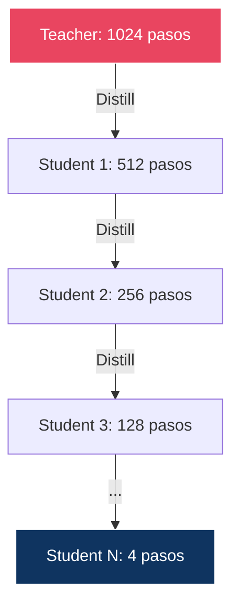
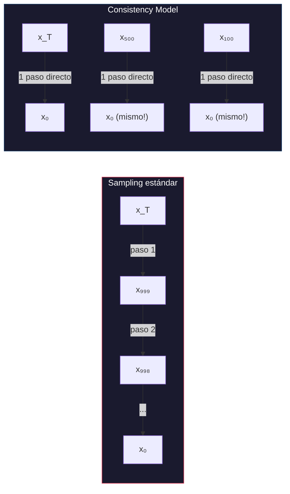
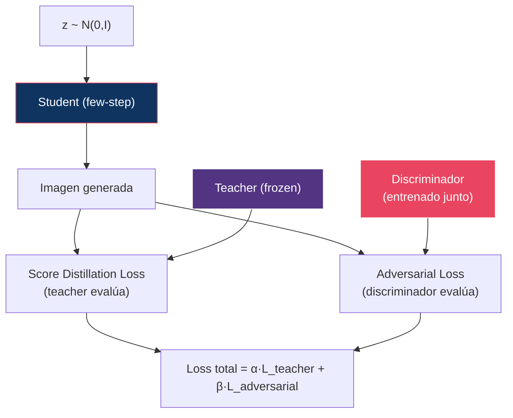
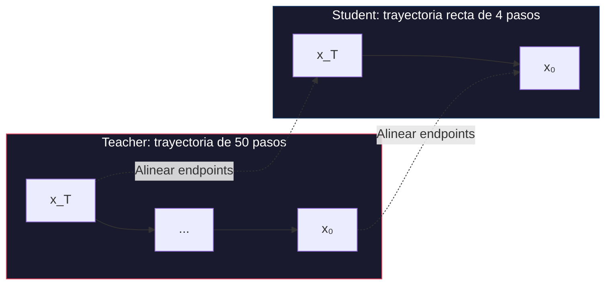
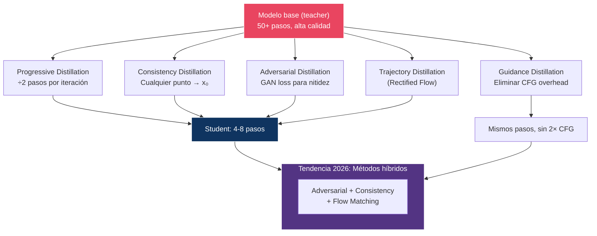

# 10 — Distillation y Few-Step Generation

> ¿Cómo pasar de 50 pasos a 4 — o incluso 1 — sin destruir la calidad?

---

## Índice

1. [El problema de la latencia](#1-problema)
2. [Progressive distillation](#2-progressive)
3. [Consistency models](#3-consistency)
4. [Adversarial distillation](#4-adversarial)
5. [Trajectory distillation](#5-trajectory)
6. [Comparación de métodos](#6-comparación)
7. [¿Qué se pierde en la distillation?](#7-qué-se-pierde)
8. [Estado del arte (2026)](#8-estado-del-arte)

---

## 1. El problema de la latencia

| Modelo | Pasos | NFE* | Latencia (est.) | Viable en producción? |
|:-------|:------|:-----|:----------------|:---------------------|
| DDPM | 1000 | 1000 | ~5 min | ✗ |
| SD 1.5 (DDIM) | 50 | 50 | ~5s | Parcialmente |
| SD 1.5 (DPM++) | 20 | 20 | ~2s | Sí |
| FLUX.1 dev | 30 | 60** | ~8s | Parcialmente |
| FLUX.1 schnell | 4 | 4 | ~1s | **Sí** |
| Consistency Model | 1-2 | 1-2 | ~0.2s | **Sí** |

*NFE = Number of Function Evaluations
**Con CFG = 2× evaluaciones por paso

> **Objetivo**: Reducir NFE manteniendo calidad → reduce latencia linealmente.

---

## 2. Progressive distillation

### Salimans & Ho (2022)

**Idea**: Iterativamente enseñar al modelo a hacer en N/2 pasos lo que antes hacía en N pasos.



### Procedimiento

En cada iteración:
1. El **teacher** genera un resultado con 2 pasos (t → t-1 → t-2)
2. El **student** debe replicar ese resultado con **1 paso** (t → t-2)
3. Loss: `‖student_output - teacher_output‖²`

### Resultado

Cada iteración **divide los pasos por 2**. Después de 8 iteraciones: 1024 → 4 pasos.

### Limitaciones

- Requiere **múltiples rondas** de entrenamiento
- Cada ronda necesita el teacher (costoso)
- La calidad degrada progresivamente

---

## 3. Consistency models

### Song et al. (2023)

**Idea radical**: Entrenar un modelo que mapee **cualquier punto de la trayectoria directamente a x₀**.



### Propiedad de consistencia

Un modelo de consistencia `fθ` satisface:

```
fθ(xₜ, t) = fθ(xₜ', t')    para todo t, t' en la misma trayectoria
```

Es decir: no importa en qué punto de la trayectoria evalúes el modelo, siempre devuelve el **mismo x₀**.

### Dos modos de entrenamiento

| Modo | Requiere teacher? | Calidad | Velocidad de training |
|:-----|:-----------------|:--------|:---------------------|
| **Consistency Distillation (CD)** | Sí (modelo pre-entrenado) | Mejor | Más rápido |
| **Consistency Training (CT)** | No (from scratch) | Menor | Más lento |

### Multistep consistency

Los consistency models también soportan **multistep** refinamiento:

```
x₀_rough = fθ(x_T, T)              // 1 paso: calidad básica
x₀_better = fθ(add_noise(x₀_rough, t₁), t₁)  // 2 pasos: mejor
x₀_best = fθ(add_noise(x₀_better, t₂), t₂)   // 3 pasos: aún mejor
```

> **Trade-off**: Más pasos = mejor calidad, hasta converger al resultado del teacher.

---

## 4. Adversarial distillation

### ADD: Adversarial Diffusion Distillation (Sauer et al., 2023)

**Combina** score distillation con un **discriminador adversarial** (GAN loss):



### ¿Por qué adversarial?

El loss de distillation (MSE contra el teacher) produce imágenes **borrosas** en pocos pasos. El discriminador adversarial fuerza al student a producir detalles **nítidos** y texturas **realistas**.

| Componente | Función |
|:-----------|:--------|
| Teacher loss | Asegura fidelidad semántica al prompt |
| Adversarial loss | Asegura nitidez y realismo perceptual |

### CAMF: Continuous Adversarial MeanFlow (2025)

Evolución de ADD que integra adversarial distillation con el framework de Flow Matching para mejor estabilidad de training.

---

## 5. Trajectory distillation

### Concepto

En lugar de destilar el **modelo**, destilar la **trayectoria** (secuencia de pasos).



### Conexión con Rectified Flow

Rectified Flow (módulo 07) es una forma de trajectory distillation:
1. Generar pares (ruido, dato) usando el teacher
2. Re-entrenar con trayectorias rectas entre esos pares
3. Las trayectorias más rectas necesitan menos pasos

---

## 6. Comparación de métodos

| Método | Pasos | Calidad vs teacher | Requiere teacher | Training cost | Estabilidad |
|:-------|:------|:------------------|:-----------------|:-------------|:------------|
| Progressive distillation | 4-8 | ~90% | Sí | Alto (múltiples rondas) | Alta |
| Consistency distillation | 1-4 | ~85-90% | Sí | Medio | Media |
| Consistency training | 1-4 | ~80-85% | No | Alto | Media |
| Adversarial distillation | 1-4 | ~90-95% | Sí | Alto | Baja (GAN training) |
| Rectified flow + distill | 4-8 | ~92-95% | Sí (implícito) | Medio | Alta |
| Guidance distillation | N* | ~95% (sin 2× CFG) | Sí | Medio | Alta |

*Mismos pasos pero sin el 2× overhead de CFG.

---

## 7. ¿Qué se pierde en la distillation?

### Degradaciones observadas

| Aspecto | Full model (50 pasos) | Distilled (4 pasos) |
|:--------|:---------------------|:--------------------|
| **Detalles finos** | Excelentes | Buenos (algo de blur) |
| **Diversidad** | Alta | Reducida |
| **Prompt adherence** | Alta | Similar |
| **Composición compleja** | Buena | Puede fallar |
| **Text rendering** | Dependiente del modelo | Ligeramente peor |
| **Coherencia anatómica** | Dependiente del modelo | Ligeramente peor |
| **Artefactos** | Raros | Más frecuentes |

### ¿Por qué ocurre la degradación?

1. **Mode averaging**: Con pocos pasos, el modelo tiende a promediar modos → blur
2. **Information loss**: No todos los detalles pueden transmitirse en 4 pasos
3. **Distributional shift**: El student opera en un régimen diferente al del teacher
4. **Guidance distortion**: Sin CFG, la adherencia al prompt es naturalmente menor

### Diagrama: calidad vs pasos

```
Calidad
  │
  │  ████████████████████████  ← Teacher (50 pasos, 100% calidad)
  │  ██████████████████████
  │  █████████████████        ← Adversarial distilled (4 pasos, ~93%)
  │  ████████████████         ← Rectified flow distilled (4 pasos, ~90%)
  │  █████████████            ← Progressive distilled (4 pasos, ~88%)
  │  ██████████               ← Consistency (2 pasos, ~85%)
  │  ███████                  ← Consistency (1 paso, ~80%)
  │
  └──────────────────────────── Pasos
  1    2    4    8   20   50
```

---

## 8. Estado del arte (2026)

### Tendencias actuales

1. **Hybrid distillation**: Combinar consistency + adversarial + flow matching
2. **Variance-reduced training**: Reducir el coste de la distillation misma (vrCL)
3. **Guidance distillation**: Eliminar el 2× overhead de CFG (FLUX.1 schnell)
4. **Multi-student**: Múltiples students especializados

### Modelos distilados prominentes

| Modelo | Método | Pasos | Resultado |
|:-------|:-------|:------|:---------|
| FLUX.1 schnell | Guidance + trajectory distillation | 1-4 | Sub-segundo, sin CFG |
| FLUX.2 Klein | Distillation + quantization | ~4 | Consumer GPU, sub-segundo |
| Z-Image Turbo | Few-step distillation + reward post-training | ~4 | <16GB VRAM |
| SD Turbo | ADD (adversarial distillation) | 1-4 | Real-time en GPU |
| SDXL Lightning | Progressive distillation | 2-4 | Rápido, buena calidad |

---

## Diagrama: el landscape de distillation



---

## Referencias

- Salimans, T. & Ho, J. (2022). *Progressive Distillation for Fast Sampling of Diffusion Models*. ICLR.
- Song, Y. et al. (2023). *Consistency Models*. ICML.
- Sauer, A. et al. (2023). *Adversarial Diffusion Distillation*. ECCV.
- Luo, S. et al. (2023). *Latent Consistency Models: Synthesizing High-Resolution Images with Few-Step Inference*. 

---

*← [09 — Guidance](../09-guidance/README.md) | [11 — Conditioning →](../11-conditioning/README.md)*
