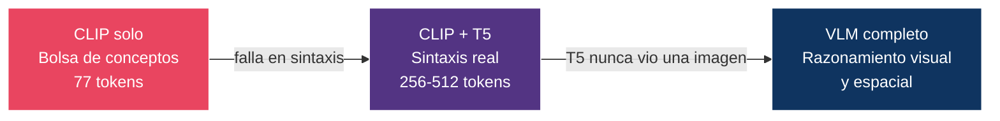
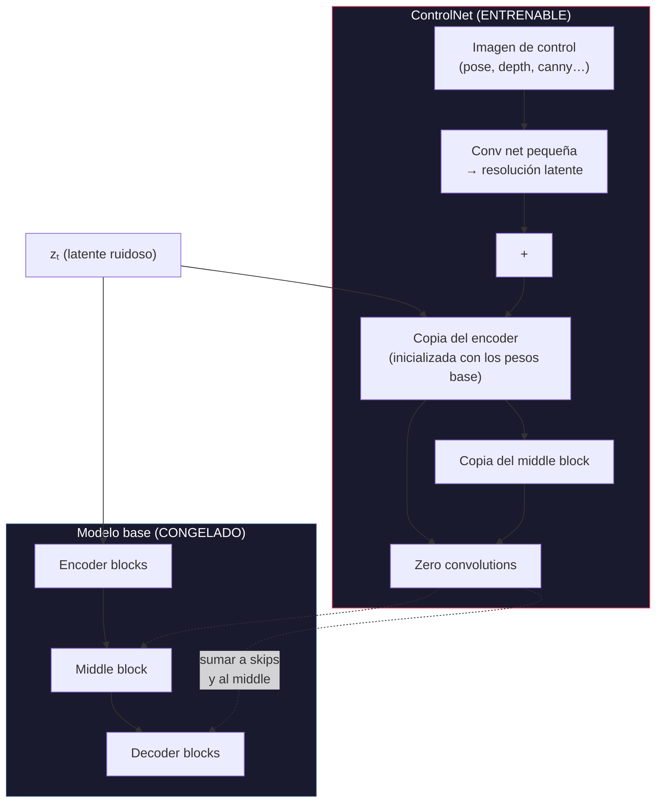
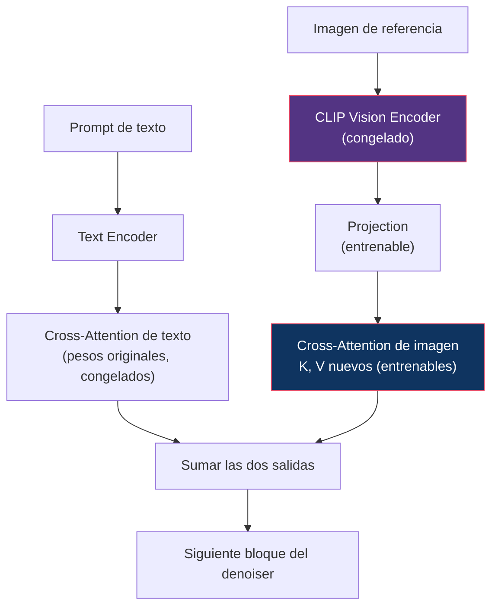
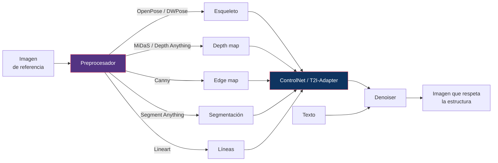
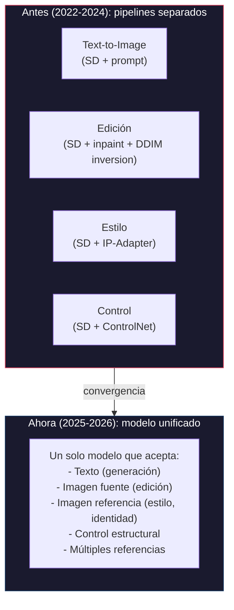

# 11 — Conditioning y Control

> Cómo los modelos reciben información adicional: desde texto hasta pose, depth, reference images, y adaptadores modulares.

---

## Índice

1. [Taxonomía de conditioning](#1-taxonomía-de-conditioning)
2. [Text conditioning: evolución de encoders](#2-text-conditioning-evolución-de-encoders)
3. [Los cuatro mecanismos de inyección](#3-los-cuatro-mecanismos-de-inyección)
4. [Micro-conditioning (SDXL)](#4-micro-conditioning-sdxl)
5. [ControlNet](#5-controlnet)
6. [IP-Adapter](#6-ip-adapter)
7. [LoRA y Textual Inversion](#7-lora-y-textual-inversion)
8. [Structural conditioning](#8-structural-conditioning)
9. [Unificación: generation + editing + reference](#9-unificación-generation--editing--reference)

---

## 1. Taxonomía de conditioning

```mermaid
graph TB
    COND["Conditioning"]

    COND --> TEXT["Textual"]
    COND --> VISUAL["Visual"]
    COND --> STRUCT["Structural"]
    COND --> META["Metadatos"]
    COND --> ADAPT["Adapters (modifican pesos)"]

    TEXT --> CLIP_C["CLIP (768d / 1280d)"]
    TEXT --> T5_C["T5-XXL (4096d)"]
    TEXT --> VLM_C["VLM / LLM"]

    VISUAL --> REF["Reference images"]
    VISUAL --> IPA["IP-Adapter"]
    VISUAL --> SRC["Imagen fuente (img2img)"]

    STRUCT --> POSE["Pose (OpenPose)"]
    STRUCT --> DEPTH["Depth map"]
    STRUCT --> EDGE["Edges (Canny)"]
    STRUCT --> SEG["Segmentation"]
    STRUCT --> MASK["Inpainting mask"]

    META --> SIZE["Resolución original"]
    META --> CROP["Coordenadas de crop"]
    META --> AR["Aspect ratio"]

    ADAPT --> LORA_C["LoRA"]
    ADAPT --> TI_C["Textual Inversion"]
    ADAPT --> DB_C["DreamBooth"]

    style TEXT fill:#533483,stroke:#e94560,color:#fff
    style VISUAL fill:#0f3460,stroke:#e94560,color:#fff
    style STRUCT fill:#16213e,stroke:#e94560,color:#fff
    style META fill:#1a1a2e,stroke:#e94560,color:#fff
    style ADAPT fill:#e94560,stroke:#fff,color:#fff
```



> **Distinción importante**: las cuatro primeras ramas son **entradas** al modelo en inferencia. La quinta (*adapters*) **modifica los pesos** — no es conditioning en sentido estricto, aunque cumpla la misma función práctica ([§7](#7-lora-y-textual-inversion)).

---

## 2. Text conditioning: evolución de encoders

| Text Encoder | Modelo(s) | Tokens | Dimensión | Fortalezas | Debilidades |
|:------------|:----------|:-------|:----------|:-----------|:-----------|
| **CLIP ViT-L/14** | SD 1.x | 77 | 768 | Rápido, ligero | Comprensión superficial |
| **CLIP-L + OpenCLIP-G** | SDXL | 77 | 768 + 1280 (concat 2048) + pooled 1280 | Más expresivo | Sigue limitado a 77 tokens |
| **CLIP-L/G + T5-XXL** | SD3, FLUX.1 | 77 + 256/512 | 768 + 1280 + 4096 | Prompts largos, comprensión sintáctica | T5-XXL ≈ 4.7B params (~9 GB fp16) |
| **VLM completo** | FLUX.2 | Largo | Variable | Comprensión visual y espacial | Coste de un modelo grande extra |
| **MLLM integrado** | Qwen-Image | Muy largo | Variable | Generación + edición unificadas | Complejidad del sistema |

### Por qué CLIP se queda corto

El límite no es solo la longitud. CLIP se entrena con un objetivo **contrastivo** sobre pares imagen-texto cortos, que premia identificar *qué* aparece, no *cómo se relaciona*. El resultado se comporta parcialmente como una bolsa de conceptos:

| Falla | Ejemplo |
|:------|:--------|
| Relaciones espaciales | «un cubo rojo **a la izquierda de** una esfera azul» |
| Vinculación de atributos | «un gato **rojo** y un perro **azul**» → colores intercambiados |
| Conteo | «**tres** manzanas» |
| Negación | «un paisaje **sin** árboles» |

T5 aporta comprensión sintáctica real (fue entrenado con objetivos de lenguaje, no contrastivos) pero **nunca ha visto una imagen**. El VLM cierra ese hueco. Ver [06 §7](../06-architectures/README.md#7-vlm-coupled-architectures).



---

## 3. Los cuatro mecanismos de inyección

Toda señal de condicionamiento entra por uno de estos cuatro caminos. La elección determina la **granularidad** del control.

### 3.1 Concatenación por canales

El más simple y el más olvidado en las explicaciones. La señal se apila con el latente ruidoso a lo largo del eje de canales:

```
entrada_unet = concat([ zₜ , señal ], dim=canales)
```

Es como funcionan realmente **img2img** e **inpainting**. Un checkpoint de inpainting de SD no tiene 4 canales de entrada sino **9**:

```
4 canales  →  zₜ (latente ruidoso)
4 canales  →  latente de la imagen enmascarada
1 canal    →  la máscara, redimensionada
```

Requiere modificar la primera capa convolucional, así que **exige reentrenar** (o al menos hacer fine-tuning) — de ahí que existan checkpoints «-inpainting» separados.

| Granularidad | Espacial, píxel a píxel |
|:---|:---|
| Direccionalidad | Unidireccional, entrada fija |
| Coste | Nulo en inferencia |
| Requiere entrenamiento | **Sí** (cambia la forma de entrada) |

### 3.2 Cross-Attention (SD 1.x, SDXL, PixArt)

```
Q = W_Q · features_imagen      ← del denoiser
K = W_K · embeddings_texto     ← del text encoder
V = W_V · embeddings_texto

Salida = softmax(QKᵀ/√d) · V
```

| Granularidad | Token a token |
|:---|:---|
| Direccionalidad | Unidireccional: texto → imagen |
| Coste | Medio |
| Ventaja clave | `τ(c)` puede ser cualquier cosa sin cambiar la arquitectura |

### 3.3 Joint Attention (MMDiT, SD3, FLUX)

```
Q = concat(Q_texto, Q_imagen)
K = concat(K_texto, K_imagen)
V = concat(V_texto, V_imagen)
```

| Granularidad | Token a token |
|:---|:---|
| Direccionalidad | **Bidireccional**: texto ↔ imagen |
| Coste | Alto (la secuencia crece) |
| Ventaja clave | La representación del prompt se actualiza durante la generación |

### 3.4 Modulación / AdaLN (DiT)

```
γ, β, α = MLP( emb(t) + emb_pooled(c) )
h ← h + α · Bloque( γ · LayerNorm(h) + β )
```

| Granularidad | **Global** — un vector para toda la imagen |
|:---|:---|
| Direccionalidad | Condicionamiento → todas las posiciones por igual |
| Coste | Bajo |
| Limitación | No permite control por token; sirve para timestep, clase, tamaño |

> El `α` con init a cero es el AdaLN-**Zero** de [06 §3](../06-architectures/README.md#3-dit).

### Comparación

| Mecanismo | Granularidad | Dirección | Coste | Reentrenar | Uso típico |
|:----------|:-------------|:----------|:------|:-----------|:-----------|
| Concatenación | Espacial | → | Nulo | **Sí** | img2img, inpainting |
| Cross-Attention | Token | → | Medio | No (si ya existe) | Texto en SD/SDXL |
| Joint Attention | Token | ↔ | Alto | — | Texto en SD3/FLUX |
| AdaLN | Global | → | Bajo | — | Timestep, clase, metadatos |

---

## 4. Micro-conditioning (SDXL)

Una idea sencilla y con mucho efecto práctico, que suele omitirse.

**Problema**: entrenar solo con imágenes de alta resolución desperdicia la mayor parte de un dataset. Pero incluir imágenes pequeñas reescaladas enseña al modelo a generar imágenes borrosas, y recortar al cuadrado enseña a generar sujetos descentrados o cortados.

**Solución de SDXL**: no descartar esas imágenes — **decirle al modelo cómo son**. Se añaden como condicionamiento, vía embeddings sinusoidales por AdaLN:

| Señal | Qué comunica | Qué permite en inferencia |
|:------|:-------------|:--------------------------|
| `original_size` (h, w) | Resolución real antes de reescalar | Pedir «como una imagen de 1024²» aunque se genere a otra escala → menos blur |
| `crop_coords` (top, left) | Desde dónde se recortó | Pedir `(0,0)` → sujetos centrados, sin cortar |
| `target_size` (h, w) | Resolución de salida buscada | Soporte de aspect ratios variados |

> **El patrón general**: en lugar de filtrar los datos imperfectos, se **etiqueta la imperfección** y se condiciona sobre ella. En inferencia se pide el valor «bueno». Es una técnica reutilizable — la misma lógica aparece en el condicionamiento por calidad estética de otros modelos.

---

## 5. ControlNet

### Zhang et al. (2023)

**Idea**: duplicar el encoder del modelo base en una copia entrenable que recibe **el mismo latente ruidoso más una señal de control**, y sumar sus features de vuelta al modelo congelado.



Tres detalles que suelen dibujarse mal:

1. **La copia recibe `zₜ`**, no solo la imagen de control. Es una copia funcional del encoder, no un codificador de hints aislado.
2. La imagen de control pasa antes por una **red convolucional pequeña** que la lleva a la resolución del latente.
3. Las features se suman **a las skip connections y al middle block**, no solo a la salida del decoder.

### Zero convolution

Las capas de salida se inicializan a **cero**, así que en el paso 0 del entrenamiento el ControlNet aporta exactamente nada y el modelo se comporta como el base. El control se aprende sin destruir lo aprendido.

> **Un patrón que se repite en todo este repositorio**: AdaLN-**Zero** ([06 §3](../06-architectures/README.md#3-dit)), zero convolutions aquí, y `B = 0` en LoRA ([§7](#7-lora-y-textual-inversion)). Los tres son la misma idea — **inicializar el módulo nuevo como la identidad** para que el entrenamiento parta del modelo que ya funciona.

### Coste

Duplicar el encoder añade aproximadamente **un 45-50 % de cómputo** por paso. No es gratis: con ControlNet + CFG se pagan ~3× las evaluaciones de un modelo base sin nada.

### Tipos de control soportados

| Control | Input | Uso |
|:--------|:------|:----|
| Canny edges | Bordes | Preservar estructura |
| Depth | Mapa de profundidad | Composición 3D |
| Pose (OpenPose) | Esqueleto humano | Postura de personas |
| Segmentation | Mapa semántico | Layout de escena |
| Normal map | Normales de superficie | Iluminación |
| Scribble / Lineart | Dibujo a mano | Composición libre |

### Alternativas más ligeras

| Método | Diferencia con ControlNet | Coste |
|:-------|:--------------------------|:------|
| **T2I-Adapter** | Red pequeña que inyecta features una sola vez, sin copiar el encoder | ~5 % |
| **ControlNet-LoRA** | Aproxima la copia con adaptadores de rango bajo | Reducido |
| **ControlNet Union** | Un solo modelo para varios tipos de control | Igual que uno solo |

---

## 6. IP-Adapter

### Ye et al. (2023)

**Idea**: inyectar una **imagen de referencia** como condicionamiento, por el mismo camino que el texto.



### Decoupled cross-attention

La clave del método está en el nombre. IP-Adapter **no reemplaza** la cross-attention de texto ni la reentrena: añade **una segunda** cross-attention, con `K` y `V` propios derivados de la imagen, y suma las dos salidas.

Ambas comparten la misma `Q` (que viene del denoiser). Solo se entrenan las proyecciones `W_K'`, `W_V'` y la capa de proyección de features de imagen — del orden de 22M parámetros, frente a los cientos de millones de un ControlNet.

> **Por qué desacoplar importa**: si se concatenaran los tokens de imagen a los de texto en la cross-attention existente, competirían por la misma distribución de atención y la imagen ahogaría al prompt. Con ramas separadas se puede **ponderar cada una** de forma independiente, que es el parámetro `scale` que ajustan los usuarios.

### Usos

| Uso | Descripción |
|:----|:-----------|
| Transferencia de estilo | Estilo de la referencia, contenido del prompt |
| Consistencia facial | Mantener identidad (IP-Adapter-FaceID) |
| Consistencia de producto | Preservar la apariencia de un objeto |
| Multi-referencia | Varias imágenes para aspectos distintos |

---

## 7. LoRA y Textual Inversion

### LoRA: modificar los pesos

LoRA **no es conditioning** en sentido estricto — no es una entrada del modelo, es una modificación de los pesos:

```
W' = W + (α/r) · B·A

W ∈ ℝ^(d×k)  congelado
B ∈ ℝ^(d×r),  A ∈ ℝ^(r×k),   r ≪ min(d,k)
```

Solo se entrenan `A` y `B`. Con `r = 16` sobre una matriz de 1024×1024, se pasa de ~1M parámetros a ~33K: una reducción de 30×.

**`B` se inicializa a cero** (y `A` con ruido gaussiano), así que `ΔW = 0` al empezar: el modelo arranca exactamente como el base. Es el mismo patrón que las zero convolutions de [§5](#5-controlnet).

En la práctica se aplica a las proyecciones de atención (`W_Q`, `W_K`, `W_V`, `W_O`) — y en particular a las de **cross-attention**, que es donde reside la relación texto-imagen.

### Textual Inversion: modificar el vocabulario

El extremo opuesto. No se toca ni un peso del modelo: se aprende **un único embedding nuevo** `S*` en el espacio del text encoder, optimizándolo para que reconstruya un conjunto de imágenes de ejemplo.

```
Vocabulario original  +  [S*]  ←  el único parámetro entrenado (~1 KB)
```

Después se usa en el prompt como una palabra más: `"una foto de S* en la playa"`.

### Comparación

| | Textual Inversion | LoRA | DreamBooth | ControlNet |
|:--|:------------------|:-----|:-----------|:-----------|
| Qué se entrena | 1 embedding | Matrices de rango bajo | Todo el modelo (o gran parte) | Copia del encoder |
| Tamaño | ~KB | ~10 MB – 1 GB | Tamaño completo | ~300 MB – 2 GB |
| Expresividad | Baja | Media-alta | Alta | Alta (estructural) |
| Coste en inferencia | Nulo | Nulo (fusionable) | Nulo | ~+50 % |
| Combinable | Sí | Sí (varios a la vez) | No | Sí |

> **Tamaños de LoRA**: dependen del modelo base y del rango. ~10-150 MB para SD 1.5, ~100-400 MB para SDXL, y hasta varios GB para FLUX. Citar «50-100 MB» como cifra general es válido solo para SD 1.5.

---

## 8. Structural conditioning

### Pipeline típico



> **El preprocesador importa tanto como el ControlNet**. Un ControlNet de depth entrenado con MiDaS espera la distribución de mapas de MiDaS; alimentarlo con Depth Anything, cuyo rango y calibración difieren, degrada el control aunque ambos sean «mapas de profundidad». Es un caso de desplazamiento distribucional que se diagnostica mal con frecuencia.

---

## 9. Unificación: generation + editing + reference

### Tendencia 2025-2026



### Qué lo hizo posible

No fue una técnica nueva, sino que **las condiciones dejaron de necesitar mecanismos distintos**:

1. Con **joint attention** ([§3.3](#3-los-cuatro-mecanismos-de-inyección)), cualquier modalidad se tokeniza y se concatena a la secuencia. Texto, imagen de referencia y control estructural entran por el mismo camino.
2. Con un **VLM** al frente, la imagen de referencia se entiende semánticamente en lugar de proyectarse como un vector de estilo.
3. Los adaptadores externos existían porque el modelo base **no podía** reentrenarse para cada tarea. Con datos de entrenamiento multi-tarea, esa restricción desaparece.

> **El coste de la unificación**: los adaptadores eran modulares y entrenables por cualquiera con una GPU. Un modelo unificado hay que reentrenarlo entero para añadir una capacidad. Se gana calidad y coherencia; se pierde el ecosistema abierto que hizo grande a SD 1.5.

### Ejemplos

| Modelo | Capacidades unificadas |
|:-------|:----------------------|
| FLUX.2 | Generación + multi-referencia + tipografía |
| Qwen-Image 2.0+ | Generación + edición en un solo modelo |
| LTX-2.3 | T2V + I2V + V2V + conditioning + audio |

> ⚠️ Pendiente de contrastar con [16 — Image Models](../16-image-models/README.md) y [17 — Video Models](../17-video-models/README.md).

---

## Referencias

- Rombach, R. et al. (2022). *High-Resolution Image Synthesis with Latent Diffusion Models*. CVPR 2022. — Cross-attention conditioning.
- Zhang, L., Rao, A., & Agrawala, M. (2023). *Adding Conditional Control to Text-to-Image Diffusion Models*. ICCV 2023. — **ControlNet.**
- Mou, C. et al. (2024). *T2I-Adapter: Learning Adapters to Dig out More Controllable Ability for Text-to-Image Diffusion Models*. AAAI 2024.
- Ye, H. et al. (2023). *IP-Adapter: Text Compatible Image Prompt Adapter for Text-to-Image Diffusion Models*.
- Hu, E.J. et al. (2022). *LoRA: Low-Rank Adaptation of Large Language Models*. ICLR 2022.
- Gal, R. et al. (2023). *An Image is Worth One Word: Personalizing Text-to-Image Generation using Textual Inversion*. ICLR 2023.
- Ruiz, N. et al. (2023). *DreamBooth: Fine Tuning Text-to-Image Diffusion Models for Subject-Driven Generation*. CVPR 2023.
- Podell, D. et al. (2024). *SDXL: Improving Latent Diffusion Models for High-Resolution Image Synthesis*. ICLR 2024. — **Micro-conditioning** ([§4](#4-micro-conditioning-sdxl)).

---

*← [10 — Distillation](../10-distillation/README.md) | 12 — Training (pendiente)*
