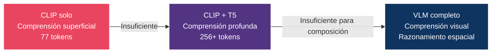
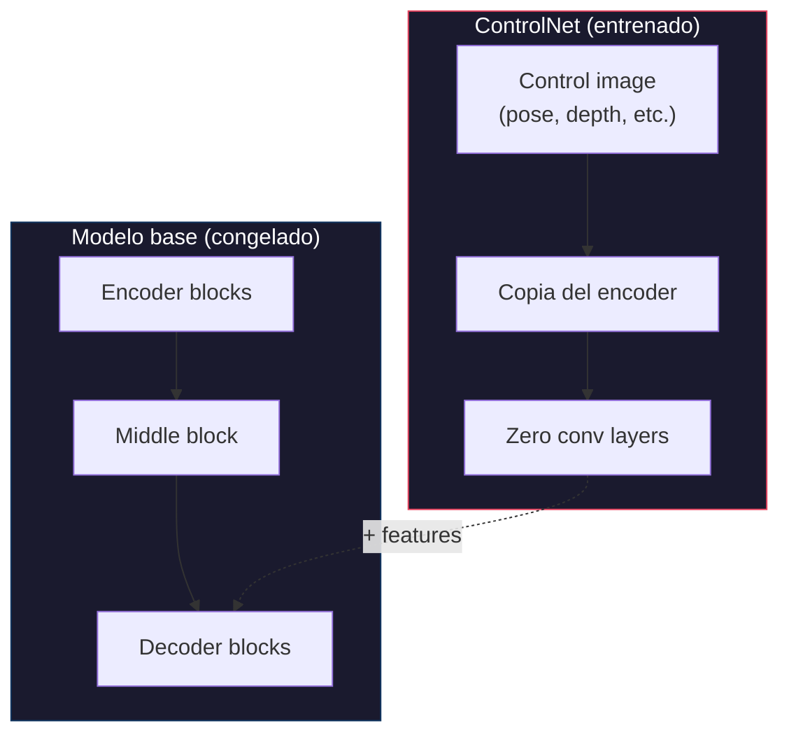
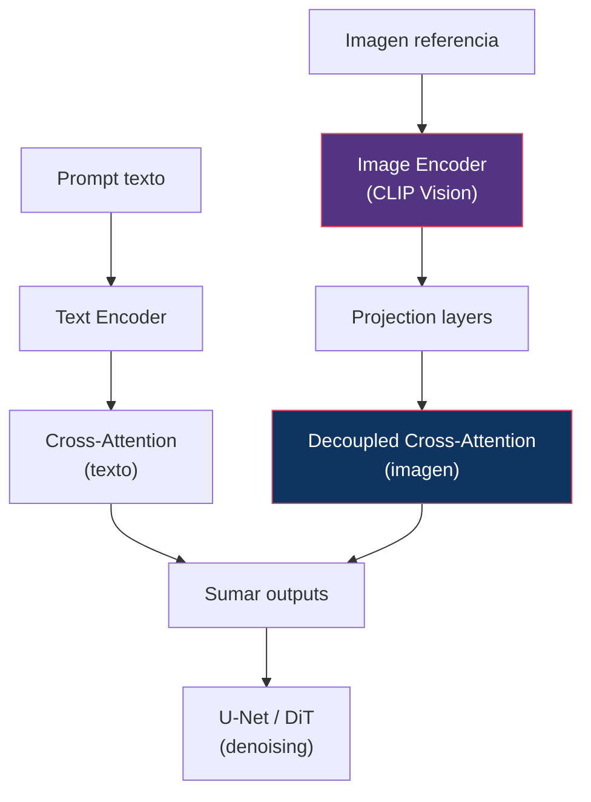
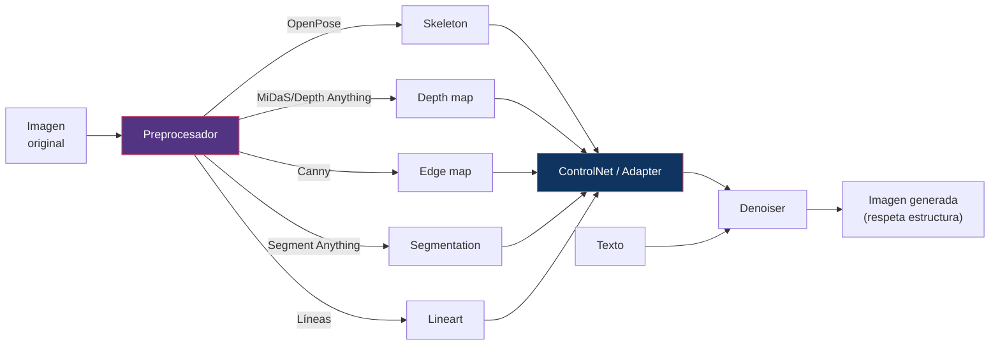
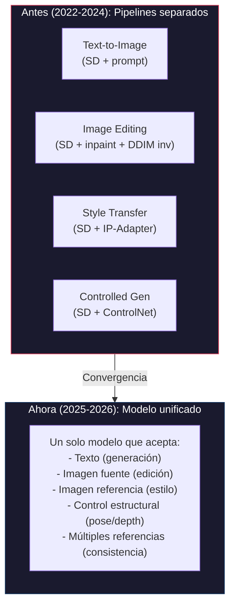

# 11 — Conditioning y Control

> Cómo los modelos reciben información adicional: desde texto hasta pose, depth, reference images, y adaptadores modulares.

---

## Índice

1. [Taxonomía de conditioning](#1-taxonomía)
2. [Text conditioning: evolución de encoders](#2-text)
3. [Mecanismos de inyección](#3-mecanismos)
4. [ControlNet](#4-controlnet)
5. [IP-Adapter](#5-ip-adapter)
6. [LoRA como conditioning](#6-lora)
7. [Structural conditioning](#7-structural)
8. [Unificación: generation + editing + reference](#8-unificación)

---

## 1. Taxonomía de conditioning

```mermaid
graph TB
    COND["Conditioning"]

    COND --> TEXT["Textual"]
    COND --> VISUAL["Visual"]
    COND --> STRUCT["Structural"]
    COND --> ADAPT["Adapters"]

    TEXT --> CLIP_C["CLIP (768d/1280d)"]
    TEXT --> T5_C["T5-XXL (4096d)"]
    TEXT --> VLM_C["VLM (Mistral, LLM)"]

    VISUAL --> REF["Reference images"]
    VISUAL --> IPA["IP-Adapter"]
    VISUAL --> STYLE["Style reference"]

    STRUCT --> POSE["Pose (OpenPose)"]
    STRUCT --> DEPTH["Depth map"]
    STRUCT --> EDGE["Edges (Canny)"]
    STRUCT --> SEG["Segmentation"]
    STRUCT --> MASK["Inpainting mask"]
    STRUCT --> SKETCH["Sketch"]

    ADAPT --> LORA_C["LoRA"]
    ADAPT --> CN_C["ControlNet"]
    ADAPT --> TI_C["Textual Inversion"]

    style TEXT fill:#533483,stroke:#e94560,color:#fff
    style VISUAL fill:#0f3460,stroke:#e94560,color:#fff
    style STRUCT fill:#16213e,stroke:#e94560,color:#fff
    style ADAPT fill:#e94560,stroke:#fff,color:#fff
```



---

## 2. Text conditioning: evolución de encoders

| Text Encoder | Modelo(s) | Tokens | Dimensión | Fortalezas | Debilidades |
|:------------|:----------|:-------|:----------|:-----------|:-----------|
| **CLIP ViT-L/14** | SD 1.x | 77 | 768 | Rápido, ligero | Comprensión limitada |
| **CLIP-L + OpenCLIP-G** | SDXL | 77 | 768+1280 | Más expresivo | Todavía 77 tokens |
| **CLIP-L+G + T5-XXL** | SD3, FLUX.1 | 77+256 | 768+1280+4096 | Comprensión profunda | T5 = ~10GB VRAM |
| **Mistral-3 24B VLM** | FLUX.2 | Largo | Variable | Comprensión visual+textual | ~24GB VRAM |
| **MLLM integrado** | Qwen-Image | 4500+ | Variable | Generación + edición | Complejo |

### Evolución causal



---

## 3. Mecanismos de inyección

### Cross-Attention (SD 1.x, SDXL)

```
Q = projection(image_features)     ← del denoiser
K = projection(text_embeddings)    ← del text encoder
V = projection(text_embeddings)    ← del text encoder

Output = softmax(QKᵀ/√d) · V      ← texto modifica imagen
```

**Flujo**: Unidireccional (texto → imagen). El texto no se actualiza.

### Joint Attention (MMDiT, SD3)

```
Q = concat(Q_text, Q_image)
K = concat(K_text, K_image)
V = concat(V_text, V_image)

Output = softmax(QKᵀ/√d) · V      ← bidireccional: texto ↔ imagen
```

**Flujo**: Bidireccional. Texto e imagen se influencian mutuamente.

### AdaLN / AdaLN-Zero (DiT)

```
γ, β = MLP(timestep_emb + pooled_text_emb)
output = γ · LayerNorm(x) + β
```

**Flujo**: Global conditioning (sin token-level control). Modula la normalización.

### Comparación

| Mecanismo | Granularidad | Dirección | Coste | Uso |
|:----------|:------------|:----------|:------|:----|
| Cross-Attention | Token-level | Text → Image | Medio | SD 1.x, SDXL |
| Joint Attention | Token-level | Text ↔ Image | Alto | SD3, FLUX |
| AdaLN | Global | Conditioning → All | Bajo | DiT (complemento) |

---

## 4. ControlNet

### Zhang et al. (2023)

**Idea**: Añadir una **copia del encoder** del modelo base que recibe una señal de control adicional (pose, depth, edges), y fusiona sus features con el denoiser original.



### Zero convolution

Los outputs del ControlNet se inicializan a **cero**, así que al inicio el modelo se comporta exactamente como el base. El control se aprende gradualmente.

### Tipos de control soportados

| Control | Input | Ejemplo de uso |
|:--------|:------|:-------------|
| Canny edges | Bordes de la imagen | Preservar estructura |
| Depth | Mapa de profundidad | Composición 3D |
| Pose (OpenPose) | Skeleton humano | Posición de personas |
| Segmentation | Mapa semántico | Layout de escena |
| Normal map | Normales de superficie | Iluminación |
| Scribble | Dibujo a mano | Composición libre |
| Inpainting | Máscara binaria | Edición selectiva |

### ControlNet Union (2025-2026)

Tendencia moderna: un solo ControlNet que soporta **múltiples tipos de control simultáneamente**, seleccionados dinámicamente.

---

## 5. IP-Adapter

### Ye et al. (2023)

**Idea**: Inyectar **imagen de referencia** como conditioning, similar a como se inyecta texto.



### Decoupled cross-attention

IP-Adapter no reemplaza la cross-attention de texto. Añade una **nueva** cross-attention con claves y valores derivados de la imagen, que se suma a la original.

### Usos

| Uso | Descripción |
|:----|:-----------|
| Style transfer | Usar estilo de una imagen referencia |
| Face consistency | Mantener identidad facial |
| Product consistency | Mantener apariencia de producto |
| Multi-reference | Múltiples imágenes para diferentes aspectos |

---

## 6. LoRA como conditioning

### ¿LoRA es conditioning?

Técnicamente, LoRA no es "conditioning" en el sentido de input al modelo. Es una **modificación de los pesos** que sesga al modelo hacia un dominio específico.

```
W' = W + α · BA
```

donde:
- W = pesos originales (congelados)
- B ∈ ℝ^(d×r), A ∈ ℝ^(r×d) con r << d (rank bajo)
- α = factor de escala

### Pero funciona como conditioning porque...

Un LoRA entrenado en "style anime" hace que **toda** generación tenga ese estilo, efectivamente "condicionando" el modelo a un dominio.

| LoRA vs Conditioning explícito | LoRA | Conditioning |
|:-------------------------------|:-----|:-------------|
| Requiere training | Sí | No (text/image) |
| Persistente | Sí (cargado en pesos) | No (por prompt) |
| Combinable | Sí (múltiples LoRAs) | Sí (multi-cond) |
| Reversible | Sí (descargar LoRA) | Sí (cambiar prompt) |
| VRAM extra | Mínimo (~50-100MB) | Variable |

---

## 7. Structural conditioning

### Pipeline típico de control estructural



---

## 8. Unificación: generation + editing + reference

### Tendencia 2025-2026

Los modelos modernos unifican capacidades que antes requerían pipelines separados:



### Ejemplos

| Modelo | Capacidades unificadas |
|:-------|:----------------------|
| FLUX.2 | Generación + multi-reference (10 imgs) + typography |
| Qwen-Image 2.0+ | Generación + edición en un solo modelo |
| LTX-2.3 | T2V + I2V + V2V + conditioning + audio |

---

## Referencias

- Zhang, L. et al. (2023). *Adding Conditional Control to Text-to-Image Diffusion Models*. ICCV.
- Ye, H. et al. (2023). *IP-Adapter: Text Compatible Image Prompt Adapter*. 
- Hu, E.J. et al. (2022). *LoRA: Low-Rank Adaptation of Large Language Models*. ICLR.
- Ruiz, N. et al. (2023). *DreamBooth: Fine Tuning Text-to-Image Diffusion Models for Subject-Driven Generation*. CVPR.

---

*← [10 — Distillation](../10-distillation/README.md) | [12 — Training →](../12-training/README.md)*
