# 15 — Descomposición de Pipelines

> Ningún modelo generativo moderno es una sola red neuronal. Cada uno es un **sistema de componentes** interconectados. Aquí los desarmamos pieza por pieza.

---

## Índice

1. [Anatomía general de un pipeline](#1-anatomía-general)
2. [Pipeline: Stable Diffusion 1.5 / SDXL](#2-pipeline-stable-diffusion-15--sdxl)
3. [Pipeline: Stable Diffusion 3 / 3.5](#3-pipeline-stable-diffusion-3--35)
4. [Pipeline: FLUX.1](#4-pipeline-flux1)
5. [Pipeline: FLUX.2](#5-pipeline-flux2)
6. [Pipeline: Z-Image](#6-pipeline-z-image)
7. [Pipeline: Wan 2.2 (Video)](#7-pipeline-wan-22-video)
8. [Pipeline: LTX-2.3 (Video)](#8-pipeline-ltx-23-video)
9. [Tabla comparativa de componentes](#9-tabla-comparativa-de-componentes)
10. [¿Dónde está el cuello de botella?](#10-dónde-está-el-cuello-de-botella)

---

## 1. Anatomía general

Todo pipeline de generación sigue este flujo:

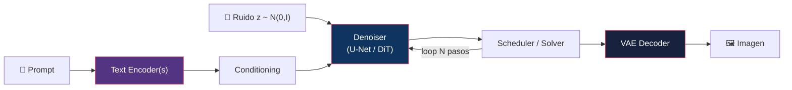

### Componentes universales

| Componente | Función | Ejemplos |
|:-----------|:--------|:---------|
| **Text Encoder** | Convertir texto en embeddings | CLIP, T5, Mistral |
| **Conditioning** | Inyectar info de texto en el denoiser | Cross-attention, AdaLN, joint attention |
| **VAE Encoder** | Comprimir imagen a latent space — **solo en img2img, inpainting y edición**; en texto-imagen puro no se usa | KL-VAE, VQ-VAE |
| **Denoiser** | Predecir ruido/velocidad | U-Net, DiT, MMDiT |
| **Scheduler** | Controlar el proceso de denoising | DDPM, Euler, DPM-Solver++ |
| **Guidance** | Amplificar adherencia al prompt | CFG, dynamic CFG |
| **VAE Decoder** | Reconstruir imagen desde latent | Decoder de VAE |

---

## 2. Pipeline: Stable Diffusion 1.5 / SDXL

### SD 1.5

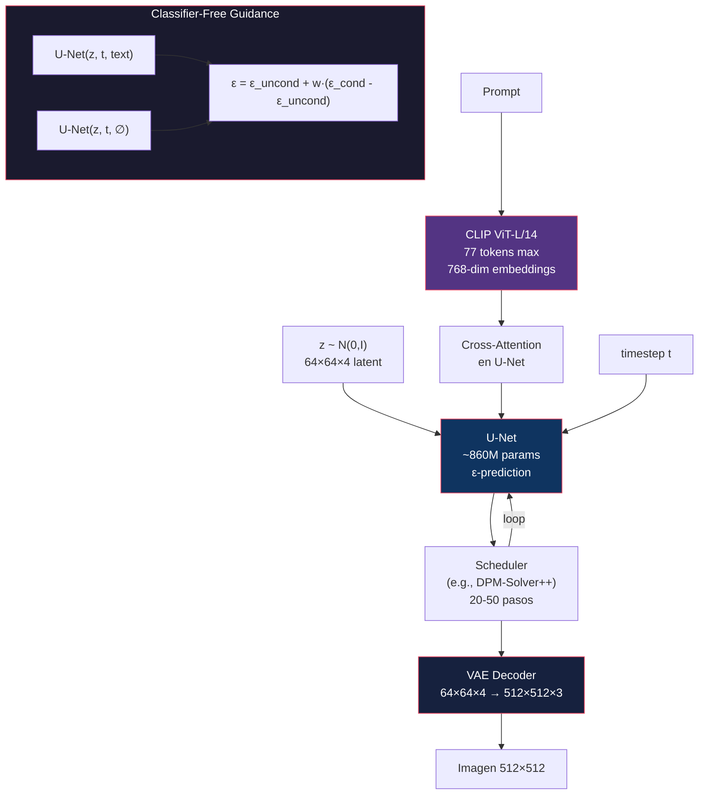

| Componente | Especificación |
|:-----------|:--------------|
| Text Encoder | CLIP ViT-L/14 (77 tokens, 768d) |
| Denoiser | U-Net ~860M params |
| Prediction | ε-prediction |
| VAE | KL-f8 (factor 8 de compresión) |
| Latent shape | 64×64×4 (para 512×512 output) |
| Scheduler default | PNDM, luego DPM-Solver++ |
| Guidance | CFG (2 forward passes) |
| VRAM típico | ~4-6 GB (FP16) |

### SDXL

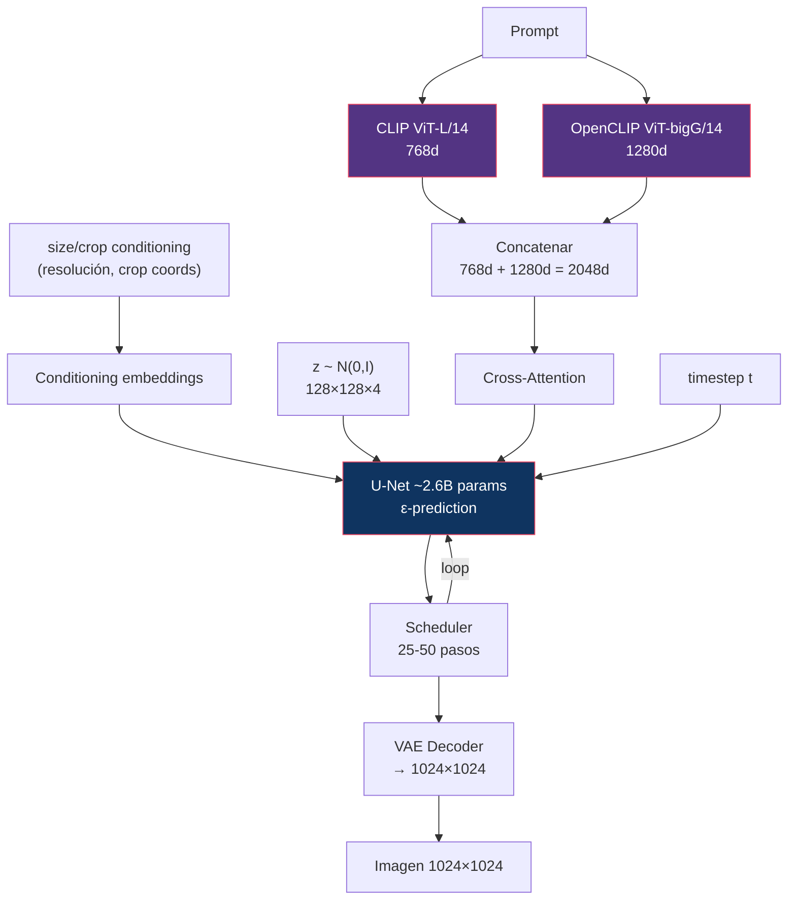

| Cambio vs SD 1.5 | Detalle |
|:-----------------|:--------|
| **2 text encoders** | CLIP-L + OpenCLIP-G concatenados (2048d) + pooled (1280d) |
| **U-Net más grande** | 2.6B vs 860M params, con la atención redistribuida |
| **Resolución nativa** | 1024×1024 vs 512×512 |
| **Micro-conditioning** | `original_size`, `crop_coords`, `target_size` vía embeddings ([11 §4](../11-conditioning/README.md#4-micro-conditioning-sdxl)) |
| **Refiner opcional** | Un segundo modelo especializado en los últimos timesteps |

> ⚠️ **Corrección frecuente**: se atribuye v-prediction a SDXL. **SDXL 1.0 base usa ε-prediction** (`prediction_type: "epsilon"`). El modelo de la familia Stable Diffusion que sí usa v-prediction es **SD 2.x en la variante 768-v**. Ver [01 §7](../01-foundations/README.md#7-parametrizaciones).

---

## 3. Pipeline: Stable Diffusion 3 / 3.5

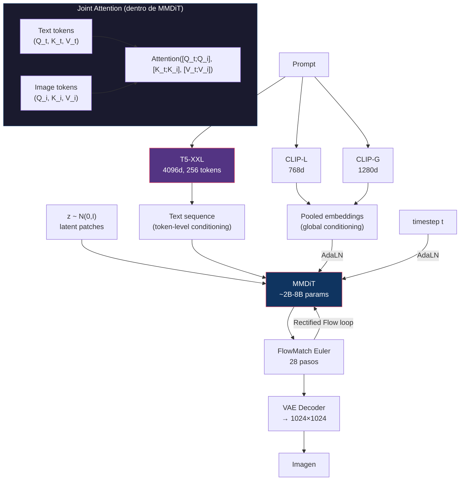

| Componente | SD3 | SD 3.5 Large | SD 3.5 Medium |
|:-----------|:----|:-------------|:--------------|
| Text Encoders | CLIP-L + CLIP-G + T5-XXL | CLIP-L + CLIP-G + T5-XXL | CLIP-L + CLIP-G + T5-XXL |
| Denoiser | MMDiT ~2B | MMDiT ~8B | MMDiT-X ~2.5B |
| Prediction | Rectified Flow (velocity) | Rectified Flow | Rectified Flow |
| QK-Norm | No | Sí | Sí |
| Pasos default | 28 | 28 | 28 |
| VRAM (FP16) | ~12GB (sin T5) | ~24GB | ~12GB |

### Cambios fundamentales vs SDXL

1. **U-Net → MMDiT**: Cambio arquitectónico completo
2. **ε-prediction → Rectified Flow**: Cambio de paradigma de entrenamiento
3. **Cross-attention → Joint attention**: Texto e imagen interactúan bidireccionalmente
4. **T5-XXL añadido**: Comprensión de texto mucho más profunda (pero costoso en VRAM)

---

## 4. Pipeline: FLUX.1

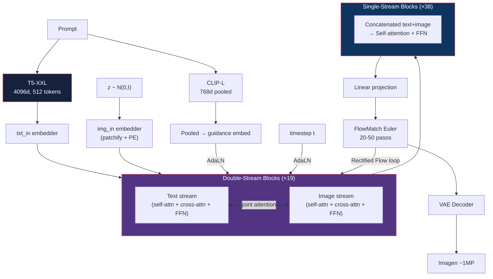

| Componente | FLUX.1 [dev] | FLUX.1 [schnell] |
|:-----------|:-------------|:-----------------|
| Text Encoders | CLIP-L + T5-XXL | CLIP-L + T5-XXL |
| Params | 12B | 12B |
| Blocks | 19 double + 38 single | 19 double + 38 single |
| Prediction | Rectified Flow (velocity) | Rectified Flow (destilado) |
| Guidance | **Destilada** (`w` como embedding, **1 pasada**) | Destilada, sin control |
| NFE por paso | **1** | **1** |
| Pasos | 20-50 | 1-4 |
| Licencia | Non-commercial | Apache 2.0 |

> ⚠️ **Corrección frecuente**: contar FLUX.1 dev como «CFG clásico, 2 forward passes». **No lo es.** Está *guidance-distilled*: el valor de guidance (típicamente 3.5) entra como **embedding de condicionamiento**, igual que el timestep, y se ejecuta **una sola pasada por paso**. Por eso 30 pasos son 30 NFE y no 60, y por eso no admite negative prompts. Ver [09 §8](../09-guidance/README.md#8-guidance-en-modelos-modernos) y [10 §1](../10-distillation/README.md#1-el-problema-de-la-latencia).

### Innovación: Double + Single stream

La arquitectura FLUX.1 usa un diseño **híbrido**:
- **Double-stream blocks (×19)**: texto e imagen con pesos separados y joint attention (como MMDiT)
- **Single-stream blocks (×38)**: una sola secuencia concatenada con pesos compartidos

> **Qué sugiere el reparto 19/38**: la separación por modalidad importa sobre todo **al principio**, donde las estadísticas de tokens de texto y de imagen son muy distintas. Una vez alineadas las representaciones, los pesos compartidos bastan y salen más baratos. Es una posición intermedia entre MMDiT (todo dual) y S3-DiT (todo single) — ver [06 §5](../06-architectures/README.md#5-s3-dit).

---

## 5. Pipeline: FLUX.2

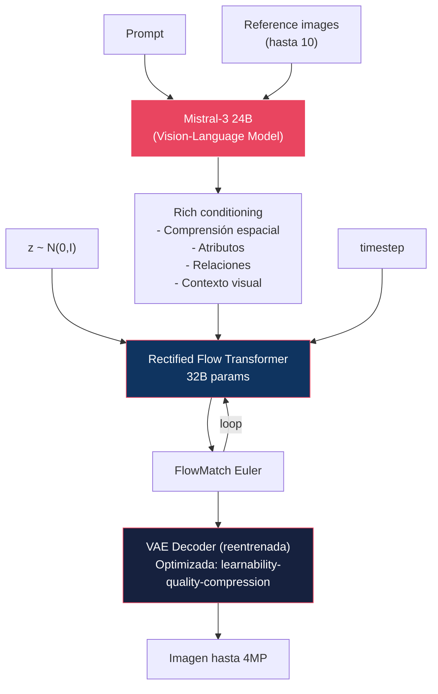

| Componente | FLUX.2 | vs FLUX.1 |
|:-----------|:-------|:----------|
| Comprensión semántica | Mistral-3 24B VLM | CLIP-L + T5-XXL |
| Generador | 32B Flow Transformer | 12B Flow Transformer |
| VAE | Reentrenada from scratch | Heredada |
| Multi-reference | Hasta 10 imágenes | No soportado |
| Resolución máx | 4 megapíxeles | ~1 megapíxel |
| Typography | Mejorada significativamente | Básica |
| VRAM estimado | ~40GB+ (FP8) | ~24GB (FP8) |

### FLUX.2 Klein

Variante distilada para consumer GPUs:
- **Sub-segundo** de generación
- Objetivo: <16GB VRAM
- Distillation + cuantización agresiva

---

## 6. Pipeline: Z-Image

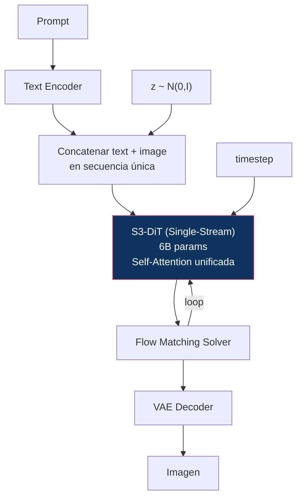

| Aspecto | Z-Image | vs FLUX.1 |
|:--------|:--------|:----------|
| Arquitectura | S3-DiT (single-stream) | Double+Single stream |
| Params | 6B | 12B |
| VRAM | <16GB | ~24GB |
| Velocidad | Sub-segundo (enterprise) | 5-15 segundos |
| Filosofía | Eficiencia > escala | Escala > eficiencia |

---

## 7. Pipeline: Wan 2.2 (Video)

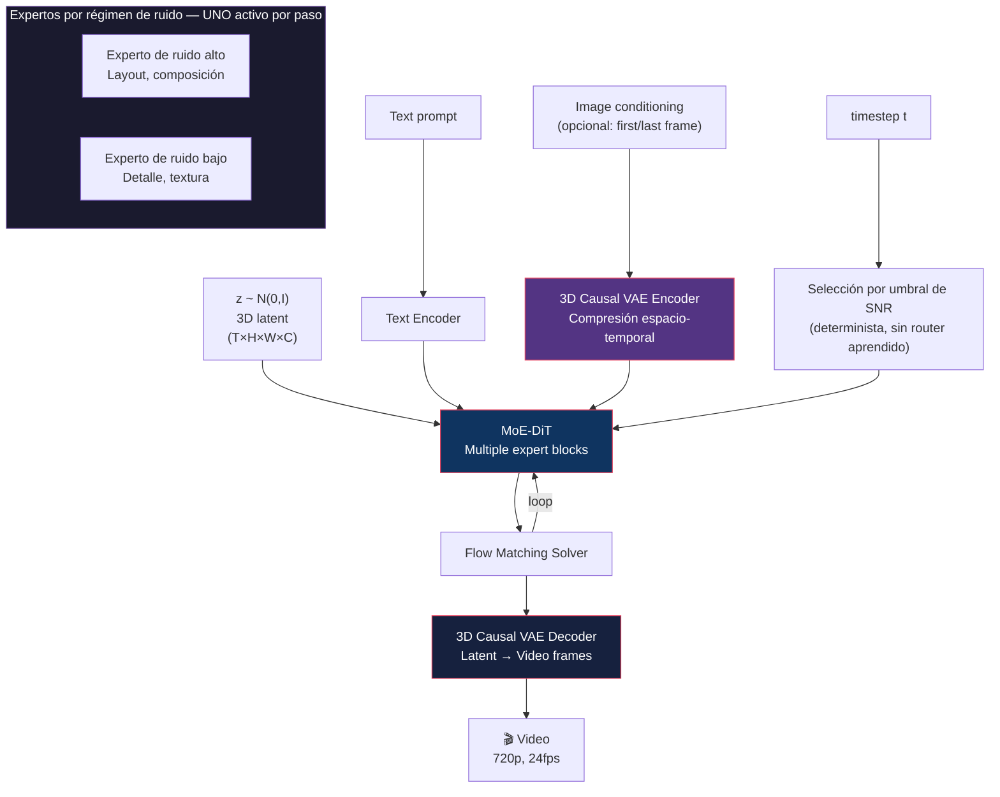

### ¿Qué cambia de imagen a video?

| Aspecto | Image Pipeline | Video Pipeline (Wan 2.2) |
|:--------|:--------------|:-------------------------|
| VAE | 2D (H×W) | **3D Causal** (T×H×W) |
| Latent | 3D tensor (h×w×c) | **4D tensor** (t×h×w×c) |
| Attention | Spatial only | **Spatial + Temporal** |
| Conditioning | Text + (image) | Text + first/last frame + motion |
| Compute | ~1x | **~50-200x** (proporcional a frames) |
| VRAM | 6-40GB | **24-80GB** |
| Experts | N/A | MoE por régimen de ruido |

> **Sobre el MoE por timestep**: la selección debe ser **exclusiva** — un solo experto activo por forward pass. Si se combinaran varios con una suma ponderada habría que evaluarlos todos y desaparecería el ahorro de cómputo, que es la única razón de ser del diseño. Y como el timestep se conoce de antemano, **no hace falta router aprendido ni balanceo de carga**, a diferencia del MoE de un LLM. Detalle en [06 §6](../06-architectures/README.md#6-moe-dit).
>
> ⚠️ El número exacto de expertos y el umbral de conmutación deben verificarse contra el reporte técnico de Wan 2.2 ([17](../17-video-models/README.md)).

---

## 8. Pipeline: LTX-2.3 (Video)

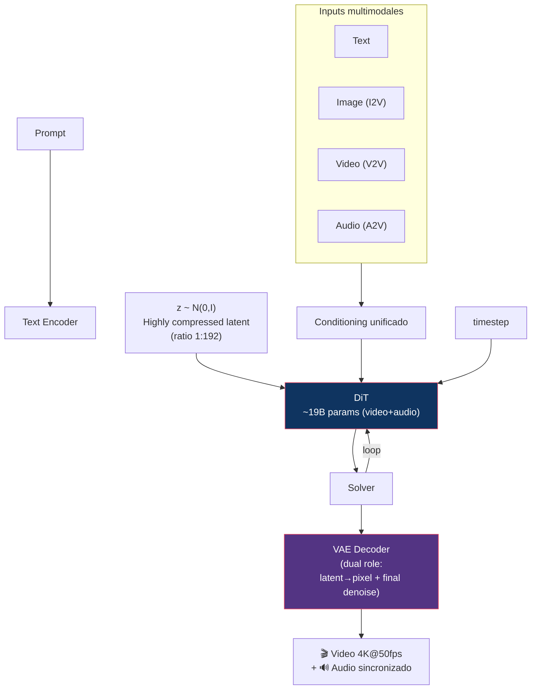

### Innovación: VAE con doble rol

En LTX, la VAE decoder no solo convierte latents a píxeles — también realiza el **último paso de denoising**. Esto compensa la pérdida de detalle causada por la alta compresión (1:192).

### Evolución de LTX

| Versión | Año | Capacidades clave |
|:--------|:----|:-----------------|
| LTX-Video | Nov 2024 | DiT, faster-than-real-time |
| LTX-2 | Oct 2025 | 19B, audio-video simultáneo |
| LTX-2.3 | Mar 2026 | 4K@50fps, pose/depth/edge, multimodal |
| LTX-2.5 | Mid 2026 | Adaptive keyframes, robotics, HDR |

---

## 9. Tabla comparativa de componentes

| | SD 1.5 | SDXL | SD3 | FLUX.1 | FLUX.2 | Z-Image | Wan 2.2 | LTX-2.3 |
|:--|:-------|:-----|:----|:-------|:-------|:--------|:--------|:--------|
| **Text Enc** | CLIP-L | CLIP-L+G | CLIP-L+G+T5 | CLIP-L+T5 | Mistral-3 24B | TE | TE | TE |
| **Denoiser** | U-Net | U-Net | MMDiT | Flow Transf | Flow Transf | S3-DiT | MoE-DiT | DiT |
| **Params** | 860M | 2.6B | 2-8B | 12B | 32B | 6B | 5-14B | 19B |
| **Prediction** | ε | **ε** | velocity (RF) | velocity (RF) | velocity (RF) | velocity | velocity | velocity |
| **VAE** | KL-f8, 4ch | KL-f8, 4ch | KL-f8, **16ch** | f8, 16ch | Reentrenada | Propia | 3D Causal | f32, 1:192 |
| **Attention** | Self+Cross | Self+Cross | Joint | Double+Single | VLM+Flow | Unified | Spatial+Temporal | Spatiotemporal |
| **Guidance** | CFG **2×** | CFG **2×** | CFG **2×** | **Destilada 1×** | Destilada 1× | — | — | — |
| **Pasos** | 20-50 | 25-50 | 28 | 20-50 | ~30 | ~20 | ~30 | ~30 |
| **NFE reales** | 40-100 | 50-100 | 56 | **20-50** | ~30 | ~20 | ~30 | ~30 |
| **Output** | 512² | 1024² | 1024² | ~1MP | 4MP | Variable | 720p video | 4K video |
| **Modality** | Image | Image | Image | Image | Image | Image | Video | Video+Audio |

> **La fila que importa es «NFE reales»**, no «Pasos». SD3 con 28 pasos y CFG cuesta 56 evaluaciones; FLUX.1 dev con 30 pasos y guidance destilada cuesta 30. Comparar por pasos hace parecer a SD3 más barato de lo que es.

> ⚠️ Las columnas de FLUX.2, Z-Image, Wan 2.2 y LTX-2.3 son orientativas y **pendientes de contrastar** con [16 — Image Models](../16-image-models/README.md) y [17 — Video Models](../17-video-models/README.md), que son la fuente dentro de este repositorio.

---

## 10. ¿Dónde está el cuello de botella?

### Caso A — modelo con CFG clásico (SDXL, 30 pasos = 60 NFE)

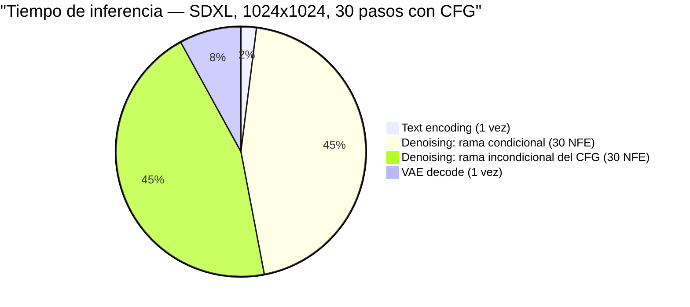

### Caso B — guidance destilada (FLUX.1 dev, 30 pasos = 30 NFE)

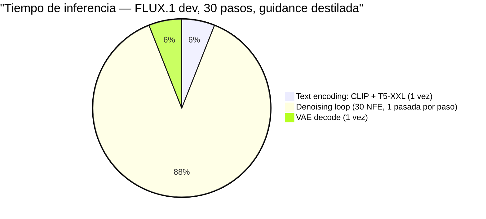

> ⚠️ **Corrección frecuente**: presentar el «overhead de CFG» como una porción pequeña (un 4 %) **junto a** un denoising loop del 85 %. Es incoherente: el 2× de CFG **no es un extra al margen del loop, es el loop ejecutado dos veces**. Si el loop domina, duplicarlo duplica prácticamente el tiempo total. Por eso la guidance destilada es una de las optimizaciones más rentables que existen.

### El denoiser domina — pero no siempre igual

| Componente | Tiempo (imagen) | Tiempo (vídeo) | VRAM | Cómo se optimiza |
|:-----------|:----------------|:---------------|:-----|:-----------------|
| Text Encoder | 2-6 % (una vez) | <1 % | **10-40 %** (T5-XXL ≈ 9 GB) | Offload a CPU; precomputar embeddings |
| **Denoiser** | **~88 %** | ~70-85 % | 60-70 % | **Cuantización, distillation, menos pasos** |
| VAE Decoder | 6-8 % | **10-25 %** | 5 % (imagen), alto en vídeo | `torch.compile`, decode por bloques |
| CFG (si aplica) | **×2 sobre el denoiser** | ×2 | +pico | Guidance distillation |

> **En vídeo cambia el reparto**: el decoder 3D procesa `T×H×W` y su coste crece con la duración del clip, así que deja de ser despreciable. Y a menudo el cuello no es el tiempo sino la **memoria**: el latente 4D completo puede no caber, lo que obliga a decodificar por ventanas temporales.

### Implicación para optimización, por rentabilidad

| Acción | Ganancia | Coste |
|:-------|:---------|:------|
| **Eliminar CFG** (guidance distillation) | **~2× tiempo** | Se pierde el control fino ([09 §6](../09-guidance/README.md#6-negative-prompts)) |
| **Reducir pasos** (distillation) | Lineal: 30 → 4 es ~7× | Diversidad y detalle ([10 §10](../10-distillation/README.md#10-qué-se-pierde-en-la-distillation)) |
| **Cuantizar el denoiser** (FP8/INT4) | 2-4× VRAM, algo de tiempo | Pérdida de calidad según el esquema |
| **Offload del text encoder** | Libera ~9 GB | Latencia extra solo en la primera pasada |
| **Mejor solver** | 50 → 20 pasos | Ninguno; es gratis ([08](../08-sampling/README.md)) |

El orden importa: **cambiar el solver es gratis**, así que se hace primero. Eliminar CFG y destilar pasos son multiplicativos entre sí (2× × 7× ≈ 14×), y son los que de verdad llevan a la generación sub-segundo.

---

## Referencias

- Rombach, R. et al. (2022). *High-Resolution Image Synthesis with Latent Diffusion Models*. CVPR.
- Podell, D. et al. (2024). *SDXL: Improving Latent Diffusion Models for High-Resolution Image Synthesis*.
- Esser, P. et al. (2024). *Scaling Rectified Flow Transformers for High-Resolution Image Synthesis*.
- Black Forest Labs (2024/2025). *FLUX.1 / FLUX.2 Technical Reports*.
- Alibaba/Tongyi Lab (2025). *Wan 2.1/2.2 Technical Reports*.
- Lightricks (2024–2026). *LTX-Video Series Documentation*.

---

*← 14 — Quantization (pendiente) | [16 — Image Models →](../16-image-models/README.md)*
