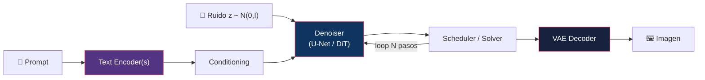
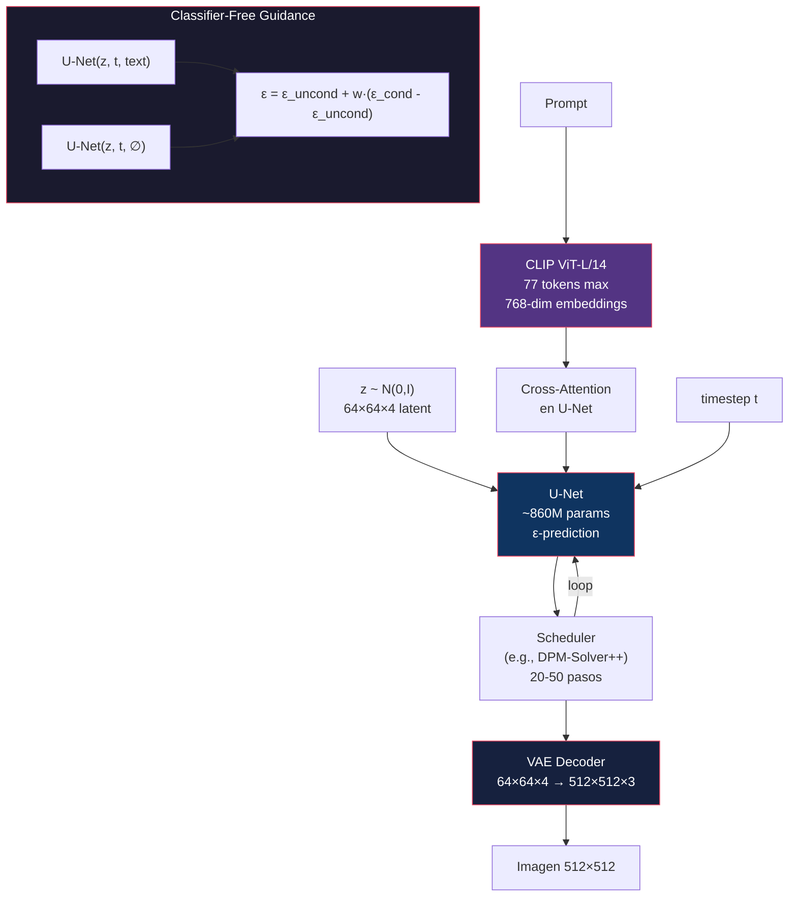
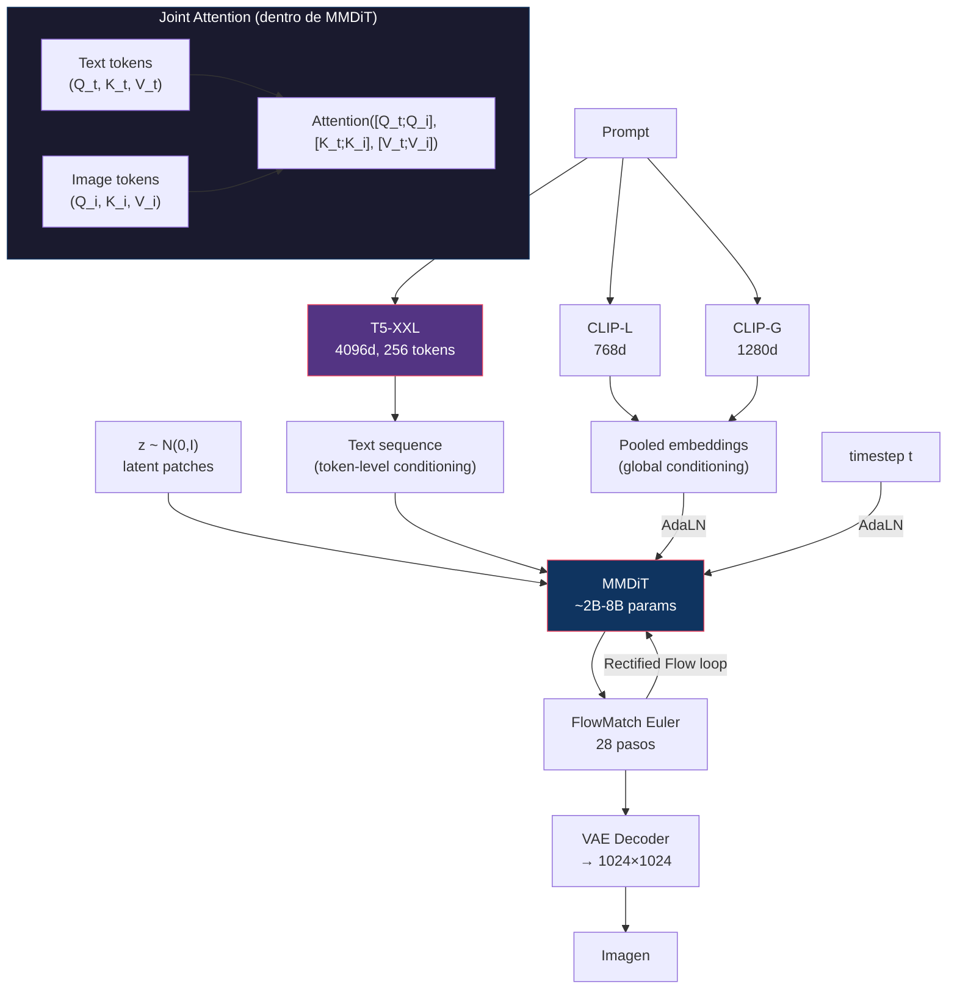
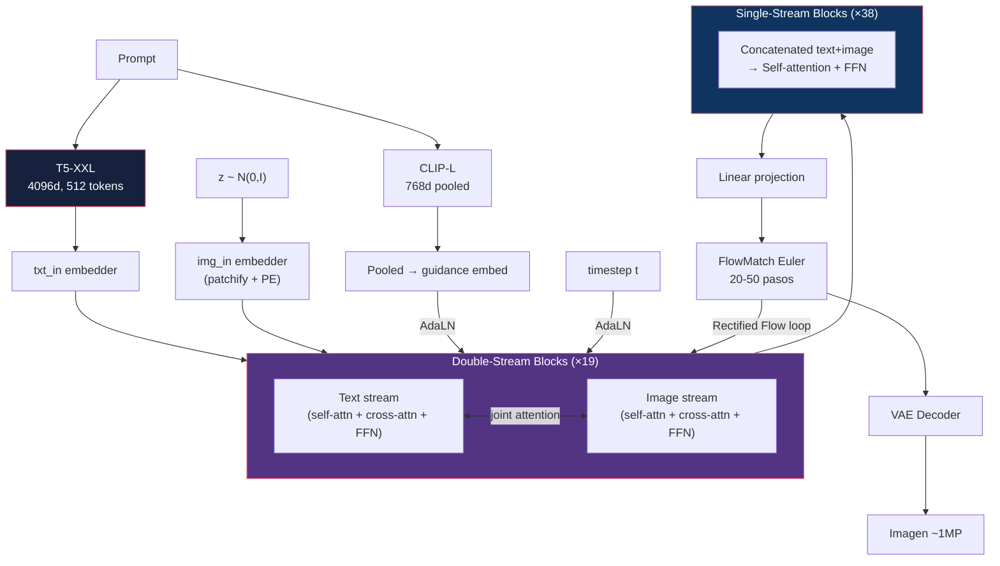
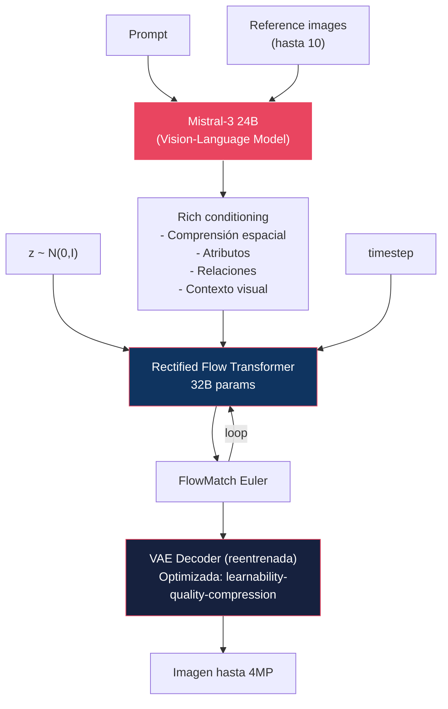
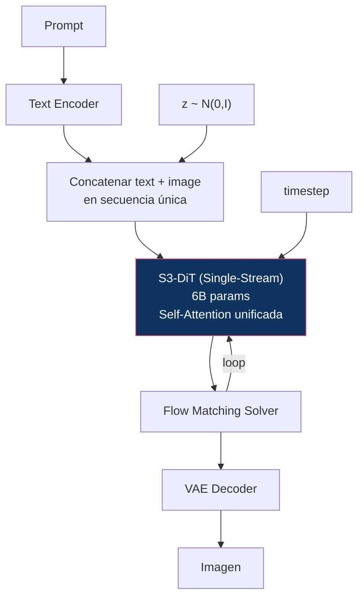
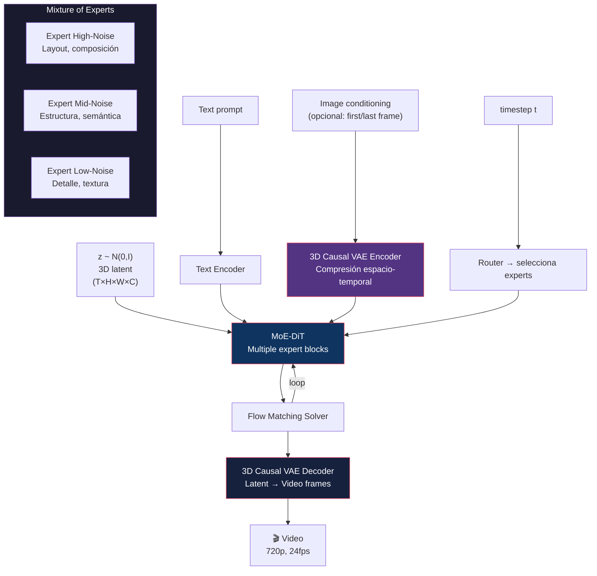
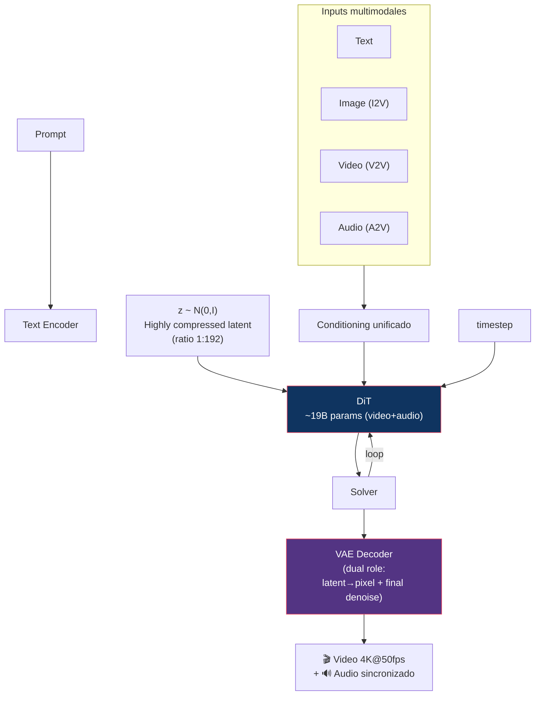
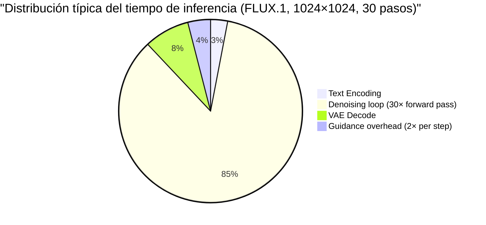

# 15 — Descomposición de Pipelines

> Ningún modelo generativo moderno es una sola red neuronal. Cada uno es un **sistema de componentes** interconectados. Aquí los desarmamos pieza por pieza.

---

## Índice

1. [Anatomía general de un pipeline](#1-anatomía-general)
2. [Pipeline: Stable Diffusion 1.5 / SDXL](#2-sd-sdxl)
3. [Pipeline: Stable Diffusion 3 / 3.5](#3-sd3)
4. [Pipeline: FLUX.1](#4-flux1)
5. [Pipeline: FLUX.2](#5-flux2)
6. [Pipeline: Z-Image](#6-z-image)
7. [Pipeline: Wan 2.2 (Video)](#7-wan22)
8. [Pipeline: LTX-2.3 (Video)](#8-ltx23)
9. [Tabla comparativa de componentes](#9-tabla-componentes)
10. [¿Dónde está el cuello de botella?](#10-bottleneck)

---

## 1. Anatomía general

Todo pipeline de generación sigue este flujo:

### Componentes universales

| Componente | Función | Ejemplos |
|:-----------|:--------|:---------|
| **Text Encoder** | Convertir texto en embeddings | CLIP, T5, Mistral |
| **Conditioning** | Inyectar info de texto en el denoiser | Cross-attention, AdaLN, joint attention |
| **VAE Encoder** | Comprimir imagen a latent space | KL-VAE, VQ-VAE |
| **Denoiser** | Predecir ruido/velocidad | U-Net, DiT, MMDiT |
| **Scheduler** | Controlar el proceso de denoising | DDPM, Euler, DPM-Solver++ |
| **Guidance** | Amplificar adherencia al prompt | CFG, dynamic CFG |
| **VAE Decoder** | Reconstruir imagen desde latent | Decoder de VAE |

---

## 2. Pipeline: Stable Diffusion 1.5 / SDXL

### SD 1.5

| Componente | Especificación |
|:-----------|:--------------|
| Text Encoder | CLIP ViT-L/14 (77 tokens, 768d) |
| Denoiser | U-Net ~860M params |
| Prediction | ε-prediction |
| VAE | KL-f8 (factor 8 de compresión) |
| Latent shape | 64×64×4 (para 512×512 output) |
| Scheduler default | PNDM, luego DPM-Solver++ |
| Guidance | CFG (2 forward passes) |
| VRAM típico | ~4-6 GB (FP16) |

### SDXL

| Cambio vs SD 1.5 | Detalle |
|:-----------------|:--------|
| **2 text encoders** | CLIP + OpenCLIP para embeddings más ricos |
| **U-Net más grande** | 2.6B vs 860M params |
| **v-prediction** | Cambio de ε a v-prediction |
| **Resolución nativa** | 1024×1024 vs 512×512 |
| **Size conditioning** | El modelo conoce la resolución objetivo durante training |

---

## 3. Pipeline: Stable Diffusion 3 / 3.5

| Componente | SD3 | SD 3.5 Large | SD 3.5 Medium |
|:-----------|:----|:-------------|:--------------|
| Text Encoders | CLIP-L + CLIP-G + T5-XXL | CLIP-L + CLIP-G + T5-XXL | CLIP-L + CLIP-G + T5-XXL |
| Denoiser | MMDiT ~2B | MMDiT ~8B | MMDiT-X ~2.5B |
| Prediction | Rectified Flow (velocity) | Rectified Flow | Rectified Flow |
| QK-Norm | No | Sí | Sí |
| Pasos default | 28 | 28 | 28 |
| VRAM (FP16) | ~12GB (sin T5) | ~24GB | ~12GB |

### Cambios fundamentales vs SDXL

1. **U-Net → MMDiT**: Cambio arquitectónico completo
2. **ε-prediction → Rectified Flow**: Cambio de paradigma de entrenamiento
3. **Cross-attention → Joint attention**: Texto e imagen interactúan bidireccionalmente
4. **T5-XXL añadido**: Comprensión de texto mucho más profunda (pero costoso en VRAM)

---

## 4. Pipeline: FLUX.1

| Componente | FLUX.1 [dev] | FLUX.1 [schnell] |
|:-----------|:-------------|:-----------------|
| Text Encoders | CLIP-L + T5-XXL | CLIP-L + T5-XXL |
| Params | 12B | 12B |
| Blocks | 19 double + 38 single | 19 double + 38 single |
| Prediction | Rectified Flow (velocity) | Rectified Flow (distilled) |
| Guidance | CFG (dev) | No CFG (schnell) |
| Pasos | 20-50 | 1-4 |
| Licencia | Non-commercial | Apache 2.0 |

### Innovación: Double + Single stream

La arquitectura FLUX.1 usa un diseño **híbrido**:
- **Double-stream blocks**: Texto e imagen tienen streams separados con joint attention (como MMDiT)
- **Single-stream blocks**: Después de la fusión inicial, texto e imagen se procesan juntos (más eficiente)

Este diseño captura lo mejor de ambos mundos: fusión profunda + eficiencia.

---

## 5. Pipeline: FLUX.2

| Componente | FLUX.2 | vs FLUX.1 |
|:-----------|:-------|:----------|
| Comprensión semántica | Mistral-3 24B VLM | CLIP-L + T5-XXL |
| Generador | 32B Flow Transformer | 12B Flow Transformer |
| VAE | Reentrenada from scratch | Heredada |
| Multi-reference | Hasta 10 imágenes | No soportado |
| Resolución máx | 4 megapíxeles | ~1 megapíxel |
| Typography | Mejorada significativamente | Básica |
| VRAM estimado | ~40GB+ (FP8) | ~24GB (FP8) |

### FLUX.2 Klein

Variante distilada para consumer GPUs:
- **Sub-segundo** de generación
- Objetivo: <16GB VRAM
- Distillation + cuantización agresiva

---

## 6. Pipeline: Z-Image

| Aspecto | Z-Image | vs FLUX.1 |
|:--------|:--------|:----------|
| Arquitectura | S3-DiT (single-stream) | Double+Single stream |
| Params | 6B | 12B |
| VRAM | <16GB | ~24GB |
| Velocidad | Sub-segundo (enterprise) | 5-15 segundos |
| Filosofía | Eficiencia > escala | Escala > eficiencia |

---

## 7. Pipeline: Wan 2.2 (Video)

### ¿Qué cambia de imagen a video?

| Aspecto | Image Pipeline | Video Pipeline (Wan 2.2) |
|:--------|:--------------|:-------------------------|
| VAE | 2D (H×W) | **3D Causal** (T×H×W) |
| Latent | 3D tensor (h×w×c) | **4D tensor** (t×h×w×c) |
| Attention | Spatial only | **Spatial + Temporal** |
| Conditioning | Text + (image) | Text + first/last frame + motion |
| Compute | ~1x | **~50-200x** (proporcional a frames) |
| VRAM | 6-40GB | **24-80GB** |
| Experts | N/A | MoE por timestep |

---

## 8. Pipeline: LTX-2.3 (Video)

### Innovación: VAE con doble rol

En LTX, la VAE decoder no solo convierte latents a píxeles — también realiza el **último paso de denoising**. Esto compensa la pérdida de detalle causada por la alta compresión (1:192).

### Evolución de LTX

| Versión | Año | Capacidades clave |
|:--------|:----|:-----------------|
| LTX-Video | Nov 2024 | DiT, faster-than-real-time |
| LTX-2 | Oct 2025 | 19B, audio-video simultáneo |
| LTX-2.3 | Mar 2026 | 4K@50fps, pose/depth/edge, multimodal |
| LTX-2.5 | Mid 2026 | Adaptive keyframes, robotics, HDR |

---

## 9. Tabla comparativa de componentes

| | SD 1.5 | SDXL | SD3 | FLUX.1 | FLUX.2 | Z-Image | Wan 2.2 | LTX-2.3 |
|:--|:-------|:-----|:----|:-------|:-------|:--------|:--------|:--------|
| **Text Enc** | CLIP-L | CLIP-L+G | CLIP-L+G+T5 | CLIP-L+T5 | Mistral-3 24B | TE | TE | TE |
| **Denoiser** | U-Net | U-Net | MMDiT | Flow Transf | Flow Transf | S3-DiT | MoE-DiT | DiT |
| **Params** | 860M | 2.6B | 2-8B | 12B | 32B | 6B | 5-14B | 19B |
| **Prediction** | ε | v | velocity (RF) | velocity (RF) | velocity (RF) | velocity | velocity | velocity |
| **VAE** | KL-f8 | KL-f8 | KL-f8 | Custom | Reentrenada | Custom | 3D Causal | 1:192 compression |
| **Attention** | Self+Cross | Self+Cross | Joint | Double+Single | VLM+Flow | Unified | Spatial+Temporal | Spatiotemporal |
| **Guidance** | CFG | CFG | CFG | CFG | CFG | CFG | CFG | CFG |
| **Pasos** | 20-50 | 25-50 | 28 | 20-50 | ~30 | ~20 | ~30 | ~30 |
| **Output** | 512² | 1024² | 1024² | ~1MP | 4MP | Variable | 720p video | 4K video |
| **Modality** | Image | Image | Image | Image | Image | Image | Video | Video+Audio |

---

## 10. ¿Dónde está el cuello de botella?

### El denoiser domina absolutamente

| Componente | Tiempo relativo | VRAM relativo | Optimizable? |
|:-----------|:---------------|:-------------|:-------------|
| Text Encoder | ~3% | ~10-30% | Offload a CPU |
| **Denoiser** | **~85%** | **~60-70%** | **Cuantización, distillation, fewer steps** |
| VAE Decoder | ~8% | ~5% | torch.compile |
| CFG overhead | ~2× denoiser | +50% VRAM peak | CFG distillation, PAG |

### Implicación para optimización

1. **Reducir pasos** (distillation) → reducción lineal del tiempo
2. **Reducir precisión** (FP8/INT4) → reducción ~2-4× de VRAM del denoiser
3. **Eliminar CFG** (distilled guidance) → reducción ~2× de compute
4. **Offload text encoder** → liberación de VRAM sin impacto notable en latencia

---

## Referencias

- Rombach, R. et al. (2022). *High-Resolution Image Synthesis with Latent Diffusion Models*. CVPR.
- Podell, D. et al. (2024). *SDXL: Improving Latent Diffusion Models for High-Resolution Image Synthesis*.
- Esser, P. et al. (2024). *Scaling Rectified Flow Transformers for High-Resolution Image Synthesis*.
- Black Forest Labs (2024/2025). *FLUX.1 / FLUX.2 Technical Reports*.
- Alibaba/Tongyi Lab (2025). *Wan 2.1/2.2 Technical Reports*.
- Lightricks (2024–2026). *LTX-Video Series Documentation*.

---

*← [14 — Quantization](../14-quantization/README.md) | [16 — Image Models →](../16-image-models/README.md)*
