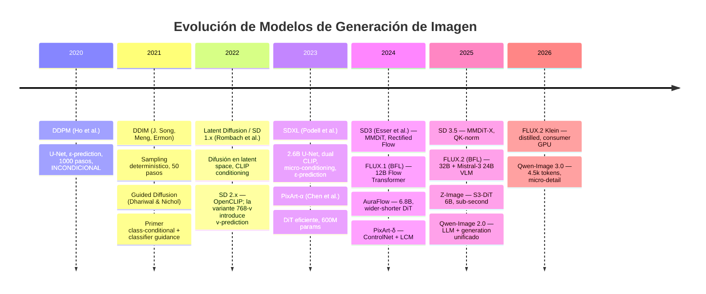
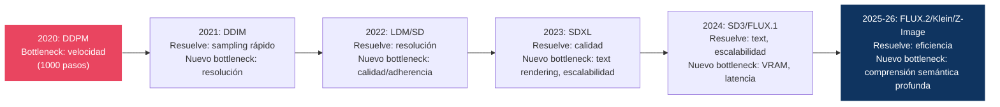

# 16 — Modelos de Generación de Imagen

> Matriz histórica y técnica de los modelos representativos, desde DDPM hasta los sistemas de agosto de 2026.

---

## Estado de verificación

Este módulo es la **fuente de referencia** dentro del repositorio: los demás módulos remiten aquí para las especificaciones concretas. Por tanto cada ficha lleva un marcador explícito de hasta dónde está contrastada.

| Marca | Significado |
|:------|:------------|
| ✅ | Contrastado contra paper, config o model card oficial |
| 🟡 | Coherente con las fuentes conocidas, **pendiente de contraste directo** |
| ⚠️ | Reconstruido de fuentes secundarias — **no citar sin verificar** |

> Regla del repositorio: ninguna afirmación marcada 🟡 o ⚠️ debe propagarse a otros módulos como si fuese un hecho establecido.

---

## Evolución cronológica

---

## Model Cards

### DDPM (2020) ✅

| Aspecto | Detalle |
|:--------|:--------|
| **Paper** | *Denoising Diffusion Probabilistic Models* (Ho, Jain, Abbeel) |
| **Arquitectura** | U-Net con self-attention **solo en 16×16** |
| **Parámetros** | ~35.7M (CIFAR-10) / ~114M (256×256) 🟡 |
| **Text Encoder** | Ninguno |
| **Conditioning** | **Ninguno — el modelo es incondicional** |
| **VAE** | Ninguno (pixel space) |
| **Training Objective** | ε-prediction, `L_simple` (ELBO sin la ponderación) |
| **Noise Schedule** | Linear: β₁=10⁻⁴, β_T=0.02, T=1000 |
| **Sampling** | DDPM ancestral, 1000 pasos, σₜ²=βₜ en el resultado principal |
| **Guidance** | Ninguna (no existía) |
| **Resolución** | 32×32 (CIFAR-10), 256×256 (LSUN, CelebA-HQ) |
| **Resultados** | **CIFAR-10: FID 3.17, IS 9.46, NLL ≤3.75 bits/dim** ✅ |
| **Fortalezas** | Fundacional, riguroso, training estable |
| **Debilidades** | Lento, baja resolución, **sin ningún condicionamiento** |
| **Fuente** | [arxiv:2006.11239](https://arxiv.org/abs/2006.11239) · detalle en [02](../02-ddpm/README.md) |

> ⚠️ **Corrección frecuente**: catalogar DDPM como «class-conditional o unconditional». Ho et al. (2020) entrenan **exclusivamente modelos incondicionales** en CIFAR-10, LSUN y CelebA-HQ. El condicionamiento por clase aparece un año después con Dhariwal & Nichol (2021), junto con classifier guidance.

---

### Stable Diffusion 2.x (2022) 🟡

Ficha breve, pero necesaria: es el modelo que la literatura confunde con más frecuencia.

| Aspecto | Detalle |
|:--------|:--------|
| **Text Encoder** | OpenCLIP ViT-H/14 (sustituye a CLIP ViT-L de SD 1.x) |
| **Variantes** | SD 2.0/2.1 **base (512)**: ε-prediction · SD 2.0/2.1 **768-v**: **v-prediction** |
| **Resolución** | 512×512 (base), 768×768 (variante -v) |
| **Relevancia** | **Es el único modelo de la familia SD que usa v-prediction** |

> Este es el origen del error más repetido del área: la v-prediction pertenece a **SD 2.x-768-v**, no a SDXL. Ver [01 §7](../01-foundations/README.md#7-parametrizaciones).

---

### Stable Diffusion 1.5 (2022)

| Aspecto | Detalle |
|:--------|:--------|
| **Paper** | *High-Resolution Image Synthesis with Latent Diffusion Models* (Rombach et al.) |
| **Arquitectura** | U-Net con cross-attention |
| **Parámetros** | ~860M (U-Net) + ~123M (CLIP) + ~83M (VAE) |
| **Text Encoder** | CLIP ViT-L/14 (77 tokens, 768d) |
| **Conditioning** | Cross-attention (text → image) |
| **VAE** | KL-regularized, f=8 (compresión 8×) |
| **Latent Shape** | 64×64×4 (para output 512×512) |
| **Training Objective** | ε-prediction |
| **Noise Schedule** | Scaled linear |
| **Sampling** | 20-50 pasos, DPM-Solver++ recomendado |
| **Guidance** | CFG (scale 7.5 default) |
| **Resolución** | 512×512 nativa |
| **VRAM** | ~4GB (FP16), ~6-8GB con safety checker |
| **Fortalezas** | Ecosistema masivo, LoRA/ControlNet/adapters, rápido |
| **Debilidades** | Baja resolución, adherencia al prompt limitada, anatomía deficiente |
| **Licencia** | CreativeML Open RAIL-M |
| **Fuente** | [arxiv:2112.10752](https://arxiv.org/abs/2112.10752) |

---

### SDXL (2023)

| Aspecto | Detalle |
|:--------|:--------|
| **Paper** | *SDXL: Improving Latent Diffusion Models for High-Resolution Image Synthesis* |
| **Arquitectura** | U-Net (más grande, transformer blocks más profundos) |
| **Parámetros** | ~2.6B (U-Net base) + ~800M (refiner, opcional) |
| **Text Encoders** | CLIP ViT-L/14 (768d) + OpenCLIP ViT-bigG/14 (1280d) |
| **Conditioning** | Cross-attention (2048d concatenados) + pooled (1280d) + **micro-conditioning** |
| **Micro-conditioning** | `original_size`, `crop_coords`, `target_size` vía embeddings ([11 §4](../11-conditioning/README.md#4-micro-conditioning-sdxl)) |
| **VAE** | KL-f8, 4 canales, re-entrenada (scale factor 0.13025, no 0.18215) |
| **Latent Shape** | 128×128×4 (para output 1024×1024) |
| **Training Objective** | **ε-prediction** (igual que SD 1.5) |
| **Noise Schedule** | `scaled_linear` (β lineal en √β), T=1000 |
| **Sampling** | 25-50 pasos |
| **Guidance** | CFG clásico, **2 forward passes** (scale 5-9 típico) |
| **Resolución** | 1024×1024 nativa, multi-aspect ratio |
| **VRAM** | ~8-12GB (FP16) |
| **Fortalezas** | Gran salto de calidad, micro-conditioning, ecosistema muy rico |
| **Debilidades** | Text rendering limitado, VAE de 4 canales, sin T5 |
| **Fuente** | [arxiv:2307.01952](https://arxiv.org/abs/2307.01952) |

> ⚠️ **Corrección frecuente — la más extendida del área**: SDXL **no usa v-prediction**. Su configuración es `prediction_type: "epsilon"`. La confusión viene de SD 2.x-768-v. Este error aparecía en tres lugares distintos de este repositorio y se ha corregido en todos.
>
> Tampoco su schedule es «offset noise + shifted»: es `scaled_linear`, el mismo de LDM. *Offset noise* es una técnica de entrenamiento independiente del schedule, y atribuirla a SDXL requiere fuente. 🟡

---

### PixArt-α (2023)

| Aspecto | Detalle |
|:--------|:--------|
| **Paper** | *PixArt-α: Fast Training of Diffusion Transformer for Photorealistic Text-to-Image Synthesis* |
| **Arquitectura** | DiT (Diffusion Transformer) |
| **Parámetros** | ~600M |
| **Text Encoder** | T5-XXL (4096d) |
| **Conditioning** | Cross-attention (T5 tokens) |
| **VAE** | SD VAE (f=8) |
| **Training Objective** | ε-prediction |
| **Innovación** | Descomposición del entrenamiento en tres etapas: (1) distribución de píxeles → (2) alineamiento texto-imagen → (3) calidad estética |
| **Training Cost** | ~10.8 % del coste de **Stable Diffusion v1.5** (≈675 vs ≈6 250 días-A100) 🟡 — la comparación del paper es contra SD 1.5, **no contra SDXL** |
| **Sampling** | DPM-Solver, 14-20 pasos |
| **Resolución** | Hasta 1024×1024 |
| **VRAM** | ~6GB (FP16) |
| **Fortalezas** | Eficiente, demostró viabilidad de DiT, buena adherencia al prompt |
| **Debilidades** | Menor calidad que modelos más grandes |
| **Licencia** | Open weights |
| **Fuente** | [arxiv:2310.00426](https://arxiv.org/abs/2310.00426) |

---

### Stable Diffusion 3 (2024)

| Aspecto | Detalle |
|:--------|:--------|
| **Paper** | *Scaling Rectified Flow Transformers for High-Resolution Image Synthesis* |
| **Arquitectura** | MMDiT (Multimodal Diffusion Transformer) |
| **Parámetros** | ~2B (medium) / ~8B (large) |
| **Text Encoders** | CLIP-L (768d) + CLIP-G (1280d) + T5-XXL (4096d) |
| **Conditioning** | Joint attention (text ↔ image bidireccional) + AdaLN (pooled + timestep) |
| **VAE** | KL-regularized, f=8, 16 channels |
| **Training Objective** | Rectified Flow (velocity prediction) |
| **Innovación** | Joint attention, 3 text encoders, QK-normalization (3.5) |
| **Sampling** | FlowMatch Euler, 28 pasos |
| **Guidance** | CFG (scale ~5) |
| **Resolución** | 1024×1024 nativa |
| **VRAM** | ~12-24GB (FP16, según variante) |
| **Fortalezas** | Mejor text rendering, composición, joint attention |
| **Debilidades** | Calidad inconsistente en SD3 base, mejorado en 3.5 |
| **Licencia** | Stability Community License |
| **Fuente** | [arxiv:2403.03206](https://arxiv.org/abs/2403.03206) |

---

### AuraFlow (2024)

| Aspecto | Detalle |
|:--------|:--------|
| **Arquitectura** | Rectified Flow Transformer ("wider, shorter" design) |
| **Parámetros** | ~6.8B |
| **Text Encoder** | T5 |
| **Conditioning** | Reemplaza bloques MMDiT por single-modality DiT encoder blocks |
| **Training Objective** | Rectified Flow |
| **Innovación** | Mostró que single-modality blocks escalados > muchos MMDiT blocks |
| **Resolución** | 1024×1024 |
| **Fortalezas** | Open source grande, buena prompt adherence, diseño eficiente |
| **Debilidades** | Community model, menor pulido que FLUX |
| **Licencia** | Apache 2.0 |
| **Fuente** | fal.ai |

---

### FLUX.1 (2024)

| Aspecto | Detalle |
|:--------|:--------|
| **Organización** | Black Forest Labs |
| **Arquitectura** | Rectified Flow Transformer (double + single stream) |
| **Parámetros** | ~12B |
| **Text Encoders** | CLIP-L (pooled, 768d) + T5-XXL (sequence, 4096d, 512 tokens) |
| **Conditioning** | Double-stream: joint attention; Single-stream: unified self-attention |
| **VAE** | Custom VAE |
| **Training Objective** | Rectified Flow (velocity prediction) |
| **Blocks** | 19 DoubleStreamBlocks + 38 SingleStreamBlocks |
| **Sampling** | FlowMatch Euler, 20-50 pasos (dev), 1-4 pasos (schnell) |
| **Guidance** | **Destilada en ambas variantes** — 1 forward pass por paso |
| **↳ dev** | Escala de guidance ajustable (típ. 3.5) como **embedding**, no como CFG |
| **↳ schnell** | Guidance fija; además destilado en pasos |
| **Resolución** | ~1 megapíxel, multi-aspect |
| **VRAM** | ~24GB (FP16), ~12GB (FP8/NF4) |
| **Variantes** | dev (non-commercial), schnell (Apache 2.0) |
| **Fortalezas** | Calidad excepcional, text rendering, coherencia |
| **Debilidades** | Alto VRAM; dev es non-commercial; **sin negative prompts** (consecuencia de la guidance destilada) |
| **Fuente** | [bfl.ai](https://bfl.ai) |

> ⚠️ **Corrección frecuente**: describir FLUX.1 dev como «CFG clásico, 2 forward passes». Está *guidance-distilled*: 30 pasos son **30 NFE**, no 60, y su escala 3.5 **no es comparable** con el CFG 7.5 de SDXL — son magnitudes distintas. Ver [09 §8](../09-guidance/README.md#8-guidance-en-modelos-modernos).

---

### FLUX.2 (2025)

| Aspecto | Detalle |
|:--------|:--------|
| **Organización** | Black Forest Labs |
| **Arquitectura** | VLM-coupled Rectified Flow Transformer |
| **Parámetros** | ~32B (generador) + ~24B (Mistral-3 VLM) |
| **VLM** | Mistral-3 24B (vision-language model) |
| **Conditioning** | VLM procesa prompt + ref images → rich conditioning |
| **VAE** | Reentrenada from scratch (optimizada learnability-quality-compression) |
| **Training Objective** | Rectified Flow |
| **Multi-reference** | Hasta 10 imágenes fuente |
| **Resolución** | Hasta 4 megapíxeles |
| **Typography** | Significativamente mejorada |
| **VRAM estimado** | ~40GB+ (FP8) |
| **Variantes** | FLUX.2, FLUX.2 Klein (sub-second, consumer GPU) |
| **Fortalezas** | Comprensión semántica profunda, multi-reference, 4MP |
| **Debilidades** | Muy alto VRAM, API-first |
| **Fuente** | [bfl.ai](https://bfl.ai) |

---

### Z-Image (2025)

| Aspecto | Detalle |
|:--------|:--------|
| **Organización** | Alibaba |
| **Arquitectura** | S3-DiT (Scalable Single-Stream Diffusion Transformer) |
| **Parámetros** | ~6B |
| **Conditioning** | Single-stream: texto e imagen en secuencia unificada |
| **Training Objective** | Flow Matching |
| **Variantes** | Z-Image base, Z-Image-Turbo (distilled, few-step) |
| **VRAM** | <16GB |
| **Velocidad** | Sub-segundo (enterprise hardware) |
| **Fortalezas** | Eficiencia extrema, consumer GPU friendly, buena calidad/parámetro |
| **Debilidades** | Menor capacidad absoluta que FLUX.2 |
| **Fuente** | [arxiv](https://arxiv.org), [zimage.run](https://zimage.run) |

---

### Qwen-Image (2025–2026)

| Aspecto | Detalle |
|:--------|:--------|
| **Organización** | Alibaba/Qwen |
| **Arquitectura** | MLLM + VAE + MMDiT |
| **Módulos** | (1) Multimodal LLM → (2) VAE tokenizer → (3) MMDiT backbone |
| **Innovación** | MSRoPE (Multimodal Scalable RoPE), unifica generación + edición |
| **Versiones** | Qwen-Image (2025) → 2512 → 2.0 (Feb 2026) → 3.0 (Jul 2026) |
| **Qwen-Image 3.0** | High-token (4.5k), micro-level detail rendering |
| **Fortalezas** | Text rendering, edición integrada, diseño infográfico |
| **Fuente** | [qwen.ai](https://qwen.ai) |

---

## Tabla resumen comparativa

| Modelo | Año | Arch | Params | Objective | Condicionamiento | Guidance | Pasos | NFE | Resolución | VRAM (FP16) | Verif. |
|:-------|:----|:-----|:-------|:----------|:-----------------|:---------|:------|----:|:-----------|:------------|:------|
| DDPM | 2020 | U-Net | 35-114M | ε-pred | **ninguno** | — | 1000 | 1000 | 256² | <2GB | ✅ |
| SD 1.5 | 2022 | U-Net | 860M | ε-pred | CLIP-L | CFG 2× | 20-50 | 40-100 | 512² | 4-6GB | ✅ |
| SD 2.1-768-v | 2022 | U-Net | 865M | **v-pred** | OpenCLIP-H | CFG 2× | 20-50 | 40-100 | 768² | 5-8GB | 🟡 |
| SDXL | 2023 | U-Net | 2.6B | **ε-pred** | CLIP-L+G + micro | CFG 2× | 25-50 | 50-100 | 1024² | 8-12GB | ✅ |
| PixArt-α | 2023 | DiT | 600M | ε-pred | T5-XXL | CFG 2× | 14-20 | 28-40 | 1024² | ~6GB | 🟡 |
| SD3 / 3.5 | 2024 | MMDiT | 2-8B | RF velocity | CLIP-L+G + T5 | CFG 2× | 28 | 56 | 1024² | 12-24GB | 🟡 |
| AuraFlow | 2024 | RF Transf | 6.8B | RF velocity | T5 | CFG 2× | ~25 | ~50 | 1024² | ~20GB | ⚠️ |
| FLUX.1 dev | 2024 | RF Transf | 12B | RF velocity | CLIP-L + T5 | **destilada 1×** | 20-50 | **20-50** | ~1MP | ~24GB | 🟡 |
| FLUX.1 schnell | 2024 | RF Transf | 12B | RF (destilado) | CLIP-L + T5 | destilada 1× | 1-4 | 1-4 | ~1MP | ~24GB | 🟡 |
| FLUX.2 | 2025 | VLM+RF | 32B+24B | RF velocity | VLM | destilada | ~30 | ~30 | 4MP | ~40GB+ | ⚠️ |
| Z-Image | 2025 | S3-DiT | 6B | FM velocity | single-stream | — | ~20 | ~20 | Variable | <16GB | ⚠️ |
| Qwen-Image 3.0 | 2026 | LLM+MMDiT | Variable | FM velocity | MLLM | — | ~25 | ~25 | 2K+ | Variable | ⚠️ |

> **Las columnas que suelen faltar y más engañan si se omiten**: `Guidance` y `NFE`. Un modelo con CFG clásico cuesta el doble de lo que sugiere su número de pasos. SD3 con 28 pasos cuesta 56 evaluaciones; FLUX.1 dev con 30 pasos cuesta 30. Ver [15 §10](../15-pipelines/README.md#10-dónde-está-el-cuello-de-botella).

---

## Diagrama de evolución de bottlenecks

---

*← [15 — Pipelines](../15-pipelines/README.md) | [17 — Video Models →](../17-video-models/README.md)*
