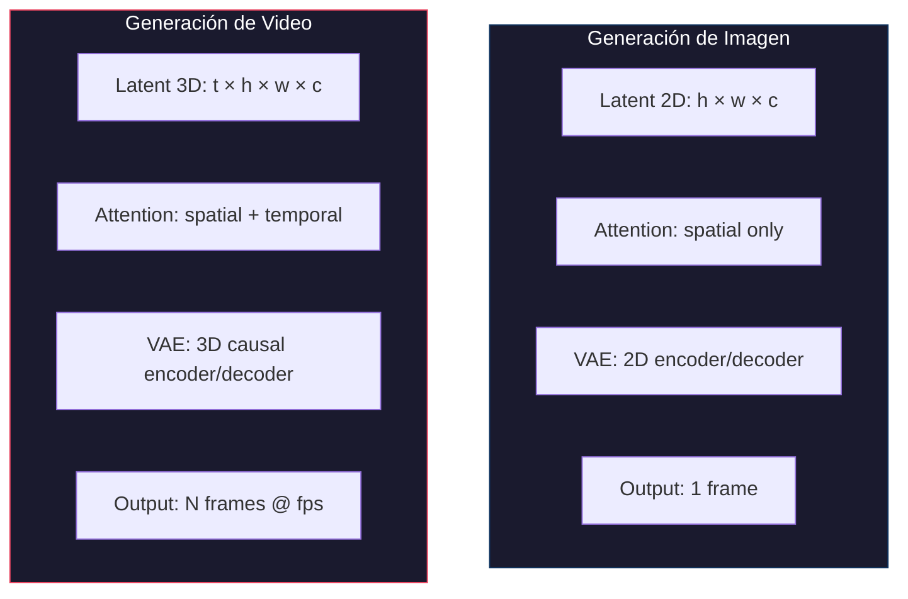
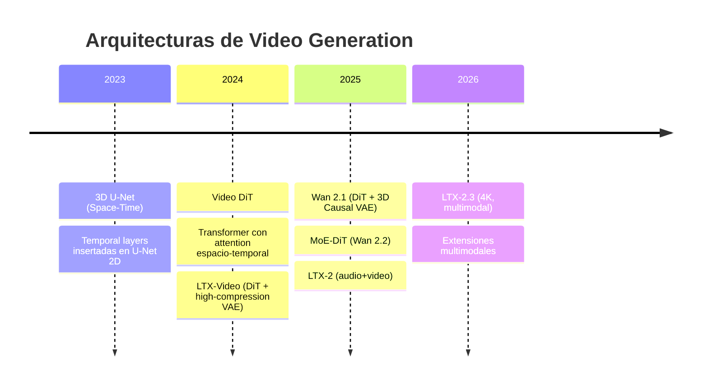
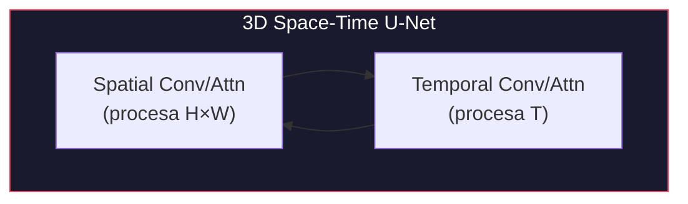
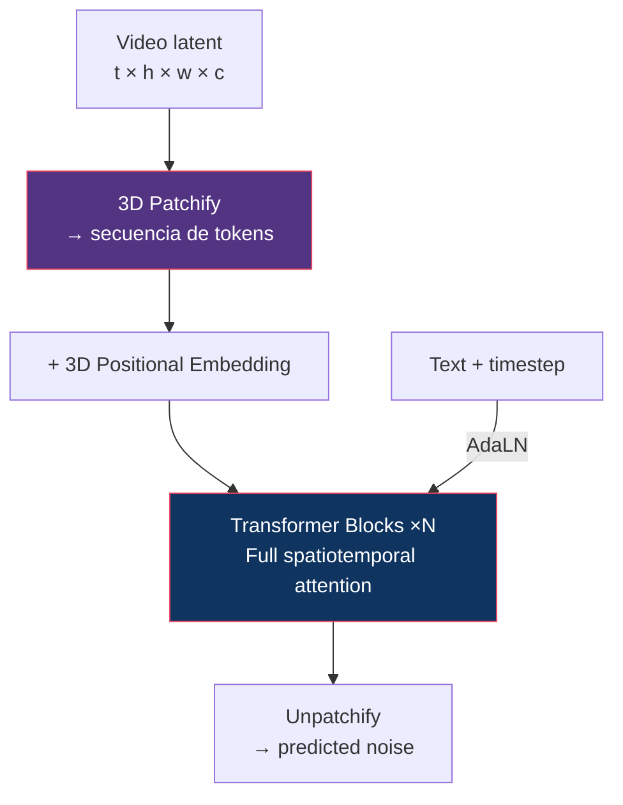
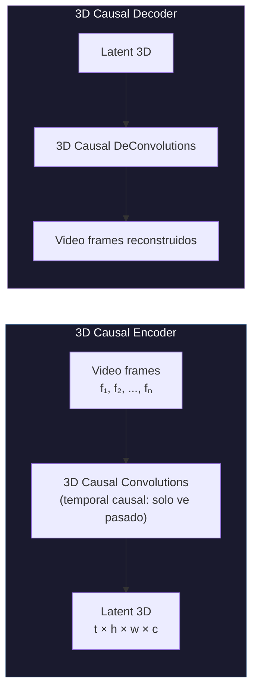
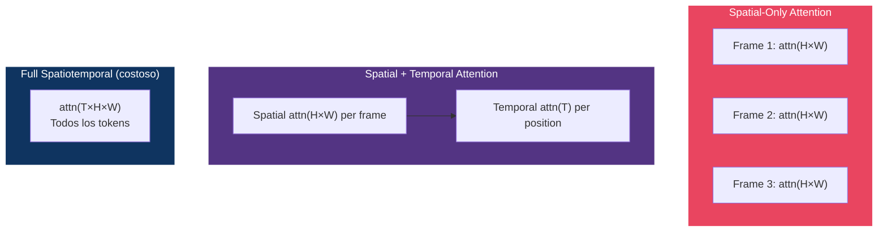
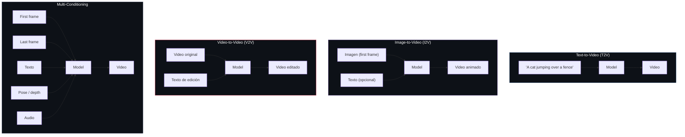
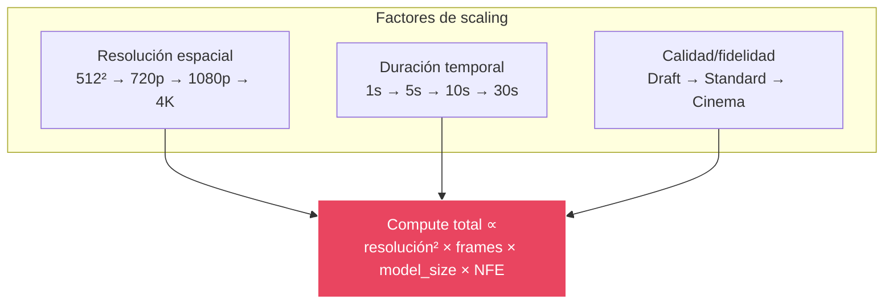
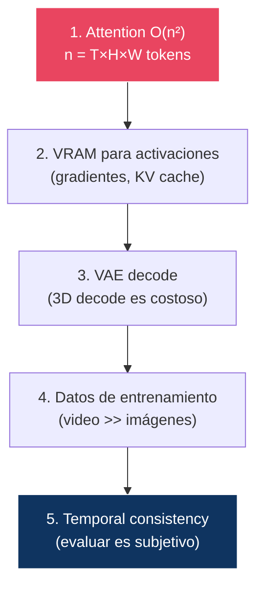

# 17 — Modelos de Generación de Video

> El video no es "muchas imágenes seguidas". Es un problema fundamentalmente diferente que requiere representaciones espacio-temporales, VAEs 3D, y órdenes de magnitud más compute.

---

## Índice

1. [De imagen a video: qué cambia](#1-qué-cambia)
2. [Arquitecturas de video](#2-arquitecturas)
3. [VAEs 3D y Causal VAEs](#3-vaes-3d)
4. [Temporal attention](#4-temporal-attention)
5. [Conditioning en video](#5-conditioning)
6. [Model cards de video](#6-model-cards)
7. [Scaling computacional: imagen vs video](#7-scaling)

---

## 1. De imagen a video: qué cambia

### Dimensiones del problema

| Aspecto | Imagen (1024²) | Video (720p, 5s, 24fps) | Factor |
|:--------|:---------------|:------------------------|:-------|
| Píxeles totales | 1M | 1M × 120 frames = **120M** | 120× |
| Latent size (f=8) | 128² = 16K | 30 × 90 × 160 = **432K** | 27× |
| Attention O(n²) | n=16K → 268M | n=432K → **186B** | ~700× |
| VRAM típico | 6-24 GB | **24-80+ GB** | 3-10× |
| Latencia | 2-10s | **30s - 5min** | 10-30× |

> **El video multiplica todo**: compute, memoria, latencia, datos de entrenamiento, y complejidad de evaluación.

---

## 2. Arquitecturas de video

### Evolución

### 3D U-Net (Space-Time)

- Extiende U-Net 2D insertando **temporal layers** (1D conv + temporal attention)
- Pro: Puede inicializar desde U-Net 2D pre-entrenada (image weights)
- Con: Limitado por la arquitectura U-Net subyacente

### Video DiT

---

## 3. VAEs 3D y Causal VAEs

### ¿Por qué no usar la VAE 2D frame por frame?

| Enfoque | Consistencia temporal | Eficiencia | Calidad |
|:--------|:---------------------|:-----------|:--------|
| VAE 2D por frame | ✗ (flickering) | Baja (N decodificaciones) | Buena por frame |
| **VAE 3D** | ✓ (temporal coherence) | Alta (1 decodificación) | Buena + consistente |

### 3D Causal VAE (Wan)

### ¿Por qué "causal"?

**Causal** = cada frame solo puede depender de frames **anteriores**, no futuros. Esto permite:
- Generar video de **longitud arbitraria** (streaming)
- Mantener consistencia temporal sin requerir todos los frames en memoria
- Compatible con **auto-regressive extension** (generar más frames)

### Comparación de VAEs de video

| VAE | Compresión espacial | Compresión temporal | Ratio total | Modelo |
|:----|:--------------------|:-------------------|:------------|:-------|
| Wan 3D Causal VAE | 8× | 4× | 256× | Wan 2.1/2.2 |
| Wan Advanced VAE | 8× | 8× | 512× | Wan 2.2 (variantes) |
| LTX Video VAE | 32× | ~6× | **192×** | LTX-Video |
| CogVideoX VAE | 8× | 4× | 256× | CogVideoX |

---

## 4. Temporal attention

### Tipos de attention en video

| Tipo | Complejidad | Consistencia temporal | Uso |
|:-----|:-----------|:---------------------|:----|
| Spatial only | O((H·W)²) por frame | ✗ (sin conexión temporal) | No usado solo |
| **Factorized (spatial + temporal)** | O((H·W)² + T²) | ✓ (buena) | Wan, la mayoría |
| Full spatiotemporal | O((T·H·W)²) | ✓✓ (mejor) | LTX (en latent comprimido) |
| Causal temporal | O(T·(H·W)) | ✓ (con restricción causal) | Generación streaming |

---

## 5. Conditioning en video

### Tipos de conditioning para video

### Tabla de capacidades por modelo

| Capability | Wan 2.1 | Wan 2.2 | LTX-2 | LTX-2.3 |
|:-----------|:--------|:--------|:------|:--------|
| T2V | ✓ | ✓ | ✓ | ✓ |
| I2V | ✓ | ✓ | ✓ | ✓ |
| V2V | ✗ | ✓ | ✗ | ✓ |
| First/Last frame | ✓ | ✓ | ✓ | ✓ |
| Pose conditioning | ✗ | ✗ | ✗ | ✓ |
| Depth conditioning | ✗ | ✗ | ✗ | ✓ |
| Audio generation | ✗ | ✓ (ext.) | ✓ | ✓ |
| Camera control | ✗ | ✓ | ✗ | ✓ |
| Video extension | ✓ | ✓ | ✓ | ✓ |

---

## 6. Model cards de video

### Wan 2.1

| Aspecto | Detalle |
|:--------|:--------|
| **Organización** | Alibaba / Tongyi Lab |
| **Arquitectura** | DiT + 3D Causal VAE |
| **Parámetros** | 1.3B (small) / 14B (large) |
| **VAE** | 3D Causal VAE (compresión espacio-temporal) |
| **Framework** | Flow Matching |
| **Resolución** | Hasta 720p |
| **FPS** | 24 |
| **Duración** | Hasta ~10 segundos |
| **Capacidades** | T2V, I2V, first/last frame |
| **Fortalezas** | Open-source, buen balance calidad/eficiencia |
| **Fuente** | [arxiv:2503.20314](https://arxiv.org/abs/2503.20314) |

### Wan 2.2

| Aspecto | Detalle |
|:--------|:--------|
| **Innovación clave** | MoE-DiT (Mixture of Experts por timestep) |
| **VAE** | Advanced 3D Causal VAE (mayor compresión) |
| **Datos** | Dataset significativamente ampliado |
| **Nuevas capacidades** | Animate (character animation), S2V (sound-to-video) |
| **Control estético** | Etiquetas de iluminación, composición, contraste |
| **Variante eficiente** | Wan2.2-TI2V-5B (720p@24fps en RTX 4090) |
| **Fuente** | [wan.video](https://wan.video) |

### LTX-Video (original)

| Aspecto | Detalle |
|:--------|:--------|
| **Organización** | Lightricks |
| **Arquitectura** | DiT + High-compression Video-VAE |
| **Innovación** | VAE unificada con transformer (pipeline integrado) |
| **Compresión** | 1:192 (extrema) |
| **Velocidad** | Faster-than-real-time |
| **Fuente** | Lightricks, 2024 |

### LTX-2

| Aspecto | Detalle |
|:--------|:--------|
| **Parámetros** | ~19B (asimétrico: video + audio) |
| **Innovación clave** | Audio-video sincronizado en un solo pass |
| **Streams** | Streams separados para video y audio |
| **Fuente** | Lightricks, Oct 2025 |

### LTX-2.3

| Aspecto | Detalle |
|:--------|:--------|
| **Resolución** | Nativa 4K @ 50fps |
| **Duración** | Hasta 20 segundos |
| **VAE** | Reconstruida, menor blur, texturas más nítidas |
| **Conditioning** | Pose, depth, edge (built-in) |
| **Multimodal** | T2V + I2V + audio en un solo modelo |
| **Capacidades pro** | Clean plate (object removal), SDR→HDR |
| **Fuente** | Lightricks, Mar 2026 |

---

## 7. Scaling computacional: imagen vs video

### El cubo del compute

### Tabla de scaling

| Configuración | Tokens latentes | Relativo a SD (512²) | VRAM est. |
|:-------------|:---------------|:---------------------|:----------|
| SD 1.5 (512²) | 4,096 | 1× | 4-6 GB |
| SDXL (1024²) | 16,384 | 4× | 8-12 GB |
| FLUX.1 (1024²) | 16,384 | 4× | 24 GB |
| Wan 2.1 (720p, 3s, 24fps) | ~200,000 | **49×** | 24-40 GB |
| Wan 2.2 (720p, 5s, 24fps) | ~350,000 | **85×** | 40-80 GB |
| LTX-2.3 (4K, 5s, 50fps) | ~2,000,000 | **488×** | 80+ GB |

### La jerarquía de bottlenecks en video

---

## Diagrama: la evolución hacia multimodal

---

## Referencias

- Alibaba/Tongyi (2025). *Wan: Open and Advanced Large-Scale Video Generative Models*.
- Lightricks (2024-2026). *LTX-Video Series*.
- Ho, J. et al. (2022). *Video Diffusion Models*.
- Blattmann, A. et al. (2023). *Align Your Latents: High-Resolution Video Synthesis with Latent Diffusion Models*.

---

*← [16 — Image Models](../16-image-models/README.md) | [18 — Evaluation →](../18-evaluation/README.md)*
