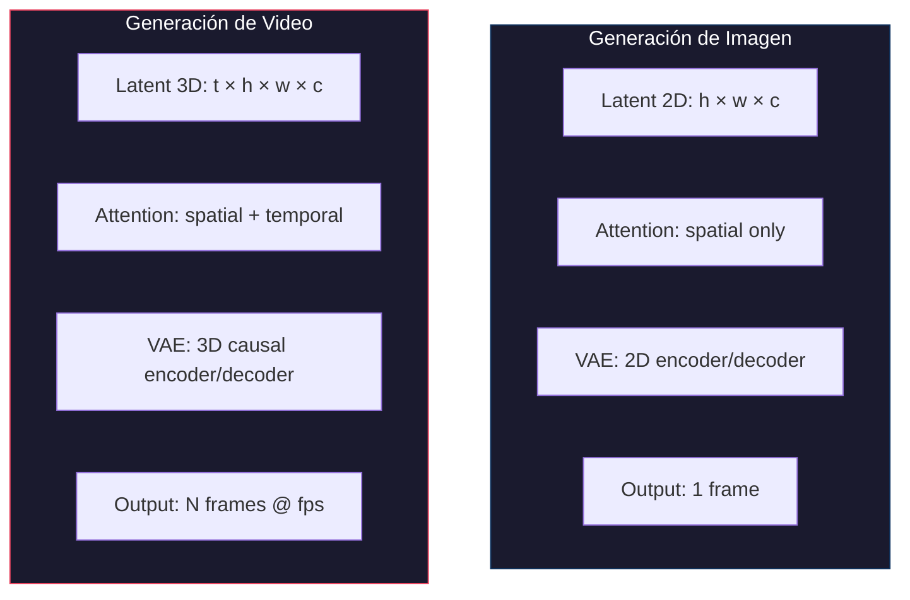
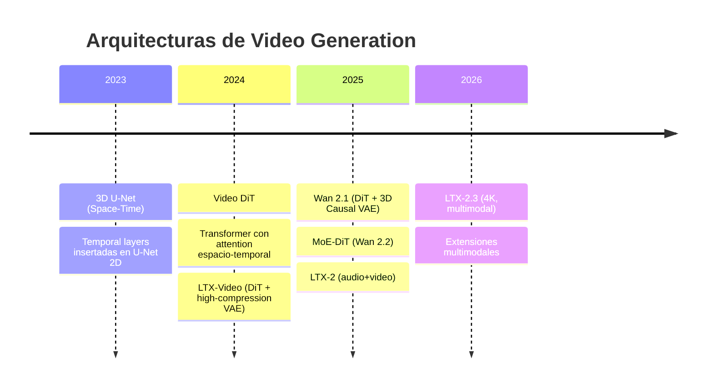
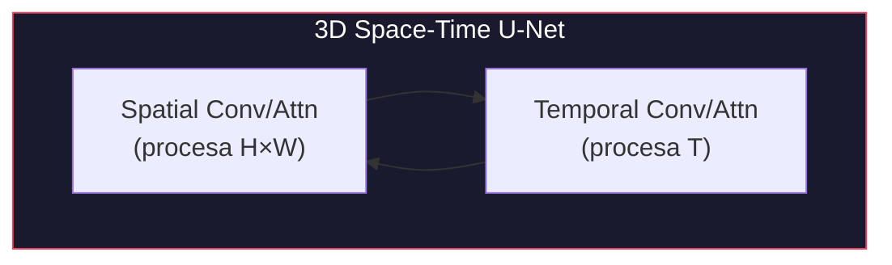
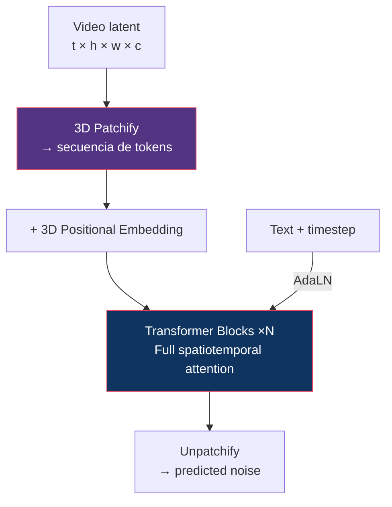
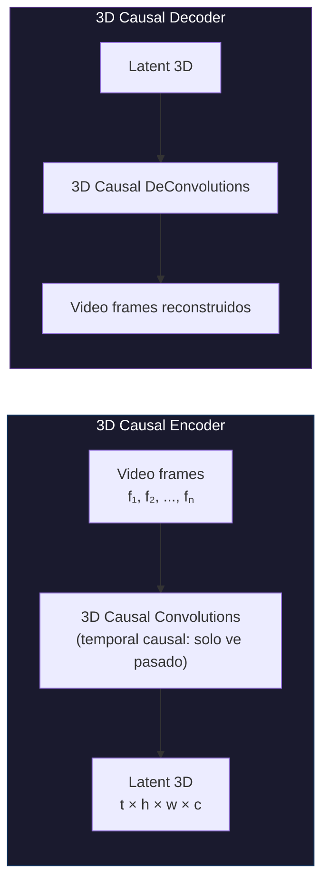
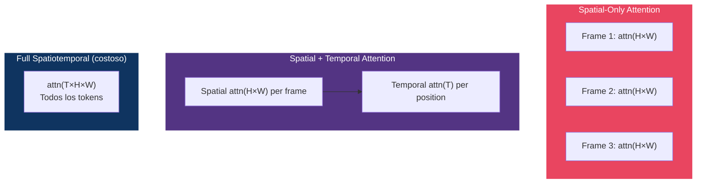
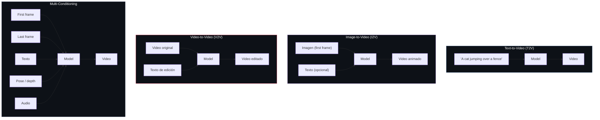
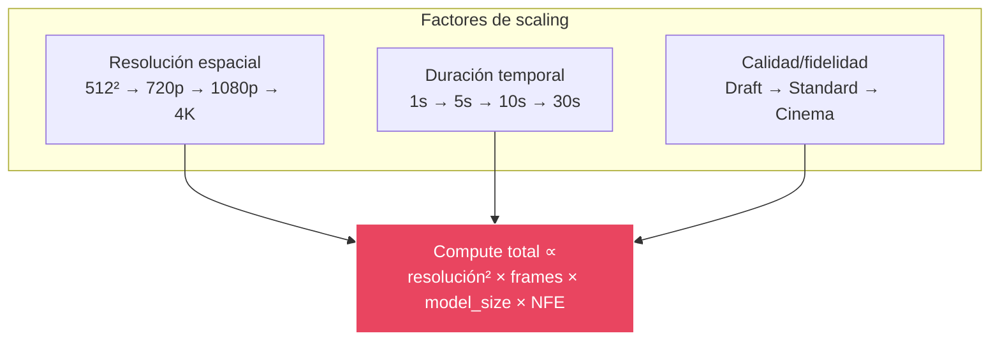
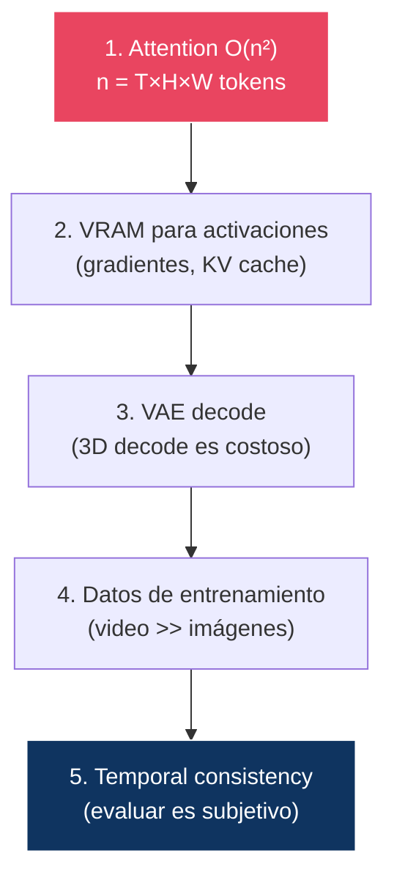

# 17 — Modelos de Generación de Video

> El video no es "muchas imágenes seguidas". Es un problema fundamentalmente diferente que requiere representaciones espacio-temporales, VAEs 3D, y órdenes de magnitud más compute.

---

## Índice

1. [De imagen a video: qué cambia](#1-de-imagen-a-video-qué-cambia)
2. [Arquitecturas de video](#2-arquitecturas-de-video)
3. [VAEs 3D y Causal VAEs](#3-vaes-3d-y-causal-vaes)
4. [Temporal attention](#4-temporal-attention)
5. [Conditioning en video](#5-conditioning-en-video)
6. [Model cards de video](#6-model-cards-de-video)
7. [Scaling computacional: imagen vs video](#7-scaling-computacional-imagen-vs-video)

> **Estado de verificación**: este módulo usa el mismo criterio que [16 — Image Models](../16-image-models/README.md): ✅ contrastado · 🟡 pendiente de contraste directo · ⚠️ reconstruido de fuentes secundarias. Las especificaciones de modelos de 2025-2026 son en su mayoría 🟡 o ⚠️.

---

## 1. De imagen a video: qué cambia



### Dimensiones del problema

| Aspecto | Imagen (1024²) | Video (720p, 5s, 24fps) | Factor |
|:--------|:---------------|:------------------------|:-------|
| Píxeles totales | 1M | 1M × 120 frames = **120M** | 120× |
| Latent size (f=8) | 128² = 16K | 30 × 90 × 160 = **432K** | 27× |
| Attention O(n²) | n=16K → 268M | n=432K → **186B** | ~700× |
| VRAM típico | 6-24 GB | **24-80+ GB** | 3-10× |
| Latencia | 2-10s | **30s - 5min** | 10-30× |

> **El video multiplica todo**: compute, memoria, latencia, datos de entrenamiento, y complejidad de evaluación.

---

## 2. Arquitecturas de video

### Evolución



### 3D U-Net (Space-Time)



- Extiende U-Net 2D insertando **temporal layers** (1D conv + temporal attention)
- Pro: Puede inicializar desde U-Net 2D pre-entrenada (image weights)
- Con: Limitado por la arquitectura U-Net subyacente

### Video DiT



---

## 3. VAEs 3D y Causal VAEs

### ¿Por qué no usar la VAE 2D frame por frame?

| Enfoque | Consistencia temporal | Tamaño del latente | Calidad |
|:--------|:---------------------|:-------------------|:--------|
| VAE 2D por frame | ✗ **flickering**: cada frame se codifica sin saber de los demás | `T × h × w × c` — **sin compresión temporal** | Buena por frame, incoherente en el tiempo |
| **VAE 3D** | ✓ el encoder ve varios frames a la vez | `(T/f_t) × h × w × c` — **comprime también en el tiempo** | Coherente |

> **La ventaja real no es «una decodificación en lugar de N»** — un decoder 3D procesa el tensor completo y su coste crece con `T` igual. Las dos ventajas verdaderas son: **(a)** compresión temporal, que reduce el número de posiciones latentes sobre las que difundir en un factor `f_t`; y **(b)** que el encoder ve una ventana temporal, lo que elimina el parpadeo entre frames.

### 3D Causal VAE (Wan)



### ¿Por qué "causal"?

**Causal** = cada frame solo puede depender de frames **anteriores**, nunca futuros. Esto permite:

- Generar vídeo de **longitud arbitraria** (streaming, extensión autoregresiva)
- Codificar y decodificar **por ventanas** sin tener todo el clip en memoria
- Compatibilidad con generación incremental

**El detalle que lo hace funcionar para I2V**: en un VAE causal, el **primer frame se codifica de forma independiente**, sin contexto temporal. Eso hace que su latente sea compatible con el de una imagen suelta, y es lo que permite condicionar la generación de vídeo con una imagen fija. Sin esa asimetría en el primer frame, I2V requeriría un mecanismo aparte.

### Comparación de VAEs de vídeo

⚠️ **Nota metodológica**: la «compresión total» de un VAE **no es el producto de los factores espacial y temporal**. Hay que contar también los canales, igual que en [05 §3](../05-latent-diffusion/README.md#3-el-espacio-latente):

```
compresión = (f_s · f_s · f_t · 3) / C_latente
```

| VAE | f espacial | f temporal | Canales | Elementos reducidos | **Compresión real** | Modelo |
|:----|:-----------|:-----------|:--------|--------------------:|--------------------:|:-------|
| Wan 3D Causal | 8× | 4× | 16 🟡 | 256× | **48×** | Wan 2.1/2.2 |
| LTX Video | 32× | 8× | 128 🟡 | 8 192× | **192×** | LTX-Video |
| CogVideoX | 8× | 4× | 16 🟡 | 256× | **48×** | CogVideoX |

> ⚠️ **Corrección**: la tabla anterior de este módulo daba «256×» para Wan y «192×» para LTX mezclando **dos métodos distintos** — el 256 contaba solo elementos espacio-temporales (8·8·4) y el 192 sí incluía canales. No son comparables entre sí. Con el criterio unificado, la diferencia real entre ambos es de 4×, no de la que sugerían aquellos números.
>
> Los recuentos de canales están marcados 🟡: deben contrastarse con las configuraciones oficiales antes de darlos por buenos.

---

## 4. Temporal attention

### Tipos de attention en video



Complejidades **por bloque, sobre el clip completo** (`S = H·W` posiciones espaciales, `T` frames latentes):

| Tipo | Complejidad total | Consistencia temporal | Uso |
|:-----|:------------------|:---------------------|:----|
| Spatial only | `T · S²` | ✗ ninguna conexión temporal | Nunca en solitario |
| **Factorizada (spatial + temporal)** | `T · S²  +  S · T²` | ✓ buena | Wan y la mayoría |
| Full spatiotemporal | `(T · S)²` | ✓✓ mejor | LTX, sobre latente muy comprimido |
| Causal temporal (enmascarada) | `T · S²  +  S · T²` | ✓ con restricción causal | Generación en streaming |

> ⚠️ **Corrección**: la versión anterior daba `O(T·(H·W))` para la atención causal temporal, es decir **lineal en T**. No lo es: enmascarar el futuro elimina la mitad de las entradas de la matriz de atención pero **no cambia el orden** — sigue siendo cuadrática en `T`. Solo los esquemas lineales o recurrentes (SSM, atención lineal) bajan a `O(T)`.

**Por qué la factorización es la opción por defecto**: `T·S² + S·T²` frente a `(T·S)²`. Con `T = 30` y `S = 14 400`, la factorizada cuesta ~1.9·10¹⁰ y la completa ~1.9·10¹¹ — **un orden de magnitud**. La atención completa solo es viable si el VAE comprime lo bastante como para que `T·S` se mantenga pequeño, que es exactamente la apuesta de LTX con su compresión de 192×.

---

## 5. Conditioning en video

### Tipos de conditioning para video



### Tabla de capacidades por modelo

> ⚠️ Tabla 🟡/⚠️ en su conjunto: **pendiente de contrastar** contra los model cards oficiales de cada versión.

| Capability | Wan 2.1 | Wan 2.2 | LTX-2 | LTX-2.3 |
|:-----------|:--------|:--------|:------|:--------|
| T2V | ✓ | ✓ | ✓ | ✓ |
| I2V | ✓ | ✓ | ✓ | ✓ |
| V2V | ✗ | ✓ | ✗ | ✓ |
| First/Last frame | ✓ | ✓ | ✓ | ✓ |
| Pose conditioning | ✗ | ✗ | ✗ | ✓ |
| Depth conditioning | ✗ | ✗ | ✗ | ✓ |
| Audio generation | ✗ | ✓ (ext.) | ✓ | ✓ |
| Camera control | ✗ | ✓ | ✗ | ✓ |
| Video extension | ✓ | ✓ | ✓ | ✓ |

---

## 6. Model cards de video

### Wan 2.1

| Aspecto | Detalle |
|:--------|:--------|
| **Organización** | Alibaba / Tongyi Lab |
| **Arquitectura** | DiT + 3D Causal VAE |
| **Parámetros** | 1.3B (small) / 14B (large) |
| **VAE** | 3D Causal VAE (compresión espacio-temporal) |
| **Framework** | Flow Matching |
| **Resolución** | Hasta 720p |
| **FPS** | 24 |
| **Duración** | Hasta ~10 segundos |
| **Capacidades** | T2V, I2V, first/last frame |
| **Fortalezas** | Open-source, buen balance calidad/eficiencia |
| **Fuente** | [arxiv:2503.20314](https://arxiv.org/abs/2503.20314) |

### Wan 2.2 🟡

| Aspecto | Detalle |
|:--------|:--------|
| **Innovación clave** | MoE-DiT: expertos especializados por **régimen de ruido**, con selección determinista por umbral de SNR y **un solo experto activo por paso** — sin router aprendido, porque el timestep se conoce de antemano ([06 §6](../06-architectures/README.md#6-moe-dit)) |
| **VAE** | Advanced 3D Causal VAE (mayor compresión) |
| **Datos** | Dataset significativamente ampliado |
| **Nuevas capacidades** | Animate (character animation), S2V (sound-to-video) |
| **Control estético** | Etiquetas de iluminación, composición, contraste |
| **Variante eficiente** | Wan2.2-TI2V-5B (720p@24fps en RTX 4090) |
| **Fuente** | [wan.video](https://wan.video) |

### LTX-Video (original)

| Aspecto | Detalle |
|:--------|:--------|
| **Organización** | Lightricks |
| **Arquitectura** | DiT + High-compression Video-VAE |
| **Innovación** | VAE unificada con transformer (pipeline integrado) |
| **Compresión** | 1:192 (extrema) |
| **Velocidad** | Faster-than-real-time |
| **Fuente** | Lightricks, 2024 |

### LTX-2

| Aspecto | Detalle |
|:--------|:--------|
| **Parámetros** | ~19B (asimétrico: video + audio) |
| **Innovación clave** | Audio-video sincronizado en un solo pass |
| **Streams** | Streams separados para video y audio |
| **Fuente** | Lightricks, Oct 2025 |

### LTX-2.3

| Aspecto | Detalle |
|:--------|:--------|
| **Resolución** | Nativa 4K @ 50fps |
| **Duración** | Hasta 20 segundos |
| **VAE** | Reconstruida, menor blur, texturas más nítidas |
| **Conditioning** | Pose, depth, edge (built-in) |
| **Multimodal** | T2V + I2V + audio en un solo modelo |
| **Capacidades pro** | Clean plate (object removal), SDR→HDR |
| **Fuente** | Lightricks, Mar 2026 |

---

## 7. Scaling computacional: imagen vs video

### El cubo del compute



### Tabla de scaling

**Metodología**: se cuentan los **tokens que ve la atención**, no las posiciones latentes. En los modelos DiT hay un *patchify* (típicamente `p = 2`) que divide el número de posiciones entre `p²` antes de entrar al transformer. Confundir ambas cosas infla la cuenta 4× en todos los modelos basados en DiT.

| Configuración | Posiciones latentes | Patch | **Tokens de atención** | Relativo | Coste atención (n²) | VRAM est. |
|:-------------|--------------------:|:------|-----------------------:|---------:|--------------------:|:----------|
| SD 1.5 (512²) | 4 096 | — (U-Net) | 4 096 | 1× | 1× | 4-6 GB |
| SDXL (1024²) | 16 384 | — (U-Net) | 16 384 | 4× | 16× | 8-12 GB |
| FLUX.1 (1024²) | 16 384 | **2×2** | **4 096** | **1×** | **1×** | ~24 GB |
| Wan 2.1 (720p, 3 s, 24 fps) | ~259 000 | 2×2 🟡 | ~65 000 | ~16× | ~250× | 24-40 GB |
| Wan 2.2 (720p, 5 s, 24 fps) | ~432 000 | 2×2 🟡 | ~108 000 | ~26× | ~700× | 40-80 GB |
| LTX-2.3 (4K, 5 s, 50 fps) | ~253 000 ⚠️ | 1×1 🟡 | ~253 000 | ~62× | ~3 800× | 80+ GB |

> ⚠️ **Dos correcciones respecto a la versión anterior**:
>
> 1. **FLUX.1 no ve 16 384 tokens sino ~4 096.** Con patch size 2, un latente de 128×128 produce 64×64 tokens. Contarlo igual que SDXL borra precisamente la razón por la que un DiT es viable a esa resolución.
> 2. **LTX-2.3 a 4K no son ~2 000 000 de posiciones.** Con su VAE de `f_s=32` y `f_t=8`, 3840×2160 da 120×68 por frame latente y 250 frames se comprimen a ~31: unas **253 000** posiciones. La cifra anterior correspondía a un `f=8` estándar y contradecía la propia tesis del modelo — que su compresión extrema es lo que hace tratable el 4K.

> **La conclusión al usar la métrica correcta**: FLUX.1 a 1024² cuesta en atención lo mismo que SD 1.5 a 512². Todo el salto de resolución de 2022 a 2024 se pagó con **compresión** (VAE + patchify), no con más cómputo de atención. El vídeo es donde esa palanca se agota y el coste sí explota.

### La jerarquía de bottlenecks en video



---

## Diagrama: la evolución hacia multimodal


---

## Referencias

- Alibaba/Tongyi (2025). *Wan: Open and Advanced Large-Scale Video Generative Models*.
- Lightricks (2024-2026). *LTX-Video Series*.
- Ho, J. et al. (2022). *Video Diffusion Models*.
- Blattmann, A. et al. (2023). *Align Your Latents: High-Resolution Video Synthesis with Latent Diffusion Models*.

---

*← [16 — Image Models](../16-image-models/README.md) | 18 — Evaluation (pendiente)*
