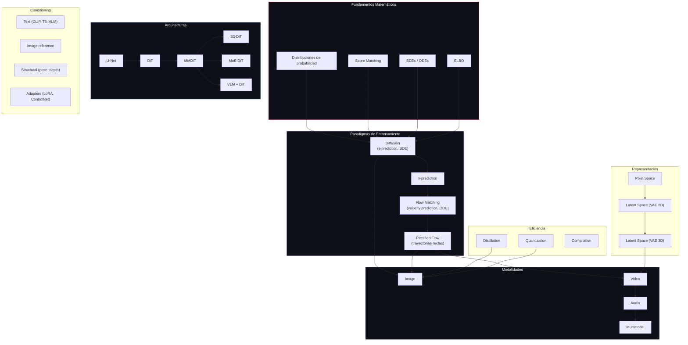
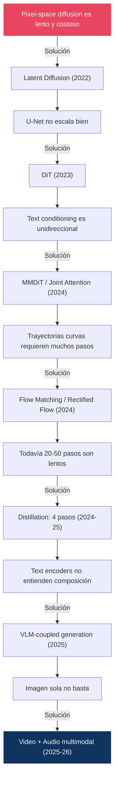

# 20 — Taxonomía y Mapa Conceptual

> El mapa completo del campo: arquitecturas × objetivos × samplers × conditioning, con la evolución cronológica que conecta todo.

---

## Mapa conceptual maestro

---

## Timeline cronológico

| Año | Hito | Importancia |
|:----|:-----|:-----------|
| **2015** | Deep Unsupervised Learning using Nonequilibrium Thermodynamics (Sohl-Dickstein) | Primera formulación de diffusion para generación |
| **2019** | NCSN / Score Matching (Y. Song & Ermon) | Score-based perspective |
| **2020** | **DDPM** (Ho et al.) | Demostración práctica; **modelo incondicional** |
| **2021** | **DDIM** (**J.** Song, Meng, Ermon) | Sampling determinístico, aceleración 20× |
| **2021** | Improved DDPM (Nichol & Dhariwal) | Varianza aprendida, cosine schedule |
| **2021** | Classifier Guidance (Dhariwal & Nichol) | Diffusion > GANs; **primer class-conditional** |
| **2021** | Score SDE (**Y.** Song et al.) | Unificación SDE/ODE, probability flow, PC sampling |
| **2021** | VDM (Kingma et al.) | log-SNR; el ELBO continuo solo depende de λ_min y λ_max |
| **2022** | **Latent Diffusion / SD 1.x** (Rombach et al.) | Diffusion en latent space + cross-attention |
| **2022** | **CFG** (Ho & Salimans) | Guidance sin clasificador |
| **2022** | Progressive Distillation (Salimans & Ho) | Reducción de pasos; origen de **v-prediction** |
| **2022** | SD 2.x | La variante **768-v** es la que usa v-prediction |
| **2022** | **EDM** (Karras et al.) | Reformulación del design space; sampler de Heun, sigmas ρ=7 |
| **2023** | **SDXL** (Podell et al.) | Escalado de U-Net, dual CLIP, micro-conditioning, **ε-prediction** |
| **2023** | **DiT** (Peebles & Xie) | Transformer reemplaza U-Net |
| **2023** | PixArt-α (Chen et al.) | DiT eficiente (600M params) |
| **2023** | **Consistency Models** (Song et al.) | Generación en 1-2 pasos |
| **2023** | **Flow Matching** (Lipman et al.) | Trayectorias rectas, velocity prediction |
| **2023** | **Rectified Flow** (Liu et al.) | Enderezar trayectorias iterativamente |
| **2023** | Adversarial Diffusion Distillation | Combinar GAN + distillation |
| **2024** | **SD3 / MMDiT** (Esser et al.) | Joint attention text↔image, rectified flow |
| **2024** | **FLUX.1** (Black Forest Labs) | 12B flow transformer, double+single stream |
| **2024** | AuraFlow | 6.8B, wider-shorter design |
| **2024** | LTX-Video | DiT para video, high-compression VAE |
| **2024** | Zero-terminal-SNR (Lin et al.) | ᾱ_T ≠ 0 explica el sesgo de luminancia; CFG rescaling |
| **2024** | **DMD / DMD2** (Yin et al.) | Distillation por igualación de distribuciones, 1 paso |
| **2024** | Guidance interval (Kynkäänniemi et al.) | La guidance en ruido alto **perjudica** |
| **2024** | CFG is a Predictor-Corrector (Bradley & Nakkiran) | CFG **no** muestrea de `p·p^w` |
| **2025** | **FLUX.2** (BFL) | 32B + Mistral-3 24B VLM, 4MP |
| **2025** | **Wan 2.1/2.2** (Alibaba) | MoE-DiT para video, 3D causal VAE |
| **2025** | **Z-Image** (Alibaba) | S3-DiT 6B, single-stream, sub-segundo |
| **2025** | SD 3.5 | MMDiT-X, QK-normalization |
| **2025** | Qwen-Image 2.0 | LLM + generación unificada |
| **2025** | LTX-2 | 19B, audio-video sincronizado |
| **2026** | FLUX.2 Klein | Distilled, consumer GPU, sub-segundo |
| **2026** | LTX-2.3 | 4K@50fps, multimodal, conditioning avanzado |
| **2026** | Qwen-Image 3.0 | 4.5k tokens, micro-detail rendering |

---

## Taxonomía: Modelo × Paradigma × Arquitectura

### Image Models

| Modelo | Paradigma | Arch | Params | Text Enc | Prediction |
|:-------|:----------|:-----|:-------|:---------|:-----------|
| DDPM | Diffusion | U-Net | 35-114M | **ninguno** | ε |
| SD 1.5 | Diffusion | U-Net | 860M | CLIP-L | ε |
| SD 2.x base (512) | Diffusion | U-Net | 865M | OpenCLIP-H | ε |
| **SD 2.x 768-v** | Diffusion | U-Net | 865M | OpenCLIP-H | **v** |
| SDXL | Diffusion | U-Net | 2.6B | CLIP-L+G | **ε** |
| PixArt-α | Diffusion | DiT | 600M | T5-XXL | ε |
| SD3 | Rectified Flow | MMDiT | 2-8B | CLIP-L+G+T5 | velocity |
| SD 3.5 | Rectified Flow | MMDiT-X | 2.5-8B | CLIP-L+G+T5 | velocity |
| AuraFlow | Rectified Flow | RF Transf | 6.8B | T5 | velocity |
| FLUX.1 | Rectified Flow | RF Transf | 12B | CLIP-L+T5 | velocity |
| FLUX.2 | Rectified Flow | VLM+RF | 32B+24B | Mistral-3 | velocity |
| Z-Image | Flow Matching | S3-DiT | 6B | TE | velocity |
| Qwen-Image 3.0 | Flow Matching | LLM+MMDiT | Var | MLLM | velocity |

### Video Models

| Modelo | Paradigma | Arch | VAE | Audio |
|:-------|:----------|:-----|:----|:------|
| Wan 2.1 | Flow Matching | DiT | 3D Causal | ✗ |
| Wan 2.2 | Flow Matching | MoE-DiT | 3D Causal Adv. | Extensiones |
| LTX-Video | Flow Matching | DiT | 1:192 compress | ✗ |
| LTX-2 | Flow Matching | DiT | 1:192 | ✓ (sincronizado) |
| LTX-2.3 | Flow Matching | DiT | Rebuilt | ✓ (integrado) |

---

## Taxonomía: Objetivo × Parametrización

Los pesos están expresados **en espacio-ε**, tomando ε-prediction como baseline uniforme. Derivación en [01 §7](../01-foundations/README.md#7-parametrizaciones).

| Objetivo | Target | Loss | Peso en espacio-ε | Enfatiza | Usado por |
|:---------|:-------|:-----|:------------------|:---------|:----------|
| ε-prediction | Ruido ε | ‖ε-εθ‖² | `1` | — (uniforme) | DDPM, SD 1.x, **SDXL** |
| x₀-prediction | Imagen limpia | ‖x₀-x₀θ‖² | `1/SNR` | **SNR bajo** (t grande) | Fine-tuning, consistency |
| v-prediction | v = √ᾱ·ε − √(1-ᾱ)·x₀ | ‖v-vθ‖² | `1 + 1/SNR` | Balanceado | **SD 2.x-768-v**, Imagen Video |
| velocity (FM) | x_data − x_noise | ‖(x_data−x_noise)−vθ‖² | — (otro interpolante) | Se regula vía `p(t)` | SD3, FLUX |
| score | ∇log p(x) | ‖s-sθ‖² | `1/(1-ᾱ)` | **SNR alto** (t pequeño) | NCSN, Score-SDE |
| consistency | f(xₜ) = f(xₜ') | Self-consistency + frontera | N/A | N/A | Consistency Models |

> ⚠️ **Dos correcciones frecuentes en esta tabla**:
>
> 1. **x₀ y score suelen aparecer intercambiados.** x₀-prediction enfatiza el ruido **alto** (`1/SNR` crece cuando SNR baja); score enfatiza el ruido **bajo** (`1/(1-ᾱ)` diverge cuando ᾱ→1).
> 2. **v-prediction no es de SDXL** sino de SD 2.x-768-v. SDXL usa ε.
>
> Sobre *velocity (FM)*: no tiene un peso comparable en esta tabla porque **usa otro interpolante** (recta, no arco). Y no es «uniforme»: la ponderación efectiva la fija la distribución de muestreo `p(t)` — logit-normal en SD3 — más el resolution shift ([07 §6](../07-flow-matching/README.md#6-timestep-sampling-y-shift)).

---

## Preguntas clave y dónde se responden

| Pregunta causal | Respuesta | Módulo |
|:---------------|:----------|:-------|
| ¿Por qué ε-prediction → v-prediction? | ε-pred se indefine cuando `ᾱ→0`; v sigue bien condicionada. Es el requisito del zero-terminal-SNR | [01 §6](../01-foundations/README.md#6-snr) |
| ¿Por qué v-prediction → velocity? | Interpolante recto en vez de arco. **No elimina el ajuste**: lo traslada del schedule a `p(t)` y el shift | [07 §6](../07-flow-matching/README.md#6-timestep-sampling-y-shift) |
| ¿Por qué U-Net → DiT? | No por más calidad a igual cómputo, sino por **escalado predecible**: el FID cae con los Gflops | [06 §3](../06-architectures/README.md#3-dit) |
| ¿Por qué DiT → cross-attn → MMDiT? | AdaLN es global; cross-attn es unidireccional; joint attention es bidireccional | [06 §4](../06-architectures/README.md#4-mmdit) |
| ¿Por qué CLIP → T5 → VLM? | CLIP es contrastivo (bolsa de conceptos); T5 nunca vio una imagen; el VLM cierra ambos huecos | [11 §2](../11-conditioning/README.md#2-text-conditioning-evolución-de-encoders) |
| ¿Por qué diffusion → flow matching? | Trayectorias rectas = menos error de discretización = menos NFE | [07](../07-flow-matching/) |
| ¿Por qué las trayectorias marginales salen curvas? | Las rectas por par **se cruzan**, y el campo aprendido es la media en el cruce | [07 §5](../07-flow-matching/README.md#5-rectified-flow-y-el-problema-del-cruce) |
| ¿Por qué 1000 → 50 → 4 → 1 pasos? | Solvers (1000→20) + reflow + distillation (20→1). Son etapas distintas | [08](../08-sampling/), [10](../10-distillation/) |
| ¿Por qué un solo paso da imágenes borrosas? | El minimizador del MSE es `E[x₀|x_T]`, y la media de imágenes plausibles no lo es | [10 §2](../10-distillation/README.md#2-por-qué-un-paso-es-difícil) |
| ¿Por qué CFG existe? | La rama incondicional actúa como clasificador implícito: `∇log p(c\|x) = ∇log p(x\|c) − ∇log p(x)` | [09 §3](../09-guidance/README.md#3-classifier-free-guidance-cfg) |
| ¿Por qué CFG alto satura? | Es una **extrapolación**: `‖ε̃‖` crece con `w` y la `x̂₀` implícita sale del rango de los datos | [09 §5](../09-guidance/README.md#5-cfg-scale-efectos-y-trade-offs) |
| ¿Por qué eliminar CFG? | Cuesta 2× el loop entero, no un extra marginal | [10 §7](../10-distillation/README.md#7-guidance-distillation) |
| ¿Por qué el vídeo es ~700× más costoso en atención? | `n = T·H·W` y la atención es `O(n²)`; 27× más posiciones son ~700× de coste | [17 §1](../17-video-models/README.md#1-de-imagen-a-video-qué-cambia) |
| ¿Por qué SD3/FLUX pasaron a VAE de 16 canales? | Renuncian a compresión (48×→12×) a cambio de fidelidad; es lo que arregla el texto | [05 §3](../05-latent-diffusion/README.md#3-el-espacio-latente) |

---

## Diagrama: cascada de innovaciones

---

## Clasificación de innovaciones futuras

Cuando aparezca un nuevo modelo/paper, clasificarlo según:

| Categoría | Pregunta | Ejemplo |
|:----------|:---------|:--------|
| **Nuevo paradigma** | ¿Cambia la formulación matemática base? | Flow Matching vs Diffusion |
| **Nueva arquitectura** | ¿Cambia la red neuronal? | U-Net → DiT |
| **Nuevo objetivo** | ¿Cambia qué predice el modelo? | ε → v → velocity |
| **Nuevo sampler** | ¿Cambia cómo se generan muestras? | DDPM → DPM-Solver++ |
| **Nuevo conditioning** | ¿Cambia cómo entra información al modelo? | Cross-attn → joint attn |
| **Distillation** | ¿Reduce pasos imitando a un teacher? | Consistency, ADD, DMD |
| **Re-emparejamiento** | ¿Mantiene el objetivo pero cambia los datos de entrenamiento? | **Reflow** — no es distillation ([10 §8](../10-distillation/README.md#8-reflow-por-qué-no-es-distillation)) |
| **Better data** | ¿Mejora por datos, no por modelo? | LAION → curated datasets |
| **Better scaling** | ¿Más grande = mejor, predeciblemente? | 12B → 32B params |
| **Better representation** | ¿Cambia el espacio latente? | VAE 2D → 3D causal |
| **Better efficiency** | ¿Mismo resultado con menos recursos? | FP16 → FP8, FlashAttention |

---

## Errores recurrentes del área

Recopilación de las confusiones que este repositorio ha tenido que corregir. Sirven de lista de verificación al leer cualquier fuente sobre el tema.

| Afirmación frecuente | Realidad | Dónde |
|:---------------------|:---------|:------|
| «SDXL usa v-prediction» | Usa **ε**. La v es de SD 2.x-768-v | [01 §7](../01-foundations/README.md#7-parametrizaciones) |
| «DDPM es class-conditional» | Es **incondicional**; el class-conditional es de 2021 | [02 §9](../02-ddpm/README.md#9-limitaciones-y-lo-que-vino-después) |
| «q(x_T) ≈ N(0,I) con T=1000» | `ᾱ_T ≈ 4·10⁻⁵ ≠ 0`; de ahí el sesgo de luminancia | [01 §6](../01-foundations/README.md#6-snr) |
| «La inversión DDIM es exacta» | Solo en el límite continuo; asume una linealización | [03 §6](../03-ddim/README.md#6-ddim-inversion) |
| «CFG muestrea de `p(x)·p(c\|x)^w`» | **No**: difundir y afilar no conmutan | [09 §4](../09-guidance/README.md#4-análisis-matemático) |
| «FLUX.1 dev usa CFG con 2 pasadas» | Guidance **destilada**, 1 pasada | [09 §8](../09-guidance/README.md#8-guidance-en-modelos-modernos) |
| «Reflow es distillation» | Preserva las marginales y no acorta pasos por sí solo | [10 §8](../10-distillation/README.md#8-reflow-por-qué-no-es-distillation) |
| «DPM-Solver da orden 2-3 con 1 NFE/paso» | Solo las variantes **multistep** | [08 §4](../08-sampling/README.md#4-samplers-principales) |
| «trailing pone más pasos al final» | El espaciado es uniforme; cambia **qué extremo incluye** | [08 §7](../08-sampling/README.md#7-timestep-spacing-y-sigma-schedules) |
| «SD3 comprime 48× como SD 1.5» | **12×**: 16 canales en vez de 4 | [05 §3](../05-latent-diffusion/README.md#3-el-espacio-latente) |
| «El DiT original hace texto-imagen» | Es **class-conditional** sobre ImageNet | [06 §3](../06-architectures/README.md#3-dit) |
| «El zero-init de AdaLN-Zero es en γ» | Es en **α**, la puerta residual | [06 §3](../06-architectures/README.md#3-dit) |
| «El latent scaling es `z / factor`» | Es `z · factor` para entrar a la difusión | [05 §6](../05-latent-diffusion/README.md#6-kl-regularization-y-latent-scaling) |
| «El VAE de SD produce latentes ~N(0,I)» | β ≈ 10⁻⁶: apenas hay regularización | [05 §2](../05-latent-diffusion/README.md#2-autoencoders-y-vae) |

---

*Este documento es un mapa vivo. Cada nueva entrada debe clasificarse causalmente, no simplemente agregarse.*

*← [17 — Video Models](../17-video-models/README.md) | [Volver al índice](../README.md)*
