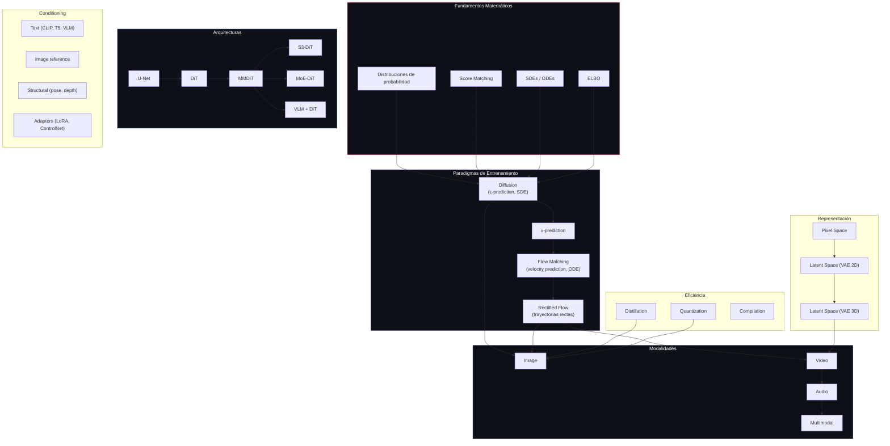
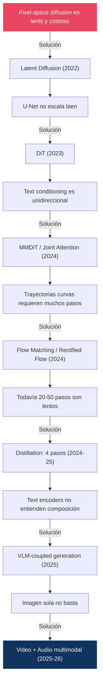

# 20 — Taxonomía y Mapa Conceptual

> El mapa completo del campo: arquitecturas × objetivos × samplers × conditioning, con la evolución cronológica que conecta todo.

---

## Mapa conceptual maestro

---

## Timeline cronológico

| Año | Hito | Importancia |
|:----|:-----|:-----------|
| **2015** | Deep Unsupervised Learning using Nonequilibrium Thermodynamics (Sohl-Dickstein) | Primera formulación de diffusion para generación |
| **2019** | NCSN / Score Matching (Song & Ermon) | Score-based perspective |
| **2020** | **DDPM** (Ho et al.) | Demostración práctica de diffusion models |
| **2021** | **DDIM** (Song et al.) | Sampling determinístico, aceleración 20× |
| **2021** | Improved DDPM (Nichol & Dhariwal) | Varianza aprendida, cosine schedule |
| **2021** | Classifier Guidance (Dhariwal & Nichol) | Diffusion > GANs por primera vez |
| **2021** | Score SDE (Song et al.) | Unificación SDE/ODE, probability flow |
| **2022** | **Latent Diffusion / SD 1.x** (Rombach et al.) | Diffusion en latent space, democratización |
| **2022** | **CFG** (Ho & Salimans) | Guidance sin clasificador, texto → imagen |
| **2022** | Progressive Distillation (Salimans & Ho) | Reducción de pasos via distillation |
| **2023** | **SDXL** (Podell et al.) | Escalado de U-Net, dual CLIP, v-prediction |
| **2023** | **DiT** (Peebles & Xie) | Transformer reemplaza U-Net |
| **2023** | PixArt-α (Chen et al.) | DiT eficiente (600M params) |
| **2023** | **Consistency Models** (Song et al.) | Generación en 1-2 pasos |
| **2023** | **Flow Matching** (Lipman et al.) | Trayectorias rectas, velocity prediction |
| **2023** | **Rectified Flow** (Liu et al.) | Enderezar trayectorias iterativamente |
| **2023** | Adversarial Diffusion Distillation | Combinar GAN + distillation |
| **2024** | **SD3 / MMDiT** (Esser et al.) | Joint attention text↔image, rectified flow |
| **2024** | **FLUX.1** (Black Forest Labs) | 12B flow transformer, double+single stream |
| **2024** | AuraFlow | 6.8B, wider-shorter design |
| **2024** | LTX-Video | DiT para video, high-compression VAE |
| **2025** | **FLUX.2** (BFL) | 32B + Mistral-3 24B VLM, 4MP |
| **2025** | **Wan 2.1/2.2** (Alibaba) | MoE-DiT para video, 3D causal VAE |
| **2025** | **Z-Image** (Alibaba) | S3-DiT 6B, single-stream, sub-segundo |
| **2025** | SD 3.5 | MMDiT-X, QK-normalization |
| **2025** | Qwen-Image 2.0 | LLM + generación unificada |
| **2025** | LTX-2 | 19B, audio-video sincronizado |
| **2026** | FLUX.2 Klein | Distilled, consumer GPU, sub-segundo |
| **2026** | LTX-2.3 | 4K@50fps, multimodal, conditioning avanzado |
| **2026** | Qwen-Image 3.0 | 4.5k tokens, micro-detail rendering |

---

## Taxonomía: Modelo × Paradigma × Arquitectura

### Image Models

| Modelo | Paradigma | Arch | Params | Text Enc | Prediction |
|:-------|:----------|:-----|:-------|:---------|:-----------|
| DDPM | Diffusion | U-Net | 114M | — | ε |
| SD 1.5 | Diffusion | U-Net | 860M | CLIP-L | ε |
| SD 2.x | Diffusion | U-Net | 860M | OpenCLIP-H | ε |
| SDXL | Diffusion | U-Net | 2.6B | CLIP-L+G | v |
| PixArt-α | Diffusion | DiT | 600M | T5-XXL | ε |
| SD3 | Rectified Flow | MMDiT | 2-8B | CLIP-L+G+T5 | velocity |
| SD 3.5 | Rectified Flow | MMDiT-X | 2.5-8B | CLIP-L+G+T5 | velocity |
| AuraFlow | Rectified Flow | RF Transf | 6.8B | T5 | velocity |
| FLUX.1 | Rectified Flow | RF Transf | 12B | CLIP-L+T5 | velocity |
| FLUX.2 | Rectified Flow | VLM+RF | 32B+24B | Mistral-3 | velocity |
| Z-Image | Flow Matching | S3-DiT | 6B | TE | velocity |
| Qwen-Image 3.0 | Flow Matching | LLM+MMDiT | Var | MLLM | velocity |

### Video Models

| Modelo | Paradigma | Arch | VAE | Audio |
|:-------|:----------|:-----|:----|:------|
| Wan 2.1 | Flow Matching | DiT | 3D Causal | ✗ |
| Wan 2.2 | Flow Matching | MoE-DiT | 3D Causal Adv. | Extensiones |
| LTX-Video | Flow Matching | DiT | 1:192 compress | ✗ |
| LTX-2 | Flow Matching | DiT | 1:192 | ✓ (sincronizado) |
| LTX-2.3 | Flow Matching | DiT | Rebuilt | ✓ (integrado) |

---

## Taxonomía: Objetivo × Parametrización

| Objetivo | Target | Loss | SNR weighting | Usado por |
|:---------|:-------|:-----|:-------------|:----------|
| ε-prediction | Ruido ε | ‖ε-εθ‖² | Uniforme | DDPM, SD 1.x |
| x₀-prediction | Imagen limpia | ‖x₀-x₀θ‖² | Alto en SNR alto | Fine-tuning |
| v-prediction | v = √ᾱ·ε - √(1-ᾱ)·x₀ | ‖v-vθ‖² | Balanceado | SDXL |
| velocity (FM) | x₁ - x₀ | ‖(x₁-x₀)-vθ‖² | Uniforme | SD3, FLUX, etc. |
| score | ∇log p(x) | ‖s-sθ‖² | Alto en SNR bajo | NCSN |
| consistency | f(xₜ) = f(xₜ') | Self-consistency | N/A | Consistency Models |

---

## Preguntas clave y dónde se responden

| Pregunta causal | Respuesta | Módulo |
|:---------------|:----------|:-------|
| ¿Por qué ε-prediction → v-prediction? | v-prediction es más estable en zero-SNR y balances mejor el loss | [01](../01-foundations/) |
| ¿Por qué v-prediction → velocity? | Flow matching simplifica el framework: sin schedule, sin ᾱ | [07](../07-flow-matching/) |
| ¿Por qué U-Net → DiT? | DiT escala predeciblemente como LLMs | [06](../06-architectures/) |
| ¿Por qué DiT → MMDiT? | Joint attention mejora prompt adherence | [06](../06-architectures/) |
| ¿Por qué CLIP → T5 → VLM? | Mayor comprensión semántica en cada paso | [15](../15-pipelines/) |
| ¿Por qué diffusion → flow matching? | Trayectorias más rectas = menos pasos | [07](../07-flow-matching/) |
| ¿Por qué 1000 → 50 → 4 pasos? | DDIM + distillation + rectified flow | [03](../03-ddim/), [10](../10-distillation/) |
| ¿Por qué CFG existe? | Sin CFG, los modelos ignoran parcialmente el prompt | [09](../09-guidance/) |
| ¿Por qué eliminar CFG? | 2× coste; guidance distillation lo integra | [10](../10-distillation/) |
| ¿Por qué video es 100× más costoso? | Dimensionalidad espacio-temporal + O(n²) attention | [17](../17-video-models/) |

---

## Diagrama: cascada de innovaciones

---

## Clasificación de innovaciones futuras

Cuando aparezca un nuevo modelo/paper, clasificarlo según:

| Categoría | Pregunta | Ejemplo |
|:----------|:---------|:--------|
| **Nuevo paradigma** | ¿Cambia la formulación matemática base? | Flow Matching vs Diffusion |
| **Nueva arquitectura** | ¿Cambia la red neuronal? | U-Net → DiT |
| **Nuevo objetivo** | ¿Cambia qué predice el modelo? | ε → v → velocity |
| **Nuevo sampler** | ¿Cambia cómo se generan muestras? | DDPM → DPM-Solver++ |
| **Nuevo conditioning** | ¿Cambia cómo entra información al modelo? | Cross-attn → joint attn |
| **Distillation** | ¿Reduce pasos sin cambiar arquitectura? | Consistency, ADD |
| **Better data** | ¿Mejora por datos, no por modelo? | LAION → curated datasets |
| **Better scaling** | ¿Más grande = mejor, predeciblemente? | 12B → 32B params |
| **Better representation** | ¿Cambia el espacio latente? | VAE 2D → 3D causal |
| **Better efficiency** | ¿Mismo resultado con menos recursos? | FP16 → FP8, FlashAttention |

---

*Este documento es un mapa vivo. Cada nueva entrada debe clasificarse causalmente, no simplemente agregarse.*
