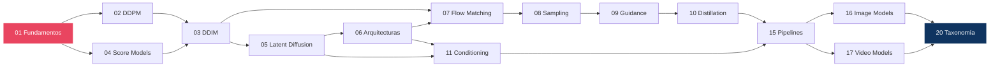

# 🔬 Diffusion Models Research Lab

> Estudio técnico y arquitectónico sobre los modelos generativos basados en difusión y sus sucesores modernos — actualizado a **agosto de 2026**.

---

## ¿Qué es este repositorio?

Un **atlas arquitectónico** del campo de los modelos generativos basados en difusión. No es código ejecutable — es un estudio profundo que documenta:

- **Fundamentos matemáticos** — derivaciones completas de cada formulación
- **Evolución arquitectónica** — de U-Net a DiT a MMDiT a S3-DiT
- **Diagramas de pipeline** — descomposición interna de cada modelo
- **Tablas comparativas** — especificaciones técnicas verificadas contra fuentes primarias
- **Análisis causal** — por qué cada innovación apareció y qué problema resolvió

### Principio central

> *No optimizar por cantidad de modelos. Optimizar por profundidad conceptual y capacidad de explicar causalmente los resultados.*

---

## 🗺️ Mapa del repositorio

### Módulos disponibles

| Módulo | Contenido |
|:-------|:----------|
| [**01-foundations**](01-foundations/) | Forward/reverse process, schedules, SNR, parametrizaciones, ELBO, SDE vs ODE |
| [**02-ddpm**](02-ddpm/) | DDPM: derivación completa, U-Net original, resultados |
| [**03-ddim**](03-ddim/) | Sampling determinístico, la vista ODE, inversión |
| [**04-score-models**](04-score-models/) | Score matching, Langevin, NCSN, VE/VP-SDE, predictor-corrector |
| [**05-latent-diffusion**](05-latent-diffusion/) | VAE, espacios latentes, factor de compresión, cross-attention |
| [**06-architectures**](06-architectures/) | U-Net → DiT → MMDiT → S3-DiT → MoE-DiT → VLM-coupled |
| [**07-flow-matching**](07-flow-matching/) | CFM, el problema del cruce, reflow, timestep sampling |
| [**08-sampling**](08-sampling/) | Solvers, NFE, timestep spacing, sigma schedules |
| [**09-guidance**](09-guidance/) | Classifier guidance, CFG y su interpretación correcta, negative prompts |
| [**10-distillation**](10-distillation/) | Progressive, consistency, adversarial, DMD, guidance distillation |
| [**11-conditioning**](11-conditioning/) | Los cuatro mecanismos de inyección, ControlNet, IP-Adapter, LoRA |
| [**15-pipelines**](15-pipelines/) | Descomposición de pipelines de producción y análisis de bottleneck |
| [**16-image-models**](16-image-models/) | Model cards: DDPM → FLUX.2 |
| [**17-video-models**](17-video-models/) | Model cards: Wan 2.2, LTX-2.3 |
| [**20-taxonomy**](20-taxonomy/) | Mapa conceptual, timeline, **errores recurrentes del área** |
| [**docs/references.md**](docs/references.md) | Bibliografía completa con índice por módulo |

### Módulos planificados

Aún sin escribir. Los enlaces desde otros módulos a estas secciones aparecen marcados como *(pendiente)*:

```
12-training/             Datasets, distributed training, costes
13-fine-tuning/          LoRA, DreamBooth, merging
14-quantization/         FP8, INT4, optimización de memoria
18-evaluation/           Métricas, benchmarks, limitaciones
19-experiments/          Diseños experimentales (sin ejecución)
```

---

## 📖 Recorrido recomendado



**Atajo si ya conoces el área**: [01 §6-7](01-foundations/README.md#6-snr) (SNR y parametrizaciones) → [07](07-flow-matching/) (flow matching) → [20](20-taxonomy/) (errores recurrentes).

---

## 🔑 Preguntas que este repositorio responde

| Pregunta | Módulo |
|:---------|:-------|
| ¿Qué es realmente un diffusion model? | [01](01-foundations/) |
| ¿Por qué funciona el denoising? | [02](02-ddpm/) |
| ¿Por qué entrenar un denoiser *es* score matching? | [01 §4](01-foundations/README.md#4-reverse-process), [04](04-score-models/) |
| ¿Qué problema resuelve latent diffusion? | [05](05-latent-diffusion/) |
| ¿Por qué los U-Net fueron reemplazados por Transformers? | [06 §9](06-architectures/README.md#9-por-qué-ocurrió-la-transición) |
| ¿Por qué Flow Matching se volvió central? | [07](07-flow-matching/) |
| ¿Qué relación matemática hay entre diffusion y flow matching? | [07 §7](07-flow-matching/README.md#7-diffusion-vs-flow-matching) |
| ¿Por qué las trayectorias «rectas» salen curvas? | [07 §5](07-flow-matching/README.md#5-rectified-flow-y-el-problema-del-cruce) |
| ¿Por qué algunos modelos necesitan 100 pasos y otros 4? | [08](08-sampling/), [10](10-distillation/) |
| ¿Por qué un solo paso produce imágenes borrosas? | [10 §2](10-distillation/README.md#2-por-qué-un-paso-es-difícil) |
| ¿Qué se pierde durante la distillation? | [10 §10](10-distillation/README.md#10-qué-se-pierde-en-la-distillation) |
| ¿Qué hace realmente CFG — y qué *no* hace? | [09 §4](09-guidance/README.md#4-análisis-matemático) |
| ¿Por qué algunos modelos no admiten negative prompts? | [09 §6](09-guidance/README.md#6-negative-prompts) |
| ¿Cómo escalan los modelos de imagen hacia vídeo? | [17](17-video-models/) |
| ¿Qué diferencia hay entre research y producción? | [15](15-pipelines/) |

---

## ⚠️ Estado de verificación

El repositorio distingue explícitamente entre lo contrastado y lo que no:

| Marca | Significado |
|:------|:------------|
| ✅ | Contrastado contra paper, config o model card oficial |
| 🟡 | Coherente con las fuentes conocidas, pendiente de contraste directo |
| ⚠️ | Reconstruido de fuentes secundarias — no citar sin verificar |

**Regla**: nada marcado 🟡 o ⚠️ debe propagarse a otro módulo como hecho establecido. La política completa está en [16 — Image Models](16-image-models/README.md).

En general, la matemática de los módulos 01-11 está verificada; las especificaciones de modelos de 2025-2026 en los módulos 16 y 17 están en su mayoría pendientes.

---

## 🧭 Errores recurrentes del área

Uno de los productos de este estudio es una lista de las confusiones más extendidas sobre difusión, cada una con su corrección y su desarrollo. Ejemplos:

- «SDXL usa v-prediction» → usa **ε**; la v es de SD 2.x-768-v
- «DDPM es class-conditional» → es **incondicional**
- «La inversión DDIM es exacta» → solo en el límite continuo
- «CFG muestrea de `p(x)·p(c|x)^w`» → **no**; difundir y afilar no conmutan
- «Reflow es distillation» → preserva las marginales y no acorta pasos por sí solo

**Lista completa en [20 — Taxonomía](20-taxonomy/README.md#errores-recurrentes-del-área).**

---

## 📚 Fuentes (prioridad)

1. Paper original
2. Documentación oficial / model card
3. Repositorio oficial
4. Documentación Hugging Face
5. Implementaciones reconocidas
6. Benchmarks publicados

Toda afirmación técnica debe poder rastrearse a una fuente → [docs/references.md](docs/references.md)
