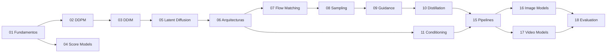

# 🔬 Diffusion Models Research Lab

> Estudio técnico y arquitectónico sobre los modelos generativos basados en difusión y sus sucesores modernos — actualizado a **agosto de 2026**.

---

## ¿Qué es este repositorio?

Un **atlas arquitectónico** del campo de los modelos generativos basados en difusión. No es código ejecutable — es un estudio profundo que documenta:

- **Fundamentos matemáticos** — derivaciones completas de cada formulación
- **Evolución arquitectónica** — de U-Net a DiT a MMDiT a S3-DiT
- **Diagramas de pipeline** — descomposición interna de cada modelo
- **Tablas comparativas** — especificaciones técnicas verificadas contra fuentes primarias
- **Análisis causal** — por qué cada innovación apareció y qué problema resolvió

### Principio central

> *No optimizar por cantidad de modelos. Optimizar por profundidad conceptual y capacidad de explicar causalmente los resultados.*

---

## 🗺️ Mapa del repositorio

```
01-foundations/          Probabilidad, score matching, SDEs, ODEs, ruido
02-ddpm/                 DDPM: derivación matemática completa
03-ddim/                 DDIM: sampling determinístico y aceleración
04-score-models/         Score-based models, Langevin, VE/VP
05-latent-diffusion/     VAE, espacios latentes, por qué cambian todo
06-architectures/        U-Net → DiT → MMDiT → S3-DiT
07-flow-matching/        Flow Matching, Rectified Flow, trayectorias
08-sampling/             Comparación de solvers y samplers
09-guidance/             CFG, classifier guidance, dynamic guidance
10-distillation/         Progressive, adversarial, consistency
11-conditioning/         Text, image, structural conditioning
12-training/             Datasets, distributed training, costes
13-fine-tuning/          LoRA, DreamBooth, merging
14-quantization/         FP8, INT4, optimización de memoria
15-pipelines/            Descomposición de pipelines de producción
16-image-models/         Model cards: DDPM → FLUX.2
17-video-models/         Model cards: Wan 2.2, LTX-2.3
18-evaluation/           Métricas, benchmarks, limitaciones
19-experiments/          Diseños experimentales (sin ejecución)
20-taxonomy/             Mapa conceptual, timeline, taxonomía
docs/references.md       Bibliografía completa
```

---

## 📖 Recorrido recomendado



---

## 🔑 Preguntas que este repositorio responde

| Pregunta | Módulo |
|:---------|:-------|
| ¿Qué es realmente un diffusion model? | [01](01-foundations/) |
| ¿Por qué funciona el denoising? | [02](02-ddpm/) |
| ¿Qué problema resuelve latent diffusion? | [05](05-latent-diffusion/) |
| ¿Por qué los U-Net fueron reemplazados por Transformers? | [06](06-architectures/) |
| ¿Por qué Flow Matching se volvió central? | [07](07-flow-matching/) |
| ¿Qué relación matemática hay entre diffusion y flow matching? | [07](07-flow-matching/) |
| ¿Por qué algunos modelos necesitan 100 pasos y otros 4? | [08](08-sampling/), [10](10-distillation/) |
| ¿Qué se pierde durante la distillation? | [10](10-distillation/) |
| ¿Qué hace realmente CFG? | [09](09-guidance/) |
| ¿Cómo escalan los modelos de imagen hacia vídeo? | [17](17-video-models/) |
| ¿Cuánto se puede comprimir un modelo? | [14](14-quantization/) |
| ¿Qué diferencia hay entre research y producción? | [15](15-pipelines/) |

---

## 📚 Fuentes (prioridad)

1. Paper original
2. Documentación oficial / model card
3. Repositorio oficial
4. Documentación Hugging Face
5. Implementaciones reconocidas
6. Benchmarks publicados

Toda afirmación técnica puede rastrearse a una fuente → ver [docs/references.md](docs/references.md)
